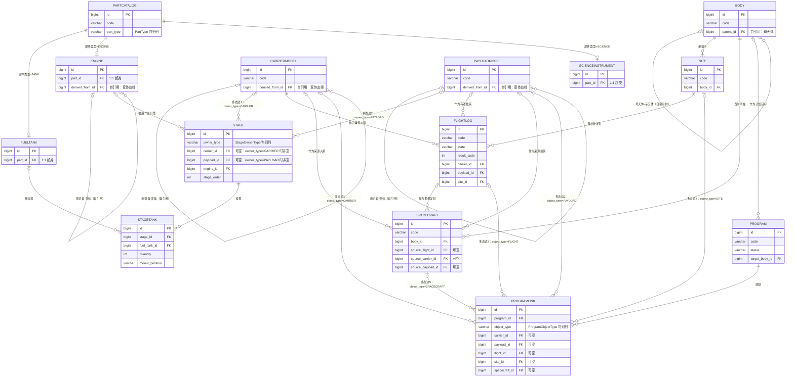

# 02 · 概念模型（Conceptual Model）

> **版本**：v1.0 ｜ **日期**：2026-09-19 ｜ **依据**：`docs/_design-brief.md`（唯一权威源）
> **项目**：《坎巴拉太空计划》(KSP) 发射计划与任务记录管理工具 ｜ Django 5.2 + SQLite ｜ 单机自用
> **上游文档**：`01-需求规格说明.md` ｜ **下游文档**：`03-数据库设计.md`
> **本文性质**：概念层文档。回答「**领域里有什么、它们怎么关联**」；**不写字段类型、不写 DDL、不写索引**——那是 `03-数据库设计.md` 的职责。本文出现的所有表名、字段名、枚举值与 `_design-brief.md` **严格一致**，未发明任何字段。

---

## 1. 文档目的与建模范围

### 1.1 本文要解决的问题

旧项目（Flask + MySQL「火箭发射管理系统」）的数据模型是**作业示例数据驱动**的：`Carrier`（运载火箭）表里存着 `Cleo`（LEO 运力）、`Cgto`（GTO 运力）、`Cmass`（总质量）、`Cthrust`（最大推力）、`Cratio`（推重比），而这些量**全部是级配置的函数**——同一份事实被手工录入两遍，必然漂移。

本次重构的实质是**把领域重新建模**：从「一张宽表填一堆算得出来的数字」，改为「**用级、引擎、燃料罐把火箭的结构表达清楚，派生量一律算出来**」。要做对这件事，必须先回答几个概念层问题：

- 领域里的核心对象到底有哪些？边界画在哪里？
- 「级」是什么？它属于火箭、属于载荷，还是两者共有？
- 「航天计划」与它统筹的对象之间，是 1:n 还是 n:m？靠外键还是靠链接表？
- 「族」（EngineFamily / StageFamily / CarrierFamily / PayloadFamily）到底该不该存在？

本文逐一回答，并把这些结论固化成**术语表 + 词汇表 + ER 图 + 关系清单**，供 `03-数据库设计.md` 直接翻译为逻辑模型。

### 1.2 建模范围（v1）

| 在范围内 | 说明 |
|---|---|
| 14 个领域实体 | 见 brief 第 3 节（9 个 app） |
| 实体间的全部关系与基数 | 含多态关系与自引用关系 |
| KSP 术语 ↔ 数据模型的双向映射 | 界面用词、`verbose_name`、文档用词的统一依据 |
| 决策论证 | 记录 D-06（链接表）、D-07（级间段语义）、D-08（族取消）的概念层依据 |

| 明确不在范围内（v1 排除，见 brief 0.3） | 归属 |
|---|---|
| 乘员 kerbal 名册与乘员-航天器分配 | 后续扩展；v1 仅记人数（`FlightLog.crew_count` / `Spacecraft.crew_count`） |
| 多用户与角色权限 | 沿用 Django 内置认证，单玩家 |
| KSP 存档 `.sfs` 解析与数据导入导出 | 后续扩展 |
| 整流罩 / 分离环 / 电池 / 太阳能板的**零件级**细分建模 | 归入 `PartCatalog.part_type=OTHER` |
| 部件级质量/推力自动计算器 | v1 只做展示与简单汇总 |

### 1.3 概念模型与逻辑模型的边界

本文只描述「**实体、属性分类、关系、基数、参与度**」；**字段类型、约束实现、索引、迁移**由 `03` 承担。全文仅在「关系清单」一节为说明**实现方式**而提及 `FK` / 关联表 / 多态 FK / `on_delete`——概念层本身不预设实现。

---

## 2. ★ KSP 术语映射表

> 本表是**文档、界面、`verbose_name`、`help_text` 的统一用词依据**（brief 第 1 节的展开版）。冲突时以 `_design-brief.md` 为准。

### 2.1 核心对象与结构

| KSP 中文惯用词 | KSP 英文 | 数据模型对应物 | 说明 |
|---|---|---|---|
| 部件 / 零件 | Part | `PartCatalog` | 所有部件的公共属性；`part_type` 区分燃料罐/引擎/科学设备/其他 |
| 燃料罐 / 油箱 | Fuel Tank | `FuelTank` → `PartCatalog`（1:1） | 容量、燃料类型、湿重 |
| 引擎 / 发动机 | Engine | `Engine` → `PartCatalog`（1:1） | 推力、比冲、万向节、节流范围 |
| 科学设备 / 实验装置 | Science Instrument | `ScienceInstrument` → `PartCatalog`（1:1） | 实验类型、数据量、是否可重复 |
| **级 / 级间段** | **Stage** | **`Stage`** | **本项目的「级间段」即指此**，见 2.4 术语澄清 |
| 推进级 / 上面级 | upper stage | `Stage`（`stage_order` 较小者靠上） | KSP 玩家口语「一级」「二级」即 `stage_order` |
| 级-燃料罐挂载 | — | `StageTank` | 一级挂 n 个燃料罐（同型用 `quantity` 压缩） |
| 运载火箭 / 火箭 | Launch Vehicle / Rocket | `CarrierModel` | 玩家建造的火箭型号 |
| 有效载荷 / 载荷 | Payload | `PayloadModel` | 载人舱/卫星/探测器/着陆器/空间站模块 |
| 发射场 / 发射台 | Launch Site / Launch Pad | `Site` | 含天体归属（`body`）与发射台等级（`pad_level`） |
| 天体 | Celestial Body | `Body` | 自引用树（Kerbol → Kerbin → Mun），带 `mu` |
| 发射日志 / 任务记录 | Launch / Flight Log | `FlightLog` | **替代旧 `SCP` 表**；含计划时间与实发时间 |
| 航天计划 / 计划 | Space Program | `Program` | 1:n 的「1」端 |
| 计划成员 | — | `ProgramLink` | 1:n 的「n」端，多态挂接 5 种对象 |
| 在轨航天器 / 在役飞行器 | Active Vessel / Spacecraft | `Spacecraft` | 轨道六要素 + 周期 |

### 2.2 KSP 物理量与轨道术语

| KSP 中文惯用词 | KSP 英文 | 数据模型对应物 | 说明 |
|---|---|---|---|
| **Δv** | Delta-v | **不落库，`services/deltav.py` 计算** | 齐奥尔科夫斯基公式逐级累加；玩家口语「这枚火箭有多少 Δv」 |
| **比冲** | Specific Impulse (Isp) | `Engine.isp_asl` / `Engine.isp_vac` | 单位：秒（s） |
| 海平面比冲 | Isp at sea level | `Engine.isp_asl` | 第一级起飞段用 |
| 真空比冲 | Isp in vacuum | `Engine.isp_vac` | 上面级与真空中用 |
| 推力 | Thrust | `Engine.thrust_asl` / `Engine.thrust_vac` | 单位：千牛（kN） |
| 推重比 | Thrust-to-Weight Ratio | 不落库，`services/deltav.py` 计算 | 起飞判定用 `thrust_asl`；阈值见 brief 8.2 |
| 标准重力加速度 | Standard Gravity | 常数 `G0 = 9.80665`（`core/constants.py`） | **Δv 公式用此常数，与所在天体无关**（常见错误是用当地重力） |
| **影响球** | Sphere of Influence (SOI) | `Body.soi_radius` | 单位：米（m） |
| 标准重力参数 | Standard Gravitational Parameter | `Body.mu` | 单位：m³/s²；**没有它算不出轨道周期**（决策 D-10） |
| 半长轴 | Semi-major Axis | `Spacecraft.sma` | **轨道周期的唯一权威输入**（决策 D-12） |
| 离心率 / 偏心率 | Eccentricity | `Spacecraft.eccentricity` | v1 只处理 `0 ≤ e < 1` 的椭圆轨道 |
| 轨道倾角 | Inclination | `Spacecraft.inclination` | 单位：度（°），范围 0–180 |
| 升交点经度 | Longitude of Ascending Node (LAN) | `Spacecraft.lan` | 单位：度（°） |
| 近拱点幅角 | Argument of Periapsis | `Spacecraft.arg_pe` | 单位：度（°） |
| 真近点角 | True Anomaly | `Spacecraft.true_anomaly` | 单位：度（°） |
| 历元平近点角 | Mean Anomaly at Epoch | `Spacecraft.mean_anomaly_at_epoch` | 单位：度（°） |
| 轨道历元 | Epoch | `Spacecraft.epoch_ut` | KSP 游戏时间（UT） |
| 近拱点 / 远拱点 | Periapsis / Apoapsis | **派生字段，不落库** | 由 `sma` + `eccentricity` 实时计算 |
| 轨道周期 | Orbital Period | **派生量，不落库**；`Spacecraft.cached_period_sec` 仅作快照 | $T = 2\pi\sqrt{a^3/\mu}$；KSP 玩家常用「天」表示（1 天 = 21600 s） |
| 恒星日 | Sidereal Day | `Body.sidereal_day` | **周期公式用恒星日**（21549.4 s），不是太阳日 21600 s |
| 太阳日 | Solar Day | `Body.solar_day` | 两列并存正是为消除 21549.4 / 21600 的社区混淆 |
| 同步轨道高度 | Synchronous Orbit Altitude | **派生便利值** | Kerbin 约 2 863.33 km（用恒星日） |
| 霍曼转移 Δv | Hohmann Transfer Δv | 不落库，v1 只算展示 | 不做轨道规划器 |

### 2.3 KSP 部件与建造术语

| KSP 中文惯用词 | KSP 英文 | 数据模型对应物 | 说明 |
|---|---|---|---|
| **节点（科技树）** | Tech Tree Node | `PartCatalog.tech_node` | 该部件解锁所需科技节点 |
| **节点（轨道机动）** | Maneuver Node | **不建模**（v1 无轨道规划器） | ⚠️ 同词异义：KSP 里「节点」两义皆有，界面文案须带限定词 |
| 直径 / 规格 | Diameter / Size | `PartCatalog.diameter` | 单位：米（m）；适配性筛选键 |
| 干重 | Dry Mass | `PartCatalog.dry_mass` | 单位：吨（t） |
| 湿重 / 满载质量 | Wet Mass | `FuelTank.wet_mass` | 单位：吨（t）；业务规则 `wet_mass ≥ part.dry_mass` |
| 燃料容量 | Fuel Capacity | `FuelTank.capacity` | **燃料资源单位数**，1 单位 ≈ 0.005 t（见 brief 4.3 容量语义） |
| 燃料类型 | Fuel Type | `FuelTank.fuel_type` / `Engine.fuel_type` | 枚举 `FuelType`：`LF_OX`/`MONO`/`XENON`/`SOLID`/`ORE`/`OTHER` |
| 交叉供给 | Crossfeed | `PartCatalog.allow_fuel_crossfeed` | 燃料可否跨部件流动 |
| 径向安装 | Radial Attachment | `PartCatalog.is_radial` / `StageTank.mount_position` | 侧挂 vs 堆叠 |
| 可堆叠 | Stackable | `PartCatalog.stackable` | 可否纵向串联 |
| 万向节范围 | Gimbal Range | `Engine.gimbal_range` | 单位：度（°） |
| 节流范围 / 最小节流 | Throttle Range | `Engine.is_throttleable` / `Engine.min_throttle` | `min_throttle` 为百分比 |
| 循环方式 | Engine Cycle | `Engine.cycle_type` | 枚举 `EngineCycle`：燃气发生器/分级燃烧/膨胀循环/挤压式/固体/喷气/核热/单元推进剂 |
| 点火次数 | Ignitions | `Engine.ignitions` | `0` = 无限次 |
| 整流罩 | Fairing | `Stage.has_fairing` / `PayloadModel.diameter` | v1 只记「此级带整流罩」与「最小整流罩直径」 |
| **整流罩分离 / 分离环 / 级间环** | Decoupler / Interstage | `Stage.separation_type` + `Stage.decoupler_mass` | ⚠️ **这不是「级间段」**，见 2.4 |
| 造价 / 根币 | Cost / Funds (√) | `PartCatalog.cost`、`CarrierModel.cost`、`PayloadModel.cost`、`FlightLog.cost`… | 单位：根币（√） |
| 制造商 | Manufacturer | `PartCatalog.manufacturer` / `CarrierModel.manufacturer` | — |
| 科技节点解锁 | Tech Unlock | `PartCatalog.tech_node` | 与 2.3 首行同义 |

### 2.4 ★ 术语澄清：「级间段」= 火箭的级（决策 D-07）

这是**用户亲自确认过的语义**，必须全项目统一：

> **在本项目里，「级间段」指火箭的「级」（`Stage`），而不是 KSP 原版零件中的 interstage / decoupler 分离环。**

**为什么需要这条澄清？** 在 KSP 原版语境里，「级间段」通常指**一个结构零件**——夹在两级之间的环状段，用于安装分离器、保护上面级引擎。而玩家的原始表述是「**1 级有 n 燃料罐或引擎**」——这句话描述的是**一个有序的、聚合了引擎与燃料罐的推进单元**，即 `Stage`，而不是一个零件。

**这条澄清带来的三个具体后果**：

1. **`Stage` 是一等内容（entity），不是零件的别名。** 它有 `stage_order`（有序）、有 `engine` + `engine_count`、有若干 `StageTank` 挂载，还有自己的 `name`。
2. **分离方式仍然是 `Stage` 的属性，而不是另开一张表。** `Stage.separation_type`（枚举 `SeparationType`：`STACK_DECOUPLER` / `RADIAL_DECOUPLER` / `DOCKING` / `NONE` / `OTHER`）记录**这一级是怎么和下面那级分开的**，`Stage.decoupler_mass` 记录分离件的质量。也就是说：**「级」承载了结构和分离信息，但「级」本身不等于分离环零件。** 分离环作为零件若要入账，走 `PartCatalog.part_type=OTHER`（v1 不做零件级细分）。
3. **界面与文档一律用「级」这个字，避免混用。** `Stage` 的中文 `verbose_name` 为「级」，`help_text` 里说明「本系统的『级』相当于玩家口语的『级间段』，指一级推进单元，不含分离环零件」。`Stage.separation_type` 的中文标签为「分离方式」，不叫「级间段类型」——否则会在界面上重新制造这个歧义。

> **决策记录**：D-07（见 brief 0.2）。本条一旦违反，`CarrierModel` 的级序列表、「每级 Δv 累加」、「n 级失效」的 `result_code` 语义都会失去立足点。

---

## 3. 领域词汇表 / 概念清单

每个概念给出两件事：**在 KSP 玩法中的含义**（为什么玩家关心它）+ **在系统中的角色**（它在数据模型里承担什么）。

### 3.1 部件（Part）— `PartCatalog`

- **KSP 玩法含义**：KSP 的建造系统里，火箭是由一个个零件（Part）拼出来的。每个零件有直径（0.625/1.25/2.5/3.75 m）、干重、造价、所属科技节点。
- **系统角色**：**部件超类（1:1 超类）**。把「所有部件类型都真正有的属性」集中一处：`name` / `diameter` / `dry_mass` / `cost` / `tech_node` / `manufacturer` / `is_radial` / `stackable`。`part_type` 判别它下面挂哪张子表。它存在的理由是**消除多值依赖**（见 §7.6 与 `PartCatalog` 保留的理由）。

### 3.2 燃料罐（Fuel Tank）— `FuelTank`

- **KSP 玩法含义**：装液体燃料+氧化剂（或单组元/氙气/固体/矿石）的罐子。玩家关心两件事：**装多少**（容量）和**空罐多重/满罐多重**（干重/湿重）——因为 Δv 全靠这两个数算。
- **系统角色**：`PartCatalog` 的 1:1 子表，承载燃料罐专有属性：`capacity`、`fuel_type`、`wet_mass`、`usable_capacity`、`is_jet`。**它是 Δv 计算的燃料侧输入**（`capacity × quantity × FUEL_UNIT_MASS`）。

### 3.3 引擎（Engine）— `Engine`

- **KSP 玩法含义**：推力从哪来。玩家选引擎时看的是「海平面推力够不够把火箭推起来」「真空比冲高不高」「能不能节流」「有没有万向节」。
- **系统角色**：`PartCatalog` 的 1:1 子表，承载引擎专有属性：推力（`thrust_asl`/`thrust_vac`）、比冲（`isp_asl`/`isp_vac`）、`cycle_type`、`gimbal_range`、`min_throttle`、`ignitions`。**它是 Δv 计算的比冲侧输入**，并被 `Stage.engine` 引用。`series` 与 `derived_from` 记录引擎的系列归属与变体血缘（替代已取消的 `EngineFamily`）。

### 3.4 科学设备（Science Instrument）— `ScienceInstrument`

- **KSP 玩法含义**：做科学实验拿科技点的装置（温度计、气压计、材料研究舱、Goo 罐、地震仪……）。玩家关心实验放哪、能拿多少科学点、能不能重复做。
- **系统角色**：`PartCatalog` 的 1:1 子表。v1 里它**不参与级结构**（`Stage` 不引用科学设备），只作为部件库条目与载荷搭载说明（`PayloadModel.instruments` 是自由文本）存在。这是有意的范围收窄。

### 3.5 级（Stage）— `Stage`

- **KSP 玩法含义**：玩家口语的「一级」「二级」。一个级 = **一个（或一组）引擎 + 若干燃料罐 + 一个分离方式**。发射时按 `stage_order` 从下往上依次点火、燃尽、分离。
- **系统角色**：**本模型的核心结构实体**。它同时承担四件事：① 归属（属于哪枚火箭或哪个载荷）；② 顺序（`stage_order`，位置敏感）；③ 动力（`engine` + `engine_count` + `is_radial_engine`）；④ 分离（`separation_type` + `decoupler_mass`）。它是 Δv 逐级累加的**计算单元**，也是 `result_code` 里「第 n 级失效」的**指称对象**。

### 3.6 级-燃料罐挂载（Stage Tank Mount）— `StageTank`

- **KSP 玩法含义**：「这一级挂了几个、什么样的罐子」。比如 4 个 FL-T800 堆叠、或 2 个径向小罐。
- **系统角色**：`Stage` ↔ `FuelTank` 的**关联表（多对多，带属性）**。属性为 `quantity`（数量）与 `mount_position`（`INLINE` 堆叠 / `RADIAL` 径向）。它使「同型多罐」压缩为一行（`quantity=4`），异型则多行。**它是「级 → 总燃料质量」的唯一桥梁**。

### 3.7 运载火箭（Launch Vehicle）— `CarrierModel`

- **KSP 玩法含义**：一枚可以反复使用的火箭设计（「Davy 2B」「Newton A3」）。玩家会为它命名、记首飞时间、记造价，并在发射日志里引用它。
- **系统角色**：**火箭型号主表**。它聚合若干 `Stage`（`related_name='stages'`），是 `FlightLog` 的必填引用对象，也是 `Spacecraft.source_carrier` 与 `ProgramLink.carrier` 的指称对象。旧 `Carrier` 表中的 `Cleo`/`Cgto`/`Cmass`/`Cthrust`/`Cratio` 五个派生字段**被移除**——有了 `Stage` + `Engine` + `FuelTank` 之后它们都能算出来。仅保留 `max_payload_mass` 作为**玩家声明的设计目标**（与计算值并列显示、不一致时提示）。

### 3.8 有效载荷（Payload）— `PayloadModel`

- **KSP 玩法含义**：火箭顶上要送上去的东西——载人舱、卫星、探测器、着陆器、空间站模块。
- **系统角色**：**载荷型号主表**。与 `CarrierModel` **同级对称**：同样有 `series`/`derived_from`、同样可以拥有自己的 `Stage`（因为上面级/转移级常常属于载荷而非火箭）、同样被 `FlightLog` 与 `ProgramLink` 引用。载荷质量是 Δv 累加的「上方质量」起点。

### 3.9 发射场（Launch Site）— `Site`

- **KSP 玩法含义**：KSC 发射台、跑道、或者 Mun 上自己搭的临时着陆场。玩家关心它在**哪个天体**上、经纬度多少、能承受多重的火箭。
- **系统角色**：**从属于 `Body` 的地理实体**。它同时承载**发射可行性的约束属性**（`max_mass`、`max_diameter`、`pad_level`)——让「这枚火箭能不能从这个台子起飞」成为可查询的问题。它是 `FlightLog` 的必填引用对象。

### 3.10 天体（Celestial Body）— `Body`

- **KSP 玩法含义**：Kerbol（恒星）、Kerbin（母星）、Mun、Minmus、Duna、Jool……每个天体有半径、重力参数 μ、影响球、自转周期、有无大气。
- **系统角色**：**系统的物理基准表**，也是**自引用分类树**（`parent`）。三重作用：① 为 `Site`/`Spacecraft` 提供「在哪儿」；② 为「影响球 / 同步轨道 / 推重比」提供 μ 与半径；③ 作为 `Program.target_body`（计划目标天体）的指称对象。**没有 `Body.mu` 就算不出轨道周期**（决策 D-10：故此表必留）。设计为**可编辑**——天体常数是数据而非硬编码（应对 RSS/OPM 模组）。

### 3.11 发射日志（Flight Log）— `FlightLog`

- **KSP 玩法含义**：「我哪一天（游戏时间）用哪枚火箭、从哪个场、把什么东西送上天，成功没有」。**这是玩家最核心的记录对象。**
- **系统角色**：**任务事件表**，同时承担**计划**与**记录**两职：`state`（`PLANNED`/`COUNTDOWN`/`LAUNCHED`/`FAILED`/`CANCELLED`）+ `planned_ut`（计划时间）+ `actual_ut`（实发时间），使「安排 — 发射 — 记录」成为一条状态流而不是两张表。`result_code` 用**有语义的编码**（`-2`/`-1`/`0`/`n`）而非自由文本（借自 `ek.Launch.result`）。它是 `Spacecraft.source_flight` 的来源，也是 `ProgramLink.flight` 的挂接对象。

### 3.12 航天计划（Space Program）— `Program`

- **KSP 玩法含义**：「登月计划」「Duna 无人探测计划」——玩家自己给自己立的项目。它把散落的火箭、载荷、发射、发射场、在轨航天器**收拢到一个目标下**，好回答「这个计划整体进行到哪了」。
- **系统角色**：**聚合根**，1:n 关系的「1」端。它提供 `objective`（目标）、`status`（状态）、`target_body`（目标天体）、`budget`/`spent`（预算执行）、`priority`（优先级）。它**不直接持有成员外键**——成员关系在 `ProgramLink` 里（见 §7.2 论证）。

### 3.13 计划成员（Program Link）— `ProgramLink`

- **KSP 玩法含义**：「这个计划里包括这几枚火箭、这几个载荷、这几次发射、这个发射场、这颗在轨卫星。」
- **系统角色**：`Program` 与 5 种对象（`CarrierModel`/`PayloadModel`/`FlightLog`/`Site`/`Spacecraft`）之间的**多态链接表**，1:n 关系的「n」端。`object_type` 判别指向哪一种，5 个可空 FK 里**恰好一个非空**（CHECK 强制）。它还携带关系自身的属性：`role_note`（在本计划中的角色）、`added_at`（加入时间）——**这正是它必须是一张表而不是一个外键列的理由**（见 §7.2）。

### 3.14 在轨航天器（Spacecraft）— `Spacecraft`

- **KSP 玩法含义**：「现在天上还有什么、在哪儿、什么轨道」。玩家从 MechJeb/KER 抄下轨道六要素与周期，记录下来。
- **系统角色**：**发射的下游产物**。它向上追溯来源（`source_flight`/`source_carrier`/`source_payload`，全部 `SET_NULL`），向下提供轨道状态（六要素 + `situation` + `is_active`）。它是**派生量计算的服务对象**：`sma` + `Body.mu` → 周期、近远拱点、轨道速度，一律实时算、不落库。

### 3.15 派生量（Derived Quantities）— 概念上存在，但不建表不建列

这是一组**在概念清单里必须显式登记、但在数据模型里刻意缺席**的概念：

| 派生量 | 输入 | 归属 |
|---|---|---|
| 轨道周期 `period` | `Spacecraft.sma` + `Body.mu` | `services/orbital.py` |
| 近拱点 `periapsis` / 远拱点 `apoapsis` | `sma` + `eccentricity` | `services/orbital.py` |
| 轨道速度 `orbital_speed` | `r` + `sma` + `mu`（vis-viva） | `services/orbital.py` |
| Δv（单级/逐级/全箭） | `Engine.isp_*`、`Stage`/`StageTank` 质量、`G0` | `services/deltav.py` |
| 起飞推重比 TWR | `Engine.thrust_asl × engine_count` + 质量 + `Body.mu` | `services/deltav.py` |
| 同步轨道高度 | `mu` + `sidereal_day` | `services/orbital.py` |
| 计划进度 / 预算执行率 / 发射成功率 | 各表聚合 | `services/stats.py` |

**建模结论**：它们是**函数依赖的下游**，存储必然漂移。唯一的例外是两个**玩家声明的快照**：`Spacecraft.cached_period_sec`（从 MechJeb/KER 抄录）与 `CarrierModel.max_payload_mass`（设计目标）——它们存的不是计算结果，而是**玩家的声明**，因此界面上与计算值并列显示、偏差超阈值时提示。这是本项目贯穿始终的一个设计模式：**派生量算，声明值存，两者对照**。

---

## 4. ★ 实体关系图（ER 图）

### 4.1 约定

- 只画**主键与外键**。完整字段清单见 §5 与 `03-数据库设计.md`——把全部字段塞进图里会让图不可读。
- 图例：`||` 恰好一个 ｜ `|o` 零或一个 ｜ `o{` 零或多个 ｜ `o|` 零或一个。
- **外键一律位于子实体一侧**；基数箭头描述的是「该子实体这一端必须/可以有几个父实体」。
- 多态关系（`Stage`、`ProgramLink`）在图中**画成多条边**，每条边都是可选的，由 §4.3 的判别规则约束；Mermaid 无法表达 CHECK 约束，故必须读注释。

### 4.2 Mermaid ER 图



### 4.3 读图须知（三处必须配合注释才能读懂的地方）

**① `Stage` 的多态归属（两条边，一条规则）**

图中 `CARRIERMODEL |o--o{ STAGE` 与 `PAYLOADMODEL |o--o{ STAGE` 是**同一个关系的两种取值**，不是两个独立关系。真实规则是：

- `owner_type = 'CARRIER'` 时，`carrier_id` 非空、`payload_id` 为空；
- `owner_type = 'PAYLOAD'` 时，`payload_id` 非空、`carrier_id` 为空；
- 两者**恰好一个非空**（`CheckConstraint` 名：`stage_exactly_one_owner`）。

所以每条边单独看都是「零或一个」（用 `|o` 起头，而非 `||`）；**两条边合起来才是「恰好一个」**。为什么这样设计、为什么不用 `GenericForeignKey`，见 §7.1。

**② `ProgramLink` 的多态挂接（五条边，一条规则）**

`ProgramLink` 的 5 个可空 FK 对应 `object_type` 的 5 个取值，同样**恰好一个非空**（`programlink_exactly_one_object`）。但 `PROGRAM ||--o{ PROGRAMLINK` 这一条是**强制的**：每个 `ProgramLink` 必须属于某个 `Program`。

**③ `PartCatalog` 的 1:1 子表（三条边，三个可空）**

`FuelTank`/`Engine`/`ScienceInstrument` 各自与 `PartCatalog` 是 1:1，但画成 `||--o|`：**从子表一侧看**，每一行必须恰好对应一个 `PartCatalog` 行（子表侧强制）；**从超类一侧看**，一个 `PartCatalog` 行只有在 `part_type` 匹配时才有对应子行，故为「零或一个」。跨表 CHECK 无法用 FK 表达，因此 `part_type` 与「哪个子表有行」的一致性由**表单与 `clean()`** 保证，写入 `03` 与 `04`。

---

## 5. 实体详细说明

> 每节结构：**中文名 / 一句话职责 / 主要属性（分类描述） / 参与关系（含基数与参与度） / 业务规则要点**。
> 属性只做分类描述，不逐字段罗列；字段权威定义见 `_design-brief.md` 第 4 节与 `03-数据库设计.md`。

### 5.1 `core.Body` — 天体

- **一句话职责**：为整个系统提供「在哪个天体上 / 绕哪个天体转」的物理基准与地理基准。
- **主要属性**：① 标识（`code`、`name`、`name_en`）；② 树结构（`parent` 自引用、`sort_order`）；③ 物理常数（`radius`、`mu`、`soi_radius`、`surface_gravity`、`atmosphere_height`、`has_atmosphere`、`sidereal_day`、`solar_day`）；④ 分类标志（`is_star`、`is_reachable`）；⑤ 备注（`description`）。
- **参与关系**：
  | 关系 | 对端 | 基数 | 参与度 |
  |---|---|---|---|
  | 母天体-子天体 | `Body`（自身） | 1 : n | 子端可选（`parent` 可空，恒星无母天体）；父端可选 |
  | 坐落于 | `Site` | 1 : n | **`Site` 侧强制**（每个发射场必须属于一个天体） |
  | 当前所在 | `Spacecraft` | 1 : n | **`Spacecraft` 侧强制** |
  | 作为计划目标 | `Program` | 1 : n | `Program` 侧可选（`target_body` 可空） |
- **业务规则要点**：
  1. **禁止自己当自己的母天体**（`body_no_self_parent`）。
  2. 有子天体的天体不可删除（`parent` 用 `PROTECT`）——删 Kerbin 而 Mun 还在树上是不允许的。
  3. 有发射场或航天器的天体不可删除（`Site`/`Spacecraft` 用 `PROTECT`）。
  4. **层级不落列**：不存 `depth`/`path`，用递归 CTE 或 Python 侧 `parent` 链遍历（`Meta.ordering = ['sort_order', 'depth_hint']`）。
  5. 天体常数是**数据不是硬编码**：`Body` 设计为可编辑，以应对 KSP 版本更新或 RSS/OPM 模组（风险 R-01）。
  6. 本表**不带审计字段**（`created_at`/`updated_at`），因其为基准数据而非业务记录。

### 5.2 `parts.PartCatalog` — 部件目录

- **一句话职责**：收纳所有部件类型**真正共享**的公共属性，作为部件子表的 1:1 超类。
- **主要属性**：① 标识（`code`、`name`）；② 类型判别（`part_type`，枚举 `PartType`：`TANK`/`ENGINE`/`SCIENCE`/`OTHER`）；③ 通用物理属性（`diameter`、`dry_mass`）；④ 经济属性（`cost`、`tech_node`、`manufacturer`）；⑤ 安装共性（`allow_fuel_crossfeed`、`is_radial`、`stackable`）；⑥ 说明（`description`）。
- **参与关系**：
  | 关系 | 对端 | 基数 | 参与度 |
  |---|---|---|---|
  | 超类-子类 | `FuelTank` / `Engine` / `ScienceInstrument` | 1 : 0..1（各一条） | **子表侧强制**（每个子表行必须有一个 `part`）；超类侧视 `part_type` 而定 |
- **业务规则要点**：
  1. `part_type` 必须与「哪个子表存在行」一致：`TANK` ⇔ 有 `FuelTank` 行，依此类推。
  2. `is_radial`/`stackable`/`allow_fuel_crossfeed` **刻意留在超类**——它们是所有部件类型的安装共性（brief 4.2）。
  3. 删除 `PartCatalog` 时 1:1 子表 `CASCADE` 消失（子表不能脱离超类独立存在）。
  4. 索引 `['part_type', 'diameter']` 服务于「按类型+直径筛选适配性」这一高频查询。
  5. **本表不带审计字段**，与 `Body` 同属基准数据。

### 5.3 `parts.FuelTank` — 燃料罐

- **一句话职责**：描述「这个罐子能装多少、装什么、满罐多重」——Δv 计算的燃料侧唯一输入。
- **主要属性**：① 1:1 指向 `PartCatalog`（`part`）；② 容量（`capacity`、`usable_capacity`）；③ 燃料类型（`fuel_type`，枚举 `FuelType`）；④ 质量（`wet_mass`）；⑤ 特性（`is_jet`、`note`）。
- **参与关系**：
  | 关系 | 对端 | 基数 | 参与度 |
  |---|---|---|---|
  | 扩展自 | `PartCatalog` | 1 : 1 | **强制**（`part` 非空） |
  | 被挂载于 | `StageTank` | 1 : n | 子端强制；被级引用时受 `PROTECT` 保护 |
- **业务规则要点**：
  1. `capacity ≥ 0`（DB CHECK）；`wet_mass ≥ part.dry_mass`（**跨表，DB CHECK 不可行，改由 `clean()` 校验**）。
  2. **容量语义**（关键，brief 4.3）：`capacity` = 燃料资源**单位数**；`LF_OX` 时为 LF+OX 合计；统一按 **`FUEL_UNIT_MASS = 0.005 t/单位`** 的混合平均质量折算；**不做 LF/OX 分账**（已声明的建模简化，风险 R-02）。
  3. 被任何 `StageTank` 引用时不可删除（`PROTECT`），防脏数据。

### 5.4 `parts.Engine` — 引擎

- **一句话职责**：描述「这个引擎推力多大、比冲多高、能不能节流/摆动」——Δv 与 TWR 计算的比冲与推力侧唯一输入。
- **主要属性**：① 1:1 指向 `PartCatalog`（`part`）；② 分组与血缘（`series`、`derived_from`）；③ 循环与推进剂（`cycle_type`、`fuel_type`）；④ 性能（`thrust_asl`/`thrust_vac`、`isp_asl`/`isp_vac`）；⑤ 可控性（`gimbal_range`、`min_throttle`、`is_throttleable`）；⑥ 附属（`has_alternator`、`alternator_output`、`ignitions`、`is_vacuum_optimized`）；⑦ 备注（`note`）。
- **参与关系**：
  | 关系 | 对端 | 基数 | 参与度 |
  |---|---|---|---|
  | 扩展自 | `PartCatalog` | 1 : 1 | **强制** |
  | 改进自 | `Engine`（自身） | 1 : n | **两端均可选**（`derived_from` 可空） |
  | 被用作主引擎 | `Stage` | 1 : n | `Stage.engine` **可空**（末级/无动力级可以没有引擎）；被引用时 `PROTECT` |
- **业务规则要点**：
  1. `thrust_asl ≥ 0` 且 `thrust_vac ≥ 0`（CHECK）；`0 ≤ min_throttle ≤ 100`（CHECK）。
  2. `thrust_vac ≥ thrust_asl`（**模型 `clean()`**：真空推力不应低于海平面）。
  3. `ignitions = 0` 表示**无限次**点火（KSP 语义，须写入 `help_text`）。
  4. **`series` 取代已取消的 `EngineFamily`**：`AJ10`、`XLR81`、`LV-909` 这类分组写在此列；`derived_from` 记录变体血缘（如 `AJ10-104` 改进自 `AJ10-37`）。论证见 §7。
  5. 被 `Stage` 引用时不可删除（`PROTECT`）——沿用旧项目「删除前检查外键关联」的意图，但改由数据库强制（旧 `check_foreign_key()` 函数废弃）。

### 5.5 `parts.ScienceInstrument` — 科学设备

- **一句话职责**：登记科学实验装置及其科学产出能力，供部件库展示与载荷搭载说明引用。
- **主要属性**：① 1:1 指向 `PartCatalog`（`part`）；② 实验定义（`experiment_type`）；③ 产出（`data_value`、`transmit_efficiency`、`storage_capacity`、`has_storage`）；④ 使用条件（`is_repeatable`、`requires_crew`、`requires_surface`）；⑤ 备注（`note`）。
- **参与关系**：仅与 `PartCatalog` 构成 1:1（**参与度：强制**）。**v1 中它不参与任何其他关系**——不被 `Stage` 引用，只作部件库条目。
- **业务规则要点**：
  1. `0 ≤ transmit_efficiency ≤ 100`（模型 `clean()`）。
  2. `data_value`/`storage_capacity` 单位 **Mits**（KSP 科学数据单位）。
  3. `requires_crew` 与 `requires_surface` 是**互不排斥**的两个条件（KSP 中可同时成立）。
  4. 与 `PayloadModel.instruments`（自由文本）的关系是**「说明性引用」而非外键引用**——这是 v1 的有意简化，不在本次建模范围（见 §1.2）。

### 5.6 `carriers.CarrierModel` — 运载火箭型号

- **一句话职责**：记录一枚玩家设计的运载火箭，并聚合它的级序列表。
- **主要属性**：① 标识（`code`、`name`）；② 分组与血缘（`series`、`derived_from`）；③ 外形与规格（`manufacturer`、`diameter`、`height`）；④ 使用记录（`first_flight_ut`、`crew_capacity`、`is_reusable`）；⑤ 经济（`cost`）；⑥ 设计意图（`max_payload_mass`、`description`）；⑦ 审计（`created_at`/`updated_at`）。
- **参与关系**：
  | 关系 | 对端 | 基数 | 参与度 |
  |---|---|---|---|
  | 拥有级 | `Stage`（多态，`owner_type='CARRIER'`） | 1 : n | 子端**强制属于且仅属于一个所有者**（火箭或载荷） |
  | 改进自 | `CarrierModel`（自身） | 1 : n | 两端均可选 |
  | 作为运载火箭 | `FlightLog` | 1 : n | **`FlightLog` 侧强制**（每次发射必须有火箭）；`PROTECT` |
  | 作为来源火箭 | `Spacecraft` | 1 : n | 可选（`SET_NULL`） |
  | 作为计划成员 | `ProgramLink`（多态） | 1 : n | 可选 |
- **业务规则要点**：
  1. **五个派生字段被移除**：`Cleo`(LEO 运力)、`Cgto`(GTO 运力)、`Cmass`、`Cthrust`、`Cratio` 全部删除——有了 `Stage` + `StageTank` + `Engine` 之后它们都能算出来，手工再录一份就是冗余且必然漂移（brief 4.6）。**这是本次重构最实质的数据模型改进之一。**
  2. 保留 `max_payload_mass` 作为**玩家声明的设计目标**（非计算结果），与计算值并列显示、不一致时提示。
  3. 被 `FlightLog` 引用时不可删除（`PROTECT`）——发射历史不可因删火箭而丢失。
  4. 删除时其 `Stage` 级联消失（级是火箭的组成部分，火箭没了级无意义）。
  5. `first_flight_ut` 由旧的 `Cmaiden`（`DATE`）改为 **KSP 游戏时间 UT（浮点秒）**——全项目时间语义统一，不使用 `DateField`/`DateTimeField` 表达游戏时间。

### 5.7 `payloads.PayloadModel` — 有效载荷型号

- **一句话职责**：记录一个载荷型号（舱段/卫星/探测器/着陆器/空间站模块），并同样可拥有自己的级。
- **主要属性**：① 标识（`code`、`name`）；② 分组与血缘（`series`、`derived_from`）；③ 类型（`payload_type`，枚举 `PayloadType` 8 值）；④ 质量与外形（`mass`、`diameter`）；⑤ 能力（`crew_capacity`、`science_capacity`、`has_docking_port`）；⑥ 经济（`cost`）；⑦ 搭载说明（`instruments`、`description`）；⑧ 审计字段。
- **参与关系**：
  | 关系 | 对端 | 基数 | 参与度 |
  |---|---|---|---|
  | 拥有级 | `Stage`（多态，`owner_type='PAYLOAD'`） | 1 : n | 子端**强制属于且仅属于一个所有者** |
  | 改进自 | `PayloadModel`（自身） | 1 : n | 两端均可选 |
  | 作为有效载荷 | `FlightLog` | 1 : n | **可选**（`FlightLog.payload` 可空，如纯测试发射）；`PROTECT` |
  | 作为来源载荷 | `Spacecraft` | 1 : n | 可选（`SET_NULL`） |
  | 作为计划成员 | `ProgramLink`（多态） | 1 : n | 可选 |
- **业务规则要点**：
  1. `payload_type` 由旧 `Ptype` 自由文本**枚举化**（迁移需人工映射）。
  2. `diameter` 语义为**最小整流罩直径**（不是载荷自身直径）——须在 `help_text` 中写明，否则会被误用。
  3. 与 `CarrierModel` **对称**：同样有 `series`/`derived_from`、同样能有 `Stage`。这不是重复设计，而是因为**上面级/转移级在 KSP 中常常属于载荷**（如「卫星 + 自己的入轨级」）。
  4. `crew_capacity` 与 `Spacecraft.crew_count` 是**容量与实载**的区别，不是同一件事。

### 5.8 `stages.Stage` — 级（本项目语义下的「级间段」）

- **一句话职责**：描述一枚火箭或载荷的**一个有序推进单元**：它是第几级、用什么引擎、几台、怎么分离。
- **主要属性**：① 多态归属（`owner_type`、`carrier`、`payload`）；② 顺序与命名（`stage_order`、`name`）；③ 动力（`engine`、`engine_count`、`is_radial_engine`）；④ 分离（`separation_type`、`decoupler_mass`）；⑤ 其他（`has_fairing`、`min_throttle_used`、`note`）；⑥ 审计字段。
- **参与关系**：
  | 关系 | 对端 | 基数 | 参与度 |
  |---|---|---|---|
  | 属于（多态） | `CarrierModel` **或** `PayloadModel` | n : 1 | **强制**：每个级必须恰好属于一个所有者（CHECK `stage_exactly_one_owner`） |
  | 使用主引擎 | `Engine` | n : 1 | **可选**（`engine` 可空）；被引用时 `PROTECT` |
  | 挂载燃料罐 | `StageTank` | 1 : n | 子端强制；级删除时级联 |
- **业务规则要点**：
  1. **`stage_order` 必须显式落列**——`ek` 的 `LV(name, family, desc, *stages)` 用**参数位置**表达级序，关系库没有「参数位置」这种概念，必须显式存。（这是 `ek` 教的关键：**级位置敏感**。）
  2. `stage_order ≥ 1`；同一所有者内 `stage_order` 唯一（`uniq_carrier_stage_order` / `uniq_payload_stage_order` 两条唯一约束）。
  3. `engine_count ≥ 1`。
  4. **火箭与载荷共用一张 `Stage` 表**：两者级以上语义完全一致，避免抄两张平行表——这正是相对 `ek` 的改进（`ek` 的 `LV` 与 `Aircraft` 就是两份近乎重复的代码）。
  5. `min_throttle_used` 与 `Engine.min_throttle` 是**不同概念**：前者是「这一级实际用了多少节流上限」，后者是「引擎物理上最小能节流到多少」。
  6. `separation_type` 是**级的属性而非零件**（见 §2.4 术语澄清）。
  7. 级的数量不定，故 Admin 内联用 `extra=0`，前端用 `stage_formset.js` 克隆 `empty_form` 动态增删行。

### 5.9 `stages.StageTank` — 级-燃料罐挂载

- **一句话职责**：记录「这一级挂了哪些罐子、各几个、怎么装的」。
- **主要属性**：① 两端外键（`stage`、`fuel_tank`）；② 数量（`quantity`）；③ 安装方式（`mount_position`，枚举 `MountPosition`：`INLINE`/`RADIAL`）；④ 备注（`note`）。
- **参与关系**：
  | 关系 | 对端 | 基数 | 参与度 |
  |---|---|---|---|
  | 属于 | `Stage` | n : 1 | **强制**；级删除时 `CASCADE` |
  | 使用 | `FuelTank` | n : 1 | **强制**；被引用时 `PROTECT` |
- **业务规则要点**：
  1. **它是带属性的关联表**：`quantity` 与 `mount_position` 是**关系自身的属性**，不是任何一端的属性——这正是它必须是独立表的理由。
  2. `quantity ≥ 1`；`(stage, fuel_tank, mount_position)` 三者唯一（`uniq_stage_tank_mount`）——同一个罐子在同一种安装方式下只允许一行，重复需合并 `quantity`。
  3. **一份燃料罐可以装堆叠又装径向**（`mount_position` 不同），故唯一约束含 `mount_position`。
  4. 「一级挂 n 个同型燃料罐」用 `quantity` 压缩为一行（如 4 个 FL-T800 = `quantity=4`），异型则多行——与 `ek.Stage(engine, count)` 的思路一致。
  5. 它是 Δv 计算中「本级燃料质量」与「本级干重（部件部分）」的**唯一来源**。

### 5.10 `sites.Site` — 发射场

- **一句话职责**：记录「从哪儿发射」，并承载发射可行性约束。
- **主要属性**：① 标识（`code`、`name`）；② 归属（`body`）；③ 位置（`latitude`、`longitude`、`altitude`）；④ 能力约束（`pad_level`、`max_mass`、`max_diameter`）；⑤ 状态（`is_operational`）；⑥ 说明（`description`）；⑦ 审计字段。
- **参与关系**：
  | 关系 | 对端 | 基数 | 参与度 |
  |---|---|---|---|
  | 坐落于 | `Body` | n : 1 | **强制**（旧 `Site` 无此列，是本次新增的必填外键）；父端 `PROTECT` |
  | 自此处发射 | `FlightLog` | 1 : n | **`FlightLog` 侧强制**；`PROTECT` |
  | 作为计划成员 | `ProgramLink`（多态） | 1 : n | 可选 |
- **业务规则要点**：
  1. `-90 ≤ latitude ≤ 90`、`-180 ≤ longitude ≤ 180`（模型 `clean()`）。
  2. **旧类型缺陷修复**：`Slatitude`/`Slongitude` 原为 `CHAR(6)`，**存不下负号+小数**（如 `-0.0972`），改为浮点（brief 4.10、旧缺陷清单第 9 项）。
  3. 旧数据迁移时 `body` 统一填 Kerbin（brief 11.1）。
  4. 有发射记录的发射场不可删除（`PROTECT`）。

### 5.11 `launches.FlightLog` — 发射日志

- **一句话职责**：**同时承担「计划」与「记录」**——既回答「接下来要发什么」，也回答「过去发了什么、成没成」。
- **主要属性**：① 标识（`code` 保留 `SCP-` 前缀、`name`）；② 状态流（`state`，枚举 `FlightState` 5 值）；③ 时间（`planned_ut`、`actual_ut`）；④ 参与对象（`carrier`、`payload`、`site`）；⑤ 结果（`result_code`、`rest_dv`、`cost`、`crew_count`）；⑥ 详情（`detail`）；⑦ 审计字段。
- **参与关系**：
  | 关系 | 对端 | 基数 | 参与度 |
  |---|---|---|---|
  | 使用运载火箭 | `CarrierModel` | n : 1 | **强制**；`PROTECT` |
  | 搭载有效载荷 | `PayloadModel` | n : 1 | **可选**（可空）；`PROTECT` |
  | 自发射场发射 | `Site` | n : 1 | **强制**；`PROTECT` |
  | 在轨成果 | `Spacecraft` | 1 : n | 子端可选（`SET_NULL`） |
  | 作为计划成员 | `ProgramLink`（多态） | 1 : n | 可选 |
- **业务规则要点**：
  1. **`result_code` 语义编码**（借自 `ek.Launch.result`，写入 `help_text`）：
     | 值 | 含义 |
     |---|---|
     | `NULL` | 尚未执行（`state=PLANNED`） |
     | `-2` | 台架中止（T-0 前失败，发射夹未释放） |
     | `-1` | 任务失败（各级工作正常，但设计缺陷导致任务失败） |
     | `0` | 成功 |
     | `>0` | 第 n 级失效 |
  2. DB CHECK 只保证 `result_code` 为空或 `≥ -2`；**其余语义一致性写在 `clean()`**：`state=PLANNED` 时 `actual_ut` 应为空；`state=LAUNCHED/FAILED` 时 `actual_ut` 必填。放 `clean()` 是为了给出友好错误提示（brief 4.11）。
  3. `state` 是**状态机**：`PLANNED → COUNTDOWN → LAUNCHED/FAILED`，另有 `CANCELLED` 出口。一键「执行发射」即 `PLANNED → LAUNCHED` 并填 `actual_ut`（路由 `flight_launch`）。
  4. 索引 `['state', 'planned_ut']` 是「发射日程」视图的主查询路径。
  5. `code` **保留 `SCP-` 前缀**（如 `SCP-2026-014`）：旧表 `SCP` 的名字不再作为表名，但任务编号前缀保留，使旧数据与界面习惯延续（brief 4.15）。
  6. `detail` 中如需引用「第几级失效」，其「级」的含义由**该次发射所用火箭的 `stage_order`** 定义——这是 `FlightLog` 与 `Stage` 的隐含语义链接（无外键）。

### 5.12 `programs.Program` — 航天计划

- **一句话职责**：把散落的火箭/载荷/发射/发射场/在轨航天器**收拢到一个目标下**，回答「这个计划整体进行到哪了」。
- **主要属性**：① 标识（`code`、`name`）；② 目标（`objective`、`target_body`）；③ 状态（`status`，枚举 `ProgramStatus` 4 值）；④ 时间（`start_ut`、`end_ut`）；⑤ 预算（`budget`、`spent`）；⑥ 优先级（`priority`，1 最高）；⑦ 说明（`description`）；⑧ 审计字段。
- **参与关系**：
  | 关系 | 对端 | 基数 | 参与度 |
  |---|---|---|---|
  | 收拢成员 | `ProgramLink` | 1 : n | 子端**强制**属于一个计划；计划删除时 `CASCADE` |
  | 目标天体 | `Body` | n : 1 | **可选**（`target_body` 可空，如纯技术验证计划）；父端 `SET_NULL` |
- **业务规则要点**：
  1. `1 ≤ priority ≤ 5`（CHECK），语义为「1 最高」——**这是反向排序**，界面与 `Meta.ordering` 须一致，否则会误读。
  2. `end_ut ≥ start_ut`（两者都非空时，模型 `clean()`）。
  3. `spent` 是**手工/汇总的已花费**，与 `budget` 构成预算执行率；`services/stats.py::program_progress` 计算。
  4. **`Program` 不直接持有任何成员外键**——成员关系全在 `ProgramLink`。这是决策 D-06 的核心（论证见 §7.2）。
  5. 删除 `Program` **只删成员关系，不删成员对象本身**（`ProgramLink` 侧 `CASCADE`，成员对象保留）。

### 5.13 `programs.ProgramLink` — 计划成员链接

- **一句话职责**：表达「某个对象参与了某个计划」这一**关系本身**，并记录关系自带的属性。
- **主要属性**：① 所属计划（`program`）；② 判别与目标（`object_type` + 5 个可空 FK）；③ 关系属性（`role_note`、`added_at`）。
- **参与关系**：
  | 关系 | 对端 | 基数 | 参与度 |
  |---|---|---|---|
  | 属于 | `Program` | n : 1 | **强制** |
  | 指向（多态） | `CarrierModel` **或** `PayloadModel` **或** `FlightLog` **或** `Site` **或** `Spacecraft` | n : 1 | **恰好一个非空**（CHECK `programlink_exactly_one_object`） |
- **业务规则要点**：
  1. `object_type` 的 5 个取值与 5 个可空 FK **一一对应，恰好一个非空**。
  2. **一个成员对象最多归属一个计划**——由 5 条 `UniqueConstraint`（`uniq_program_carrier` 等）保证。**这是「1 计划 : n 对象」最贴合用户原话的实现**。
  3. 若将来需要「一个对象参与多个计划」，**只需移除那 5 条唯一约束，表结构无需改动**（写入 `03` 的扩展说明）。
  4. 任意被指向对象删除时，其计划关系 `CASCADE` 消失（对象都不在了，关系无意义）。
  5. `role_note`（≤120 字）是**关系属性**：同一个火箭在不同计划里的角色可以不同，这是它无法上提到任一端的原因。

### 5.14 `spacecraft.Spacecraft` — 在轨航天器

- **一句话职责**：记录当前在天上运行的航天器及其轨道状态，并向发射历史追溯来源。
- **主要属性**：① 标识（`code`、`name`）；② 来源追溯（`source_flight`、`source_carrier`、`source_payload`）；③ 位置与状态（`body`、`situation`、`is_active`、`is_controlled`、`crew_count`）；④ **轨道六要素**（`sma`、`eccentricity`、`inclination`、`lan`、`arg_pe`、`true_anomaly`、`mean_anomaly_at_epoch`、`epoch_ut`）；⑤ 快照（`cached_period_sec`、`altitude`）；⑥ 备注与审计字段。
- **参与关系**：
  | 关系 | 对端 | 基数 | 参与度 |
  |---|---|---|---|
  | 来源发射 | `FlightLog` | n : 1 | **可选**（`SET_NULL`） |
  | 来源火箭 | `CarrierModel` | n : 1 | **可选**（`SET_NULL`） |
  | 来源载荷 | `PayloadModel` | n : 1 | **可选**（`SET_NULL`） |
  | 当前所在 | `Body` | n : 1 | **强制**；父端 `PROTECT` |
  | 作为计划成员 | `ProgramLink`（多态） | 1 : n | 可选 |
- **业务规则要点**：
  1. **来源三列全部可变空、全部 `SET_NULL`**：航天器已在轨，删除发射日志或火箭型号不应连带删除在轨资产（brief 4.16）。这也允许「手工补录一颗来源不明的旧卫星」。
  2. **`sma` 是周期的唯一权威输入**（决策 D-12）；`period`/`periapsis`/`apoapsis`/`orbital_speed` **一律实时计算、不建列**（避免与 `sma`/`eccentricity` 漂移）。
  3. `cached_period_sec` 是**玩家从 MechJeb/KER 抄录的周期快照**，仅作对照展示；界面并列显示「计算值 / 录入值」，偏差 >1% 时提示（与 `CarrierModel.max_payload_mass` 同一套设计模式）。
  4. `0 ≤ eccentricity < 1`（v1 只处理椭圆轨道；双曲线轨道 `situation=ESCAPING` 时不参与周期计算）；`0 ≤ inclination ≤ 180`。
  5. `sma` 为空或 `> Body.radius`（**跨表，DB CHECK 不可行，改由 `clean()` 校验**）。
  6. 索引 `['body', 'is_active', 'situation']` 服务「按天体/状态筛选在役航天器」。
  7. `situation` 枚举 `Situation` 对应 KSP 飞行状态：`LANDED`/`SPLASHED`/`FLYING`/`ORBITING`/`ESCAPING`/`DOCKED`/`DESTROYED`。

### 5.15 未列入 14 表的两个概念

| 概念 | 为什么不建表 |
|---|---|
| 用户（Users） | 由 Django 内置 `auth_user` 提供，不新增自定义用户表（brief 第 3 节）。单玩家自用，无需角色权限 |
| 「族」（Family） | **已被决策 D-08 取消**，论证见 §7。功能由 `*.series`（分组）+ `*.derived_from`（血缘）替代 |
| 派生量（周期/Δv/近远拱点） | 函数计算结果，由 `services/` 实时产出，不落库（见 §3.15） |

---

## 6. ★ 关系清单与基数论证

### 6.1 全部关系总表

> 「参与度」列中：**强制** = 该端的外键非空（每个实例都必须有对端）；**可选** = 外键可空。
> 「删除策略」为概念层意图，`03` 落为 `on_delete` 参数。

| # | 关系名 | 两端实体 | 基数 | 参与度 | 实现方式 | 删除策略 |
|---|---|---|---|---|---|---|
| R01 | 母天体-子天体 | `Body` — `Body` | 1 : n | 子端可选 / 父端可选 | 自引用 FK（`parent`） | `PROTECT` |
| R02 | 坐落于 | `Body` — `Site` | 1 : n | `Site` 强制 | FK（`Site.body`） | `PROTECT` |
| R03 | 当前所在 | `Body` — `Spacecraft` | 1 : n | `Spacecraft` 强制 | FK（`Spacecraft.body`） | `PROTECT` |
| R04 | 计划目标天体 | `Body` — `Program` | 1 : n | `Program` 可选 | FK（`Program.target_body`） | `SET_NULL` |
| R05 | 部件扩展（燃料罐） | `PartCatalog` — `FuelTank` | 1 : 1 | 子端强制 / 超类端可选 | 1:1 FK（`FuelTank.part`） | `CASCADE` |
| R06 | 部件扩展（引擎） | `PartCatalog` — `Engine` | 1 : 1 | 子端强制 / 超类端可选 | 1:1 FK（`Engine.part`） | `CASCADE` |
| R07 | 部件扩展（科学设备） | `PartCatalog` — `ScienceInstrument` | 1 : 1 | 子端强制 / 超类端可选 | 1:1 FK（`ScienceInstrument.part`） | `CASCADE` |
| R08 | 引擎变体血缘 | `Engine` — `Engine` | 1 : n | 两端可选 | 自引用 FK（`derived_from`） | `SET_NULL` |
| R09 | 火箭变体血缘 | `CarrierModel` — `CarrierModel` | 1 : n | 两端可选 | 自引用 FK（`derived_from`） | `SET_NULL` |
| R10 | 载荷变体血缘 | `PayloadModel` — `PayloadModel` | 1 : n | 两端可选 | 自引用 FK（`derived_from`） | `SET_NULL` |
| R11 | 级的归属（火箭侧） | `CarrierModel` — `Stage` | 1 : n | 子端**多态强制** | **多态 FK**（`Stage.carrier` + `owner_type`） | `CASCADE` |
| R12 | 级的归属（载荷侧） | `PayloadModel` — `Stage` | 1 : n | 子端**多态强制** | **多态 FK**（`Stage.payload` + `owner_type`） | `CASCADE` |
| R13 | 级使用主引擎 | `Engine` — `Stage` | 1 : n | `Stage` 可选 | FK（`Stage.engine`） | **`PROTECT`** |
| R14 | 级挂载燃料罐 | `Stage` — `StageTank` | 1 : n | 子端强制 | FK（`StageTank.stage`） | `CASCADE` |
| R15 | 挂载使用燃料罐 | `FuelTank` — `StageTank` | 1 : n | 子端强制 | FK（`StageTank.fuel_tank`） | **`PROTECT`** |
| R16 | 运载火箭 | `CarrierModel` — `FlightLog` | 1 : n | `FlightLog` 强制 | FK（`FlightLog.carrier`） | **`PROTECT`** |
| R17 | 有效载荷 | `PayloadModel` — `FlightLog` | 1 : n | `FlightLog` **可选** | FK（`FlightLog.payload`） | **`PROTECT`** |
| R18 | 发射场 | `Site` — `FlightLog` | 1 : n | `FlightLog` 强制 | FK（`FlightLog.site`） | **`PROTECT`** |
| R19 | 来源发射 | `FlightLog` — `Spacecraft` | 1 : n | `Spacecraft` 可选 | FK（`Spacecraft.source_flight`） | `SET_NULL` |
| R20 | 来源火箭 | `CarrierModel` — `Spacecraft` | 1 : n | `Spacecraft` 可选 | FK（`Spacecraft.source_carrier`） | `SET_NULL` |
| R21 | 来源载荷 | `PayloadModel` — `Spacecraft` | 1 : n | `Spacecraft` 可选 | FK（`Spacecraft.source_payload`） | `SET_NULL` |
| R22 | 计划的成员关系 | `Program` — `ProgramLink` | 1 : n | 子端**强制** | FK（`ProgramLink.program`） | `CASCADE` |
| R23 | 成员=火箭 | `CarrierModel` — `ProgramLink` | 1 : n | 子端多态可选 | **多态 FK**（`ProgramLink.carrier` + `object_type`） | `CASCADE` |
| R24 | 成员=载荷 | `PayloadModel` — `ProgramLink` | 1 : n | 子端多态可选 | **多态 FK**（`ProgramLink.payload` + `object_type`） | `CASCADE` |
| R25 | 成员=发射日志 | `FlightLog` — `ProgramLink` | 1 : n | 子端多态可选 | **多态 FK**（`ProgramLink.flight` + `object_type`） | `CASCADE` |
| R26 | 成员=发射场 | `Site` — `ProgramLink` | 1 : n | 子端多态可选 | **多态 FK**（`ProgramLink.site` + `object_type`） | `CASCADE` |
| R27 | 成员=航天器 | `Spacecraft` — `ProgramLink` | 1 : n | 子端多态可选 | **多态 FK**（`ProgramLink.spacecraft` + `object_type`） | `CASCADE` |

**R11 与 R12 合起来才构成一条完整规则**：`Stage` 与 `CarrierModel`/`PayloadModel` 的关系是一个**互斥析取（exclusive-or）的多态 1:n**——每个级恰好属于一个所有者。同样，**R23–R27 合起来**是 `ProgramLink` 对 5 种对象的互斥析取多态 1:n。

**关于删策略的分层逻辑**（可在 `03` 复用）：
- **`CASCADE` 用在「组成部分」**：级是火箭的组成部分、挂载是级的组成部分、1:1 子表是超类的组成部分——整体没了，部分无意义。
- **`PROTECT` 用在「被历史记录引用」**：引擎、燃料罐、火箭、载荷、发射场、天体——它们已被发射历史/级结构引用，删除会破坏历史完整性，**这是旧项目 `check_foreign_key()` 函数想做的事，现在由数据库强制**。
- **`SET_NULL` 用在「已独立的在轨资产」**：航天器与其来源——在轨资产的生命周期已经脱离来源，删除来源不应连带销毁。

### 6.2 论证一：为什么 `Stage` 用 `owner_type` + 双可空 FK 多态？

**问题**：`Stage` 既可以属于 `CarrierModel`（火箭的级），也可以属于 `PayloadModel`（载荷的级）。三种实现方式可选：

| 方案 | 形态 | 判定 |
|---|---|---|
| **A. 多态 FK（`owner_type` + 双可空 FK）** | 一张 `Stage` 表，`owner_type` 判别 + `carrier`/`payload` 两列可空 + CHECK 恰好一个非空 | ✅ **采用** |
| B. 两张平行表 | `CarrierStage` + `PayloadStage` | ❌ 否 |
| C. Django `GenericForeignKey` | `content_type` + `object_id` | ❌ 否 |

**为什么否掉 C（`GenericForeignKey`）**：`GenericForeignKey` 依赖 Django 的 `ContentType` 框架，用 `(content_type_id, object_id)` 两列表示任意目标。**代价是彻底放弃数据库级完整性**：

- 无法在 `Stage.carrier` 这类真实列上建立**数据库级外键**——`object_id` 只是一个整数，数据库不知道它指向哪张表；
- 无法建立 `CHECK` 约束表达「恰好一个非空」——因为「哪个字段非空」这件事在 C 方案里根本不存在（只有 `content_type_id` + `object_id`）；
- 因此**删除火箭时数据库不会级联清理它的级，也不会保护被引用的对象**，全部完整性退化为 Python 层约定；
- `ContentType` 需要额外 JOIN、`select_related` 不支持、Admin 的多态内联（`GenericTabularInline`）会**绕过我们设计的 CHECK 约束**（brief 5.3 已把这一点列为风险 R-05 并给出规避方案）。

本项目的一致立场是：**完整性由数据库强制，Python 层只做友好提示**。C 方案与此立场直接冲突。

**为什么否掉 B（两张平行表）**：

- **双份表单 / 双份路由 / 双份校验**：`CarrierStageForm` 与 `PayloadStageForm` 字段完全相同，`stage_create`/`stage_update`/`stage_delete`/`stage_reorder` 四条路由要写两遍，`BaseStageFormSet.clean()` 里「`stage_order` 唯一且连续」的校验要写两遍。
- **`ek` 的教训**：`ek` 的 `LV`（运载火箭）与 `Aircraft`（航天飞机）就是**两份近乎重复的类**——`ek.py:131-160` 与 `ek.py:176-205` 的 `LV` 与 `Aircraft` 除了名字，字段、`stages` 属性、`description` 回退逻辑逐行对应，`LVFamily` 与 `AircraftFamily`（`ek.py:117-129`、`ek.py:162-175`）同样是复制粘贴。这是**单机 Python 项目里已经发生的重复**，本项目明确要避免。
- **跨类型查询变难**：「列出全部级」「统计一共有多少级」在 B 方案里需要 `UNION`，在 A 方案里就是一次 `Stage.objects.all()`。

**A 方案的收益**：

1. 一张表、一套表单、一套路由、一套校验。
2. 两个 FK 都是**真实外键**，数据库级 `CASCADE` 与 `PROTECT` 正常工作。
3. CHECK 约束 `stage_exactly_one_owner` 把「恰好一个所有者」写进 schema，越界写入直接报错。
4. **SQLite 与 MySQL 上均可移植**（brief 4.8 明确要求）。
5. Django Admin 侧用两个独立的普通 `TabularInline`（`fk_name='carrier'` / `fk_name='payload'`）实现分类型内联，`owner_type` 在 `save_formset` 自动填充——既拿到多态收益，又避开 `GenericTabularInline` 的坑。

**A 方案的代价（须诚实登记）**：加一种新的所有者类型时，要**加一列 + 改 CHECK + 改枚举**，而不能像 `ContentType` 那样零改动。但本项目的所有者只有「火箭」与「载荷」两种，且两者级以上语义完全一致，这个代价是一次性的、可接受的。这也是 `ProgramLink` 用同一手法的原因（见 §6.3）。

### 6.3 论证二：为什么 `Program` 与对象之间用链接表？（决策 D-06）

**问题**：航天计划要统筹 5 种对象（火箭/载荷/发射/发射场/在轨航天器）。有两种实现：

| 方案 | 形态 |
|---|---|
| **A. 链接表（`ProgramLink`）** | `Program` 1 : n `ProgramLink`，`ProgramLink` 多态指向 5 种对象之一 |
| B. 在 5 张表上加 `program` 外键 | `CarrierModel.program`、`PayloadModel.program`、`FlightLog.program`、`Site.program`、`Spacecraft.program` |

**为什么否掉 B**：

1. **污染 5 张业务表**：每加一种「可被计划收拢」的对象类型，就要改动那张表；而 `CarrierModel`/`Site` 等表的职责是描述**自身**，不该背负「属于哪个计划」。
2. **关系属性无处安放**：`role_note`（在本计划中的角色）与 `added_at`（加入时间）是**关系的属性**，不是任何一端的属性。B 方案里它们只能塞进 `CarrierModel`，语义上就错了（一个火箭的「角色」随计划而异）。
3. **多计划扩展困难**：B 方案是硬编码的 1:n；若将来要「一个对象参与多个计划」，需要把 5 个外键全改成关联表——**表结构变动**。A 方案只需删掉 5 条唯一约束，**表结构不变**。
4. **无法统一视图**：计划总览页要「按 `object_type` 分组展示所有成员」。A 方案是一次 `program.links.select_related(...)` + 一次分组；B 方案要发 5 次查询再手工合并，且无法表达「成员加入顺序」。

**准确基数表述（必须逐字写进 `03` 与 `04`）**：

- `Program (1) ── (n) ProgramLink`：**一个计划可挂任意多个成员**。
- **一个成员对象最多归属一个计划**（由 5 条 `UniqueConstraint` 保证）。
- 合起来即用户原话的「**1 航天计划 : n 其他对象**」。
- ⚠️ **不要写成「`Program` n:m 对象」**——在本项目的 v1 约束下它是 1:n 而不是 n:m。那 5 条唯一约束是**把 n:m 收窄为 1:n 的那道闸门**，而不是可有可无的装饰；它们的可移除性恰恰是未来的扩展点。

**`ProgramLink` 的 CHECK 与唯一约束配套**（brief 4.13）：

- `CheckConstraint` 保证 `object_type` 与「哪个 FK 非空」**一一对应**（`programlink_exactly_one_object`）；
- 5 条 `UniqueConstraint`（`uniq_program_carrier` / `uniq_program_payload` / `uniq_program_flight` / `uniq_program_site` / `uniq_program_spacecraft`）保证同一对象不在同一计划里重复挂载；
- **SQLite 中 `NULL` 不参与唯一性**，故这 5 条约束互不干扰——这是本方案能在 SQLite 上成立的关键细节。

**Admin 侧的实现约束**：`ProgramLink` 是**多态**的，因此 `ProgramAdmin` **不使用内联**，改为独立的 `ProgramLinkAdmin` 维护页（带 `object_type` 过滤），避免多态表单复杂度（brief 5.3）。

---

## 7. ★「族」被取消的论证（决策 D-08）

> 本节完整记录**用户亲自提出的质疑**及其论证过程。这是一次概念模型的实质性简化，不是风格偏好。

### 7.1 用户的质疑（原话）

> 「族的存在作用是什么？**既然 1 族 : n 引擎 / n 火箭，为什么不向 n 端合并？**」

这个质疑方向是对的：1:n 关系的「1」端只有在**携带 n 端无法各自拥有的实质属性**时，才值得独立成表。否则它就是一次没有收益的规范化——或者更糟，是**反规范化**（把信息拆散到两处）。下面用 `ek` 的真实数据来验证。

### 7.2 `ek` 中族到底携带了什么？——只有两个可继承默认值

`ek.py:13-19` 的 `EngineFamily` **只有三个字段**：

```python
class EngineFamily(object):
    def __init__(self, name, description, vac=False):
        self.name = name
        self.description = description
        self.vac = vac
```

而 `ek.py:34-49` 的 `Engine.description` / `Engine.vac` 是**回退属性**：

```python
@property
def description(self):
    if self._description is None and self.family is not None:
        return self.family.description      # ← 自身为 None 时回退到 family
    return self._description

@property
def vac(self):
    if self._vac is None and self.family is not None:
        return self.family.vac              # ← 同上
    return self._vac
```

**结论**：族提供的全部价值是「**一句描述**」与「**是否真空版**」这两个**可继承默认值**。同样的回退模式在 `Stage`（`ek.py:81-112`，回退 `engine`/`description`/`engine_count`/`vac`）、`LV`（`ek.py:142-157`，回退 `stages`/`description`）、`Aircraft`（`ek.py:187-202`）上重复出现——**这是「用继承省打字」的代码复用手法，不是数据建模**。

### 7.3 数据验证：族与成员之间到底共享了什么？

`ek/sample.py` 中 10 个引擎族的成员分布（**已逐条核对 `sample.py`**）：

| 族 | 成员数 | 成员 |
|---|---|---|
| `AJ10`（`sample.py:14`） | **7** | `AJ10-37`、`AJ10-42`、`AJ10-101A`、`AJ10-104`、`AJ10-138`、`AJ10-142`（族内） + `AJ10-27`（挂 `Aerobee` 族） |
| `XLR81`（`sample.py:60`） | 5 | `XLR81-BA-5`、`-BA-7`、`-BA-11`、`-BA-13`、`-BA-16` |
| `LR79`（`sample.py:35`） | 4 | `S-3`、`S-3D`、`MB-3-1`、`MB-3-2` |
| `LR105`（`sample.py:74`） | 4 | `LR105-NA-3`、`-NA-5`、`-NA-6`、`-NA-7` |
| `RL10`（`sample.py:130`） | 3 | `RL10A-1`、`RL10A-3-1`、`RL10A-3-3` |
| `Aerobee`（`sample.py:11`） | 2 | `XASR-1`、`AJ10-27` |
| `H1Family`（`sample.py:114`） | 2 | `H-1-SaturnI`、`H-1-SaturnIB` |
| `Redstone`（`sample.py:7`） | 1 | `NAA-75-110` |
| `Castor`（`sample.py:47`） | 1 | `Castor I` |
| `J2`（`sample.py:171`） | 1 | `J-2-200klbf` |

**以成员最多的 `AJ10` 为例**，逐个核对这 7 个成员与族之间共享了什么：

| 成员 | 推力 | 比冲 | 质量 | 造价 | 描述 | `vac` |
|---|---|---|---|---|---|---|
| `AJ10-37` | 各自 Engine 行 | 各自 | 各自 | 各自 | — （回退族描述） | True（回退） |
| `AJ10-42` | 各自 | 各自 | 各自 | 各自 | — （回退） | True（回退） |
| `AJ10-101A` | 各自 | 各自 | 各自 | 各自 | — （回退） | True（回退） |
| `AJ10-104` | 各自 | 各自 | 各自 | 各自 | **自有**（"First 'Delta' variant…"） | True（回退） |
| `AJ10-138` | 各自 | 各自 | 各自 | 各自 | **自有**（"Advanced AJ10 as used on Transtage. 4 ignitions."） | True（回退） |
| `AJ10-142` | 各自 | 各自 | 各自 | 各自 | — （回退） | True（回退） |
| `AJ10-27` | 各自 | 各自 | 各自 | 各自 | **自有**，且**挂 `Aerobee` 族** | True（回退） |

**关键发现**：7 个成员共享的**只有那句描述与 `vac=True`**。推力、比冲、质量、造价**全部在各自的 `Engine` 行上，一个都没有共享**。甚至 **`AJ10-27` 这个名字里写着 AJ10 的引擎，族归属是 `Aerobee` 而不是 `AJ10`**（`sample.py:13`）——这直接说明**族不是「型号谱系」的可靠载体**，它只是一个打字用的默认值容器。

再核对 `StageFamily`：`Able`（`sample.py:21`）与 `Delta`（`sample.py:104`）各带 4 个成员，族携带的实质共享属性是 `engine`（`AJ10`）+ `engine_count` 默认值——**而 `engine` + `engine_count` 恰恰就是本项目 `Stage` 表自身的字段**（`Stage.engine` + `Stage.engine_count`）。也就是说，`StageFamily` 想做的事，`Stage` 已经在做了。

### 7.4 3NF 判定标准

> **若族表只携带「名称 + 描述」，而描述又是可继承的默认值，则它把一个属性从 n 端抽出单独存放，属于可消除的传递依赖，不应独立成表。**
>
> **族表值得独立存在的唯一条件：它携带 n 端无法共享、且非派生、且写入时会重复的实质性属性。**

逐条对照 `ek` 的族：

| 条件 | `EngineFamily` 是否满足 | 说明 |
|---|---|---|
| 携带 n 端无法共享的实质属性？ | ❌ | 只有 `description` + `vac`，两者都是**默认值**（n 端可覆盖），不是共享事实 |
| 该属性非派生？ | ❌ | `description` 是文字默认值；`vac` 可由 `isp_vac > isp_asl` 之类的性能数据派生 |
| 写入时会重复？ | ❌ | 描述只写一次在族上；无需重复 |

三条全不满足 ⇒ **可消除的传递依赖**。把 `description` 与 `vac` 直接落到 `Engine` 行上（允许为空），得到的是**同样信息量、少一次 JOIN、少一次归属决策**的模型。

### 7.5 逐族判定表（四张全部取消）

| 族 | n 端成员 | 族携带的实质共享属性 | 判定 | 理由 |
|---|---|---|---|---|
| `EngineFamily` | 10 族，最多 7 成员（`AJ10`） | **无** | ❌ **取消** | 成员间只共享一句描述与 `vac`；推力/比冲/质量/造价**零共享**；`AJ10-27` 甚至挂错族 |
| `StageFamily` | `Able`→4、`Delta`→4 | `engine` + `engine_count` 默认值 | ❌ **取消** | 这正是 `Stage` 本身的字段——族的角色与级表的角色**重叠**，重叠即冗余 |
| `CarrierFamily` | `Davy 2`/`2A`/`2B` | 无（原本只打算放 `description`） | ❌ **取消** | 三个成员的差异全在级配置上；族层只剩一句描述 |
| `PayloadFamily` | 同上 | 无 | ❌ **取消** | 同上 |

### 7.6 `ek` 为什么需要族层级？两个原因，在关系库里都不成立

**原因一：数据是 Python 字面量，族能少打字。**

`ek/sample.py` 里写 `LV("Davy 2", Davy2Family, ...)` 时，第三、四个级可以由 `Davy2Family` 提供（`ek.py:143-145` 的 `stages` 回退），于是 `Davy2A` / `Davy2B` 只需写**与族不同的部分**。这是**静态代码里的复用诉求**——写在源码里的东西，复用一次就少打一次字。

→ **在关系库里不成立**：数据是**行**，不是字面量。录入一个新型号时，级结构要么复制一遍、要么通过界面从既有型号「克隆」——**这是应用层功能，不需要在数据模型里造一层继承**。数据库里的每行都必须自带完整信息，不存在「继承下来就不用写」这回事。

**原因二：族是报告分组层级。**

`ek.py:549-559` 的 `lv_family_tree` / `ac_family_tree` / `stage_family_tree` / `engine_family_tree` 四个属性，都是**从已构建的树上筛出「节点对象是 Family 的那些子树」**：

```python
@property
def lv_family_tree(self):
    return dict((k,v) for k,v in self.lv_tree.items() if isinstance(self.lvs[k]['lv'], LVFamily))
```

配合 `roll_family()`（`ek.py:561-574`）把成员的 `success`/`scrub`/`failure`/`mission_failure`/`lower_failure`/`dest` 统计**按族滚动汇总**（`lv_family()` / `engine_family()` 等，`ek.py:575-598`）。也就是说：**族在 `ek` 里的实际用途是「统计报表的分组键」**。

→ **在关系库里不成立**：分组键**不需要是一张表**，只需要是一列。

```sql
-- 族统计：一列 + GROUP BY 就够
SELECT series, COUNT(*) AS n,
       SUM(CASE WHEN result_code = 0 THEN 1 ELSE 0 END) AS success
FROM launches_flightlog f
JOIN carriers_carriermodel c ON c.id = f.carrier_id
GROUP BY c.series;
```

**收益**：少一张表、少一个 JOIN、少一层级联删除、少一步录入决策（「这个型号归哪个族？」）。

### 7.7 替换方案：`series` + `derived_from`

在每个子表加两个字段，把「分组」与「血缘」从**结构层级降级为属性**（brief 2.4）：

| 字段 | 位置 | 语义 | 可空性 |
|---|---|---|---|
| `series` | `Engine` / `CarrierModel` / `PayloadModel` | **分组 / 筛选用**（`AJ10`、`XLR81`、`Davy 2x`） | 可空 = **不强制分类** |
| `derived_from` | `Engine` / `CarrierModel` / `PayloadModel` | **变体血缘**（自引用 FK，`related_name='variants'`） | 可空 |

**「火箭族」概念没有丢**：

| 族层的用途 | 用 `series` / `derived_from` 的等价表达 |
|---|---|
| 族视图（列出 `Davy 2x` 全部型号） | `CarrierModel.objects.filter(series="Davy 2x")` |
| 族统计（族的成功率/首飞时间） | `GROUP BY series`（+ `MIN`/`MAX`/`SUM` 聚合） |
| 族归属（这个引擎属于哪一族） | 一列 `series`，**录入时填一次，无需先建族再选族** |
| 「这个型号是 Davy 2 的改进版」 | `Davy2B.derived_from = Davy2` |

**`derived_from` 比 `ek` 的扁平族信息更丰富**：`ek` 里 `Davy 2` / `2A` / `2B` 同属 `Davy2Family`，族内成员**彼此平级**，无法表达「谁改自谁」。`derived_from` 能表达**逐代演进**：

```
Davy 2  →  Davy 2A  →  Davy 2A+
   （自引用链，可递归成变体树 —— 路由 carrier_variants 展示）
```

这一点连 `ek` 都做不到——`ek` 的 `LV.family` 允许**族链**（`LV` 的 `family` 也可以是另一个 `LV`，`ek.py:135`），于是 `Davy 2A` 可以挂 `Davy2Family`，`Davy2Family` 再挂 `Davy`——但这是**分类层级**（「属于哪个系列」），不是**血缘关系**（「改自哪个具体型号」）。本项目用 `series` 表达前者、`derived_from` 表达后者，**两个概念分开，各自可查**。

### 7.8 对比：`PartCatalog` 为何**保留**？

这是关键对照——**同样是「1 : n 的 1 端」，为什么 `PartCatalog` 保留而「族」取消？**

| 维度 | 「族」（已取消） | `PartCatalog`（保留） |
|---|---|---|
| 携带的属性 | `name` + `description` + `vac`（**默认值**） | `name` / `diameter` / `dry_mass` / `cost` / `tech_node` / `manufacturer` / `is_radial` / `stackable` / `allow_fuel_crossfeed` |
| 子端是否**真的每行都有值** | ❌ 否——子端可以覆盖，也可以不共享 | ✅ **是**——燃料罐、引擎、科学设备的**每一行都真的有直径、干重、造价、科技节点** |
| 是「默认值继承」还是「共享事实」 | 默认值继承（可消除的传递依赖） | **共享事实**（消除多值依赖） |
| 去掉它会发生什么 | 信息量不变，少一次 JOIN | **每个子表都要重复 `diameter`/`dry_mass`/`cost`/`tech_node`/`manufacturer`/`is_radial`/`stackable`**，且无法统一查询「所有直径 2.5 m 的部件」 |
| 结论 | ❌ **取消** | ✅ **保留**，是**货真价实的 1:1 超类** |

**判定尺子（可复用到 `03`）**：区别在于**「子端每一行是否都真的拥有这个属性」**。`PartCatalog` 的属性是**部件的固有属性**（一个引擎必然有干重和造价）；族表的属性是**可继承的默认值**（一个引擎可以有自己的描述，也可以没有）。前者消除多值依赖，后者制造传递依赖。

**保留 `PartCatalog` 的附带收益**：`part_type` 判别列让「列出所有部件」「按直径筛选适配性」成为单表查询；`is_radial`/`stackable` 是**所有部件类型的安装共性**，放在超类而不是各子表（brief 4.2）。故 `PartCatalog` 保留，但 `Engine.family` 之类的 FK **已全部去除**。

---

## 8. 从 `ek` 借鉴与有意不借鉴的内容

> 参考项目：`F:\Codes\DownloadProjects\ek`（Encyclopædia Kerbonautica，KSP 发射库）。
> 它对本项目最大的价值是**一位资深 KSP 玩家已经把领域概念想清楚了**——哪些概念真实存在、哪些量是派生的、级为什么重要。它的代码组织则几乎全是反面教材。

### 8.1 借鉴清单

| # | 借鉴内容 | `ek` 出处 | 本项目落点 | 说明 |
|---|---|---|---|---|
| 1 | **「族—型号」两层结构** | `ek.py:13-205`（Family 类族） | **经 §7 论证后取消**，但**有序级序列**（`Stage` + `stage_order`）与**自引用分类树**（`Body.parent`）保留 | 「层级」这个想法是对的；但用一张只装描述的族表去实现它是错的。改由 `series`（分组）+ `derived_from`（血缘）+ `Body.parent`（分类树）承载 |
| 2 | **`Stage(engine, count)`：把引擎与数量放在级上** | `ek.py:69-115`、`sample.py` 全篇（`Stage("Able 0", AbleStage, AJ10_37)`） | `Stage.engine` + `Stage.engine_count` | 玩家描述一级时说的是「这个级用几台什么引擎」，**不是「装了几个零件」**。这个抽象层级的选择是正确的，直接采纳 |
| 3 | **级位置敏感（有序级序列）** | `ek.LV(name, family, desc, *stages)` 用**参数顺序**表达级序 | `Stage.stage_order`（显式落列）+ 两条唯一约束 + `stage_reorder` 路由 | `ek` 靠参数位置，关系库必须显式落列。**这是 `ek` 教的关键一条** |
| 4 | **`Destination` 的天体分类树思路** | `ek.py:207-287`（`category` 递归 + `depth` 属性 + `member()` 判断归属） | `Body.parent`（自引用 FK）+ 递归遍历 | `Destination` 把「EA/SO/地球轨道 → LEO/GEO/HEO → 月球/火星轨道…」建成**递归树**，并给出 `depth` 与 `member()`。本项目用 `Body.parent` 表达 Kerbol → Kerbin → Mun 的层级关系，思路同源。**但 `Body` 是物理实体表（带 μ、半径、影响球），而 `Destination` 只是任务目标分类** —— 本项目把「轨道类型分类」留给了 `FlightLog.detail` 自由文本，不在 v1 建模 |
| 5 | **`Launch.result` 的结果语义编码** | `ek.py:329-337` | `FlightLog.result_code`（`-2`/`-1`/`0`/`n`）+ `help_text` | `ek` 的注释原文：`-2 = Scrub at T-0`、`-1 = Mission failure (all stages worked but design error killed mission)`、`0 = Success`、`positive = number of failing stage`。**「结果应是有语义的编码而非自由文本」这个判断直接采纳**，把旧项目的 `State` 自由文本枚举化。`>0` 表示「第 n 级失效」这一点尤其贴合本项目的 `Stage` 模型 |

### 8.2 有意不借鉴的内容

| # | `ek` 的做法 | 为什么不借鉴 | 本项目的做法 |
|---|---|---|---|
| 1 | **单机 Python 库**（`nevow` + Python 2 语法，`ek.py:1-2` 的 `#!/usr/bin/python2`） | Python 2 已停止维护，`nevow` 是废弃的 Web 框架；本项目是 Django 5.2 + Python 3.10 | Django 5.2 + SQLite（决策 D-02/D-04） |
| 2 | **数据写死在 `sample.py` 字面量里** | 数据不是数据，是源码。改一条天体常数要改 Python 并重启；无法查询、无法统计、无法多表 JOIN | 数据入库（`db.sqlite3`）+ 种子 fixtures + Django Admin 可编辑 |
| 3 | **无数据库、无 Web 界面、无用户输入** | `ek` 只有 `Database` 内存对象与 `flatten` 出的静态页面；玩家**不能录入**自己的发射 | 完整 CRUD + 17 个页面 + Django Admin（brief 第 7 节） |
| 4 | **75 KB 全塞 `ek.py` 一个文件**（实测 `ek.py` = 75 413 字节，1520 行；`sample.py` 另有 35 795 字节） | **正是本项目要避免的单文件巨石**。旧项目 `manage.py` 992 行含 26 条路由已是同样的病 | 9 个 app + `services/` + `config/settings/` 分层；`manage.py` 只保留 Django 标准入口（brief 5.1/5.2） |
| 5 | **靠继承省打字**（`Engine.description` 等回退属性） | 这是**代码复用**手法，不是数据建模。它使「一个引擎属于哪个族」变成必填的**录入负担**，而这个族只提供一句默认可覆盖的描述 | 字段直接落在 n 端（`series` 可空，不强制分类） |
| 6 | **`LV` 与 `Aircraft` 两份近乎重复的类** | `ek.py:131-160` 与 `ek.py:176-205` 逐行对应；`LVFamily` 与 `AircraftFamily` 同样。重复会带来双份维护成本 | 火箭与载荷**共用一张 `Stage` 表**（多态 `owner_type`），一套表单/路由/校验 |

### 8.3 一句话总结这次借鉴

**借鉴 `ek` 的领域理解（级是结构单元、级是有序的、结果是有语义的编码、天体是递归树），不借鉴 `ek` 的工程形态（单文件、字面量数据、无库无界面、靠继承省打字、重复的平行类）。**

---

## 9. 概念模型到逻辑模型的映射

本文到此完成了概念层。`03-数据库设计.md` 将按下表把概念翻译为逻辑模型。规则如下：

| # | 概念模型构造 | 逻辑模型实现 | 本项目的具体落点 |
|---|---|---|---|
| M1 | **强实体** | 独立表，`id` 主键（`BigAutoField`） | `Body`、`PartCatalog`、`CarrierModel`、`PayloadModel`、`Site`、`FlightLog`、`Program`、`Spacecraft` |
| M2 | **弱实体 / 1:1 子类** | 独立表 + 1:1 `FK`（`unique=True` 语义） | `FuelTank`/`Engine`/`ScienceInstrument` 各带 `part` → `PartCatalog` |
| M3 | **1:n 关系** | 在 **n 端**加 `FK` | R02/R03/R13/R14/R16–R22 全部落在 n 端 |
| M4 | **n:m 关系（带关系属性）** | **关联表**，两端 FK + 关系属性 + 复合唯一约束 | `StageTank`（`quantity`、`mount_position`） |
| M5 | **多态关系（互斥析取）** | **判别列 + 多个可空 FK + CHECK 恰好一个非空**（**不用 `GenericForeignKey`**） | `Stage.owner_type` + `carrier`/`payload`；`ProgramLink.object_type` + 5 个可空 FK |
| M6 | **自引用层级 / 血缘** | **自引用 FK**，查询时递归（CTE 或应用层遍历） | `Body.parent`、`*.derived_from` |
| M7 | **属性（原子）** | 列（`CharField`/`FloatField`/`BooleanField`…），带 `verbose_name` | 见 brief 第 4 节字段级定义 |
| M8 | **枚举取值** | `CharField(choices=...)`；**不建字典表** | `PartType`/`FuelType`/`EngineCycle`/`SeparationType`/`MountPosition`/`StageOwnerType`/`PayloadType`/`FlightState`/`ProgramStatus`/`ProgramObjectType`/`Situation` |
| M9 | **派生量（函数依赖下游）** | **不建列**，由 `services/` 实时计算 | 周期、近拱点、远拱点、轨道速度、Δv、TWR、族统计 |
| M10 | **玩家声明值（与派生量对照）** | 落列，但语义是「声明」而非「计算」 | `Spacecraft.cached_period_sec`、`CarrierModel.max_payload_mass` |
| M11 | **业务短码（人可读标识）** | 独立 `code` 列（`unique` + `db_index` + 正则校验） | 全部业务表；`SCP-` 前缀保留 |
| M12 | **分组（原「族」）** | **一列 `series`**（可空），分组视图用 `filter(series=...)`，统计用 `GROUP BY` | `Engine.series`、`CarrierModel.series`、`PayloadModel.series` |
| M13 | **跨表约束** | **DB CHECK 无法表达，降级为模型 `clean()`** | `FuelTank.wet_mass ≥ part.dry_mass`、`Spacecraft.sma > Body.radius`、`Stage` 的 `stage_order` 唯一且连续 |
| M14 | **状态一致性规则** | 模型 `clean()`（为给出友好错误提示） | `FlightLog`：`PLANNED` 时 `actual_ut` 为空；`LAUNCHED/FAILED` 时必填 |

### 9.1 `03` 必须承接的清单

以下条目在本文只是概念结论，`03` 必须给出**类型、约束、索引、`on_delete`、迁移**：

1. 27 条关系（R01–R27）逐一落为 `ForeignKey` / `OneToOneField` / 关联表 / 多态 FK，并写明 `on_delete`（本文 §6.1 已给出策略意图，`03` 给参数）。
2. 27 条关系对应的 `related_name`（本文在 §5 中已使用 `children`/`sites`/`stages`/`tanks`/`variants`/`links`/`program_links`/`flights`/`spacecraft`/`stage_usages` 等确切名称）。
3. `Stage` 的 4 条约束（`stage_exactly_one_owner`、两条 `uniq_*_stage_order`、`stage_order_positive`、`stage_engine_count_positive`）。
4. `ProgramLink` 的 1 条 CHECK + 5 条唯一约束，**并附「移除 5 条唯一约束即可支持多计划」的扩展说明**。
5. 全部 `CheckConstraint` 与「DB CHECK 不可行 → 降级 `clean()`」的分工表（本文 M13/M14 给的清单）。
6. 索引：`PartCatalog(part_type, diameter)`、`FlightLog(state, planned_ut)`、`Spacecraft(body, is_active, situation)`。
7. 11 个枚举的完整取值与中文标签。
8. `Meta.verbose_name` / `verbose_name_plural` 的中文值（§2 术语表即用词依据）。

### 9.2 与 `06-核心计算设计.md` 的接口

本文 §3.15 列出的派生量，其**函数契约**在 brief 8.7 已给出（`services/orbital.py` / `services/deltav.py` / `services/stats.py`）。概念层的约束是：**这些函数所需的一切输入都必须是表上的列**——本文已验证：

| 计算 | 输入 | 来源（概念层已确认存在） |
|---|---|---|
| 轨道周期 | `sma`, `mu` | `Spacecraft.sma` + `Body.mu` |
| 近/远拱点 | `sma`, `eccentricity` | `Spacecraft` |
| Δv 逐级 | `Engine.isp_*`、`Stage.engine_count`、`StageTank.quantity`、`FuelTank.capacity`、`PartCatalog.dry_mass`、`G0`、`FUEL_UNIT_MASS` | 全部存在 |
| 起飞 TWR | `Engine.thrust_asl` × `engine_count`、质量、`Body.mu`/`radius` | 全部存在 |
| 族统计 | `series` + `GROUP BY` | `*.series`（§7.7 替换方案） |

**一个必须记录的概念层已知缺口**：`Stage` 不引用 `ScienceInstrument`，`PayloadModel.instruments` 是自由文本。因此**「载荷的科学产出」在 v1 中无法计算**，只能人工填写说明。这是有意收窄（§1.2 排除项），不是遗漏。

---

## 附录 A · 决策索引（本文涉及的决策记录）

| 决策 | 内容 | 本文落点 |
|---|---|---|
| D-05 | `id` 自增主键 + 独立业务短码 `code` | §9 M1/M11、§5 各实体「主要属性」 |
| D-06 | 航天计划 1:n 用 `ProgramLink` 链接表 + 可空 FK + CHECK 恰好一个非空 | **§6.3 完整论证**、§5.13 |
| D-07 | 「级间段」= 火箭的「级」（`Stage`），非 interstage/decoupler 零件 | **§2.4 术语澄清**、§5.8、§5.9 |
| D-08 | 族—型号两层全部取消（四张族表） | **§7 完整论证** |
| D-10 | `Body` 天体表保留 | §5.1、§3.10 |
| D-12 | `sma` 为周期唯一权威输入，周期为派生值 + 可选快照 | §3.15、§5.14 |

## 附录 B · `ek` 代码引用索引（本文论证的取证位置）

| `ek` 位置 | 内容 | 本文引用处 |
|---|---|---|
| `ek.py:13-19` | `EngineFamily`（仅 name/description/vac） | §7.2 |
| `ek.py:25-52` | `Engine` 及 `description`/`vac` 回退属性 | §7.2、§7.3 |
| `ek.py:54-67` | `StageFamily`（含 engine + engine_count 默认值） | §7.5 |
| `ek.py:69-115` | `Stage` 及四级回退（engine/description/engine_count/vac） | §7.2、§8.1 借鉴 #2/#3 |
| `ek.py:117-160` | `LVFamily` / `LV`（`*stages` 位置参数 + `stages` 回退） | §6.2、§8.1 借鉴 #3 |
| `ek.py:162-205` | `AircraftFamily` / `Aircraft`（与 LV 近乎重复） | §6.2、§8.2 不借鉴 #6 |
| `ek.py:207-287` | `Destination` 递归分类树（`category`/`depth`/`member()`） | §8.1 借鉴 #4 |
| `ek.py:329-337` | `Launch.result` 语义编码文档字符串 | §5.11、§8.1 借鉴 #5 |
| `ek.py:500-598` | `update()`、`*_family_tree`、`roll_family()`、`*_family()` | §7.6 原因二 |
| `sample.py:7-177` | 10 个 `EngineFamily` 与各自成员（AJ10 = 7） | §7.3 |
| `ek.py` 文件大小 75 413 B / 1520 行；`sample.py` 35 795 B | 单文件巨石 | §8.2 不借鉴 #4 |

---

*本文为概念层交付物。任何表名、字段名、关系、基数的变更必须先改 `docs/_design-brief.md`，再同步回本文与上游 `01`、下游 `03`。*
