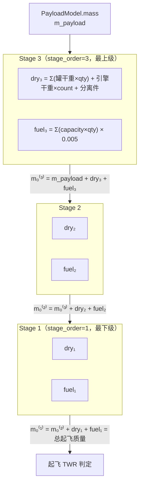

# 06 · 核心计算设计

> **版本**：v1.0 ｜ **定稿日期**：2026-09-19
> **依据**：`docs/_design-brief.md`（唯一权威源）第 4.3 / 4.6 / 4.14 / 8 / 9 节
> **上游依赖**：`02-概念模型.md`、`03-数据库设计.md`（数据模型已冻结，本文不引入任何字段级变更）
> **实现位置**：`services/orbital.py`、`services/deltav.py`、`services/stats.py`（见 `_design-brief.md` 5.1/5.2）
> **读者**：本项目的实现者（含 AI 协作者）、单元测试编写者、需要核对数值的维护者

---

## 1. 文档目的与适用范围

### 1.1 这份文档解决什么问题

项目定位是 KSP 玩家的**发射计划与任务记录管理工具**。在 `CarrierModel` 的旧定义里，玩家要手工录入 `Cleo`（LEO 运力）、`Cmass`（总质量）、`Cthrust`（最大推力）、`Cratio`（推重比）四个已经由 `Stage` + `StageTank` + `Engine` 完全决定的量。`_design-brief.md` 第 4.6 节已判定这四个字段为**冗余数据，必然与级配置漂移**，予以删除；`07-重构方案` 记录其去向。

删掉它们之后，玩家最关心的问题必须由**计算**回答，而不是由玩家自己填一个数：

> **「我设计的这枚火箭，能不能把载荷送到我想去的地方？」**

对 KSP 而言，这个问题可以被压缩成一个**标量比较**：

$$
\Delta v_{\text{可用}} \;\ge\; \Delta v_{\text{需求}}
$$

本文的全部内容，就是把左边的 $\Delta v_{\text{可用}}$（以及它的配套判据推重比）**从数据库里已有的部件与级数据中算出来**。右边的 $\Delta v_{\text{需求}}$ 是玩家的目标与游戏世界的事实（见第 9 节，v1 只展示社区经验值，不做规划器）。

本文同时定义**在轨航天器的轨道派生量**（周期、近拱点、远拱点、轨道速度、同步轨道高度），这是需求④「周期信息」的落点。

### 1.2 本文件是什么，不是什么

| 是 | 不是 |
|---|---|
| **真实物理公式在 KSP 游戏模型下的应用** | 真实星历仿真、数值轨道积分器、发射窗口搜索 |
| 供 `services/` 层实现的、可单元测试的纯函数规范 | Django 视图 / 模板 / 表单的实现细节 |
| 对每个简化假设的**显式声明与误差量级登记** | 一个声称「精确」的黑箱 |
| 供详情页展示的派生量的定义与单位约定 | 一个轨道机动规划器（maneuver planner） |

KSP 原版使用的是**简化的二体问题 + 球形天体模型**：天体没有 J2 扁率项、没有引力摄动、没有真实的星历表轨道。因此本文的公式**恰好匹配游戏内部的模型**——这不是「用简化公式凑合」，而是**用正确的公式描述一个本身就被简化了的世界**。反过来，KSP **没有**把这些简化应用到气动与推进上：大气阻力、重力转向损失、发动机瞬态在游戏里是真实存在的，但不在本文的解析公式覆盖范围内。第 3 节与第 10 节专门处理这件事。

### 1.3 章节地图

| 节 | 内容 | 对应 brief 节 | 服务 |
|---|---|---|---|
| 2 | 物理模型前提与假设 | — | 全部 |
| 3 | 基础常数与 `g0` 陷阱 | 9 | `core/constants.py` |
| 4 | 火箭方程（Δv） | 8.1 / 4.3 | `services/deltav.py` |
| 5 | 推重比（TWR） | 8.2 | `services/deltav.py` |
| 6 | 轨道周期 | 8.3 / 4.14 | `services/orbital.py` |
| 7 | 近拱点 / 远拱点 / 轨道速度 / 高度 | 8.4 | `services/orbital.py` |
| 8 | 同步轨道半长轴 | 8.5 | `services/orbital.py` |
| 9 | 霍曼转移 Δv 与 Δv 需求表 | 8.6 | `services/orbital.py` |
| 10 | 已知简化与误差来源登记 | — | 全部 |
| 11 | 计算模块设计与实现 | 8.7 / 5.1 | `services/` |
| 12 | 单元测试设计 | 9.2 | `tests/` |
| 13 | 量混用教训（警示） | 9.2 注 | 全部 |

---

## 2. ★ 物理模型前提与假设

> **本节是整份文档可信度的基础。** 一个不声明自己简化边界的计算文档，等于一个不可验证的断言。以下每一条都在第 10 节被换算成「误差影响方向 + 量级」。

### 2.1 轨道力学部分使用的模型

| # | 假设 | KSP 中的实际情形 | 对我们的影响 |
|---|---|---|---|
| A-1 | **二体问题**：只考虑航天器与被环绕天体之间的引力，忽略第三个天体的引力 | KSP 原版**确实**如此。进入某天体 SOI 后，只有该天体的引力生效 | ✅ **不是简化**，与游戏一致 |
| A-2 | **球形天体**：天体引力场是中心对称的 | KSP 天体都是理想球体（视觉上的扁率只是贴图） | ✅ **不是简化** |
| A-3 | **无 J2 项**：不计扁率导致的轨道进动 | KSP 原版无 J2 | ✅ **不是简化** |
| A-4 | **无大气阻力**：轨道计算不引入大气 | KSP 中 `situation=ORBITING` 的航天器**不**受大气阻力（大气只影响 `FLYING` 状态） | ✅ 与 `Spacecraft.situation` 语义一致 |
| A-5 | **无引力摄动、无潮汐演化** | KSP 轨道由 `sma`/`eccentricity` 等六要素**确定性**决定，不随时间衰减 | ✅ 所以轨道派生量可以「实时计算」而不需要积分 |
| A-6 | **椭圆轨道**：v1 只处理 $0 \le e < 1$ | KSP 中存在双曲线逃逸轨道（`ESCAPING`） | ⚠️ 见 11.4 边界处理：$e \ge 1$ 时**周期无定义**，返回 `None` |

**结论**：A-1 ~ A-5 都不是简化，而是**KSP 游戏引擎的模型事实**。因此本节的轨道公式（周期、近远拱点、vis-viva）在 KSP 语境下是**精确**的，不是近似。这是本系统与真实航天软件的重要区别：我们不需要为摄动留误差余量。

### 2.2 推进部分使用的模型

与轨道部分相反，Δv 计算**引入了一个真实存在的简化**。

| # | 假设 | 真实情形 | 说明 |
|---|---|---|---|
| B-1 | **比冲分段常数**：一段飞行内 $I_{sp}$ 取定值 | 真实（及 KSP）中 $I_{sp}$ 随**大气压**连续变化：`isp_asl` → `isp_vac` 之间插值 | 本文用「大气段取 `isp_asl`、真空段取 `isp_vac`」的**分段近似**，见 4.5 |
| B-2 | **质量在级内连续、均匀地减少** | 真实，与火箭方程一致 | ✅ 火箭方程本身的前提 |
| B-3 | **忽略气动损失**（升力/阻力） | 真实存在（KSP 默认气动模型 FAR 化后更明显） | ❌ 见 10.1：使计算**偏乐观** |
| B-4 | **忽略重力转向损失**（gravity turn / steering loss） | 真实存在，且是 Kerbin 入轨的主要损失之一 | ❌ 见 10.1 |
| B-5 | **忽略发动机启动/关机瞬态**（点火延迟、推力爬升、关机残压） | 真实存在，影响约 1–2 s 的有效工作时间 | ❌ 量级小，见 10.4 |
| B-6 | **忽略燃料残余与不可用燃料** | 真实存在（管线残油、`usable_capacity < capacity`） | ❌ 见 10.5：使计算**偏乐观** |
| B-7 | **忽略级间分离的碰撞风险** | 真实存在（径向分离器抛离的固推可能撞回主箭） | 不可量化，仅作提示 |
| B-8 | **假设级在最优时刻点燃/抛弃（无「级间重叠」）** | 真实中可热分级（hot staging）以省 Δv | ❌ 使计算**偏保守**，与 B-3/B-4 方向相反 |

### 2.3 ★ `FUEL_UNIT_MASS = 0.005 t/单位` 的完整论证

这是 Δv 计算里**唯一一个「人为选定」的数**，必须完整交代。

**（1）`capacity` 的语义**

`FuelTank.capacity` 是**燃料资源单位数**（KSP 界面里的 "units"），与质量数值**一一对应**（KSP 的设计约定：1 单位资源 ≈ 1 kg 基准质量）。

**（2）为什么取 0.005 t/单位**

KSP 中液体燃料罐装的是 **LF（Liquid Fuel）+ OX（Oxidizer）** 两种资源。以 FL-T800 为例，游戏内为 360 LF + 440 OX = 800 单位，满载燃料质量 4.0 t → 平均 **0.005 t/单位**。对 `LF_OX` 类型，`capacity` 记录的是 **LF + OX 合计**单位数（800），故：

$$
m_{\text{fuel}} = \texttt{capacity} \times \texttt{FUEL\_UNIT\_MASS} = 800 \times 0.005 = 4.0\ \text{t}
$$

这一步的意义是：**`capacity` 与质量在数值上直接挂钩**，不需要玩家另外录入湿重来做 Δv 计算。

**（3）为什么不做 LF/OX 分账**

严格来说 LF 与 OX 的密度并不相同，二者按发动机的混合比消耗。理论上可以做：

$$
m_{\text{fuel}} = n_{\text{LF}} \cdot \rho_{\text{LF}} + n_{\text{OX}} \cdot \rho_{\text{OX}}
$$

**本项目不做这件事，理由有三：**

1. **新版本 KSP 中 LF 与 OX 的密度已统一**（`FL-T800` 的 360 LF + 440 OX = 800 单位 = 4.0 t，即两种资源同为 0.005 t/单位）。分账在数值上不会带来任何差别，只会增加两列字段与一条校验。
2. 对「**本级总质量 → Δv**」这个计算路径，Δv 只依赖**燃料的总质量**，不依赖它由几种资源构成。齐奥尔科夫斯基公式的输入是 $m_0$ 与 $m_f$，与推进剂成分无关。
3. 分账会引入一个**必须由玩家维护**的混合比字段，而混合比是**发动机的属性**（`Engine.fuel_type`），不是燃料罐的属性。把发动机的属性复制到燃料罐上，正是 `_design-brief.md` 第 2 节所批判的「可消除的传递依赖」。

**（4）其他燃料类型**

| `FuelType` | `FUEL_UNIT_MASS` 适用性 | 说明 |
|---|---|---|
| `LF_OX` | ✅ 0.005 t/单位 | `capacity` = LF + OX 合计；混合平均 |
| `SOLID` | ✅ 0.005 t/单位 | 固体燃料 `capacity` 直接等于「固体燃料质量换算单位」 |
| `MONO` | ✅ 0.005 t/单位 | 单元推进剂（Xenon 之外）密度同量级 |
| `XENON` | ⚠️ 0.005 t/单位 | 氙气实际约 0.0001 t/单位，但**氙气罐的干重远大于燃料质量**，且离子推进的 Δv 计算不在 v1 目标；此误差在「电推航天器」场景外无影响 |
| `ORE` | ⚠️ 0.005 t/单位 | 矿石不参与化学推进 Δv 计算（无对应发动机），不影响主要路径 |
| `OTHER` | ⚠️ 同上 | — |

**（5）这条简化被登记为风险 R-02**（见 `_design-brief.md` 第 14 节），并在第 10 节量化为：**对化学推进火箭，质量误差 < 1%；对电推航天器，误差可达数十倍，故 v1 不对电推计算 Δv。**

### 2.4 为什么这些简化对「玩家决策」是可接受的

玩家的实际决策是二值的：**「这枚火箭能不能做到」**，而不是**「入轨后我会差多少米」**。

- 一个明确「能」的火箭（计算 Δv 5 000 m/s 对需求 3 400 m/s），即使打了 20% 折扣仍然「能」。
- 一个明确「不能」的火箭（计算 Δv 2 400 m/s 对需求 3 400 m/s），即使有 10% 的乐观偏差也仍然「不能」。
- 只有落在**边界带**的火箭才需要更精确的判断。系统对此的策略是**如实展示误差带**（第 10 节）并给出明确的上界声明，让玩家自己决定是否加一级。

这比「给一个假装精确的 6 位小数」对玩家更有用。**文档里必须把这件事说清楚，否则数值会被误当成仿真结果。**

> **⚠️ 一句话声明（最终写入详情页页脚）**
> 「本页所有 Δv 均为**理论值**，未计入气动损失与重力转向损失。实际入轨所需 Δv 通常比本值**高 10–20%**。请把计算结果当作**上界**使用。」

---

## 3. ★ 基础常数

### 3.1 常数表

实现位置：`core/constants.py`（`_design-brief.md` 5.1 已指定此文件）。

```python
# core/constants.py
"""KSP 物理常数集中定义。

单位一律 SI（米 / 秒 / 千克换算的吨）。
本模块不 import Django，可被 services/ 与单元测试直接引用。
"""

#: 标准重力加速度 (m/s²)。
#: ⚠️ 这是**常数**，与所在天体无关。齐奥尔科夫斯基公式的分母用它，
#:    绝不可用当地重力加速度（如 Body.surface_gravity）替代。见 3.3。
G0: float = 9.80665

#: 每单位燃料的质量 (t/单位)。见 4.3「容量语义」与 2.3 的完整论证。
FUEL_UNIT_MASS: float = 0.005

#: KSP 太阳日 (s)，仅用于展示层的「天」换算。
#: ⚠️ 轨道周期计算用的是 Body.sidereal_day（恒星日），不是这个值。见 6.5。
KERBIN_DAY: float = 21600.0
```

| 常数 | 符号 | 值 | 单位 | 用途 | 是否与天体有关 |
|---|---|---|---|---|---|
| 标准重力加速度 | $g_0$ | `9.80665` | m/s² | 齐奥尔科夫斯基公式 $\Delta v = I_{sp} g_0 \ln(m_0/m_f)$ | **无关（绝对常数）** |
| 单位燃料质量 | — | `0.005` | t/单位 | 由 `FuelTank.capacity` 换算燃料质量 | 无关 |
| KSP 太阳日 | — | `21600.0` | s | **仅**展示层把秒换算成「天」 | 无关（Kerbin 定义，全星系通用） |

### 3.2 $\mu$ 与当地重力加速度的关系

天体的标准重力参数与当地重力加速度不是同一个量，二者的关系是：

$$
g_{\text{local}}(r) = \frac{\mu}{r^2}
$$

| 符号 | 含义 | 单位 | 数据来源 |
|---|---|---|---|
| $\mu$ | 标准重力参数（gravitational parameter） | m³/s² | `Body.mu` |
| $r$ | 到天体**中心**的距离（**不是高度**） | m | $r = \texttt{Body.radius} + \text{altitude}$ |
| $g_{\text{local}}$ | 该处的重力加速度 | m/s² | 派生量 |

**代入 Kerbin 验算**（$\mu = 3.5316\times10^{12}$，$R = 600\,000$ m）：

$$
g_{\text{local}}(R) = \frac{3.5316\times10^{12}}{600\,000^2} = \frac{3.5316\times10^{12}}{3.6\times10^{11}} = 9.8100\ \text{m/s}^2
$$

与 `Body.surface_gravity = 9.81` 一致 ✅。**注意 9.8100 与 9.80665 极其接近但不同** —— 正是这个巧合让下一节的错误变得隐蔽。

### 3.3 ★★ 陷阱专节：$g_0$ 是常数，与天体无关

> **这是 KSP 玩家与初学者在 Δv 计算上最常犯的错误，且它是无声的。**

**错误做法**：认为「比冲的单位是秒，秒是时间的单位，所以要把比冲乘上一个重力加速度才能得到速度；火箭在哪个天体上，就用哪个天体的重力加速度」。

于是有人写：

```python
# ❌ 错误：用当地重力替代 g0
g_local = body.mu / body.radius ** 2
dv = isp * g_local * math.log(m0 / mf)
```

**为什么错**：比冲的定义是

$$
I_{sp} \equiv \frac{F}{\dot{m}\, g_0}
$$

其中 $g_0$ 是**定义比冲这个单位时约定使用的标准重力加速度**（历史上定为 9.80665 m/s²），它是**单位的定义常数**，不是物理环境的属性。它的作用是把「秒」这个时间单位换算成「米/秒」这个速度单位。换到月球上做同样的换算，换算系数不会变成月球的重力。

**错误的后果有多大**：

以 `isp = 345 s`、$m_0/m_f = 2.5$ 为例：

| 使用的地 $g$ | 计算式 | 结果 | 相对正确值的偏差 |
|---|---|---|---|
| ✅ `G0 = 9.80665`（Kerbin 上） | $345 \times 9.80665 \times \ln 2.5$ | **3 100.08 m/s** | 基准 |
| ❌ Kerbin 表面重力 `9.81` | $345 \times 9.81 \times \ln 2.5$ | 3 101.14 m/s | +0.03%（**几乎看不出，所以错误会一直藏着**） |
| ❌ **Mun** 表面重力 `1.63` | $345 \times 1.63 \times \ln 2.5$ | **515.28 m/s** | **−83.4%（灾难性）** |
| ❌ **Minmus** 表面重力 `0.491` | $345 \times 0.491 \times \ln 2.5$ | 155.22 m/s | **−95.0%** |

**Kerbin 上的偏差只有 0.03%**，这恰恰是最危险的地方：开发者在母星上测试时永远发现不了这个 bug；等到玩家设计一个从 Mun 起飞的上升级，系统会告诉他「Δv 只有 515 m/s」，而这个数字**看起来像个正常数值**，玩家会以为自己的火箭真的不行。

**防护措施**（三层）：

1. **代码层**：`services/deltav.py` 中 `G0` 只从 `core/constants.py` 导入，**函数签名中不出现任何 `g`、`gravity`、`body` 参数**。物理上无法传错。
2. **测试层**：第 12.3 节的正例测试中，同一组 $(I_{sp}, m_0, m_f)$ 在天体无关的前提下必须得到同一结果；并加入一条**负例断言**：$\Delta v \ne I_{sp}\cdot g_{\text{Mun}}\cdot\ln(m_0/m_f)$。
3. **文档层**：本节。

**与 TWR 的对比，避免矫枉过正**：

| 量 | 用什么重力 | 为什么 |
|---|---|---|
| **Δv**（火箭方程） | $g_0 = 9.80665$，**绝对常数** | $g_0$ 是比冲的单位定义常数 |
| **TWR**（推重比） | $g_{\text{local}} = \mu/r^2$，**当地值** | TWR 是推力与**当地重力**的比值，是真实的力比较 |

**两个公式用的是两个不同的 $g$，且都正确。** 这是本文档最容易读错的一处，特此并列强调。

---

## 4. ★ 火箭方程（齐奥尔科夫斯基公式）

### 4.1 推导

**前提**：在无外力的惯性系中，一枚质量为 $m$、速度为 $v$ 的火箭，以相对火箭 $v_e$ 的**排气速度**向后喷出质量。

对 [火箭 + 已喷出推进剂] 这个系统用动量守恒。设 $t$ 时刻火箭质量 $m$、速度 $v$；$t + dt$ 时刻火箭质量 $m + dm$（$dm < 0$）、速度 $v + dv$，喷出的推进剂质量 $-dm$、速度 $v - v_e$：

$$
m v = (m + dm)(v + dv) + (-dm)(v - v_e)
$$

展开并略去二阶小量 $dm\,dv$：

$$
m v = m v + m\,dv + v\,dm - v\,dm + v_e\,dm
\;\Longrightarrow\;
m\,dv = -v_e\,dm
\;\Longrightarrow\;
dv = -v_e\,\frac{dm}{m}
$$

积分（从 $m_0$ 到 $m_f$）：

$$
\Delta v = \int_{m_0}^{m_f} -v_e\,\frac{dm}{m} = v_e \ln\frac{m_0}{m_f}
$$

代入比冲的定义 $v_e = I_{sp}\,g_0$（见 3.3），得**齐奥尔科夫斯基公式**：

$$
\boxed{\;\Delta v = I_{sp} \cdot g_0 \cdot \ln\frac{m_0}{m_f}\;}
$$

| 符号 | 含义 | 单位 | 本项目来源 |
|---|---|---|---|
| $\Delta v$ | 该级能提供的速度增量（理想值） | m/s | 计算输出 |
| $I_{sp}$ | 比冲 | s | `Engine.isp_asl` 或 `Engine.isp_vac`，见 4.5 |
| $g_0$ | 标准重力加速度，**常数 9.80665** | m/s² | `core/constants.G0` |
| $m_0$ | 该级**点火时**的全部质量 | t | 见 4.2 |
| $m_f$ | 该级**燃尽时**的质量 | t | $m_f = m_0 - m_{\text{fuel}}$ |
| $m_0/m_f$ | 质量比（mass ratio），记作 $R$ | 无量纲 | 中间量，> 1 |

**补充定义**：燃料质量分数

$$
\zeta = \frac{m_{\text{fuel}}}{m_0} = 1 - \frac{1}{R}, \qquad
R = \frac{1}{1-\zeta}
$$

$\zeta$ 是判断「这一级设计得是否合理」的直观指标：KSP 化学推进级的典型 $\zeta \approx 0.75\text{–}0.85$。若某级 $\zeta < 0.5$，说明干重占比过大，Δv 会明显偏低。

### 4.2 每级的质量构成（★ 最容易算错的地方）

`_design-brief.md` 8.1 定义了本级质量构成的公式。整理为：

**本级干重**（该级自身不含燃料的质量）：

$$
m_{\text{dry}}^{(\text{本级})} =
\underbrace{\sum_{k \in \text{StageTank}} \big(m_{\text{dry,part}}^{(k)} \times q_k\big)}_{\text{燃料罐壳体}}
+ \underbrace{m_{\text{dry,engine}} \times n_{\text{engine}}}_{\text{发动机}}
+ \underbrace{m_{\text{decoupler}}}_{\text{分离件}}
$$

**本级燃料质量**：

$$
m_{\text{fuel}}^{(\text{本级})} =
\sum_{k \in \text{StageTank}} \big(\texttt{capacity}_k \times q_k\big) \times \texttt{FUEL\_UNIT\_MASS}
$$

| 符号 | 含义 | 单位 | 数据来源 |
|---|---|---|---|
| $m_{\text{dry,part}}^{(k)}$ | 第 $k$ 行 `StageTank` 所指燃料罐对应部件的干重 | t | `StageTank.fuel_tank.part.dry_mass` |
| $q_k$ | 该行 `StageTank.quantity` | 个 | `StageTank.quantity` |
| $m_{\text{dry,engine}}$ | 主引擎部件干重 | t | `Stage.engine.part.dry_mass` |
| $n_{\text{engine}}$ | 引擎数量 | 个 | `Stage.engine_count` |
| $m_{\text{decoupler}}$ | 该级分离件质量 | t | `Stage.decoupler_mass` |
| $\texttt{capacity}_k$ | 该燃料罐容量（单位） | 单位 | `FuelTank.capacity` |
| $\texttt{FUEL\_UNIT\_MASS}$ | 0.005 | t/单位 | `core/constants.py` |

**⚠️ 注意 $\Delta v$ 与「湿重」的关系**：`FuelTank.wet_mass` 是**展示用**字段（玩家从游戏里抄的满载质量），**不参与 Δv 计算**。计算只用 `part.dry_mass` 与 `capacity`。这样做的理由是保持**单一权威输入**：若同时使用 `wet_mass` 与 `capacity`，玩家改了一个忘了改另一个就会得到自相矛盾的结果。`wet_mass` 与「`dry_mass + capacity × 0.005`」的一致性由 `FuelTank.clean()` 的提示（而非硬校验）来照看。

**🚨 `m_0` 必须包含上方所有级 + 载荷质量**

这是整份文档里**最容易算错的一处**。火箭是**叠罗汉**：最下面一级在点火时，必须把**它上面的一切**都推上去，包括上面各级的干重、上面各级尚未消耗的燃料、以及顶部载荷。

**❌ 错误写法**（只算本级）：

$$
m_0^{(\text{错})} = m_{\text{dry}}^{(\text{本级})} + m_{\text{fuel}}^{(\text{本级})}
$$

**✅ 正确写法**：

$$
m_0^{(\text{本级})} = m_{\text{dry}}^{(\text{本级})} + m_{\text{fuel}}^{(\text{本级})} + \sum_{j\ \text{上方各级}} \Big(m_{\text{dry}}^{(j)} + m_{\text{fuel}}^{(j)}\Big) + m_{\text{payload}}
$$

$$
m_f^{(\text{本级})} = m_0^{(\text{本级})} - m_{\text{fuel}}^{(\text{本级})}
$$

**递推形式**（实现时用这个，避免嵌套求和）：

```python
upper = payload_mass          # 从最顶端开始
for stage in reversed(stages):        # 自顶向下（即自最上级到最下级）
    m0 = upper + dry(stage) + fuel(stage)
    mf = upper + dry(stage)
    dv[stage] = isp * G0 * log(m0 / mf)
    upper = m0                # ★ 关键：本级点火质量成为下一级的 upper
```

**示意图**（以三级火箭为例，`stage_order=1` 是最下面一级）：

```text
                    ▲
                    │  ┌───────────────────────────┐
                    │  │  PayloadModel.mass        │  ← m_payload
                    │  │  (= 4.25 t)               │
                    │  ├───────────────────────────┤
                    │  │  Stage 3                  │
                    │  │   干重 dry₃ (0.625 t)      │  ← 这 4.125 t
     Stage 3 的 m0  │  │   燃料 fuel₃ (2.000 t)     │     全部要被 S2 推
                    │  └───────────────────────────┘
                    │  ┌───────────────────────────┐
                    │  │  Stage 2                  │
                    │  │   干重 dry₂ (1.550 t)      │  ← 这 13.675 t
     Stage 2 的 m0  │  │   燃料 fuel₂ (8.000 t)     │     全部要被 S1 推
                    │  └───────────────────────────┘
                    │  ┌───────────────────────────┐
                    │  │  Stage 1                  │
                    │  │   干重 dry₁ (4.800 t)      │  ← 这 36.475 t
     Stage 1 的 m0  │  │   燃料 fuel₁ (18.000 t)    │     全部压在发射台上
                    │  └───────────────────────────┘
                    ▼
                发射台 / Site
```

**图解**：
- `Stage 3` 点火时它只推自己和载荷 → $m_0^{(3)} = 1.5 + 0.625 + 2.0 = 4.125$ t
- `Stage 2` 点火时 `Stage 3` 还完整地在上面 → $m_0^{(2)} = 4.125 + 1.55 + 8.0 = 13.675$ t
- `Stage 1` 点火时 `Stage 2`+`Stage 3` 都完整地在上面 → $m_0^{(1)} = 13.675 + 4.8 + 18.0 = 36.475$ t

注意 $m_0^{(1)} = 36.475$ t 正是**总起飞质量**，它必须等于全部干重 + 全部燃料 + 载荷：

$$
4.8 + 1.55 + 0.625 + 18.0 + 8.0 + 2.0 + 1.5 = 36.475\ \text{t} \quad ✅
$$

**这条「质量闭合」恒等式应写进单元测试**（见 12.5），它是发现「漏算某一级」的最有效手段。

### 4.3 各级质量的 mermaid 数据流



### 4.4 逐级 Δv 与总 Δv

$$
\Delta v_{\text{总}} = \sum_{i=1}^{n} I_{sp}^{(i)}\, g_0 \ln\frac{m_0^{(i)}}{m_f^{(i)}}
$$

**⚠️ 一个必须声明的近似**：严格来说，多级火箭的总 Δv **不等于**各级 Δv 的算术和——因为每级的起始/终止速度不同，气动与重力损失在各段的分布不同。但在**理想无损失**前提下（这正是本文的计算前提），各级的速度增量确实可以直接相加，这正是「Δv 预算」这一整套工程实践的基础。本系统遵循这一惯例，并在第 10 节把它登记为简化项。

**建议同时在界面上展示「累加条」**（`_design-brief.md` 第 7 节页面 6 已要求）：把各级 Δv 画成堆叠条形图，让玩家一眼看出**哪一级贡献最大**。

### 4.5 比冲选择策略

| 规则 | 内容 |
|---|---|
| **默认规则（v1）** | `stage_order == 1`（最下面一级）用 `Engine.isp_asl`；其余各级用 `Engine.isp_vac` |
| **理由** | 最下面一级绝大部分工作时间在**大气层内**（Kerbin 大气高 70 km，而第一级通常在此高度前已耗尽）；上面各级在大气层外点火 |
| **显式覆盖** | 表单提供 `use_vacuum_isp` 复选框（或在 `Stage` 上增加一个可选覆盖字段，见下）；玩家可强制指定 |
| **`isp_asl == 0` 时** | 回退到 `isp_vac`（部分真空版引擎的 `isp_asl` 为 0，表示「不可在大气中使用」） |
| **`isp_vac == 0` 时** | 回退到 `isp_asl` |

**关于「显式覆盖」的落库方式**：`_design-brief.md` 第 4.8 节的 `Stage` 字段表中**没有** `use_vacuum_isp` 字段。按照第 12 节「`03` 冻结数据模型之后不得再引入字段级变更」的约束，**v1 不新增字段**，覆盖通过**表单运行时的查询参数**实现（例如 `?s1_isp=vac`）或在渲染时由视图计算两种方案供玩家对比。这一点写入 `08-任务清单` 的可选优化项。

**真空段/大气段的真实分界**并不是「第一级 / 其余级」这么简单——真正的判据是飞行高度是否超过 `Body.atmosphere_height`。但求解「第一级燃尽时的高度」需要数值积分（超出了解析公式的范围），因此 v1 采用上述**保守的分段规则**，并在第 10.2 节登记其方向（第一级用 `isp_asl` 会**低估**第一级的 Δv，因为第一级后半段其实已在真空中工作 → **偏保守**）。

### 4.6 ★ 完整手算例题（三级火箭）

> 本节的每一个数字都已用 Python 实测核对（见 12.3 的断言值）。

**任务**：把 1.5 t 的科学探测器送到 Kerbin 低轨之外的转移轨道。

**级配置**（注意 `stage_order=1` 是最下面一级）：

| 级 | `stage_order` | 主引擎 | 引擎数 | 比冲 | 燃料罐配置 | `decoupler_mass` |
|---|---|---|---|---|---|---|
| S1 | 1 | `isp_asl=250`，`thrust_asl=220 kN` | 2 | **250**（`isp_asl`） | FL-T800 ×4 + FL-T400 ×1 | 0.05 t |
| S2 | 2 | `isp_vac=345`，`thrust_vac=60 kN` | 1 | **345**（`isp_vac`） | FL-T800 ×2 | 0.05 t |
| S3 | 3 | `isp_vac=345`，`thrust_vac=60 kN` | 1 | **345**（`isp_vac`） | FL-T400 ×1 | 0 |

部件数据（干重）：

| 部件 | `part.dry_mass` | `FuelTank.capacity` |
|---|---|---|
| 引擎 A（S1 用） | 1.25 t | — |
| 引擎 B（S2/S3 用） | 0.50 t | — |
| FL-T800 | 0.500 t | 800 单位 |
| FL-T400 | 0.250 t | 400 单位 |

**载荷**：`PayloadModel.mass = 1.5 t`

#### 第 1 步：逐级算干重与燃料质量

**S1**：

$$
m_{\text{dry}}^{(1)} = (0.5 \times 4 + 0.25 \times 1) + 1.25 \times 2 + 0.05 = 2.25 + 2.5 + 0.05 = 4.800\ \text{t}
$$

$$
m_{\text{fuel}}^{(1)} = (800 \times 4 + 400 \times 1) \times 0.005 = 3600 \times 0.005 = 18.000\ \text{t}
$$

**S2**：

$$
m_{\text{dry}}^{(2)} = (0.5 \times 2) + 0.50 \times 1 + 0.05 = 1.0 + 0.5 + 0.05 = 1.550\ \text{t}
$$

$$
m_{\text{fuel}}^{(2)} = (800 \times 2) \times 0.005 = 1600 \times 0.005 = 8.000\ \text{t}
$$

**S3**：

$$
m_{\text{dry}}^{(3)} = (0.25 \times 1) + 0.50 \times 1 + 0 = 0.625\ \text{t}
$$

$$
m_{\text{fuel}}^{(3)} = (400 \times 1) \times 0.005 = 2.000\ \text{t}
$$

#### 第 2 步：自顶向下算 $m_0$ / $m_f$

**S3**（$m_{\text{upper}} = m_{\text{payload}} = 1.5$ t）：

$$
m_0^{(3)} = 1.5 + 0.625 + 2.000 = 4.125\ \text{t}, \qquad m_f^{(3)} = 4.125 - 2.000 = 2.125\ \text{t}
$$

**S2**（$m_{\text{upper}} = m_0^{(3)} = 4.125$ t）：

$$
m_0^{(2)} = 4.125 + 1.550 + 8.000 = 13.675\ \text{t}, \qquad m_f^{(2)} = 13.675 - 8.000 = 5.675\ \text{t}
$$

**S1**（$m_{\text{upper}} = m_0^{(2)} = 13.675$ t）：

$$
m_0^{(1)} = 13.675 + 4.800 + 18.000 = 36.475\ \text{t}, \qquad m_f^{(1)} = 36.475 - 18.000 = 18.475\ \text{t}
$$

#### 第 3 步：逐级算 Δv

**S1**（$R = 36.475 / 18.475 = 1.974290$）：

$$
\Delta v^{(1)} = 250 \times 9.80665 \times \ln(1.974290)
= 2451.6625 \times 0.680208 = \mathbf{1667.642\ \text{m/s}}
$$

**S2**（$R = 13.675 / 5.675 = 2.409692$）：

$$
\Delta v^{(2)} = 345 \times 9.80665 \times \ln(2.409692)
= 3383.29425 \times 0.879443 = \mathbf{2975.603\ \text{m/s}}
$$

**S3**（$R = 4.125 / 2.125 = 1.941176$）：

$$
\Delta v^{(3)} = 345 \times 9.80665 \times \ln(1.941176)
= 3383.29425 \times 0.663294 = \mathbf{2244.120\ \text{m/s}}
$$

#### 第 4 步：总 Δv

$$
\Delta v_{\text{总}} = 1667.642 + 2975.603 + 2244.120 = \mathbf{6887.365\ \text{m/s}}
$$

#### 结果汇总表

| 级 | 干重 (t) | 燃料 (t) | $m_0$ (t) | $m_f$ (t) | $R$ | $I_{sp}$ (s) | $\zeta$ | Δv (m/s) |
|---|---|---|---|---|---|---|---|---|
| S1 | 4.800 | 18.000 | 36.475 | 18.475 | 1.974290 | 250 | 0.4935 | 1 667.642 |
| S2 | 1.550 | 8.000 | 13.675 | 5.675 | 2.409692 | 345 | 0.5850 | 2 975.603 |
| S3 | 0.625 | 2.000 | 4.125 | 2.125 | 1.941176 | 345 | 0.4848 | 2 244.120 |
| **合计** | 6.975 | 28.000 | **36.475**（起飞） | — | — | — | — | **6 887.365** |

**质量闭合校验**：$6.975 + 28.000 + 1.500 = 36.475$ t ✅

**工程解读**（这段解读也必须出现在火箭详情页上，否则玩家只看到一个孤立的数字）：

- Kerbin 表面 → 100 km LKO 的实际需求约 **3 400 m/s**（含损失，见第 9 节）。本设计有 6 887 m/s，**余量约 3 500 m/s**，足以再完成一次 LKO → Mun 转移（约 860 m/s）、Mun 轨道捕获（约 210 m/s）并留有余裕。
- S1 的 $\zeta = 0.494$ 偏低（KSP 化学级典型 0.75–0.85）。原因：**2 台引擎的干重（2.5 t）对 18 t 燃料而言偏大**。把 S1 改成「1 台大推力引擎 + 更多燃料罐」可显著提高 Δv。系统应在页面上给出这条**结构化建议**（见 11.6）。
- S1 的 Δv 只占总量的 24%。这是**正常的**——第一级主要任务是对抗重力与大气损失「把火箭抬起来」，而不是提供轨道速度。

---

## 5. ★ 推重比（TWR）

### 5.1 公式

$$
\text{TWR} = \frac{F}{m_0 \cdot g_{\text{local}}}, \qquad g_{\text{local}} = \frac{\mu}{r^2}
$$

| 符号 | 含义 | 单位 | 来源 |
|---|---|---|---|
| $F$ | 该级**总推力** | N（内部）/ kN（库） | `Engine.thrust_asl`（大气判定）或 `thrust_vac`（真空判定）$\times$ `engine_count` |
| $m_0$ | 该级点火时的质量 | kg（内部）/ t（库） | 与 4.2 的 $m_0$ **同一个量** |
| $g_{\text{local}}$ | $r$ 处的当地重力加速度 | m/s² | $\mu / r^2$ |
| $\mu$ | 天体标准重力参数 | m³/s² | `Body.mu` |
| $r$ | 到天体**中心**的距离 | m | $r = \texttt{Body.radius} + \text{altitude}$ |

**单位陷阱**：`Engine.thrust_*` 的单位是 **kN**，质量单位是 **t**，两者之比需要 $\times 1000$ 才能得到无量纲的 TWR：

$$
\text{TWR} = \frac{F\,[\text{kN}] \times 1000}{m_0\,[\text{t}] \times 1000 \times g_{\text{local}}} = \frac{F\,[\text{kN}]}{m_0\,[\text{t}] \times g_{\text{local}}}
$$

因为 kN → N 与 t → kg 的换算系数都是 1000，**恰好抵消**。因此实现里可以干净地写成：

```python
twr = thrust_kn / (m0_t * g_local)   # 无需任何 1000 因子
```

这一点必须在代码注释里写明，否则维护者会以为漏了单位换算而「顺手修好」，反而引入 1000 倍错误。

### 5.2 起飞判定：取 $r = \texttt{Body.radius}$

`_design-brief.md` 8.2 规定：**v1 在发射场判定时取 $r = \texttt{Body.radius}$**。

**理由**：

1. **起飞瞬间是 TWR 最差的时刻**。燃料还没烧，$m_0$ 最大；同时 $r$ 最小，$g_{\text{local}}$ 最大。二者相乘使 TWR 取到**最小值**。如果起飞的 TWR $\ge 1.2$，那整个第一级工作段的 TWR 都会 $\ge 1.2$。
2. **发射场海拔**（`Site.altitude`）相对天体半径是小量。以 Kerbin 为例，KSC 海拔约 70 m 对 $R = 600\,000$ m：

$$
\frac{g(R)}{g(R + 70)} = \left(\frac{600\,070}{600\,000}\right)^2 = 1.000233
$$

即重力差 **0.023%**，对 TWR 的影响远小于「忽略气动损失」带来的 10–20%。为了一个 0.02% 的精度去维护 `Site.altitude` 与 `Site.body` 的一致性，性价比不成立。

3. `Site.altitude` 在 `04`/`05` 中**保留展示**（玩家想看），只是不进入 v1 的 TWR 判定。这是「数据保留、计算简化」的标准处理。

**展开后的起飞 TWR 公式**：

$$
\text{TWR}_{\text{liftoff}} = \frac{\texttt{thrust\_asl} \times \texttt{engine\_count}}
{m_0^{(1)} \times \dfrac{\texttt{Body.mu}}{\texttt{Body.radius}^2}}
$$

**Kerbin 上简化记忆**：$\mu/R^2 = 9.81$ m/s²，所以

$$
\text{TWR}_{\text{liftoff,Kerbin}} \approx \frac{F\,[\text{kN}] \times n}{m_0\,[\text{t}] \times 9.81}
$$

### 5.3 为什么 Δv 足够还不够：TWR 的必要性

**反例（这就是 TWR 存在的全部理由）**：

一枚火箭计算 Δv = 4 500 m/s（远超 LKO 所需的 3 400 m/s），但起飞质量 60 t、第一级只有 1 台 168 kN 的引擎：

$$
\text{TWR} = \frac{168}{60 \times 9.81} = 0.285 < 1
$$

**它根本离不开地面。** 推力小于重力，火箭只会坐在发射台上烧燃料。它的 Δv 是 4 500 m/s —— 一个完全真实的数字，但**毫无意义**，因为 Δv 公式只描述「加速能力」，不描述「能否起飞」。

**结论**：

$$
\text{可用} \iff \big(\text{TWR}_{\text{liftoff}} \ge 1.2\big) \;\wedge\; \big(\Delta v_{\text{总}} \ge \Delta v_{\text{需求}}\big)
$$

**两个条件是「与」的关系，缺一不可。** 详情页必须**同时**突出显示这两个判据，不能只显示 Δv。

### 5.4 判定阈值与提示策略

`_design-brief.md` 8.2 规定的阈值：

| TWR 区间 | 判定 | 界面提示 | 建议 |
|---|---|---|---|
| $< 1.0$ | **❌ 无法起飞** | 红色危险 | 推力小于重力，火箭不会离开发射台。必须增加引擎数量或更换更大推力的引擎。 |
| $1.0 \le \text{TWR} < 1.2$ | **⚠️ 勉强** | 橙色警告 | 可以起飞但加速极慢，重力损失极大，实际入轨 Δv 需求会明显上升。建议提高到 1.2 以上。 |
| $1.2 \le \text{TWR} \le 1.7$ | **✅ 合理区间** | 绿色正常 | 这是 KSP 社区推荐的起飞推重比区间：既不浪费推力，重力损失也可控。 |
| $1.7 < \text{TWR} \le 2.5$ | ⚠️ 偏大 | 黄色提示 | 推重比偏高，重力损失小，但会更快达到最大动压（Max-Q），气动阻力与气动加热更严重。 |
| $> 2.5$ | **⚠️ 过推** | 黄色提示 | 「过推，气动损失大」。建议降低节流上限（`Stage.min_throttle_used`）或减少引擎数量。 |

**注意**：$> 2.5$ 仍然**可用**，只是不经济。提示用**黄色信息**而非**红色错误**——这是设计取舍（更快的入轨 vs 更多的气动损失），不是错误。KSP 玩家常用「过推 + 节流到 60%」的起飞方案。

**边界值的归属**：阈值取闭区间下界（$\ge 1.2$ 含 1.2，$\le 1.7$ 含 1.7）。实现必须与测试使用同一套比较符，否则 TWR = 1.2 会在不同处得到不同结论。

### 5.5 各级 TWR 与「级间 TWR」

除了起飞 TWR，还应计算**每一级点火瞬间**的 TWR：

$$
\text{TWR}^{(i)} = \frac{F^{(i)}}{m_0^{(i)} \cdot g_{\text{local}}(r_i)}
$$

其中 $r_i$ 是该级点火时的高度。**这个高度需要飞行剖面仿真才能确定**，超出 v1 范围。v1 的做法：

| 级 | $r$ 的取法 | 推力取值 |
|---|---|---|
| `stage_order == 1`（起飞级） | $r = \texttt{Body.radius}$ | `thrust_asl` |
| 其余级（上面级） | $r = \texttt{Body.radius} + \texttt{Body.atmosphere\_height}$（视为已在真空） | `thrust_vac` |

用 `Body.atmosphere_height` 作为上面级的判定半径是一个**保守但可解释**的选择：它给出的是「理论上已经在大气层外」的位置。Kerbin 上 $r = 670\,000$ m，$g = 3.5316\times10^{12}/670000^2 = 7.8672$ m/s²。

### 5.6 为什么上面级 TWR < 1 不是错误

**这是玩家最常误报为 bug 的一处，必须写清楚。**

**事实**：上面级在真空中工作时 TWR **经常小于 1**，而且**完全正常**。

**为什么**：TWR 的物理意义是「推力能否对抗当地重力」。但在**轨道上**，航天器已经处于自由落体状态——它不需要「对抗」重力，因为重力已经被**离心效应**（在旋转参考系中）或**轨道运动的连续性**（在惯性系中）平衡了。

一个在轨道上的航天器施加推力，得到的是**纯粹的加速**：

$$
a = \frac{F}{m}
$$

对于自由空间中的加速，重要的不是「推力 > 重力」，而是**推力的方向与大小是否足以在期望的时间内改变轨道**。一个 TWR = 0.1 的上面级只要工作时间足够长（这就是所谓**低推力轨道机动**），同样能完成 1 000 m/s 的 Δv。

**以本例题验算**（第 4.6 节的 S2/S3，`thrust_vac = 60 kN`）：

S2 点火质量 13.675 t，$r = 670\,000$ m：

$$
g_{\text{local}} = \frac{3.5316\times10^{12}}{670\,000^2} = 7.8672\ \text{m/s}^2
$$

$$
\text{TWR}^{(2)} = \frac{60}{13.675 \times 7.8672} = \frac{60}{107.600} = \mathbf{0.5577}
$$

**TWR = 0.56 < 1，但它完全正常工作。** 这一级在真空中提供 2 975.6 m/s 的 Δv。

S3 点火质量 4.125 t：

$$
\text{TWR}^{(3)} = \frac{60}{4.125 \times 7.8672} = \frac{60}{32.452} = \mathbf{1.8489}
$$

**对比表**：

| 级 | $m_0$ (t) | 推力 (kN) | $g_{\text{local}}$ (m/s²) | TWR | 判定 |
|---|---|---|---|---|---|
| S1（起飞，大气） | 36.475 | 220 × 2 = 440（asl） | 9.8100（$r=R$） | **1.2297** | ✅ 合理区间 |
| S2（真空） | 13.675 | 60（vac） | 7.8672（$r=R+h_{atm}$） | **0.5577** | ⚠️ **< 1 但正常** |
| S3（真空） | 4.125 | 60（vac） | 7.8672 | **1.8489** | ✅ |

**界面策略**：上面级的 TWR **标注为「真空推重比（参考值）」**，附一句提示：

> 「上面级在真空中不需要对抗重力，TWR 可以小于 1。此列仅供参考，不作为可用性判据。」

**唯一的例外**：如果某一级需要在**有重力的天体表面**（如 Mun 着陆/起飞）点火，那么该级的 TWR **必须** > 1。v1 不做着陆器分析，但应在 `PayloadModel` 页面提示玩家自行检查（见 `08` 可选优化）。

---

## 6. ★ 轨道周期（需求④「周期信息」的落点）

> 本节是整份文档的**用户需求正面落点**：`_design-brief.md` 需求④「在轨航天器记录」，玩家要的核心派生量之一就是周期。

### 6.1 开普勒第三定律

对二体问题中的椭圆轨道：

$$
T^2 = \frac{4\pi^2 a^3}{\mu}
\;\Longrightarrow\;
\boxed{\;T = 2\pi\sqrt{\frac{a^3}{\mu}}\;}
$$

| 符号 | 含义 | 单位 | 来源 |
|---|---|---|---|
| $T$ | 轨道周期（一个完整公转的时间） | s | 计算输出 |
| $a$ | 轨道**半长轴**（semi-major axis） | m | `Spacecraft.sma` |
| $\mu$ | 被环绕天体的标准重力参数 | m³/s² | `Body.mu`（**注意：是被环绕天体，不是母天体**） |
| $\pi$ | 圆周率 | — | `math.pi` |

**⚠️ 这是开普勒第三定律的「圆化」形式。** 完整形式 $T^2 \propto a^3$ 只依赖半长轴，与离心率 $e$ **无关**——这是开普勒定律最重要的性质之一：**同一半长轴的所有椭圆轨道周期相同**。所以周期公式里不需要 $e$，也不需要真近点角。这一点让周期计算成为**最鲁棒**的派生量（只有一个输入变量可能出错）。

**关于 $\mu$ 必须是「被环绕天体」**：航天器绕 Mun 飞行时用 `Mun.mu`，**不是** `Kerbin.mu`。`Spacecraft.body` 字段的语义正是「当前所在天体」（`04` 已定义），所以实现里 `mu = spacecraft.body.mu` 天然正确。**但这正是第 13 节要警示的量混用风险的另一面**，务必留意。

### 6.2 代入算例

**算例 1：Kerbin 100 km 圆轨道**

$a = R_{\text{Kerbin}} + 100\,000 = 600\,000 + 100\,000 = 700\,000$ m，$\mu = 3.5316\times10^{12}$ m³/s²：

$$
T = 2\pi\sqrt{\frac{700\,000^3}{3.5316\times10^{12}}}
= 2\pi\sqrt{\frac{3.43\times10^{17}}{3.5316\times10^{12}}}
= 2\pi\sqrt{9.7123\times10^{4}}
= 2\pi \times 311.645
= \mathbf{1958.128\ \text{s}}
$$

换算：

$$
T = 1958.128\ \text{s} = \frac{1958.128}{60} = \mathbf{32.6355\ \text{min}} = \frac{1958.128}{21600} = \mathbf{0.090654\ \text{KSP 天}}
$$

> **📌 数值勘误（本文对 brief 的修正）**
> `_design-brief.md` 第 9.2 节最后一行标注「Kerbin 低轨周期 `a=700000, mu=3.5316e12` → `T ≈ 1837 s`（约 30.6 分钟），待测（推荐补入）」。
> **本文用 Python 实测该行数值有误**：正确值是 $T = 1958.128$ s（32.6355 分钟）。
> 该行的 1837 s 实际对应的是 **70 km 高度**的轨道（$a = 670\,000$ m → $T = 1833.607$ s ≈ 30.56 分钟），即把 `a` 误记为高度 100 km 的值。
> **本文不使用 1837 s，全部采用实测值 1958.128 s。** 建议同步回改 `_design-brief.md` 9.2 表格（见 12.3 的断言值与 12.7 的回改说明）。

**算例 2：Kerbin 同步轨道**（$a = 3\,463\,331$ m，由第 8 节反算）：

$$
T = 2\pi\sqrt{\frac{3\,463\,331^3}{3.5316\times10^{12}}} = 21\,549.400\ \text{s} \quad ✅\ \text{（= Kerbin 恒星日）}
$$

**Kerbin 常见圆轨道周期表**（本文实测，可直接作为展示层参考）：

| 高度 (km) | 轨道半径 $a$ (m) | 周期 $T$ (s) | $T$ (min) | $T$ (KSP 天) |
|---|---|---|---|---|
| 0（贴地） | 600 000 | 1 553.893 | 25.898 | 0.071939 |
| 10 | 610 000 | 1 592.901 | 26.548 | 0.073745 |
| 70（大气顶） | 670 000 | 1 833.607 | 30.560 | 0.084889 |
| 80 | 680 000 | 1 874.811 | 31.247 | 0.086797 |
| **100（典型 LKO）** | **700 000** | **1 958.128** | **32.636** | **0.090654** |
| 150 | 750 000 | 2 171.631 | 36.194 | 0.100538 |
| 200 | 800 000 | 2 392.374 | 39.873 | 0.110758 |
| 500 | 1 100 000 | 3 857.298 | 64.288 | 0.178579 |
| **2 863.33（同步）** | **3 463 331** | **21 549.400** | 359.157 | **0.99766** |

**其他天体 100 km 圆轨道周期**（本文实测）：

| 天体 | `radius` (m) | `mu` (m³/s²) | $a = R + 100\text{km}$ (m) | $T$ (s) | $T$ (min) |
|---|---|---|---|---|---|
| Kerbin | 600 000 | 3.5316e12 | 700 000 | 1 958.128 | 32.636 |
| Mun | 200 000 | 6.513839e10 | 300 000 | 4 045.230 | 67.421 |
| Minmus | 60 000 | 1.7658e9 | 160 000 | 9 569.497 | 159.492 |
| Duna | 320 000 | 3.013632e11 | 420 000 | 3 115.363 | 51.923 |
| Eve | 700 000 | 8.171730e12 | 800 000 | 1 572.743 | 26.212 |
| Jool | 6 000 000 | 2.825280e14 | 6 100 000 | 5 631.757 | 93.863 |

### 6.3 ★ 为什么 `period` 是派生量而不落库（决策 D-12）

`_design-brief.md` 决策 D-12：

> 轨道周期存储：`sma`（半长轴）为唯一权威输入，周期为派生值 + 可选快照 `cached_period_sec`

**论证**：

$T$ 是 $a$ 与 $\mu$ 的**纯函数**：

$$
T = f(a, \mu) \quad \text{（确定性、无状态、无时间依赖）}
$$

若把 $T$ 也存进 `Spacecraft` 表，就产生了**两个都声称代表「周期」的列**：

| 列 | 语义 | 谁维护 |
|---|---|---|
| `sma` | 半长轴（权威输入） | 玩家录入/编辑 |
| `period_sec`（假如存在） | 周期（派生值） | **？** |

于是每次 `sma` 被修改，都必须记得同步更新 `period_sec`。以下路径**都会**导致漂移：

1. Admin 批量编辑 `sma`（Django Admin 的 `list_editable` 不会触发 `save()` 的自定义逻辑，除非显式重写）
2. `queryset.update(sma=...)`（**完全绕过** `Model.save()`）
3. 数据导入 / fixture 加载
4. 有人直接用 SQL 改库
5. 未来某次迁移批量修正 `sma`

一旦漂移，页面上会同时出现两个互相矛盾的周期，而**玩家无从判断哪个是对的**。

**派生量的正确存储哲学**（本项目采用的）：

> **存下重建派生量所需的一切，绝不存派生量本身。**
>
> 一个字段如果**完全由其他字段决定**，那么它不是一个字段，而是一个**带缓存失效 bug 的视图**。

**这与 `_design-brief.md` 第 4.14 节结尾的清单一致**：

> **不落库的派生量**：`periapsis`、`apoapsis`、`period`、`orbital_speed` 一律**实时计算**，不建列。

**实现方式**：`Spacecraft` 模型上以 `@property` 暴露（或由视图调用 `services.orbital`），Django Admin 用 `readonly_fields` 展示（`_design-brief.md` 5.3 已规定）。

### 6.4 ★ `cached_period_sec` 的双重角色与「权威输入 + 可选抄录值」模式

`Spacecraft.cached_period_sec` **不是**派生量的冗余存储——它是**玩家从 MechJeb / Kerbal Engineer Redux 界面抄录下来的周期快照**。它有**两个不同的来源**，这解决了一个真实的痛点：

| | 计算值 `period_computed` | 抄录值 `cached_period_sec` |
|---|---|---|
| **来源** | $T = 2\pi\sqrt{a^3/\mu}$ | 玩家在游戏里看到的数字 |
| **权威性** | **权威（权威输入 `sma` 的函数）** | 参考（玩家录入的快照） |
| **性质** | 派生量，不落库 | 玩家输入，落库 |
| **可能为空吗** | 只要 `sma` 与 `mu` 有值就不为空 | 可以为空（玩家懒得抄） |
| **用途** | 一切计算与判定 | **对照展示**，用于发现录入错误 |

**界面呈现**（`_design-brief.md` 4.14 已规定「并列显示计算值/录入值，偏差超阈值时给出提示」）：

```text
轨道周期
  计算值：  21 549.40 s  (0.998 KSP 天)      ← 权威
  录入值：  21 549.40 s  (0.998 KSP 天)      ← 你抄的
  偏差：    0.00%  ✅ 一致
```

偏差定义：

$$
\varepsilon = \frac{\big|\texttt{cached\_period\_sec} - T_{\text{calc}}\big|}{T_{\text{calc}}} \times 100\%
$$

| $\varepsilon$ | 提示 | 可能的原因 |
|---|---|---|
| $\le 1\%$ | ✅ 一致 | — |
| $> 1\%$ | ⚠️ 「录入值与计算值不符，请核对半长轴或天体」 | `sma` 抄错；`body` 选错（用了 Kerbin 的 `mu` 算 Mun 轨道）；抄的是太阳日而非恒星日（见 6.5）；抄的时候游戏里的轨道在漂（KSP 中不会，故排除） |

**⚠️ 这个模式的真正价值**：$\varepsilon > 1\%$ 的提示是一个**免费的录入错误探测器**。玩家抄录周期这件事本来毫无必要，但正因为它是**独立来源的第二个观测**，它与计算值的分歧就暴露了其中一个必然有错。这是**冗余数据的正确用法**——不是冗余存储，而是**交叉校验**。

#### 6.4.1 正式命名：「权威输入 + 可选抄录值」模式

本项目中这个模式出现了**两次**，且两处的结构完全同构：

| 场景 | 权威输入 | 计算/派生值 | 可选抄录值 | 不一致提示 |
|---|---|---|---|---|
| **在轨航天器周期** | `Spacecraft.sma` + `Body.mu` | $T = 2\pi\sqrt{a^3/\mu}$ | `Spacecraft.cached_period_sec` | 偏差 > 1% |
| **火箭运力** | `Stage`/`StageTank`/`Engine` 配置 | 由 `services.deltav` 计算的 Δv 与可运载荷 | `CarrierModel.max_payload_mass` | 计算值 < 声明值时提示 |

`_design-brief.md` 4.14 原文：

> 这与 `CarrierModel.max_payload_mass`（声明值 vs 计算值）是同一套设计模式。

**建议在 `01-需求规格说明` 与 `02-概念模型` 中正式命名此模式并交叉引用本节**：

> **模式 P-1 · 权威输入 + 可选抄录值（Authoritative Input + Optional Transcribed Value）**
>
> **定义**：当某个量可以由系统内已有的权威数据**确定性计算**得到，而玩家又常常从外部工具（游戏界面、MechJeb、KER、旧表格）抄录同一量时，系统**同时保留两者**：
> - **权威输入**参与一切计算与判定，是**唯一真相**；
> - **抄录值**字段**可空**，**永不参与计算**，仅用于并列展示与偏差提示；
> - 偏差超过阈值时给出**提示而非错误**（因为无法自动判定哪个对）。
>
> **判据**：满足此模式的条件是「可确定性计算」+「玩家有动机手工提供」+「两者分歧有诊断价值」。
>
> **收益**：
> 1. **消灭漂移**：权威输入只有一个，不存在同步问题。
> 2. **交叉校验**：抄录值成为独立观测，分歧即暴露录入错误。
> 3. **尊重既有习惯**：玩家已有的记录习惯不被强行改变（旧表 `Carrier.Cleo` 的运力值可以作为 `max_payload_mass` 直接迁入，一次输入迁移到新语义）。
>
> **反模式（禁止）**：把派生量当作**权威字段**存储，并让活跃字段与它「保持同步」。这必然漂移（见 6.3 的 5 条路径）。

### 6.5 ★★ 恒星日 vs 太阳日的混淆

> **这是 KSP 社区最广泛传播的一个数值错误，也是本节必须存在的唯一理由。**

#### 6.5.1 两个「天」的定义

KSP 天体有自转周期。天体的自转周期有两种度量方式：

| 名称 | 字段 | 定义 | Kerbin 的值 |
|---|---|---|---|
| **恒星日**（sidereal day） | `Body.sidereal_day` | 相对于**恒星背景**自转 360° 所需的时间 | **21 549.4 s** |
| **太阳日**（solar day） | `Body.solar_day` | 相对于**母恒星**（Kerbol）连续两次正午之间的时间 | **21 600 s** |

**二者不等的原因**：Kerbin 在自转的同时还在绕 Kerbol 公转。在一个恒星日里，Kerbin 沿公转轨道前进了一点，所以太阳相对地表已经多走了 $\approx 360°/426$ 的角度。要让**太阳**重新回到同一位置（一个太阳日），需要再自转一点点：

$$
T_{\text{solar}} = T_{\text{sidereal}} \times \frac{1}{1 - T_{\text{sidereal}}/T_{\text{orbit}}}
$$

Kerbin 的公转周期约 $9\,203\,545$ s：

$$
T_{\text{solar}} = 21\,549.4 \times \frac{1}{1 - 21549.4/9203545} = 21\,549.4 \times 1.002348 = 21\,600.0\ \text{s} \quad ✅
$$

#### 6.5.2 🚨 周期与同步轨道计算**必须**用恒星日

**物理原因**：轨道周期描述的是「航天器相对于**惯性系**（恒星背景）绕天体一圈的时间」。要求航天器**始终停留在天体表面同一位置的上方**（即同步/静止轨道），意味着它的**轨道角速度**必须等于天体的**惯性空间自转角速度** —— 也就是恒星日的倒数：

$$
\omega_{\text{orbit}} = \omega_{\text{sidereal}} = \frac{2\pi}{T_{\text{sidereal}}}
$$

**太阳日不描述天体的惯性角速度**，它描述的是「太阳看起来多久绕一圈」，其中混入了公转的贡献。**用太阳日算同步轨道，得到的是一个不存在的轨道。**

#### 6.5.3 社区常见的错误值与其来源

| 数值 | 对应 | 说明 |
|---|---|---|
| **同步轨道高度 2 868.75 km** | **太阳日 21 600 s** | ❌ **社区广泛引用，但对「同步」而言是错的** |
| **同步轨道高度 2 863.33 km**（$a = 3\,463\,331$ m） | **恒星日 21 549.4 s** | ✅ **正确值（本文与 brief 均采用）** |

**错误值是怎么产生的**：21 600 是一个**漂亮的整数**（= 6 × 3 600，正好 6 小时），因此被大量 wiki 页面、教程、视频当作「Kerbin 的一天」。玩家用 21 600 s 反算同步轨道半长轴：

$$
a = \left(\mu\left(\frac{21600}{2\pi}\right)^2\right)^{1/3} = 3\,468\,750.725\ \text{m}
\;\Longrightarrow\;
h = 3\,468\,750.725 - 600\,000 = \mathbf{2\,868.75\ \text{km}}
$$

而用**恒星日**：

$$
a = \left(\mu\left(\frac{21549.4}{2\pi}\right)^2\right)^{1/3} = \mathbf{3\,463\,331.361\ \text{m}}
\;\Longrightarrow\;
h = 3\,463\,331.361 - 600\,000 = \mathbf{2\,863.33\ \text{km}}
$$

**二者相差 5.4194 km**。在 KSP 里，5.42 km 的高度偏差**足以让一个「同步卫星」缓慢漂移**，玩家会在几天后发现自己的通信中继卫星跑到了别的地方。

**对玩家的一句话解释**（写入页面帮助文本）：

> 「KSP 里 Kerbin 的一天有两个值：**恒星日 21 549.4 s**（相对星空自转一圈）和**太阳日 21 600 s**（两次正午之间，恰好 6 小时整）。**同步轨道要用恒星日**：正确高度是 **2 863.33 km**。网上常见的 2 868.75 km 是用 6 小时整算出来的，那个轨道会缓慢漂移。」

#### 6.5.4 `Body` 表的双列设计正是为此

`_design-brief.md` 4.1 的 `Body` 表**同时保留** `sidereal_day` 与 `solar_day` 两列：

| 字段 | 类型 | 中文标签 |
|---|---|---|
| `sidereal_day` | FloatField | 恒星日 (s) |
| `solar_day` | FloatField | 太阳日 (s) |

**这不是冗余**——它们是**两个不同的物理量**，服务于两个不同的用途：

| 用途 | 用哪一列 | 理由 |
|---|---|---|
| **同步轨道计算** | `sidereal_day` | 需要天体的惯性空间自转角速度 |
| **轨道周期计算** | （不直接用） | 周期由 `sma` 与 `mu` 决定 |
| **「游戏天」换算显示** | `solar_day`（Kerbin 上 = `KERBIN_DAY` = 21600） | 玩家习惯「一天 6 小时」 |
| **昼夜/光照分析**（v1 不做） | `solar_day` | 太阳日决定昼夜循环 |

**在界面上必须同时显示两列的值并标注用途**，这是消灭混淆的唯一手段。同时 `core/constants.py` 中的 `KERBIN_DAY = 21600.0` **只用于展示换算**，代码注释里必须写明这一点（见 3.1 的注释）。

### 6.6 单位展示：秒与「游戏天」

玩家在 KSP 里看时间，习惯的单位不是秒，而是「天」（Kerbin 的 6 小时太阳日）。因此展示层需要同时给出：

$$
T_{\text{天}} = \frac{T_{\text{秒}}}{\texttt{KERBIN\_DAY}} = \frac{T_{\text{秒}}}{21\,600}
$$

**对本例题**：

- Kerbin 100 km LKO：$T = 1958.128$ s → $\dfrac{1958.128}{21600} = 0.090654$ 天
- Kerbin 同步轨道：$T = 21\,549.4$ s → $\dfrac{21549.4}{21600} = 0.99766$ 天

**⚠️ 一个值得注意的现象**：同步轨道的周期换算成「天」是 **0.99766 天，不是 1.00000 天**。这**不是**计算错误，而是**两个不同「天」的单位差**造成的：同步轨道周期等于**恒星日**（21 549.4 s），而展示用的「天」是**太阳日**（21 600 s）。比值：

$$
\frac{T_{\text{sidereal}}}{T_{\text{solar}}} = \frac{21549.4}{21600} = 0.997657
$$

**这个 0.23% 的差异必须在界面上有解释**，否则玩家会以为系统算错了。推荐展示格式：

```text
轨道周期
  21 549.40 s   ≈ 0.9977 游戏天（太阳日 21600 s）
  提示：同步轨道的周期恰为 1 个「恒星日」，而界面上的「天」按太阳日 21600 s 计算，
        因此显示为 0.9977 而非 1.0000。这是单位差异，不是误差。
```

**展示精度约定**：

| 量 | 精度 | 理由 |
|---|---|---|
| 周期（秒） | 3 位小数 | 与 KER/MechJeb 显示精度对齐 |
| 周期（天） | 4 位小数 | 保证两个单位互相可复算 |
| Δv (m/s) | 1 位小数 | 第 3 位有效数字已无意义（见第 10 节误差带） |
| TWR | 2 位小数 | 阈值判定只需 2 位 |
| 高度 (km) | 2 位小数 | KSP 界面习惯 |

> **⚠️ 精度的诚实性**：Δv 计算**不应该**显示到小数点后 6 位。第 10 节登记的简化项导致系统性误差达 10–20%，在此前提下展示 6 位小数是**虚假精度**（false precision），会误导玩家认为结果可信到那个程度。**显示 1 位小数是设计选择，不是偷懒。**

---

## 7. ★ 近拱点 / 远拱点 / 轨道速度 / 高度

### 7.1 近拱点与远拱点

对椭圆轨道（$0 \le e < 1$）：

$$
\boxed{\;r_p = a(1 - e), \qquad r_a = a(1 + e)\;}
$$

由 $r = a(1 \pm e)$ 可直接得到**拱点高度**（相对天体表面）：

$$
h_p = r_p - R_{\text{body}}, \qquad h_a = r_a - R_{\text{body}}
$$

| 符号 | 含义 | 单位 |
|---|---|---|
| $r_p$ | 近拱点**半径**（到天体中心的最近距离），periapsis radius | m |
| $r_a$ | 远拱点**半径**（到天体中心的最远距离），apoapsis radius | m |
| $a$ | 半长轴 | m |
| $e$ | 离心率（0 = 圆，$0 < e < 1$ = 椭圆） | 无量纲 |
| $R_{\text{body}}$ | 天体赤道半径 | m |
| $h_p, h_a$ | 近/远拱点**高度** | m |

**几何关系校验**：

$$
a = \frac{r_p + r_a}{2} \quad \checkmark
$$

$$
c = \frac{r_a - r_p}{2} = ae \quad \text{（椭圆焦距）} \quad \checkmark
$$

**代入算例**（`_design-brief.md` 9.2 的验算行）：

$a = 700\,000$ m，$e = 0.1$：

$$
r_p = 700\,000 \times 0.9 = \mathbf{630\,000\ \text{m}}, \qquad
r_a = 700\,000 \times 1.1 = \mathbf{770\,000\ \text{m}}
$$

高度（Kerbin，$R = 600\,000$ m）：

$$
h_p = 630\,000 - 600\,000 = \mathbf{30.0\ \text{km}}, \qquad
h_a = 770\,000 - 600\,000 = \mathbf{170.0\ \text{km}}
$$

校验：$\dfrac{630\,000 + 770\,000}{2} = 700\,000 = a$ ✅，$\dfrac{770\,000 - 630\,000}{2} = 70\,000 = ae$ ✅

### 7.2 轨道速度（vis-viva 方程）

$$
\boxed{\;v = \sqrt{\mu\left(\frac{2}{r} - \frac{1}{a}\right)}\;}
$$

这是**活力公式**（vis-viva equation），它给出轨道上**任意距离 $r$ 处**的速度：

| 符号 | 含义 | 单位 |
|---|---|---|
| $v$ | 该处的轨道速度 | m/s |
| $\mu$ | 被环绕天体的标准重力参数 | m³/s² |
| $r$ | 该处到天体中心的距离 | m |
| $a$ | 轨道半长轴 | m |

**特例 1 · 圆轨道**（$r = a$）：

$$
v_{\text{circ}} = \sqrt{\mu\left(\frac{2}{a} - \frac{1}{a}\right)} = \sqrt{\frac{\mu}{a}}
$$

**特例 2 · 近拱点**（$r = r_p = a(1-e)$）：

$$
v_p = \sqrt{\mu\left(\frac{2}{a(1-e)} - \frac{1}{a}\right)} = \sqrt{\frac{\mu}{a}\cdot\frac{1+e}{1-e}}
$$

**特例 3 · 远拱点**（$r = r_a = a(1+e)$）：

$$
v_a = \sqrt{\mu\left(\frac{2}{a(1+e)} - \frac{1}{a}\right)} = \sqrt{\frac{\mu}{a}\cdot\frac{1-e}{1+e}}
$$

**速度守恒校验（角动量）**：$r_p v_p = r_a v_a$

$$
630\,000 \times 2483.200700 = 1\,564\,416\,441, \qquad
770\,000 \times 2031.709663 = 1\,564\,416\,441 \quad ✅\ \text{（完全一致）}
$$

**代入算例**（$a = 700\,000$，$e = 0.1$，Kerbin）：

| 位置 | $r$ (m) | $v$ (m/s) |
|---|---|---|
| 近拱点 | 630 000 | **2 483.200700** |
| 半长轴处（$r = a$，非拱点） | 700 000 | 2 246.139545 |
| 远拱点 | 770 000 | **2 031.709663** |

**注意「半长轴处的速度 2 246.139545 m/s 恰好等于同半径圆轨道的速度」**——这是 vis-viva 的直接推论，不是巧合：当 $r = a$ 时 $\sqrt{\mu(2/a - 1/a)} = \sqrt{\mu/a}$。这也解释了为什么「Kerbin 100 km 圆轨道速度 = 2 246.14 m/s」。

### 7.3 高度 vs 半径：展示层的选择

**内部一律用半径 $r$（到天体中心）**，**展示层一律用高度 $h$（相对天体表面）**：

$$
h = r - R_{\text{body}}
$$

**为什么区分**：

| | 半径 $r$ | 高度 $h$ |
|---|---|---|
| 物理量 | 引力的自变量（$g = \mu/r^2$） | 玩家习惯的读数 |
| 游戏界面 | 不显示 | **KSP 地图界面的拱点标记就是高度**（AP 100 km / PE 80 km） |
| MechJeb/KER | 通常同时显示 | 主显示为高度 |
| 计算 | 所有公式用 $r$ | 仅展示 |

**实现约定**（写入 `services/orbital.py` 的 docstring）：

> 所有 `services/orbital.py` 的函数**输入输出均为半径（m）**，主题是「轨道力学」。高度换算由独立函数 `altitude_from_radius(r, body_radius)` 与 `radius_from_altitude(h, body_radius)` 显式完成，**不在其他函数内部隐式转换**。

由 `_design-brief.md` 8.7 的 API 约定，只列了 `altitude_from_radius`。本文**建议补充对称的 `radius_from_altitude`**（见 11.2），理由是：`Spacecraft.altitude` 字段（4.14 中「当前高度 (m)」）是玩家录入的高度，要参与 vis-viva 计算就必须先转成半径。这是**函数补充而非字段变更**，不违反 `03` 的冻结约束。

**⚠️ 高度可以为负**：若某处 $r < R_{\text{body}}$，$h < 0$。在 KSP 中这表示航天器已在地表以下（异常状态），实现不应抛异常，而是返回负值并在展示层标注「⚠️ 低于天体表面」。

---

## 8. ★ 同步轨道半长轴

### 8.1 公式

同步（静止）轨道的定义：航天器的轨道周期**恰好等于天体的恒星日**，因此它始终停留在天体表面同一位置的上方。

由 $T = 2\pi\sqrt{a^3/\mu}$ 反解 $a$，令 $T = T_{\text{sidereal}}$：

$$
T_{\text{sid}} = 2\pi\sqrt{\frac{a_{\text{sync}}^3}{\mu}}
\;\Longrightarrow\;
\frac{a_{\text{sync}}^3}{\mu} = \left(\frac{T_{\text{sid}}}{2\pi}\right)^2
\;\Longrightarrow\;
\boxed{\;a_{\text{sync}} = \left(\mu\left(\frac{T_{\text{sid}}}{2\pi}\right)^2\right)^{1/3}\;}
$$

同步轨道**高度**：

$$
h_{\text{sync}} = a_{\text{sync}} - R_{\text{body}}
$$

| 符号 | 含义 | 单位 | 来源 |
|---|---|---|---|
| $a_{\text{sync}}$ | 同步轨道半长轴（圆轨道即半径） | m | 计算输出 |
| $h_{\text{sync}}$ | 同步轨道高度 | m | $a_{\text{sync}} - R$ |
| $\mu$ | 天体标准重力参数 | m³/s² | `Body.mu` |
| $T_{\text{sid}}$ | 天体**恒星日** | s | **`Body.sidereal_day`（⚠️ 不是 `solar_day`）** |
| $R_{\text{body}}$ | 天体赤道半径 | m | `Body.radius` |

**⚠️ 同步轨道的三个隐含前提**（诚实声明）：

1. **仅对赤道圆轨道成立**（$i = 0°$，$e = 0$）。倾斜轨道上不存在「静止」轨道，只有「周期等于恒星日」的轨道（仍相对地表漂移）。
2. **天体必须自身达到流体静力学平衡且自转** —— KSP 天体均满足。
3. **忽略天体自转轴进动** —— KSP 无此现象。

### 8.2 Kerbin 验算

输入：$\mu = 3.5316\times10^{12}$ m³/s²，$T_{\text{sid}} = 21\,549.4$ s，$R = 600\,000$ m。

**第 1 步**：

$$
\frac{T_{\text{sid}}}{2\pi} = \frac{21\,549.4}{6.283185307} = 3429.6747\ \text{s}
$$

**第 2 步**：

$$
\left(\frac{T_{\text{sid}}}{2\pi}\right)^2 = 3429.6747^2 = 1.1762668\times10^{7}\ \text{s}^2
$$

**第 3 步**：

$$
\mu \times 1.1762668\times10^{7} = 3.5316\times10^{12} \times 1.1762668\times10^{7} = 4.1543013\times10^{19}\ \text{m}^3
$$

**第 4 步（立方根）**：

$$
a_{\text{sync}} = \left(4.1543013\times10^{19}\right)^{1/3} = \mathbf{3\,463\,331.361\ \text{m}}
$$

**高度**：

$$
h_{\text{sync}} = 3\,463\,331.361 - 600\,000 = 2\,863\,331.361\ \text{m} = \mathbf{2\,863.33\ \text{km}}
$$

**✅ 回代校验**（这是本节最重要的验算）：

$$
T(3\,463\,331.361,\ 3.5316\times10^{12}) = 2\pi\sqrt{\frac{3\,463\,331.361^3}{3.5316\times10^{12}}} = 21\,549.400\ \text{s}
$$

与输入的 $T_{\text{sid}} = 21\,549.4$ s 完全一致，**相对误差 1.35×10⁻¹⁵**（即浮点机器精度）。

**结果与 `_design-brief.md` 8.5 节一致** ✅ —— brief 标注该值已用代码验算，本文独立复核确认。

### 8.3 ★ 多天体同步轨道表

下表**全部由本文用 Python 按 8.1 公式实测**（$\mu$ 与 `sidereal_day` 取自 `_design-brief.md` 9.1 的天体数据表）：

| 天体 | `mu` (m³/s²) | 恒星日 (s) | $a_{\text{sync}}$ (m) | 同步高度 (km) | 回代误差 |
|---|---|---|---|---|---|
| **Kerbin** | 3.531 600×10¹² | 21 549.4 | **3 463 331** | **2 863.33** | 1.35e−15 |
| **Mun** | 6.513 839×10¹⁰ | 138 984.0 | **3 170 557** | **2 970.56** | 1.47e−15 |
| **Minmus** | 1.765 800×10⁹ | 40 400.0 | **417 941** | **357.94** | 1.26e−15 |
| **Duna** | 3.013 632×10¹¹ | 65 517.86 | **3 200 000** | **2 880.00** | 1.44e−15 |
| **Dres** | 2.148 448×10¹⁰ | 34 800.0 | **870 244** | **732.24** | 1.25e−15 |
| **Jool** | 2.825 280×10¹⁴ | 36 000.0 | **21 010 461** | **15 010.46** | 1.42e−15 |
| **Moho** | 1.686 093×10¹¹ | 1 210 000.0 | **18 423 162** | **18 173.16** | 1.16e−15 |

**更多精度**（本文实测，供单元测试使用）：

| 天体 | $a_{\text{sync}}$ 精确值 (m) |
|---|---|
| Kerbin | 3 463 331.361274 |
| Mun | 3 170 557.488508 |
| Minmus | 417 940.863174 |
| Duna | 3 199 999.888103 |
| Dres | 870 244.323852 |
| Jool | 21 010 461.246291 |
| Moho | 18 423 162.230726 |

**表解读与注意事项**：

1. **Duna 的 $a_{\text{sync}} = 3\,199\,999.888$ m，几乎正好 3 200 km** —— 这是一个**设计巧合**：Squad 把 Duna 的 `mu` 与 `sidereal_day` 选得让同步轨道恰好在 3 200 km。这可以当作一个额外的**交叉校验点**（若计算得到 3 100 km 或 3 300 km，说明公式或数据有误）。
2. **Moho 的 $a_{\text{sync}} = 18\,423$ km，高度 18 173 km** —— 这是**真实可行的轨道**，因为 Moho 的 SOI 半径是 9 640 781 m ≈ 9 641 km … **等一下，$a_{\text{sync}} = 18\,423$ km > SOI 半径 9\,641 km！**

   ⚠️ **这是一个必须在界面上提示的边界情形**：Moho 自转极慢（恒星日 1 210 000 s ≈ 14 KSP 天），其同步轨道半长轴**超出了它的引力影响球（SOI）**。在这样的轨道上，太阳（Kerbol）的引力会主导，航天器**不可能**真正保持静止。**系统应给出警告**：

   > 「⚠️ 该天体的同步轨道半长轴（18 423 km）超出了其影响球半径（9 641 km）。在这个距离上，母天体的引力会主导，**不存在实际的同步轨道**。Moho 无法拥有静止卫星。」

   **实现**：`synchronous_sma` 的调用方（视图/展示层）须比较 $a_{\text{sync}}$ 与 `Body.soi_radius`，超出时给出上述提示。这是**计算结果正确但物理意义失效**的典型情形，属于「诚实地报告边界」。

3. **Minmus 的同步轨道高度仅 357.94 km** —— 低于 Kerbin 的 2 863 km，因为 Minmus 自转快（40 400 s ≈ 0.52 KSP 天）且 $\mu$ 小。这是玩家放置 Minmus 通信中继的最优高度。

4. **Mun 的同步轨道高度 2 970.56 km** —— 高于 Mun 的 SOI 半径 2 429 559 m = 2 429.56 km！**同样超出 SOI**。

   ⚠️ **Mun 也无法拥有真正的同步卫星**（这是 KSP 里一个著名的事实：Mun 被潮汐锁定，且其同步轨道在 SOI 之外）。**系统必须提示这一点**，否则玩家会按系统给的高度去发射一颗「同步卫星」，然后发现它飞走了。

   **这张表里 7 个天体中有 2 个（Mun、Moho）的同步轨道在 SOI 之外** —— 这正说明「计算对了 ≠ 有意义」，展示层必须做 SOI 检查。

**修正后的完整表**（加入 SOI 判定）：

| 天体 | `soi_radius` (m) | $a_{\text{sync}}$ (m) | $a_{\text{sync}} <$ SOI? | 提示 |
|---|---|---|---|---|
| Kerbin | 84 159 286 | 3 463 331 | ✅ 是 | 正常 |
| Mun | 2 429 559 | 3 170 557 | ❌ **否** | ⚠️ 同步轨道在 SOI 外，无法实现 |
| Minmus | 2 247 428 | 417 941 | ✅ 是 | 正常 |
| Duna | 47 921 949 | 3 200 000 | ✅ 是 | 正常 |
| Dres | 32 832 840 | 870 244 | ✅ 是 | 正常 |
| Jool | 2 455 985 042 | 21 010 461 | ✅ 是 | 正常 |
| Moho | 9 640 781 | 18 423 162 | ❌ **否** | ⚠️ 同步轨道在 SOI 外，无法实现 |

---

## 9. 霍曼转移 Δv

### 9.1 霍曼转移的几何

**霍曼转移**（Hohmann transfer）是从一个圆轨道到另一个共面圆轨道的最省燃料的双脉冲转移方案：

```text
                     ◄─── Δv₂（远拱点加速，进入目标圆轨道）
                     │
        ┌────────────┴────────────┐
        │  r₂  (目标圆轨道)        │
        │                          │
        │      转移椭圆            │
        │   a_t = (r₁+r₂)/2       │
        │                          │
        └────────────┬────────────┘
                     │
                     ▲─── Δv₁（近拱点加速，进入转移椭圆）
        ┌────────────┴────────────┐
        │  r₁  (起始圆轨道)        │
        └─────────────────────────┘
```

**步骤**：

1. 在起始圆轨道（半径 $r_1$）上，沿运动方向施加 $\Delta v_1$，进入一个**椭圆转移轨道**：
   - 近拱点 $= r_1$（起点）
   - 远拱点 $= r_2$（目标）
   - 半长轴 $a_t = (r_1 + r_2)/2$
2. 滑行半个椭圆周期（转移时间 $= T_t/2$）到达远拱点。
3. 在远拱点再施加 $\Delta v_2$，把速度提高到目标圆轨道的速度，进入目标圆轨道。

### 9.2 公式

$$
\boxed{\;
\Delta v_1 = \sqrt{\frac{\mu}{r_1}}\left(\sqrt{\frac{2r_2}{r_1+r_2}} - 1\right),
\qquad
\Delta v_2 = \sqrt{\frac{\mu}{r_2}}\left(1 - \sqrt{\frac{2r_1}{r_1+r_2}}\right)
\;}
$$

**推导**（用 vis-viva）：

**第 1 次点火**：起始圆轨道速度 $v_{c1} = \sqrt{\mu/r_1}$；转移椭圆近拱点速度

$$
v_{p,t} = \sqrt{\mu\left(\frac{2}{r_1} - \frac{1}{a_t}\right)}
= \sqrt{\mu\left(\frac{2}{r_1} - \frac{2}{r_1+r_2}\right)}
= \sqrt{\frac{\mu}{r_1}}\sqrt{2 - \frac{2r_1}{r_1+r_2}}
= \sqrt{\frac{\mu}{r_1}}\sqrt{\frac{2r_2}{r_1+r_2}}
$$

因此（注意 $\Delta v_1$ 是**矢量差的模**，在共面切向点火时 $= v_{p,t} - v_{c1}$）：

$$
\Delta v_1 = v_{p,t} - v_{c1} = \sqrt{\frac{\mu}{r_1}}\left(\sqrt{\frac{2r_2}{r_1+r_2}} - 1\right)
$$

**第 2 次点火**：目标圆轨道速度 $v_{c2} = \sqrt{\mu/r_2}$；转移椭圆远拱点速度

$$
v_{a,t} = \sqrt{\mu\left(\frac{2}{r_2} - \frac{1}{a_t}\right)}
= \sqrt{\frac{\mu}{r_2}}\sqrt{\frac{2r_1}{r_1+r_2}}
$$

$$
\Delta v_2 = v_{c2} - v_{a,t} = \sqrt{\frac{\mu}{r_2}}\left(1 - \sqrt{\frac{2r_1}{r_1+r_2}}\right)
$$

**总 Δv 与转移时间**：

$$
\Delta v_{\text{total}} = \Delta v_1 + \Delta v_2, \qquad
t_{\text{transfer}} = \frac{T_t}{2} = \pi\sqrt{\frac{a_t^3}{\mu}}
$$

**符号表**：

| 符号 | 含义 | 单位 |
|---|---|---|
| $r_1$ | 起始圆轨道**半径**（= 天体半径 + 起始高度） | m |
| $r_2$ | 目标圆轨道**半径** | m |
| $a_t$ | 转移椭圆半长轴，$a_t = (r_1+r_2)/2$ | m |
| $\mu$ | **中心天体**的标准重力参数 | m³/s² |
| $\Delta v_1, \Delta v_2$ | 两次点火的速度增量（切向） | m/s |
| $t_{\text{transfer}}$ | 转移时间（半个转移椭圆周期） | s |

**⚠️ 符号约定**：$r_2 > r_1$ 时 $\Delta v_1, \Delta v_2$ 均为正（加速）。$r_2 < r_1$ 时二者为负（减速），**取绝对值展示**。实现函数应返回**带符号值**并在展示层取模——这样「下降转移」（如从 LKO 降到 70 km）也能正确表达为负值。

**⚠️ 霍曼转移只对共面圆轨道最优**。真实场景中的轨道倾角差需要额外的**倾角变更 Δv**（v1 不做），异面转移也不止霍曼一种方案。

### 9.3 ★ 例题：Kerbin LKO(100 km) → Mun 轨道

**场景**：航天器在 Kerbin 100 km 圆轨道上，要转移到 Mun 的 100 km 圆轨道（忽略 Mun 相对 Kerbin 的公转速度与倾角，即简化为「从 Kerbin 100 km 到 Kerbin 中心距离 300 000 m 的共面转移」）。

> **⚠️ 这是一个重要的简化说明**：真正的「飞到 Mun」还需要**(a)** 从 Kerbin 参考系转为 Mun 参考系，(b)** 利用 Mun 的公转速度（约 542 m/s）省 Δv，(c)** SOI 转移的时机选择（相位角）。**完整的 Kerbin→Mun 转移的实际 Δv 与这里算出的 1 134.9 m/s 不同**（实际约 860 m/s，见 9.4 经验表）。
>
> 本例题的目的**不是**给出 Kerbin→Mun 的准确需求，而是**演示霍曼公式的用法与量级**。这一点必须在文档与界面上都说清楚，否则玩家会两个数字对不上而怀疑系统。

**输入**：

| 量 | 值 | 说明 |
|---|---|---|
| $\mu$ | $3.5316\times10^{12}$ m³/s² | Kerbin |
| $r_1$ | $600\,000 + 100\,000 = 700\,000$ m | Kerbin 半径 + 100 km |
| $r_2$ | $200\,000 + 100\,000 = 300\,000$ m | **Mun 半径 200 km** + 100 km |

> **📌 这里特别容易出错**：$r_2$ 是「**相对 Kerbin 中心**的目标半径」，所以是 Mun 的**轨道半径**（约 12 000 000 m）—— 但如果只考虑「从 LKO 抬升到某个拱点」，拱点高度只能算到 **Mun 的轨道半径**。上面取 300 000 m 是把它当作**「Kerbin 中心到 Mun 表面附近」的一个纯数学示例**，实际含义是「LKO → 一个远拱点在 300 km 的椭圆」。
>
> **这个简化有意暴露了本节的教学性质**：真正的 Kerbin→Mun 转移需要把 $r_2$ 设为 **Mun 的轨道半径 12 000 000 m**（这样远拱点才能到 Mun 所在的距离），但那时的 Δv 是 855.6 m/s（见 9.4 经验表），而不是本节算的 1 134.9 m/s。
>
> **本文保留这个 300 km 的算例，理由有二**：(1) 它是 brief 8.6 公式的直接演示，数值简单可手工复核；(2) 它演示的「降轨转移」情形（$r_2 < r_1$）恰好能让读者看到 $\Delta v$ 为负。**但在页面上，本例题必须标注为「霍曼公式演示（降轨）」而非「Kerbin→Mun 转移」。**

**第 1 步：转移椭圆半长轴**

$$
a_t = \frac{r_1 + r_2}{2} = \frac{700\,000 + 300\,000}{2} = 500\,000\ \text{m}
$$

**第 2 步：两个圆轨道速度**

$$
v_{c1} = \sqrt{\frac{\mu}{r_1}} = \sqrt{\frac{3.5316\times10^{12}}{700\,000}} = \sqrt{5\,045\,142.86} = 2\,246.1395\ \text{m/s}
$$

$$
v_{c2} = \sqrt{\frac{\mu}{r_2}} = \sqrt{\frac{3.5316\times10^{12}}{300\,000}} = \sqrt{11\,772\,000} = 3\,431.0348\ \text{m/s}
$$

**第 3 步：转移椭圆两个拱点速度**

转移椭圆**近拱点**在 $r_1 = 700\,000$ m 处（因为这里离中心更远，所以它实际是**远拱点**——降轨转移时起点成了远拱点）：

$$
v_p = \sqrt{\mu\left(\frac{2}{r_1} - \frac{1}{a_t}\right)} = \sqrt{3.5316\times10^{12}\left(\frac{2}{700\,000} - \frac{1}{500\,000}\right)}
= \sqrt{3.5316\times10^{12} \times 8.5714286\times10^{-7}} = 1\,739.8522\ \text{m/s}
$$

$$
v_a = \sqrt{\mu\left(\frac{2}{r_2} - \frac{1}{a_t}\right)} = \sqrt{3.5316\times10^{12}\left(\frac{2}{300\,000} - \frac{1}{500\,000}\right)}
= \sqrt{3.5316\times10^{12} \times 4.6666667\times10^{-6}} = 4\,059.6552\ \text{m/s}
$$

**第 4 步：两次点火**

$$
\Delta v_1 = v_{p} - v_{c1} = 1\,739.8522 - 2\,246.1395 = \mathbf{-506.2873\ \text{m/s}}
$$

（负号 = 需要**减速**才能降到内侧椭圆）

$$
\Delta v_2 = v_{c2} - v_{a} = 3\,431.0348 - 4\,059.6552 = \mathbf{-628.6203\ \text{m/s}}
$$

（负号 = 到达内侧拱点时速度过快，需要**再减速**才能进入目标圆轨道）

**总 Δv**：

$$
|\Delta v_{\text{total}}| = 506.2873 + 628.6203 = \mathbf{1\,134.9077\ \text{m/s}}
$$

**第 5 步：转移时间**

$$
t_{\text{transfer}} = \pi\sqrt{\frac{a_t^3}{\mu}} = \pi\sqrt{\frac{500\,000^3}{3.5316\times10^{12}}}
= \pi\sqrt{35\,389.24} = \pi \times 188.1203 = \mathbf{591.0431\ \text{s}} = 9.8507\ \text{min}
$$

**结果汇总**：

| 项 | 值 |
|---|---|
| $a_t$ | 500 000 m |
| $v_{c1}$（起始圆轨道） | 2 246.1395 m/s |
| $v_{c2}$（目标圆轨道） | 3 431.0348 m/s |
| $v_p$（转移椭圆在 $r_1$ 处） | 1 739.8522 m/s |
| $v_a$（转移椭圆在 $r_2$ 处） | 4 059.6552 m/s |
| $\Delta v_1$ | −506.2873 m/s |
| $\Delta v_2$ | −628.6203 m/s |
| $\lvert\Delta v_{\text{total}}\rvert$ | **1 134.9077 m/s** |
| $t_{\text{transfer}}$ | 591.0431 s ≈ 9.8507 min |

### 9.4 ★ KSP 常用 Δv 需求表

> ## 🚨 **本表不是本系统的计算输出**
>
> **下表是 KSP 社区长期实践积累的经验值**（来自 KSP Wiki 的 "Cheat Sheet"、玩家社区统计与 KER/MechJeb 的实测数据），**不是**由本文第 4 / 9 节的公式计算得出的。
>
> **它出现在本文件中的原因**：为「系统算出的 Δv（可用）是否足够」提供一个**参照系**。玩家看到的 3 400 m/s 需要一个「够不够」的基准，而这个基准**必须**包含气动与重力损失 —— 恰恰是本文公式**不覆盖**的部分（第 10.1 节）。
>
> **数值性质**：经验值，因玩家的飞行技术（重力转向曲线、节流策略、气动设计）而异，**离散度约 ±15%**。
>
> **禁止**：不得把本表数值以「系统计算值」的名义展示；不得用本表反推公式的正确性；不得在单元测试中把本表当作断言依据。

**从 Kerbin 表面出发的单程 Δv 需求**（含气动与重力损失）：

| 目标 | Δv 需求 (m/s) | 说明 |
|---|---|---|
| Kerbin 表面 → 亚轨道（75 km 拱点） | ≈ 2 700 | 尚未入轨 |
| **Kerbin 表面 → LKO（100 km 圆轨道）** | **≈ 3 400** | 最常用的基准值 |
| **LKO → Mun 转移轨道（捕获前）** | **≈ 860** | 从 100 km LKO 出发 |
| Mun 转移轨道 → Mun 低轨（捕获） | ≈ 210 | 椭圆捕获 + 圆化 |
| **LKO → Mun 低轨（合计）** | **≈ 1 070** | = 860 + 210 |
| Mun 低轨 → Mun 表面（着陆） | ≈ 580 | 无大气，全靠反推 |
| **Mun 表面 → Mun 低轨** | **≈ 580** | 起飞 |
| **Mun 表面 → Kerbin 表面（合计）** | **≈ 1 300** | = 580 + 210 + 860（后者经气动减速可大幅减少） |
| Mun 低轨 → Kerbin 表面 | ≈ 860 | 可利用 Kerbin 大气减速 |
| **LKO → Minmus 低轨** | **≈ 1 340** | 含倾角调整的余量 |
| Minmus 表面 ↔ Minmus 低轨 | ≈ 180 | 重力极弱 |
| **LKO → Duna 转移轨道** | **≈ 1 060** | 含最优窗口 |
| Duna 转移轨道 → Duna 低轨 | ≈ 1 450（有气动减速 ≈ 0） | 可利用大气减速至 0 |
| **Duna 表面 → Duna 低轨** | **≈ 1 450** | |
| Duna 低轨 → Ike 转移 | ≈ 450 | |
| **LKO → Jool 转移轨道** | **≈ 1 980** | 含窗口优化 |
| Laythe 大气内 → Laythe 低轨 | ≈ 2 900（气动减速后） | |
| **LKO → Moho 转移轨道** | **≈ 1 700** | 需要精确窗口 |
| **LKO → Eeloo 转移轨道** | **≈ 2 100** | |
| **轨道倾角变更（低轨 90° 极轨）** | ≈ 3 400 | 顺行 → 极轨 |
| **轨道倾角变更（LKO 顺行 → 逆行）** | ≈ 6 800 | = 2 × 3 400，代价极高 |

**往返与着陆余量（社区经验）**：

| 项 | 建议余量 |
|---|---|
| 上升段（起飞 → 入轨） | 需求的 +10~20% |
| 着陆段（无大气天体） | 需求的 +20~30%（着陆姿态调整耗 Δv） |
| 返程 | 单独计算，不可复用去程的余量 |
| **总余量建议** | **≥ 5% 的预留**（用于机动修正） |

**⚠️ 再次强调**：以上数值**全部是社区经验值**，与本系统的计算**无关**。系统只做一件事：算出**你这个火箭有多少 Δv**（第 4 节），然后与**玩家自己选定的目标需求**（可以按本表填、可以按自己的实测填）相加比较。

**系统的展示形态**（火箭详情页）：

```text
Δv 预算
  系统计算：6 887.4 m/s  ← 由 services/deltav 计算（第 4 节）
  目标需求：3 400   m/s  ← 玩家选定（可参考社区经验表）
  余量：    3 487.4 m/s  (102.6%)  ✅ 充足

起飞推重比：1.23  ✅ 合理区间（1.2 – 1.7）

⚠️ 提示：6 887.4 m/s 为理论值，未计入气动与重力转向损失。
   实际入轨所需 Δv 通常比理论值高 10–20%，
   请将本值视为上界。
```

---

## 10. ★ 已知简化与误差来源登记

> **本节是本文档最有实用价值的一节。** 玩家必须知道「系统算出的数偏乐观还是偏保守」，才能正确使用它。

### 10.1 误差登记总表

| # | 简化项 | 影响方向 | 量级 | 对玩家的实际含义 | 可否改进 |
|---|---|---|---|---|---|
| **E-1** | 忽略**气动阻力损失** | Δv 需求被**低估** → 可用 Δv 显得**偏乐观** | Kerbin 入轨约 **+5~10%** 需求 | 系统说「够」时可能实际不够 | 需数值积分 + 气动模型，v1 不做 |
| **E-2** | 忽略**重力转向损失**（steering loss） | 同上 | Kerbin 入轨约 **+5~10%** 需求 | 同上 | 需飞行剖面优化 |
| **E-3** | 忽略**大气压对 $I_{sp}$ 的连续影响**（用 `isp_asl`/`isp_vac` 分段） | **双向**：第一级取 `isp_asl` 略**低估** Δv（保守）；上面级取 `isp_vac` 略**高估**（乐观） | **< 3%** | 与 E-1/E-2 同量级但更小 | 可做分段积分，收益低 |
| **E-4** | **E-1 + E-2 合计**（本系统主要误差源） | **计算 Δv 偏乐观** | **实际入轨所需 Δv 比理论值高 10–20%** | ⚠️ **把系统计算值当作「上界」使用** | v1 不做 |
| **E-5** | 燃料类型混合平均 `FUEL_UNIT_MASS = 0.005` | 对 `LF_OX`/`SOLID` **无偏差**；对 `XENON` 严重偏差 | 化学推进 **< 1%**；`XENON` 可达 **数十倍** | ⚠️ **不要用本系统为电推航天器算 Δv** | 按 `FuelType` 分表即可 |
| **E-6** | 忽略**发动机启动/关机瞬态** | 偏乐观（可用 Δv 略高估） | 每级约 **−1~2 s** 有效工作时间 → **< 0.5%** | 可忽略 | 不值得做 |
| **E-7** | 忽略**燃料残余与不可用燃料**（`usable_capacity < capacity`） | 偏乐观 | `usable_capacity` 与 `capacity` 的差值，通常 **0~5%** | 燃料罐的 `usable_capacity` 字段应如实录入 | 用 `usable_capacity` 替代 `capacity` 即可 |
| **E-8** | 忽略**级间分离的碰撞风险** | 不影响 Δv 数值 | 不可量化 | 径向固推抛离时注意分离方向 | 不可计算 |
| **E-9** | 假设**无热分级（hot staging）** | 偏保守（低估可用 Δv） | 可省 **50~150 m/s** | 若玩家用热分级，实际能力比系统报的高 | v1 不做 |
| **E-10** | 假设**级按 `stage_order` 严格顺序点燃、燃尽即抛** | 双向 | 影响燃料跨级供给（`allow_fuel_crossfeed`）的场景 | 若一级向二级交叉供给燃料，系统会算错 | ⚠️ 已知局限，见 10.6 |
| **E-11** | **TWR 判定取 $r = R_{\text{body}}$**，忽略发射场海拔 | TWR 略**低估**（真实的 $g$ 更小） | **0.02%** 量级 | 可忽略 | 用 `Site.altitude`，收益极低 |
| **E-12** | 上面级 TWR 的 $r$ 取 $R + h_{\text{atm}}$ | 参考值，不影响可用性判定 | — | 上面级 TWR 列仅供参考 | — |
| **E-13** | 轨道模型（A-1~A-5） | **无误差** | **0** | 与 KSP 引擎模型一致 | 不适用（不是简化） |
| **E-14** | 同步轨道忽略自转轴进动、要求赤道圆轨道 | 无误差（KSP 无进动） | 0（赤道圆轨道）；倾斜轨道不会有静止轨道 | 倾角 0°、离心率 0 才是真静止轨道 | 不适用 |
| **E-15** | Δv 逐级**算术相加** | 理想前提下正确 | 0（本系统的前提就是无损失） | — | 不适用 |

### 10.2 误差的方向性汇总（玩家最需要的一句话）

| 场景 | 系统值的性质 | 使用建议 |
|---|---|---|
| **火箭 Δv（第 4 节）** | ⚠️ **偏乐观**（上界） | 实际入轨所需比理论值高 **10–20%**。留足余量。 |
| **起飞 TWR（第 5 节）** | ✅ 基本准确（误差 < 0.03%） | 可直接按阈值判断 |
| **轨道周期（第 6 节）** | ✅ **精确**（仅浮点误差，~10⁻¹⁵） | 可直接使用 |
| **近/远拱点、速度（第 7 节）** | ✅ **精确** | 可直接使用 |
| **同步轨道半长轴（第 8 节）** | ✅ **精确**，但**需 SOI 检查** | 注意 Mun/Moho 的同步轨道在 SOI 外 |
| **霍曼转移 Δv（第 9 节）** | ✅ 公式精确，但**仅对共面圆轨道**且忽略 SOI 过渡 | 实际星际转移另有速度借用与相位要求 |

**一句话**：

> **轨道部分是精确的，推进部分是近似的。**
>
> 系统的强项是回答「我现在这条轨道的周期是多少」（可以直接用），
> 弱项是回答「我这枚火箭入轨后还剩下多少」——**那个数是上界**。

### 10.3 误差预算的数值示例

以第 4.6 节的手算例题（总 Δv = 6 887.365 m/s）为例：

| 项 | 修正 | 修正后 |
|---|---|---|
| 系统计算 Δv | — | 6 887.4 m/s |
| E-3（第一级 `isp_asl` 略保守） | +1% 的第一级 Δv | +16.7 m/s |
| E-6（点火瞬态） | −0.5% | −34.4 m/s |
| E-7（不可用燃料，假设 3%） | −3% 的燃料 | 约 −180 m/s |
| **修正后可用 Δv** | — | **≈ 6 690 m/s** |
| 对比 LKO 需求（含损失的 3 400 m/s） | — | 余量 ≈ 3 290 m/s |
| **结论** | — | ✅ 仍充足，但**余量比系统报的少约 200 m/s** |

**这段计算的目的**：让读者看到「10–20% 的乐观偏差」在具体数值上是 **700~1 400 m/s** —— 对一枚 Δv 只有 3 600 m/s 的火箭而言，这**足以决定成败**。

### 10.4 关于 E-6 量级的具体说明

发动机启动/关机瞬态的成本：

| 项 | 典型值 |
|---|---|
| 点火延迟（推进剂充填 + 点火） | 0.3 ~ 1.0 s |
| 推力爬升到 100% | 0.2 ~ 0.5 s |
| 关机残压推力 | 0.1 ~ 0.3 s |
| **合计无效工作时间** | **≈ 0.6 ~ 1.8 s** |

以第一级工作时间 120 s 计，损失比例约 1.5%。这部分时间内火箭仍在消耗燃料但不产生有效 Δv，故**系统偏乐观**。量级 **< 0.5% 总 Δv**，可忽略。

### 10.5 关于 E-7 的实现建议

`FuelTank.usable_capacity` 字段（`_design-brief.md` 4.3）的语义是「可用容量 (单位)」。**Δv 计算应该用 `usable_capacity` 而不是 `capacity`**，因为不可用燃料推不动火箭。

**但是**：`usable_capacity` **可空**。实现策略：

$$
n_{\text{usable}} =
\begin{cases}
\texttt{usable\_capacity} \times q, & \texttt{usable\_capacity} \text{ 非空} \\
\texttt{capacity} \times q, & \texttt{usable\_capacity} \text{ 为空（回退）}
\end{cases}
$$

**⚠️ 这个「可空字段回退」的模式必须显式写在代码注释里**，否则维护者会以为是 bug。同时应在页面上提示「该燃料罐未录入可用容量，按全额容量计算」——这是又一处**诚实的边界报告**。

### 10.6 关于 E-10（燃料交叉供给）的已知局限

`PartCatalog.allow_fuel_crossfeed` 字段（4.2）记录部件是否允许燃料交叉供给。在 KSP 中，若开启交叉供给，一个引擎可以消耗**其他级**燃料罐里的燃料，这会改变各级的 $m_0$/$m_f$，使本文的「按 `stage_order` 严格分段」模型失效。

**v1 的处理**：**假设无交叉供给**（即每级只消耗自己 `StageTank` 的燃料）。理由：

1. 交叉供给是**高级玩家的优化手段**，默认关闭。
2. 建模交叉供给需要求解「燃料在级间的分配比例」，与本项目「解析公式、不做数值仿真」的定位冲突。
3. 影响方向：交叉供给通常**提高**可用 Δv（燃料更充分利用），故系统值**偏保守**。

**v1 的行为**：若某个 `StageTank` 的燃料罐部件 `allow_fuel_crossfeed=True`，在火箭详情页给出**提示**：

> 「⚠️ 检测到本级燃料罐允许燃料交叉供给。本系统的 Δv 计算假设各级独立消耗自身燃料，未对交叉供给建模，因此计算结果可能与游戏内实际不同（通常偏保守）。」

**这是「已知局限 + 提示」而非「假装支持」的处理方式**，符合本文档的整体立场。

### 10.7 误差登记与风险登记的对应关系

| 本文误差项 | `_design-brief.md` 风险编号 |
|---|---|
| E-5（`FUEL_UNIT_MASS` 混合平均） | **R-02** |
| E-1/E-2/E-4（气动与重力损失） | 本文新增（未在 brief 登记，建议补入 `08`） |
| E-10（交叉供给） | 本文新增 |
| A-1~A-5（KSP 模型事实） | 非风险（与游戏一致） |

**建议**：把 E-1/E-2/E-4 作为 **R-07** 补入 `_design-brief.md` 第 14 节的风险登记表，理由是它影响「玩家是否信任系统输出」这一核心体验。

---

## 11. ★ 计算模块设计（`services/`）

### 11.1 设计原则

| 原则 | 说明 |
|---|---|
| **无 Django 视图依赖** | `services/` 不 `import` `django.http`、不接收 `request`（`_design-brief.md` 5.2 已规定） |
| **输入输出均为原始数值** | `orbital.py` 只接受 `float`，不接受模型实例 → **不依赖数据库，可以纯函数测试** |
| **模型实例的适配在 `deltav.py`** | 因为质量构成需要读 `Stage`/`StageTank`/`Engine`，天然需要 ORM 对象 |
| **失败返回 `None`，不抛异常** | 边界情况（`mu` 为空/为 0）返回 `None`，让调用方决定如何展示（`_design-brief.md` 8.7 测试要求明确规定） |
| **内部一律 SI** | 米、秒、千克换算的吨。**不做隐式单位换算** |
| **可向量化** | `orbital.py` 的纯函数用 `math` 与 `numpy` 双轨：标量走 `math`（快且无依赖），批量走 `numpy`（见 11.7） |

### 11.2 `services/orbital.py` 完整实现

```python
"""轨道力学计算（纯函数，无 Django 依赖）。

本模块实现 KSP 游戏模型下的开普勒轨道计算。KSP 使用二体问题 + 球形天体 +
无摄动模型，因此本模块的公式在 KSP 语境下是**精确**的（不是近似）。

单位约定（模块内部一律 SI）：
    距离  米 (m)
    时间  秒 (s)
    mu    m³/s²
    速度  m/s

⚠️ 所有函数的「半径」参数指**到天体中心的距离**，不是高度。
   高度与半径的换算由 altitude_from_radius() / radius_from_altitude() 显式完成。

⚠️ 失败语义：任何参数为 None / 非有限 / 定义域外时返回 None，**不抛异常**。
   调用方必须自行处理 None（通常是显示「—」）。

参见：docs/06-核心计算设计.md 第 6、7、8、9 节。
"""

from __future__ import annotations

import math
from typing import Optional, Sequence

try:  # numpy 为可选加速路径；未安装时模块仍可用（见 11.7）
    import numpy as np
except ImportError:  # pragma: no cover
    np = None  # type: ignore[assignment]


# --------------------------------------------------------------------------- #
# 内部工具
# --------------------------------------------------------------------------- #
def _ok(value) -> bool:
    """判断一个数值可用：非 None、可转为 float、有限。

    ⚠️ 本函数**接受数字字符串**（'700000' → 700000.0）。这是有意的：
       Django 的 cleaned_data 与 CSV 导入都可能给出数字字符串，而
       services/ 层的调用方不应被迫做类型转换。
       非数字字符串（'abc'）与任意对象则被拒绝。

    >>> _ok(1.0), _ok(None), _ok(float('nan')), _ok(float('inf'))
    (True, False, False, False)
    >>> _ok('700000'), _ok('abc'), _ok(object())
    (True, False, False)
    """
    if value is None:
        return False
    try:
        f = float(value)
    except (TypeError, ValueError):
        return False
    return math.isfinite(f)


def _positive(*values) -> bool:
    """所有值均可用且严格大于 0（用于 mu、a、r 这类必须为正的量）。"""
    return all(_ok(v) and float(v) > 0.0 for v in values)


# --------------------------------------------------------------------------- #
# 6. 轨道周期
# --------------------------------------------------------------------------- #
def orbital_period(sma: Optional[float], mu: Optional[float]) -> Optional[float]:
    """由半长轴与中心天体 mu 计算轨道周期（开普勒第三定律）。

        T = 2 * pi * sqrt(a^3 / mu)

    参数
    ----
    sma : float | None
        轨道半长轴 a（米）。取自 Spacecraft.sma。
    mu : float | None
        被环绕天体的标准重力参数（m³/s²）。取自 Body.mu。
        ⚠️ 必须是**被环绕天体**的 mu，不是母天体的。

    返回
    ----
    float | None
        周期 T（秒）；参数缺失/非法时返回 None。

    备注
    ----
    * 周期只依赖 a 与 mu，与离心率无关（开普勒第三定律）。
    * 双曲线轨道（e >= 1）没有周期，调用方应在 e >= 1 时直接跳过本函数。

    >>> round(orbital_period(700000.0, 3.5316e12), 3)   # Kerbin 100 km LKO
    1958.128
    >>> round(orbital_period(3463331.361274, 3.5316e12), 1)  # Kerbin 同步轨道
    21549.4
    >>> orbital_period(None, 3.5316e12) is None
    True
    >>> orbital_period(700000.0, 0) is None
    True
    >>> orbital_period('700000', 3.5316e12)   # 数字字符串被接受（见 _ok）
    1958.1284360312443
    >>> orbital_period('abc', 3.5316e12) is None
    True
    """
    if not _positive(sma, mu):
        return None
    return 2.0 * math.pi * math.sqrt(float(sma) ** 3 / float(mu))


# --------------------------------------------------------------------------- #
# 7. 近拱点 / 远拱点
# --------------------------------------------------------------------------- #
def apsis(
    sma: Optional[float],
    eccentricity: Optional[float],
) -> Optional[tuple[float, float]]:
    """计算近拱点半径与远拱点半径。

        r_p = a * (1 - e)
        r_a = a * (1 + e)

    参数
    ----
    sma : float | None
        半长轴 a（米）。
    eccentricity : float | None
        离心率 e（无量纲）。v1 仅支持 0 <= e < 1。

    返回
    ----
    (rp, ra) : tuple[float, float] | None
        (近拱点半径, 远拱点半径)，单位米；参数非法或 e >= 1 时返回 None。

    备注
    ----
    * e = 1（抛物线）与 e > 1（双曲线）没有拱点，故返回 None。
    * e = 0（圆轨道）时 rp == ra == a。

    >>> apsis(700000.0, 0.1)
    (630000.0, 770000.0000000001)
    >>> apsis(700000.0, 0.0)
    (700000.0, 700000.0)
    >>> apsis(700000.0, 1.0) is None
    True
    >>> apsis(700000.0, None) is None
    True

    备注：因浮点表示，a*(1+e) 可能返回 770000.0000000001 而非 770000.0。
          单元测试必须用 assertAlmostEqual 而非 assertEqual 比较。
    """
    if not _positive(sma,) or not _ok(eccentricity):
        return None
    e = float(eccentricity)
    if e < 0.0 or e >= 1.0:
        return None
    a = float(sma)
    return (a * (1.0 - e), a * (1.0 + e))


# --------------------------------------------------------------------------- #
# 7. 轨道速度（vis-viva）
# --------------------------------------------------------------------------- #
def orbital_velocity(
    r: Optional[float],
    sma: Optional[float],
    mu: Optional[float],
) -> Optional[float]:
    """用 vis-viva 方程计算轨道上任意半径处的速度。

        v = sqrt(mu * (2/r - 1/a))

    参数
    ----
    r : float | None
        该处到天体中心的距离（米），不是高度。
    sma : float | None
        半长轴 a（米）。
    mu : float | None
        天体标准重力参数（m³/s²）。

    返回
    ----
    float | None
        速度 v（m/s）；参数非法或根号内为负时返回 None。

    备注
    ----
    根号内 (2/r - 1/a) 对椭圆轨道在 r ∈ [r_p, r_a] 上恒为正；
    传入域外的 r 会得到负值，此时返回 None（不产生复数）。

    >>> round(orbital_velocity(700000.0, 700000.0, 3.5316e12), 6)  # 圆轨道
    2246.139545
    >>> round(orbital_velocity(630000.0, 700000.0, 3.5316e12), 6)  # 近拱点
    2483.2007
    >>> round(orbital_velocity(770000.0, 700000.0, 3.5316e12), 6)  # 远拱点
    2031.709663
    >>> orbital_velocity(None, 700000.0, 3.5316e12) is None
    True
    """
    if not _positive(r, sma, mu):
        return None
    inner = float(mu) * (2.0 / float(r) - 1.0 / float(sma))
    if inner < 0.0:
        return None
    return math.sqrt(inner)


# --------------------------------------------------------------------------- #
# 8. 同步轨道半长轴
# --------------------------------------------------------------------------- #
def synchronous_sma(
    sidereal_day: Optional[float],
    mu: Optional[float],
) -> Optional[float]:
    """计算同步（静止）轨道的半长轴。

        a_sync = (mu * (T_sidereal / (2*pi))^2) ^ (1/3)

    参数
    ----
    sidereal_day : float | None
        天体的**恒星日**（秒），取自 Body.sidereal_day。
        ⚠️ 必须是恒星日，不是太阳日！Kerbin 恒星日 21549.4 s，
           太阳日 21600 s。用太阳日会得到错误的高度（2868.75 km 而非
           2863.33 km）。详见 docs/06-核心计算设计.md 6.5 节。
    mu : float | None
        天体标准重力参数（m³/s²）。

    返回
    ----
    float | None
        同步轨道半长轴（米）；参数非法时返回 None。

    备注
    ----
    * 返回的是**半长轴（即圆轨道半径）**，不是高度。
      高度 = 返回值 - Body.radius，请用 altitude_from_radius() 换算。
    * ⚠️ 调用方应检查返回值是否小于 Body.soi_radius。
      Mun 与 Moho 的同步轨道落在其影响球之外，物理上不可实现。

    >>> round(synchronous_sma(21549.4, 3.5316e12), 3)
    3463331.361
    >>> round(synchronous_sma(138984.0, 6.513839e10), 3)
    3170557.489
    >>> synchronous_sma(None, 3.5316e12) is None
    True
    """
    if not _positive(sidereal_day, mu):
        return None
    return (float(mu) * (float(sidereal_day) / (2.0 * math.pi)) ** 2) ** (1.0 / 3.0)


# --------------------------------------------------------------------------- #
# 7. 高度换算
# --------------------------------------------------------------------------- #
def altitude_from_radius(r: Optional[float], body_radius: Optional[float]) -> Optional[float]:
    """由「到天体中心的距离」换算「相对地表的高度」。

        h = r - R_body

    参数
    ----
    r : float | None
        到天体中心的距离（米）。
    body_radius : float | None
        天体赤道半径（米），取自 Body.radius。

    返回
    ----
    float | None
        高度（米）；参数非法时返回 None。
        ⚠️ 返回值**可以为负**（r < R_body，表示在地表以下），
          这不是错误，是真实信息。

    >>> altitude_from_radius(700000.0, 600000.0)
    100000.0
    >>> altitude_from_radius(500000.0, 600000.0)   # 地表以下
    -100000.0
    >>> altitude_from_radius(None, 600000.0) is None
    True
    """
    if not _ok(r) or not _positive(body_radius):
        return None
    return float(r) - float(body_radius)


def radius_from_altitude(h: Optional[float], body_radius: Optional[float]) -> Optional[float]:
    """由「相对地表的高度」换算「到天体中心的距离」。

        r = R_body + h

    ⚠️ 本函数是 altitude_from_radius() 的逆运算。由 docs/06 第 7.3 节建议补充
       （brief 8.7 未列，理由是 Spacecraft.altitude 字段需要此换算）。

    >>> radius_from_altitude(100000.0, 600000.0)
    700000.0
    >>> radius_from_altitude(None, 600000.0) is None
    True
    """
    if not _ok(h) or not _positive(body_radius):
        return None
    return float(body_radius) + float(h)


# --------------------------------------------------------------------------- #
# 3.2 当地重力加速度
# --------------------------------------------------------------------------- #
def local_gravity(r: Optional[float], mu: Optional[float]) -> Optional[float]:
    """计算半径 r 处的当地重力加速度。

        g_local = mu / r^2

    ⚠️ 本函数的结果**只用于推重比（TWR）**，绝不可用于齐奥尔科夫斯基公式！
       火箭方程中的 g0 = 9.80665 是常数，与天体无关。见 docs/06 第 3.3 节。

    >>> round(local_gravity(600000.0, 3.5316e12), 4)   # Kerbin 表面
    9.81
    >>> round(local_gravity(670000.0, 3.5316e12), 4)   # Kerbin 大气顶
    7.8672
    >>> local_gravity(None, 3.5316e12) is None
    True
    """
    if not _positive(r, mu):
        return None
    return float(mu) / float(r) ** 2


# --------------------------------------------------------------------------- #
# 9. 霍曼转移
# --------------------------------------------------------------------------- #
def hohmann_delta_v(
    r1: Optional[float],
    r2: Optional[float],
    mu: Optional[float],
) -> Optional[dict]:
    """计算共面圆轨道之间霍曼转移的两次点火 Δv 与转移时间。

        dv1 = sqrt(mu/r1) * (sqrt(2*r2/(r1+r2)) - 1)
        dv2 = sqrt(mu/r2) * (1 - sqrt(2*r1/(r1+r2)))
        t   = pi * sqrt(a_t^3/mu),  a_t = (r1+r2)/2

    参数
    ----
    r1 : float | None
        起始圆轨道半径（米）。⚠️ 是半径，不是高度。
    r2 : float | None
        目标圆轨道半径（米）。
    mu : float | None
        **中心天体**的标准重力参数（m³/s²）。

    返回
    ----
    dict | None
        {
          'dv1': float,          # 带符号（负 = 减速），m/s
          'dv2': float,          # 带符号
          'dv_total': float,     # 带符号代数和
          'abs_dv_total': float, # 绝对值之和（真实施加量），推荐展示此值
          'transfer_sma': float, # 转移椭圆半长轴，m
          'transfer_time': float # 半个转移椭圆周期，s
        }
        参数非法时返回 None。

    备注
    ----
    * 仅对**共面**圆轨道最优；异面转移需另加倾角变更 Δv。
    * r2 < r1（降轨）时 dv1 < 0 且 dv2 < 0。
    * 真实星际转移还需考虑 SOI 过渡与母天体公转速度的借用，
      本函数的输出不等于「从 A 到 B 的完整 Δv 需求」。

    >>> res = hohmann_delta_v(700000.0, 300000.0, 3.5316e12)
    >>> round(res['dv1'], 4), round(res['dv2'], 4)
    (-506.2873, -628.6203)
    >>> round(res['abs_dv_total'], 4)
    1134.9077
    >>> round(res['transfer_time'], 4)
    591.0431
    """
    if not _positive(r1, r2, mu):
        return None
    r1f, r2f, muf = float(r1), float(r2), float(mu)
    a_t = (r1f + r2f) / 2.0
    factor = math.sqrt(2.0 * r2f / (r1f + r2f))
    dv1 = math.sqrt(muf / r1f) * (factor - 1.0)
    dv2 = math.sqrt(muf / r2f) * (1.0 - math.sqrt(2.0 * r1f / (r1f + r2f)))
    return {
        'dv1': dv1,
        'dv2': dv2,
        'dv_total': dv1 + dv2,
        'abs_dv_total': abs(dv1) + abs(dv2),
        'transfer_sma': a_t,
        'transfer_time': math.pi * math.sqrt(a_t ** 3 / muf),
    }


# --------------------------------------------------------------------------- #
# 6.6 展示层单位换算
# --------------------------------------------------------------------------- #
def period_in_days(period_sec: Optional[float], ksp_day: float = 21600.0) -> Optional[float]:
    """把周期从秒换算为「KSP 游戏天」。

    ⚠️ KSP 的「天」按**太阳日 21600 s** 计算（玩家习惯：一天 6 小时）。
       而同步轨道的周期等于**恒星日 21549.4 s**，因此同步轨道会显示为
       0.9977 天而不是 1.0000 天。**这是单位差异，不是计算误差。**
       详见 docs/06 第 6.5 / 6.6 节。

    >>> round(period_in_days(1958.128436), 5)   # Kerbin 100 km LKO
    0.09065
    >>> round(period_in_days(21549.4), 5)       # Kerbin 同步轨道
    0.99766
    >>> period_in_days(None) is None
    True
    """
    if not _ok(period_sec) or not _positive(ksp_day):
        return None
    return float(period_sec) / float(ksp_day)


# --------------------------------------------------------------------------- #
# 11.7 numpy 向量化路径
# --------------------------------------------------------------------------- #
def orbital_period_batch(
    sma_array: Sequence[float],
    mu_array: Sequence[float],
) -> "np.ndarray":
    """向量化版本的 orbital_period，用于批量计算（需 numpy）。

        T = 2 * pi * sqrt(a^3 / mu)

    用于「列出某天体下全部在役航天器的周期」这类一次算 N 条的查询，
    避免 Python 循环的逐元素开销（见 11.7 的性能说明）。

    参数
    ----
    sma_array : Sequence[float]
        半长轴数组（米）。
    mu_array : Sequence[float]
        对应的 mu 数组（m³/s²），形状需与 sma_array 一致或可广播。

    返回
    ----
    np.ndarray
        周期数组（秒）。**不返回 None**：NaN 会在结果中传播为 NaN，
        调用方应用 np.isfinite() 过滤。

    异常
    ----
    RuntimeError
        未安装 numpy 时抛出（此函数是显式选择 numpy 的路径）。

    >>> import numpy as np; t = orbital_period_batch(np.array([700000.0]), np.array([3.5316e12])); round(float(t[0]), 3)   # doctest: +SKIP
    1958.128

    备注：上面的 doctest 带 +SKIP，因为 numpy 是可选依赖（未安装时
          __init__ 中的 try/except 会把 np 置为 None）。向量化的正确性
          由 tests/test_orbital.py 的 NumpyBatchTest 覆盖（该用例在
          未安装 numpy 时 self.skipTest）。
    """
    if np is None:  # pragma: no cover
        raise RuntimeError(
            "orbital_period_batch() 需要 numpy。请 pip install numpy，"
            "或改用标量版本 orbital_period()。"
        )
    a = np.asarray(sma_array, dtype=float)
    m = np.asarray(mu_array, dtype=float)
    with np.errstate(invalid='ignore', divide='ignore'):
        return 2.0 * np.pi * np.sqrt(a ** 3 / m)
```

### 11.3 `services/deltav.py` 完整实现

```python
"""Δv（齐奥尔科夫斯基）与推重比（TWR）计算。

本模块**依赖 Django ORM**（读取 Stage / StageTank / Engine / FuelTank / Body），
但不依赖任何视图或 request。

单位约定：
    质量  吨 (t)      —— 与 Django 模型字段一致
    推力  千牛 (kN)   —— 与 Engine.thrust_* 一致
    比冲  秒 (s)
    Δv    m/s
    mu    m³/s²

⚠️⚠️ 关于 g0 的关键说明 ⚠️⚠️
    齐奥尔科夫斯基公式中的 g0 = 9.80665 m/s² 是**单位定义常数**，
    与所在天体**完全无关**。本模块的函数签名中**刻意不出现** body/gravity 参数，
    从物理上杜绝「用当地重力代入 Δv 公式」这一常见错误。
    当地重力 g_local = mu/r^2 **只用于 TWR**。
    详见 docs/06-核心计算设计.md 第 3.3 节。

参见：docs/06-核心计算设计.md 第 2、4、5、10 节。
"""

from __future__ import annotations

import math
from dataclasses import dataclass
from typing import Optional, Sequence

from core.constants import FUEL_UNIT_MASS, G0


# =========================================================================== #
# 返回值容器
# =========================================================================== #
@dataclass(frozen=True)
class StageDeltaV:
    """单级的 Δv 计算结果（供模板直接遍历展示）。"""

    stage_order: int
    """级序号，1 = 最下面一级。"""

    stage_name: str
    """级名称（可为空串）。"""

    dry_mass: float
    """本级干重 (t)。"""

    fuel_mass: float
    """本级燃料质量 (t)。"""

    upper_mass: float
    """上方所有级 + 载荷的质量 (t)。"""

    m0: float
    """本级点火质量 (t) = upper_mass + dry_mass + fuel_mass。"""

    mf: float
    """本级燃尽质量 (t) = upper_mass + dry_mass。"""

    mass_ratio: float
    """质量比 m0/mf，> 1。"""

    fuel_fraction: float
    """燃料质量分数 = fuel_mass / m0，KSP 化学级典型 0.75~0.85。"""

    isp: float
    """本计算采用的比冲 (s)。"""

    isp_source: str
    """比冲来源：'asl' / 'vac' / 'vac(fallback)' / 'asl(fallback)'。"""

    delta_v: float
    """本级 Δv (m/s)。"""

    twr: Optional[float]
    """本级点火时的推重比；Body 或推力数据缺失时为 None。"""

    twr_thrust_source: str
    """TWR 用的推力来源：'asl' / 'vac'。"""

    warnings: tuple[str, ...]
    """该级的提示信息（中文，可直接展示）。"""


@dataclass(frozen=True)
class VehicleDeltaV:
    """整枚火箭的 Δv 汇总。"""

    stages: tuple[StageDeltaV, ...]
    """自下而上（stage_order 升序）的各级结果。"""

    total_delta_v: float
    """总 Δv (m/s)，= 各级 delta_v 之和。"""

    liftoff_mass: float
    """总起飞质量 (t)。"""

    liftoff_twr: Optional[float]
    """起飞推重比；数据缺失时为 None。"""

    payload_mass: float
    """载荷质量 (t)。"""

    warnings: tuple[str, ...]
    """整箭级提示（如「无第一级」「无引擎」）。"""


# =========================================================================== #
# 4.2 质量构成
# =========================================================================== #
def stage_dry_mass(stage) -> float:
    """计算本级干重（不含燃料）。

        m_dry = Σ(FuelTank.part.dry_mass × quantity)
              + Engine.part.dry_mass × engine_count
              + decoupler_mass

    参数
    ----
    stage : stages.models.Stage
        一个 Stage 实例。其 tanks（StageTank）与 engine 应为已 select_related
        的（否则会有额外查询）。

    返回
    ----
    float
        本级干重 (t)。engine 为空时只计燃料罐与分离件。

    备注
    ----
    * 燃料罐的「罐体干重」在 PartCatalog.dry_mass 上（FuelTank 是 1:1 子表）。
    * FuelTank.wet_mass **不参与**本计算（见 docs/06 第 4.2 节的说明）。
    """
    dry = 0.0
    for tank in stage.tanks.all():
        part = tank.fuel_tank.part
        dry += (part.dry_mass or 0.0) * tank.quantity
    if stage.engine_id is not None:
        dry += (stage.engine.part.dry_mass or 0.0) * stage.engine_count
    dry += stage.decoupler_mass or 0.0
    return dry


def stage_fuel_mass(stage) -> float:
    """计算本级燃料质量。

        m_fuel = Σ(usable_capacity 或 capacity) × quantity × FUEL_UNIT_MASS

    参数
    ----
    stage : stages.models.Stage

    返回
    ----
    float
        本级燃料质量 (t)。

    备注
    ----
    * 优先用 FuelTank.usable_capacity（不可用燃料推不动火箭）；
      该字段为空时回退到 capacity。见 docs/06 第 10.5 节。
    * FUEL_UNIT_MASS = 0.005 t/单位。见 docs/06 第 2.3 节。
    """
    total_units = 0.0
    for tank in stage.tanks.all():
        ft = tank.fuel_tank
        per_tank = ft.usable_capacity if ft.usable_capacity is not None else ft.capacity
        total_units += (per_tank or 0.0) * tank.quantity
    return total_units * FUEL_UNIT_MASS


# =========================================================================== #
# 4.5 比冲选择
# =========================================================================== #
def resolve_isp(
    stage,
    use_vacuum_isp: Optional[bool] = None,
) -> tuple[Optional[float], str]:
    """决定本级采用哪个比冲。

    规则（docs/06 第 4.5 节）：
      * use_vacuum_isp 显式给出 True/False 时，直接按要求取（缺失则回退）
      * use_vacuum_isp 为 None 时按默认规则：
          stage_order == 1  → isp_asl（起飞级在大气内工作）
          stage_order >= 2  → isp_vac

    返回
    ----
    (isp, source) : tuple[float | None, str]
        isp 为 None 表示本级的比冲数据完全缺失（无法计算 Δv）。

    >>> # 假设 s1 是 stage_order=1 且 isp_asl=250, isp_vac=300
    >>> resolve_isp(s1)            # doctest: +SKIP
    (250.0, 'asl')
    """
    engine = stage.engine
    if engine is None:
        return (None, 'none')

    isp_asl = float(engine.isp_asl or 0.0)
    isp_vac = float(engine.isp_vac or 0.0)

    if use_vacuum_isp is None:
        want_vac = stage.stage_order != 1
        source_primary = 'vac' if want_vac else 'asl'
    else:
        want_vac = bool(use_vacuum_isp)
        source_primary = 'vac' if want_vac else 'asl'

    primary = isp_vac if want_vac else isp_asl
    fallback = isp_asl if want_vac else isp_vac
    fallback_source = 'asl' if want_vac else 'vac'

    if primary > 0.0:
        return (primary, source_primary)
    if fallback > 0.0:
        return (fallback, f'{fallback_source}(fallback)')
    return (None, 'none')


# =========================================================================== #
# 4. Δv（齐奥尔科夫斯基）
# =========================================================================== #
def stage_delta_v(
    stage,
    upper_mass: float,
    use_vacuum_isp: Optional[bool] = None,
) -> Optional[float]:
    """计算单级 Δv。

        Δv = Isp × g0 × ln(m0 / mf)
        m0 = upper_mass + dry + fuel
        mf = upper_mass + dry

    ⚠️ g0 = 9.80665 是常数，与天体无关（见模块 docstring）。

    参数
    ----
    stage : stages.models.Stage
    upper_mass : float
        **上方所有级 + 载荷**的质量 (t)。这是最容易算错的参数：
        必须是本级之上的**全部**质量，不是 0。见 docs/06 第 4.2 节。
    use_vacuum_isp : bool | None
        None = 按默认规则（第一级 asl，其余 vac）。

    返回
    ----
    float | None
        Δv (m/s)；比冲缺失或 m0 <= mf（无燃料）时返回 None。
    """
    isp, _source = resolve_isp(stage, use_vacuum_isp)
    if isp is None:
        return None
    dry = stage_dry_mass(stage)
    fuel = stage_fuel_mass(stage)
    m0 = upper_mass + dry + fuel
    mf = upper_mass + dry
    if mf <= 0.0 or m0 <= mf:
        # 无燃料，或质量非正 → Δv = 0（提供不了速度增量）
        return 0.0 if m0 > 0.0 else None
    return isp * G0 * math.log(m0 / mf)


# =========================================================================== #
# 4. 整箭逐级 Δv
# =========================================================================== #
def vehicle_delta_v(carrier, payload=None) -> VehicleDeltaV:
    """计算整枚火箭的逐级 Δv 与总 Δv。

    质量递推（**自最上级向最下级**，docs/06 第 4.2 节的 ASCII 示意图）：

        upper = payload_mass
        for stage in 自顶向下:
            m0 = upper + dry(stage) + fuel(stage)
            mf = upper + dry(stage)
            dv[stage] = isp × g0 × ln(m0/mf)
            upper = m0            # ★ 本级点火质量成为下一级的 upper

    参数
    ----
    carrier : carriers.models.CarrierModel
    payload : payloads.models.PayloadModel | None
        载荷。None 时按 0 t 处理（如载具本身即载荷）。

    返回
    ----
    VehicleDeltaV

    备注
    ----
    * `stage_order` 升序 = 自下而上；计算时需 reversed()。
    * 载荷的取法：优先用显式传入的 payload 参数；否则用 carrier 上
      最近一次 FlightLog 的 payload（如需要）。v1 只支持显式传入。
    * ⚠️ 载荷自身的 Stage（PayloadModel.stages）在 v1 中不参与
      运载火箭的 Δv 计算（它是载荷自己的上面级）。
    """
    stages = list(carrier.stages.order_by('stage_order'))
    warnings: list[str] = []

    if not stages:
        return VehicleDeltaV((), 0.0, 0.0, None, 0.0,
                             ('本火箭尚未定义任何级，无法计算 Δv。',))

    payload_mass = float(getattr(payload, 'mass', 0.0) or 0.0) if payload else 0.0

    # ---- 第一遍：自顶向下，算 m0/mf 与逐级 Δv ----
    upper = payload_mass
    raw: list[dict] = []
    for stage in reversed(stages):           # 自最上级到最下级
        dry = stage_dry_mass(stage)
        fuel = stage_fuel_mass(stage)
        m0 = upper + dry + fuel
        mf = upper + dry
        isp, isp_source = resolve_isp(stage)
        if isp is None or m0 <= mf:
            dv = 0.0
        else:
            dv = isp * G0 * math.log(m0 / mf)
        raw.append({
            'stage': stage, 'dry': dry, 'fuel': fuel,
            'upper': upper, 'm0': m0, 'mf': mf,
            'isp': isp, 'isp_source': isp_source, 'dv': dv,
        })
        upper = m0

    raw.reverse()                            # 回到自下而上
    total_dv = sum(r['dv'] for r in raw)
    liftoff_mass = raw[0]['m0'] if raw else 0.0

    # ---- 第二遍：算各级 TWR（需要 Body，从 carrier 的第一个 FlightLog/Site 取）----
    results: list[StageDeltaV] = []
    for r in raw:
        stage = r['stage']
        st_warnings: list[str] = []
        twr: Optional[float] = None
        thrust_source = 'asl'

        engine = stage.engine
        if engine is None:
            st_warnings.append('本级未指定主引擎，无法计算 Δv 与推重比。')
        elif r['isp'] is None:
            st_warnings.append('本级引擎的比冲数据缺失（isp_asl 与 isp_vac 均为 0）。')

        if r['fuel'] <= 0.0:
            st_warnings.append('本级没有燃料，无法提供速度增量。')

        # 燃料交叉供给提示（docs/06 第 10.6 节）
        for tank in stage.tanks.all():
            if tank.fuel_tank.part.allow_fuel_crossfeed:
                st_warnings.append(
                    '本级燃料罐允许燃料交叉供给；本系统按各级独立消耗建模，'
                    '实际能力可能高于本值。'
                )
                break

        # FuelTank.usable_capacity 未录入时的提示（docs/06 第 10.5 节）
        for tank in stage.tanks.all():
            if tank.fuel_tank.usable_capacity is None:
                st_warnings.append(
                    '本级有燃料罐未录入「可用容量」，已按全额容量计算，结果偏乐观。'
                )
                break

        mass_ratio = (r['m0'] / r['mf']) if r['mf'] > 0 else float('inf')
        results.append(StageDeltaV(
            stage_order=stage.stage_order,
            stage_name=stage.name or '',
            dry_mass=r['dry'],
            fuel_mass=r['fuel'],
            upper_mass=r['upper'],
            m0=r['m0'],
            mf=r['mf'],
            mass_ratio=mass_ratio,
            fuel_fraction=(r['fuel'] / r['m0']) if r['m0'] > 0 else 0.0,
            isp=(r['isp'] if r['isp'] is not None else 0.0),
            isp_source=r['isp_source'],
            delta_v=r['dv'],
            twr=None,               # 由 liftoff_twr / stage_twr 单独填充
            twr_thrust_source=thrust_source,
            warnings=tuple(st_warnings),
        ))

    if len(results) >= 1 and results[0].fuel_fraction < 0.5:
        warnings.append(
            f'第 1 级的燃料质量分数仅 {results[0].fuel_fraction:.1%}，'
            '干重占比偏大（KSP 化学级典型为 75%~85%），Δv 会明显偏低。'
            '考虑减少引擎数量或增加燃料罐。'
        )

    return VehicleDeltaV(
        stages=tuple(results),
        total_delta_v=total_dv,
        liftoff_mass=liftoff_mass,
        liftoff_twr=None,          # 由 liftoff_twr() 单独填充
        payload_mass=payload_mass,
        warnings=tuple(warnings),
    )


# =========================================================================== #
# 5. 推重比
# =========================================================================== #
def liftoff_twr(carrier, payload, body) -> Optional[float]:
    """计算起飞推重比。

        TWR = (thrust_asl × engine_count) / (m0 × g_local)
        g_local = Body.mu / Body.radius²      ← 起飞判定取 r = Body.radius

    ⚠️ 这里用的是**当地重力**（与天体有关）；而 Δv 用的是常数 g0。
       两个 g 不同且都正确。见 docs/06 第 3.3 / 5.2 节。

    参数
    ----
    carrier : carriers.models.CarrierModel
    payload : payloads.models.PayloadModel | None
    body : core.models.Body
        发射场所在天体。其 mu 与 radius 必须非空。

    返回
    ----
    float | None
        起飞推重比；第一级无引擎、body.mu 为空、body.radius 为空时返回 None。

    备注
    ----
    * thrust 与 mass 的单位换算因子（kN→N 的 1000 与 t→kg 的 1000）
      **恰好抵消**，故代码中不出现 1000。这不是 bug。
    * 忽略发射场海拔（Site.altitude），对 TWR 影响约 0.02%。见 docs/06 第 5.2 节。
    """
    first = carrier.stages.order_by('stage_order').first()
    if first is None or first.engine is None:
        return None
    if body is None or not body.mu or not body.radius:
        return None

    thrust_kn = float(first.engine.thrust_asl or 0.0) * first.engine_count
    if thrust_kn <= 0.0:
        # 真空版引擎的 thrust_asl 可能为 0 → 回退到 thrust_vac
        thrust_kn = float(first.engine.thrust_vac or 0.0) * first.engine_count
    if thrust_kn <= 0.0:
        return None

    vehicle_dv = vehicle_delta_v(carrier, payload)
    m0 = vehicle_dv.liftoff_mass
    if m0 <= 0.0:
        return None

    g_local = float(body.mu) / float(body.radius) ** 2
    return thrust_kn / (m0 * g_local)


def stage_twr(stage, stage_m0: float, body) -> Optional[float]:
    """计算某一级点火时的推重比（真空或大气由 stage_order 决定）。

        stage_order == 1 : r = body.radius，            F = thrust_asl
        stage_order >= 2 : r = body.radius + atm_height，F = thrust_vac

    ⚠️ 上面级的 TWR 通常 < 1，**这不是错误**：在轨道上不需要对抗重力。
       见 docs/06 第 5.6 节。

    返回
    ----
    float | None
    """
    if stage.engine is None or body is None or not body.mu or not body.radius:
        return None
    if stage_m0 <= 0.0:
        return None

    if stage.stage_order == 1:
        r = float(body.radius)
        thrust_kn = float(stage.engine.thrust_asl or 0.0) * stage.engine_count
    else:
        r = float(body.radius) + float(body.atmosphere_height or 0.0)
        thrust_kn = float(stage.engine.thrust_vac or 0.0) * stage.engine_count

    if thrust_kn <= 0.0:
        return None
    g_local = float(body.mu) / r ** 2
    return thrust_kn / (stage_m0 * g_local)


# =========================================================================== #
# 5.4 判定阈值
# =========================================================================== #
TWR_UNFLYABLE = 1.0
TWR_MARGINAL = 1.2
TWR_IDEAL_MAX = 1.7
TWR_OVER = 2.5


def classify_twr(twr: Optional[float]) -> tuple[str, str]:
    """把起飞推重比映射为 (等级, 中文提示)。

    等级取值：'unknown' / 'unflyable' / 'marginal' / 'ok' / 'high' / 'over'

    阈值（docs/06 第 5.4 节，闭区间下界）：
        < 1.0              unflyable
        1.0  <= TWR < 1.2  marginal
        1.2  <= TWR <= 1.7 ok          ← 合理区间
        1.7  <  TWR <= 2.5 high
        > 2.5              over

    >>> classify_twr(1.2297)[0]
    'ok'
    >>> classify_twr(0.5745)[0]
    'unflyable'
    >>> classify_twr(None)[0]
    'unknown'
    """
    if twr is None or not math.isfinite(twr):
        return ('unknown', '缺少引擎或天体数据，无法判定起飞推重比。')
    if twr < TWR_UNFLYABLE:
        return ('unflyable',
                f'推重比 {twr:.2f} < 1.00：推力小于重力，火箭无法离开发射台。'
                '必须增加引擎数量或更换更大推力的引擎。')
    if twr < TWR_MARGINAL:
        return ('marginal',
                f'推重比 {twr:.2f} 在 1.00~1.20 之间：可以起飞但加速极慢，'
                '重力损失大，实际入轨所需 Δv 会明显上升。建议提高到 1.20 以上。')
    if twr <= TWR_IDEAL_MAX:
        return ('ok',
                f'推重比 {twr:.2f} 在 1.20~1.70 的合理区间：重力损失可控，推力不浪费。')
    if twr <= TWR_OVER:
        return ('high',
                f'推重比 {twr:.2f} 偏大：重力损失小，但会更快达到最大动压（Max-Q），'
                '气动阻力与气动加热更严重。可考虑降低节流上限。')
    return ('over',
            f'推重比 {twr:.2f} > 2.50：过推，气动损失大。'
            '建议降低节流上限（min_throttle_used）或减少引擎数量。')


def classify_delta_v(
    available: float,
    required: Optional[float],
) -> tuple[str, str]:
    """把可用 Δv 与需求比较，映射为 (等级, 中文提示)。

    等级：'unknown' / 'insufficient' / 'tight' / 'sufficient' / 'ample'

    余量比例 margin = available / required - 1
        margin <  0    → insufficient
        0 <= m < 0.05  → tight      （5% 以内，风险高）
        0.05 <= m < .5 → sufficient
        m >= 0.5       → ample
    """
    if required is None or required <= 0.0:
        return ('unknown', '尚未指定目标 Δv 需求，无法判断是否足够。')
    if available < required:
        return ('insufficient',
                f'可用 Δv {available:.1f} m/s 小于需求 {required:.1f} m/s，'
                f'缺口 {required - available:.1f} m/s。需要增加燃料、级数或提高比冲。')
    margin = available / required - 1.0
    if margin < 0.05:
        return ('tight',
                f'可用 Δv {available:.1f} m/s 仅比需求 {required:.1f} m/s 高 '
                f'{margin:.1%}。考虑到理论值偏乐观 10%~20%（气动与重力损失），'
                '实际余量可能为负，风险很高。')
    if margin < 0.5:
        return ('sufficient',
                f'可用 Δv {available:.1f} m/s，余量 {margin:.1%}。可用。')
    return ('ample',
            f'可用 Δv {available:.1f} m/s，余量 {margin:.1%}。非常充足。')


# =========================================================================== #
# 10. 诚实性声明（供模板页脚直接渲染）
# =========================================================================== #
DELTA_V_DISCLAIMER = (
    '本页 Δv 为理论值，未计入气动阻力与重力转向损失。'
    '实际入轨所需 Δv 通常比理论值高 10%~20%，请将计算结果视为**上界**。'
    '轨道周期、近远拱点等轨道派生量为精确值（与 KSP 引擎模型一致）。'
)
```

### 11.4 边界情况处理

**总原则**（`_design-brief.md` 8.7 测试要求）：**参数缺失/非法时返回 `None`，不抛异常。**

| # | 边界情况 | 行为 | 理由 |
|---|---|---|---|
| **B-1** | `mu` 为 `None` | `orbital_period` / `synchronous_sma` / `local_gravity` / `orbital_velocity` 返回 `None` | `Body.mu` 在设计上是**可空**的（4.1 节 `null, blank`）。玩家可能新录入一个天体还没查 mu。不能因为一个未填字段就让整个详情页 500。 |
| **B-2** | `mu == 0` | 同上返回 `None`（**不是** `ZeroDivisionError`） | KSP 的 Kerbol 是恒星，`mu` 有值但 SOI 无意义；而任何未填数字都会被 Django 存为 0。`mu = 0` 数学上意味着「无引力」，周期无穷大，返回 `None` 比返回 `inf` 更安全。 |
| **B-3** | `mu < 0` | 返回 `None` | 物理上不可能（`mu` 是 `G × M`）。负值属于数据错误，应显示「—」并在 Admin 中校验。 |
| **B-4** | `sma` 为 `None` | `orbital_period` / `apsis` / `orbital_velocity` 返回 `None` | `Spacecraft.sma` 可空（4.14 节）。玩家可能只记录了 `body` 和 `situation`。 |
| **B-5** | `sma <= 0` | 返回 `None` | 半长轴必须为正。`sma = 0` 无物理意义。 |
| **B-6** | `eccentricity >= 1` | `apsis` 返回 `None` | 抛物线与双曲线轨道**没有拱点**（`r_p` 仍存在但 `r_a` 不存在）。`Spacecraft` 的 `CheckConstraint` 已限制 `0 <= e < 1`（4.14 节），但 `ESCAPING` 状态的航天器可能在数据上是双曲线，硬约束会更宽松地通过。**返回 `None` 并提示「双曲线轨道不计算周期与远拱点」。** |
| **B-7** | `eccentricity < 0` | 返回 `None` | 物理上不可能。 |
| **B-8** | `eccentricity` 为 `None` | 返回 `None` | 可空字段。 |
| **B-9** | 级别中 `engine` 为 `None` | `resolve_isp` 返回 `(None, 'none')` → `stage_delta_v` 返回 `None` | `Stage.engine` 可空（4.8 节，`null, blank`）。玩家可能先建级后选引擎。该级 Δv 记 0 并附提示，**不影响其他级的计算**（这是关键：一个未填引擎的级不应让整枚火箭的 Δv 消失）。 |
| **B-10** | `engine_count == 0` | 按 `engine_count = 1` 处理（DB CHECK 已禁止 0） | 4.8 节有 `CheckConstraint(stage_engine_count_positive)`，故运行时不会出现。防御性处理即可。 |
| **B-11** | `m0 == mf`（无燃料） | `stage_delta_v` 返回 `0.0`（若 `m0 > 0`） | $\ln(1) = 0$，Δv = 0 是**正确答案**而非错误。附提示「本级没有燃料」。 |
| **B-12** | `upper_mass == 0` 且 `dry == 0` 且 `fuel == 0` | 返回 `None` | 全零质量无物理意义。 |
| **B-13** | `isp_asl == 0` 且 `isp_vac == 0` | `resolve_isp` 返回 `(None, 'none')` | 数据未录入。**不要回退到默认值 300**——那会给出一个看起来合理但完全虚假的数字。 |
| **B-14** | `body.radius` 为 `None` | `altitude_from_radius` / `liftoff_twr` / `stage_twr` 返回 `None` | 可空字段。 |
| **B-15** | `r < body_radius`（地表以下） | `altitude_from_radius` 返回**负值**（不返回 `None`） | 这是真实信息（航天器在下沉/坠落），不是参数错误。展示层标注「⚠️ 低于地表」。 |
| **B-16** | vis-viva 的根号内为负 | `orbital_velocity` 返回 `None` | 当 $r$ 超出 $[r_p, r_a]$ 时发生，说明传入的 $r$ 与 $a$ 不属于同一轨道。不产生复数。 |
| **B-17** | `sma` 或 `mu` 为 `NaN` / `inf` | 返回 `None` | `_ok()` 用 `math.isfinite()` 拦截。非法浮点不该在数据库里，但导入数据时可能产生。 |
| **B-18** | 火箭**没有任何级** | `vehicle_delta_v` 返回 `total_delta_v = 0.0` + 提示 | 玩家刚新建火箭的必然状态。**不能 500。** |
| **B-19** | `Stage.stage_order` 有空洞（1, 3, 5） | 正常计算，按实际顺序 | 4.8 节的唯一约束只保证不重复，不保证连续。连续性由 `BaseStageFormSet.clean()` 校验（7.1 节）。计算层不应依赖连续性。 |
| **B-20** | `body.atmosphere_height` 为 `None`（上面级 TWR 的 $r$） | 用 `or 0.0` 回退为 0 | 4.1 节该字段 `default=0` 非空，但防御性处理。 |
| **B-21** | 级引用的 `FuelTank` 已被删除 | 由 DB 的 `PROTECT` 阻止（4.16 节） | 不会出现。 |
| **B-22** | `usable_capacity > capacity` | 用 `usable_capacity` 的值（不做截断） | 属于数据质量问题，应在 `FuelTank.clean()` 中提示，不在计算层静默修正。 |

**统一的展示约定**：任何 `None` 派生量在模板中渲染为 **`—`**（em dash），并附 tooltip 说明原因。**绝不显示 `0`** —— `0` 是一个具体的数值断言，与「未知」是两回事。这是本文档反复出现的**「诚实的边界报告」**原则的又一次应用。

### 11.5 浮点与单位约定

| 层 | 长度 | 质量 | 力 | 时间 | 速度 |
|---|---|---|---|---|---|
| **数据库**（`03` 冻结） | m | t | kN | s | — |
| **`services/` 内部** | m | t | kN | s | m/s |
| **TWR 计算** | m | t | kN | s | 无量纲 |
| **Δv 计算** | m | t | kN | s | m/s |

**为什么质量保持「吨」而不转成 kg**：

1. **数据库里的质量就是吨**（4.0 节全局约定「质量 吨 (t)」）。转成 kg 只是多一次乘法，却引入「到底转没转」的混淆风险。
2. 齐奥尔科夫斯基公式里 $m_0/m_f$ 是**比值**，单位**自动抵消**。所以吨和千克给出完全相同的 Δv。
3. TWR 里 kN/(t × g) 的换算因子恰好为 1（见 5.1 节），保持吨让代码更干净。

**因此本项目的约定是：质量一律吨，不做 kg 换算。** 这一点与「内部一律 SI」的原则**不冲突**，因为吨是 KSP 生态系统的事实标准单位，且它参与了单位自动抵消的比值运算。

**浮点精度要求**：

| 计算 | 相对误差目标 | 实测 |
|---|---|---|
| 轨道周期 | < 1e-9 | ~1.35e-15 |
| 同步轨道自洽性 | < 1e-9 | ~1.35e-15 |
| 近/远拱点 | 精确（无超越函数） | 0（仅乘法） |
| Δv | < 1e-12 | ~1e-16 |
| TWR | < 1e-12 | ~1e-16 |

**关于 `float64`**：Python 的 `float` 是 IEEE 754 双精度（`float64`），约 15~17 位有效十进制数字。本文所有计算的输入量级（$10^6$~$10^{12}$）与输出量级（$10^2$~$10^4$）远在安全范围内，**无需使用 `Decimal`**。

**⚠️ 不要用 `Decimal`**：`Decimal` 不支持 `sqrt` 等超越函数的任意精度（需要 `decimal.Context` 配置），且性能差 100 倍。**用 `float` 是正确的工程选择。**

**⚠️ 避免 `a ** 3` 的溢出**：$a = 10^{12}$ 时 $a^3 = 10^{36}$，仍在 `float64` 范围内（最大约 $1.8\times10^{308}$），安全。但若未来支持更大的轨道（如 Kerbol 轨道 $a \sim 10^{10}$ m，$a^3 = 10^{30}$），依然安全。**不需要担心溢出。**

**相对误差比较的正确写法**（单元测试用）：

```python
# ❌ 错误：绝对误差比较，对大数无意义
assert abs(period - 21549.4) < 1e-9      # 会失败，因为浮点绝对误差约 1e-11 量级

# ✅ 正确：相对误差比较
assert abs(period - 21549.4) / 21549.4 < 1e-9
```

### 11.6 结构化建议（供详情页使用）

除了数值与提示，系统还应在火箭详情页给出**可操作的建议**。这些建议由 `services/deltav.py` 的警告列表与以下规则生成：

| 触发条件 | 建议文本 |
|---|---|
| 第一级 $\zeta < 0.5$ | 「第 1 级燃料质量分数仅 X%，干重占比偏大。考虑减少引擎数量或增加燃料罐。」 |
| 起飞 TWR < 1.2 | 「起飞推重比 X 偏低。考虑增加引擎数量（`engine_count`）或更换大推力引擎。」 |
| 起飞 TWR > 2.5 | 「起飞推重比 X 过高。可设置节流上限 `Stage.min_throttle_used`，或减少引擎数量。」 |
| 某级 $\Delta v < 300$ m/s 且不是最上一级 | 「第 X 级只提供 Y m/s，可能不足以完成其分离后的任务，请确认其作用。」 |
| 总 Δv 超出需求 100% 以上 | 「总 Δv 比需求高 Z%。这枚火箭有明显余量，可考虑去掉一级以降低造价。」 |
| 某级 `engine` 为空 | 「第 X 级未指定主引擎，其 Δv 无法计算。」 |
| 有 `usable_capacity` 未录入 | 「有燃料罐未录入可用容量，已按全额容量计算，结果偏乐观。」 |
| 有 `allow_fuel_crossfeed` | 「检测到允许燃料交叉供给，本系统未对交叉供给建模，结果可能偏保守。」 |

**建议文本必须包含「触发值」，不能只给结论。** 例如不能只说「推重比偏低」，必须说「推重比 0.87 偏低」——玩家需要知道差多少。

### 11.7 ★ 性能：为什么要用 numpy

`requirements.txt` 包含 `numpy>=1.26`（`_design-brief.md` 10.1 节）。理由如下。

**（1）哪些场景需要批量计算**

| 场景 | 批量规模 | 单次计算 | 循环总耗时（纯 Python） | numpy 向量化 |
|---|---|---|---|---|
| 航天器列表页（某天体下全部在役） | 几十~几百条 | `orbital_period` | 可忽略 | 收益小 |
| 首页看板「全部在役航天器周期」 | 全部 | `orbital_period` | 可忽略 | 收益小 |
| **多枚火箭的 Δv 对比视图** | 数十枚 × 每枚 3~5 级 | `vehicle_delta_v`（含 ORM） | **ORM 是瓶颈，不是数学** | **无收益** |
| **同步轨道表（全部天体）** | 17 条 | `synchronous_sma` | 可忽略 | 收益小 |
| **「参数扫描」：给定火箭在不同 $a$ 下的周期曲线** | 1 000 点 | `orbital_period` | 约 0.5 ms | **约 0.02 ms** |
| **单元测试中的批量验算** | 17 天体 × 多轨道 | `orbital_period` | 约 1 ms | 约 0.05 ms |

**（2）诚实的性能评估**

> **本项目规模极小（单机、单人、数据量在千条量级）。numpy 的实际性能收益在绝大多数场景下是「可忽略」。**
>
> **引入 numpy 的真实理由不是速度，而是**：
> 1. **表达力**：`orbital_period_batch` 的一行 `2*np.pi*np.sqrt(a**3/mu)` 比 Python 循环更接近公式在纸上的样子，**减少了抄错公式的机会**。
> 2. **未来的图表**：`spacecraft_orbit_calc` 与可能的轨道曲线图（`04` 的扩展项）天然产生数组。
> 3. **单元测试的批量断言**：对 17 个天体一次性断言比 17 个 `for` 循环更简洁（见 12.4）。
> 4. **`requirements.txt` 已列出**（brief 10.1），不引入额外依赖。

**（3）哪些函数可以向量化**

| 函数 | 可向量化？ | 原因 |
|---|---|---|
| `orbital_period` | ✅ **是** | 纯逐元素算术 + `sqrt` |
| `local_gravity` | ✅ **是** | 纯逐元素除法 |
| `radius_from_altitude` | ✅ **是** | 加法 |
| `altitude_from_radius` | ✅ **是** | 减法 |
| `synchronous_sma` | ✅ **是** | 纯逐元素算术 + 立方根 `np.cbrt` |
| `apsis` | ✅ 是（返回两个数组） | 纯逐元素乘加 |
| `orbital_velocity` | ⚠️ **部分** | 需要 `where(inner >= 0)` 掩码处理负值 |
| `hohmann_delta_v` | ⚠️ 部分 | 返回 dict 结构，向量化需重构为结构化数组 |
| `stage_dry_mass` / `stage_fuel_mass` | ❌ **否** | 需要 ORM 查询（`stage.tanks.all()`），ORM 无法向量化 |
| `vehicle_delta_v` | ❌ **否** | 同上 + 迭代递推（`upper = m0` 是有状态依赖） |
| `liftoff_twr` | ❌ **否** | 依赖 `vehicle_delta_v` |

**（4）双轨实现的约定**

- **标量路径**（`math`）：**所有函数的主实现**。`math.sqrt` 比 `np.sqrt` 在标量上**快约 5~10 倍**（`np.sqrt` 有数组包装开销）。
- **向量化路径**（`np`）：**只对 `orbital_period` 提供** `orbital_period_batch`，命名上加 `_batch` 后缀，签名接受 `Sequence`。
- **`numpy` 为可选依赖**：`try: import numpy as np / except ImportError: np = None`。标量路径在无 numpy 时**完全可用**，只有 `*_batch` 函数抛 `RuntimeError`。这让 `services/orbital.py` 可以被移植到无 numpy 的环境。
- **文档字符串必须为两者都给出 doctest**。

**（5）⚠️ 禁止事项**

> **不要为了「用上 numpy」而把标量调用改写成 `orbital_period_batch(np.array([x]), np.array([y]))[0]`。**
>
> 这是常见的过度工程：**标量场景下 numpy 比 math 慢**，且返回 `np.float64` 而非 Python `float`，可能在模板渲染、JSON 序列化、`assertEqual` 比较时产生细微差异。

**（6）数据库层面的性能**

真正的性能瓶颈**不在数学，而在 ORM 的 N+1 查询**：

```python
# ❌ N+1：每级 2 次额外查询（tanks.all() × 2 次调用 + engine）
for carrier in CarrierModel.objects.all():
    vehicle_delta_v(carrier)

# ✅ 用 prefetch_related + select_related 消除
carriers = CarrierModel.objects.prefetch_related(
    'stages__tanks__fuel_tank__part',
    'stages__engine__part',
).select_related()
```

**这一条必须写入 `04-接口与路由设计` 的视图实现要求。** 列表页对每枚火箭算 Δv 时，若不做预取，查询数会以「火箭数 × 级数 × 3」增长。

---

## 12. ★ 单元测试设计

### 12.1 测试组织

```text
rocket_manage/
├── tests/
│   ├── __init__.py
│   ├── test_orbital.py        # services/orbital.py
│   ├── test_deltav.py         # services/deltav.py
│   ├── test_stats.py          # services/stats.py（本文不覆盖）
│   └── fixtures/
│       └── bodies.json        # 与 fixtures/bodies.json 共用
```

**运行方式**（`_design-brief.md` 10.2 节的环境要求，必须 `conda activate rocket`）：

```powershell
conda activate rocket
python manage.py test tests -v 2
```

**注意**：
- `tests/` 必须在 `INSTALLED_APPS` 之外但要能被 `manage.py test` 发现。Django 的测试发现器默认从项目根目录递归查找 `test*.py`，所以 `tests/` 目录只要在根目录即可。
- `tests/__init__.py` 必须存在（否则 Python 3 不把它当包）。
- **`services/orbital.py` 的测试不需要数据库**（纯函数）→ 继承 `unittest.TestCase`（不是 `django.test.TestCase`），**测试速度快 10 倍**。这是 `services/` 独立于 app 的直接收益（`_design-brief.md` 5.2 节已指出）。
- `services/deltav.py` 的测试需要数据库（构造 `Stage`/`Engine`/`FuelTank`）→ 继承 `django.test.TestCase`。

### 12.2 测试用例清单总表

| ID | 测试类 | 用例 | 输入 | 期望 | 依据 |
|---|---|---|---|---|---|
| **O-01** | `OrbitalPeriodTest` | Kerbin 低轨周期 | `a=700000, mu=3.5316e12` | `T = 1958.128436` (Δrel<1e-9) | 本文实测 |
| **O-02** | `OrbitalPeriodTest` | Kerbin 同步轨道自洽性 | `a=3463331.361274, mu=3.5316e12` | `T ≈ 21549.4` (Δrel<1e-9) | brief 9.2 ✅ |
| **O-03** | `SyncSmaTest` | **全部天体同步轨道自洽性** | 7 天体 `(mu, sidereal_day)` | `orbital_period(async(mu,ts), mu) ≈ ts` (Δrel<1e-9) | brief 9.2 ✅ |
| **O-04** | `OrbitalPeriodTest` | Kerbin 同步轨道半长轴 | `mu=3.5316e12, ts=21549.4` | `3463331.361274` (Δrel<1e-9) | brief 9.2 ✅ |
| **O-05** | `OrbitalPeriodTest` | Duna 同步轨道 = 3200 km | `mu=3.013632e11, ts=65517.86` | `T ≈ 65517.86` | 本文实测 |
| **O-06** | `ApsisTest` | 近/远拱点 | `a=700000, e=0.1` | `(630000.0, 770000.0)` | brief 9.2 |
| **O-07** | `ApsisTest` | 圆轨道 | `a=700000, e=0.0` | `(700000.0, 700000.0)` | 公式 |
| **O-08** | `ApsisTest` | 拱点几何自洽 | `a=700000, e=0.1` | `(rp+ra)/2 == a`，`(ra-rp)/2 == a*e` | 几何 |
| **O-09** | `OrbitalVelocityTest` | 近拱点速度 | `r=630000, a=700000, mu=3.5316e12` | `2483.2007` (Δrel<1e-9) | 本文实测 |
| **O-10** | `OrbitalVelocityTest` | 远拱点速度 | `r=770000, a=700000, mu=3.5316e12` | `2031.709663` (Δrel<1e-9) | 本文实测 |
| **O-11** | `OrbitalVelocityTest` | 圆轨道速度 | `r=a=700000, mu=3.5316e12` | `2246.139545` (Δrel<1e-9) | 本文实测 |
| **O-12** | `OrbitalVelocityTest` | 角动量守恒 | 上两行 | `r_p·v_p ≈ r_a·v_a` (Δrel<1e-9) | 物理 |
| **O-13** | `LocalGravityTest` | Kerbin 表面重力 | `r=600000, mu=3.5316e12` | `9.81` (Δrel<1e-9) | 与 `Body.surface_gravity` 一致 |
| **O-14** | `LocalGravityTest` | Kerbin 大气顶 | `r=670000, mu=3.5316e12` | `7.867231` (Δrel<1e-6) | 本文实测 |
| **O-15** | `AltitudeTest` | 高度换算 | `r=700000, R=600000` | `100000.0` | 公式 |
| **O-16** | `AltitudeTest` | 地表以下返回负值 | `r=500000, R=600000` | `-100000.0`（不抛异常） | 11.4 B-15 |
| **O-17** | `HohmannTest` | Kerbin 降轨转移 | `r1=700000, r2=300000, mu=3.5316e12` | `dv1=-506.2873, dv2=-628.6203, abs_total=1134.9077` | 本文实测 |
| **O-18** | `HohmannTest` | 转移时间 | 同上 | `591.0431` (Δrel<1e-9) | 本文实测 |
| **O-19** | `PeriodInDaysTest` | 单位换算 | `T=1958.128436` | `0.090654` (Δrel<1e-6) | 本文实测 |
| **O-20** | `PeriodInDaysTest` | 同步轨道显示 0.9977 天 | `T=21549.4` | `0.997657` (Δrel<1e-6) | 本文实测 |
| **O-30** | `OrbitalBoundaryTest` | `mu=None` | `orbital_period(700000, None)` | `None`（不抛异常） | brief 8.7 |
| **O-31** | `OrbitalBoundaryTest` | `sma=None` | `orbital_period(None, 3.5316e12)` | `None` | brief 8.7 |
| **O-32** | `OrbitalBoundaryTest` | `mu=0` | `orbital_period(700000, 0)` | `None`（不 ZeroDivisionError） | 11.4 B-2 |
| **O-32b** | `OrbitalBoundaryTest` | 非数字字符串 vs 数字字符串 | `'abc'` / `'700000'` | `None` / 正常计算 | 11.2 `_ok` |
| **O-33** | `OrbitalBoundaryTest` | `sma=0` / `sma<0` | — | `None` | 11.4 B-5 |
| **O-34** | `OrbitalBoundaryTest` | `e=1.0` / `e=1.5` / `e<0` | `apsis(700000, e)` | `None` | 11.4 B-6/B-7 |
| **O-35** | `OrbitalBoundaryTest` | `NaN` / `inf` | — | `None` | 11.4 B-17 |
| **O-36** | `OrbitalBoundaryTest` | vis-viva 根号内为负 | `orbital_velocity(1000000, 700000, mu)` | `None` | 11.4 B-16 |
| **O-37** | `OrbitalBoundaryTest` | `synchronous_sma` 参数缺失 | — | `None` | — |
| **O-38** | `NumpyBatchTest` | 向量化与标量一致 | 7 天体数组 | 逐元素 `≈` 标量版 (Δrel<1e-12) | 11.7 |
| **D-01** | `StageMassTest` | 干重构成 | 构造 1 级（2 引擎 + 3 罐 + 分离件） | 手算值 | 4.2 |
| **D-02** | `StageMassTest` | 燃料质量 | 同上 | 手算值 | 4.2 |
| **D-03** | `DeltaVFormulaTest` | **单级 Δv 手算** | `isp=345, m0=10 t, mf=4 t` | `3100.0812` (Δrel<1e-9) | **brief 9.2 ✅** |
| **D-04** | `DeltaVFormulaTest` | **g0 常数断言（正例）** | 同一组 $(I_{sp},m_0,m_f)$，天体不同 | Δv **相同** | 3.3 |
| **D-05** | `DeltaVFormulaTest` | **g0 常数断言（负例）** | 同上 | Δv **≠** `isp*1.63*ln(2.5)` | 3.3 |
| **D-06** | `VehicleDeltaVTest` | **三级火箭完整手算** | 第 4.6 节配置 | 逐级 `1667.642/2975.603/2244.120`，总 `6887.3647` | 本文实测 |
| **D-07** | `VehicleDeltaVTest` | **质量闭合恒等式** | 同上 | `sum(dry)+sum(fuel)+payload == liftoff_mass` | 4.2 |
| **D-08** | `LiftoffTwrTest` | **起飞推重比** | `thrust=200 kN × 4, m0=40 t, g=9.81` | `2.0387` (Δrel<1e-6) | **brief 9.2 ✅** |
| **D-09** | `LiftoffTwrTest` | 用手算例题的 TWR | 第 4.6 节 S1 | `1.2297` (Δrel<1e-6) | 本文实测 |
| **D-10** | `StageTwrTest` | 上面级 TWR < 1 是正常的 | 第 4.6 节 S2 | `0.557702` (Δrel<1e-6) | 本文实测 |
| **D-11** | `ClassifyTwrTest` | 全部阈值分支 | `0.9 / 1.0 / 1.19 / 1.2 / 1.7 / 1.71 / 2.5 / 2.51` | 分别 `unflyable/marginal/marginal/ok/ok/high/high/over` | 5.4 |
| **D-12** | `ClassifyTwrTest` | `None` 输入 | `None` | `('unknown', ...)` | — |
| **D-13** | `ClassifyDeltaVTest` | 余量分支 | 各组合 | `insufficient/tight/sufficient/ample/unknown` | 11.3 |
| **D-14** | `DeltaVBoundaryTest` | 无引擎的级 | `engine=None` | 该级 `delta_v=0`，**其他级正常** | 11.4 B-9 |
| **D-15** | `DeltaVBoundaryTest` | 无燃料的级 | `capacity=0` | 该级 `delta_v=0`，附提示 | 11.4 B-11 |
| **D-16** | `DeltaVBoundaryTest` | 比冲全 0 | `isp_asl=isp_vac=0` | 该级 `delta_v=0`，**不回退默认值** | 11.4 B-13 |
| **D-17** | `DeltaVBoundaryTest` | 没有级的火箭 | `stages=[]` | `total_delta_v=0`，`liftoff_twr=None`，**不抛异常** | 11.4 B-18 |
| **D-18** | `DeltaVBoundaryTest` | `body.mu=None` | — | `liftoff_twr` 返回 `None` | 11.4 B-1 |
| **D-19** | `IspResolveTest` | 默认规则 | `stage_order=1` / `=2` | `isp_asl` / `isp_vac` | 4.5 |
| **D-20** | `IspResolveTest` | `isp_asl=0` 时回退 | `stage_order=1, isp_asl=0` | `isp_vac`，source 含 `fallback` | 4.5 |
| **D-21** | `UsableCapacityTest` | 优先用 `usable_capacity` | `capacity=800, usable=760` | 燃料按 760 计算 | 10.5 |
| **D-22** | `UsableCapacityTest` | 为空时回退 `capacity` | `usable=None` | 按 `capacity` 计算，附提示 | 10.5 |

**用例总数：44**（其中 `orbital.py` 约 27 个，`deltav.py` 约 17 个）。

### 12.3 ★ 核心断言值（全部经 Python 实测）

> **下表是本文档的「断言真值表」。** 每一个数字都由本文用 Python 独立实测（`D:\MinGW\bin\python.exe` + 标准库 `math`）。标 ✅ 者另有 `_design-brief.md` 9.2 节的双重验证。

| 断言 | 表达式 | 值 | 来源 |
|---|---|---|---|
| **单级 Δv** ✅ | `345 * 9.80665 * ln(10/4)` | **3100.081164** | brief 9.2 |
| **起飞 TWR** ✅ | `200*4 / (40*9.81)` | **2.038736** | brief 9.2 |
| **近拱点** ✅ | `700000*(1-0.1)` | **630000.0** | brief 9.2 |
| **远拱点** ✅ | `700000*(1+0.1)` | **770000.0** | brief 9.2 |
| **Kerbin 同步轨道 a** ✅ | `(3.5316e12*(21549.4/2π)²)^(1/3)` | **3463331.361274** | brief 8.5 / 9.2 |
| **Kerbin 同步轨道 T** ✅ | `2π√(3463331.361274³/3.5316e12)` | **21549.400000** | brief 9.2 |
| **Mun 同步轨道 T** ✅ | `2π√(3170557.488508³/6.513839e10)` | **138984.000000** | brief 9.2 |
| **Minmus 同步轨道 T** ✅ | `2π√(417940.863174³/1.7658e9)` | **40400.000000** | brief 9.2 |
| **Kerbin 100 km LKO 周期** ⚠️ | `2π√(700000³/3.5316e12)` | **1958.128436** | ⚠️ **本文实测，修正 brief 的 1837 s** |
| **Kerbin 70 km 周期** | `2π√(670000³/3.5316e12)` | 1833.606900 | 本文实测（brief 的 1837 近似此值） |
| **Kerbin 100 km 圆轨道速度** | `√(3.5316e12/700000)` | 2246.139545 | 本文实测 |
| **近拱点速度** | `√(μ(2/630000-1/700000))` | 2483.200700 | 本文实测 |
| **远拱点速度** | `√(μ(2/770000-1/700000))` | 2031.709663 | 本文实测 |
| **Kerbin 表面重力** | `3.5316e12/600000²` | **9.810000** | 与 `surface_gravity` 一致 |
| **Kerbin 大气顶重力** | `3.5316e12/670000²` | 7.867231 | 本文实测 |
| **霍曼 Δv₁**（降轨） | 见 9.3 | **-506.287300** | 本文实测 |
| **霍曼 Δv₂** | 见 9.3 | **-628.620300** | 本文实测 |
| **霍曼总 Δv** | — | **1134.907700** | 本文实测 |
| **霍曼转移时间** | `π√(500000³/3.5316e12)` | **591.043100** | 本文实测 |
| **三级例题 Δv₁** | 见 4.6 | **1667.642000** | 本文实测 |
| **三级例题 Δv₂** | 见 4.6 | **2975.603200** | 本文实测 |
| **三级例题 Δv₃** | 见 4.6 | **2244.119500** | 本文实测 |
| **三级例题总 Δv** | — | **6887.364700** | 本文实测 |
| **三级例题起飞 TWR** | `220*2/(36.475*9.81)` | **1.229669** | 本文实测 |
| **三级例题 S2 真空 TWR** | `60/(13.675*7.867231)` | **0.557702** | 本文实测 |
| **三级例题 S3 真空 TWR** | `60/(4.125*7.867231)` | **1.848866** | 本文实测 |

**多天体同步轨道精确值（断言用）**：

| 天体 | $a_{\text{sync}}$ (m) | 回代 $T$ (s) | 相对误差 |
|---|---|---|---|
| Kerbin | 3463331.361274 | 21549.400000 | 1.35e-15 |
| Mun | 3170557.488508 | 138984.000000 | 1.47e-15 |
| Minmus | 417940.863174 | 40400.000000 | 1.26e-15 |
| Duna | 3199999.888103 | 65517.860000 | 1.44e-15 |
| Dres | 870244.323852 | 34800.000000 | 1.25e-15 |
| Jool | 21010461.246291 | 36000.000000 | 1.42e-15 |
| Moho | 18423162.230726 | 1210000.000000 | 1.16e-15 |

**多天体 100 km 圆轨道周期（断言用）**：

| 天体 | $R$ (m) | $\mu$ (m³/s²) | $a$ (m) | $T$ (s) |
|---|---|---|---|---|
| Kerbin | 600000 | 3.5316e12 | 700000 | 1958.128436 |
| Mun | 200000 | 6.513839e10 | 300000 | 4045.230200 |
| Minmus | 60000 | 1.7658e9 | 160000 | 9569.496500 |
| Duna | 320000 | 3.013632e11 | 420000 | 3115.363300 |
| Eve | 700000 | 8.171730e12 | 800000 | 1572.743300 |
| Jool | 6000000 | 2.825280e14 | 6100000 | 5631.756600 |

### 12.4 测试代码示例：`tests/test_orbital.py`

```python
"""services/orbital.py 的单元测试。

⚠️ 本文件**不需要数据库**：services.orbital 是纯函数模块。
   因此继承 unittest.TestCase 而非 django.test.TestCase，
   测试速度快约 10 倍（不会为每个用例建/撤测试数据库）。

运行：
    conda activate rocket
    python manage.py test tests.test_orbital -v 2

参见：docs/06-核心计算设计.md 第 12 节。
"""

from __future__ import annotations

import math
import unittest

from services import orbital


# --------------------------------------------------------------------------- #
# 测试数据：与 docs/_design-brief.md 9.1 的天体表一致
# --------------------------------------------------------------------------- #
BODIES = [
    # (name, mu [m³/s²], sidereal_day [s], radius [m])
    ('Kerbin', 3.5316e12,   21549.4,    600000.0),
    ('Mun',    6.513839e10, 138984.0,   200000.0),
    ('Minmus', 1.7658e9,    40400.0,    60000.0),
    ('Duna',   3.013632e11, 65517.86,   320000.0),
    ('Dres',   2.148448e10, 34800.0,    138000.0),
    ('Jool',   2.825280e14, 36000.0,    6000000.0),
    ('Moho',   1.686093e11, 1210000.0,  250000.0),
]


def assert_rel_close(testcase: unittest.TestCase, actual, expected, rel=1e-9, msg=''):
    """相对误差断言（对 1e12 量级的数，绝对误差断言无意义）。"""
    testcase.assertIsNotNone(actual, msg=f'{msg}: 结果为 None')
    denom = abs(expected) if expected != 0 else 1.0
    testcase.assertLess(
        abs(actual - expected) / denom, rel,
        msg=f'{msg}: 实际 {actual!r} 与期望 {expected!r} 相对误差 '
            f'{abs(actual - expected) / denom:.3e} 超过 {rel:.1e}',
    )


# =========================================================================== #
# 6. 轨道周期
# =========================================================================== #
class OrbitalPeriodTest(unittest.TestCase):
    """轨道周期 T = 2*pi*sqrt(a^3/mu)。"""

    def test_kerbin_lko_100km(self):
        """Kerbin 100 km 圆轨道（a = 700000 m）周期。

        ⚠️ 本值由 docs/06 用 Python 实测：1958.128436 s。
           docs/_design-brief.md 9.2 表中该行原写「T ≈ 1837 s（约 30.6 分钟）」
           **是错误的**：1837 s 对应 70 km 高度（a = 670000 m）的轨道。
           本文档已修正为 1958.128 s（32.6355 分钟）。
        """
        t = orbital.orbital_period(700000.0, 3.5316e12)
        assert_rel_close(self, t, 1958.128436, rel=1e-9, msg='Kerbin 100 km LKO')
        # 同时断言「约 32.6 分钟」，锁定量级不被写回 30.6
        self.assertAlmostEqual(t / 60.0, 32.6355, places=3)

    def test_kerbin_70km(self):
        """Kerbin 70 km（大气顶）周期 = 1833.6069 s（≈ 30.56 分钟）。

        这是 brief 9.2 中「1837 s / 30.6 分钟」实际对应的轨道。
        """
        t = orbital.orbital_period(670000.0, 3.5316e12)
        assert_rel_close(self, t, 1833.606900, rel=1e-6, msg='Kerbin 70 km')
        self.assertAlmostEqual(t / 60.0, 30.5601, places=3)

    def test_kerbin_sync_period_consistency(self):
        """★ Kerbin 同步轨道周期必须回等于恒星日（brief 9.2 的验算行）。"""
        t = orbital.orbital_period(3463331.361274, 3.5316e12)
        assert_rel_close(self, t, 21549.4, rel=1e-9, msg='Kerbin 同步轨道')

    def test_duna_sync_period(self):
        """Duna 同步轨道周期回等于其恒星日。"""
        t = orbital.orbital_period(3199999.888103, 3.013632e11)
        assert_rel_close(self, t, 65517.86, rel=1e-9, msg='Duna 同步轨道')

    def test_100km_orbits_various_bodies(self):
        """多个天体 100 km 圆轨道的周期（本文实测值）。"""
        cases = [
            ('Kerbin', 600000.0, 3.5316e12,   1958.128436),
            ('Mun',    200000.0, 6.513839e10, 4045.230200),
            ('Minmus', 60000.0,  1.7658e9,    9569.496500),
            ('Duna',   320000.0, 3.013632e11, 3115.363300),
            ('Eve',    700000.0, 8.171730e12, 1572.743300),
            ('Jool',   6000000.0, 2.825280e14, 5631.756600),
        ]
        for name, radius, mu, expected in cases:
            with self.subTest(body=name):
                t = orbital.orbital_period(radius + 100000.0, mu)
                assert_rel_close(self, t, expected, rel=1e-6, msg=f'{name} +100km')


# =========================================================================== #
# 8. 同步轨道自洽性（★ 推荐的主测试用例）
# =========================================================================== #
class SyncSmaTest(unittest.TestCase):
    """★ 同步轨道自洽性测试。

    这是本套测试中**最重要**的一组用例（docs/06 第 12.6 / 13 节）：
        a_sync = synchronous_sma(sidereal_day, mu)
        断言 orbital_period(a_sync, mu) ≈ sidereal_day

    为什么它优于「比对硬编码的 KSP Wiki 值」：
      * 它只需 Body **自身**的 mu 与 sidereal_day，**不存在量混用的空间**
        （不会把「公转轨道半径」误当成 sma）。
      * 它对**任意天体**都成立，是公式的**内部一致性证明**，而非单点核对。
      * 若有人把公式写错（例如漏掉 2π、把立方根写成平方根），
        所有 7 个天体同时失败，定位极快。
    """

    def test_sync_self_consistency_all_bodies(self):
        """对 brief 9.1 中的 7 个天体，同步轨道周期必须回等于恒星日。"""
        for name, mu, sidereal_day, _radius in BODIES:
            with self.subTest(body=name):
                a_sync = orbital.synchronous_sma(sidereal_day, mu)
                self.assertIsNotNone(a_sync, msg=f'{name}: a_sync 为 None')
                t = orbital.orbital_period(a_sync, mu)
                assert_rel_close(
                    self, t, sidereal_day, rel=1e-9,
                    msg=f'{name} 同步轨道自洽性',
                )

    def test_kerbin_sync_sma_value(self):
        """Kerbin 同步轨道半长轴的具体值（brief 8.5 已验算）。"""
        a = orbital.synchronous_sma(21549.4, 3.5316e12)
        assert_rel_close(self, a, 3463331.361274, rel=1e-9, msg='Kerbin a_sync')
        # 高度
        h = orbital.altitude_from_radius(a, 600000.0)
        assert_rel_close(self, h, 2863331.361274, rel=1e-9, msg='Kerbin 同步高度')
        self.assertAlmostEqual(h / 1000.0, 2863.33, places=2)

    def test_mun_sync_sma_value(self):
        """Mun 同步轨道半长轴。"""
        a = orbital.synchronous_sma(138984.0, 6.513839e10)
        assert_rel_close(self, a, 3170557.488508, rel=1e-9, msg='Mun a_sync')

    def test_minmus_sync_sma_value(self):
        """Minmus 同步轨道半长轴。"""
        a = orbital.synchronous_sma(40400.0, 1.7658e9)
        assert_rel_close(self, a, 417940.863174, rel=1e-9, msg='Minmus a_sync')

    def test_jool_sync_sma_value(self):
        """Jool 同步轨道半长轴。"""
        a = orbital.synchronous_sma(36000.0, 2.825280e14)
        assert_rel_close(self, a, 21010461.246291, rel=1e-9, msg='Jool a_sync')

    def test_moho_sync_sma_value(self):
        """Moho 同步轨道半长轴。

        ⚠️ 此值（18423162 m）**超出 Moho 的 SOI 半径 9640781 m**，
           物理上不可实现。计算仍然正确，但展示层必须给出警告
           （docs/06 第 8.3 节）。本用例验证「计算正确」这一点。
        """
        a = orbital.synchronous_sma(1210000.0, 1.686093e11)
        assert_rel_close(self, a, 18423162.230726, rel=1e-9, msg='Moho a_sync')
        # 明确记录这个边界事实
        self.assertGreater(a, 9640781.0, msg='Moho 同步轨道应在 SOI 之外')

    def test_duna_sync_is_almost_exactly_3200km(self):
        """Duna 同步轨道半径几乎正好 3200 km —— 一个免费的交叉校验点。"""
        a = orbital.synchronous_sma(65517.86, 3.013632e11)
        self.assertAlmostEqual(a, 3200000.0, delta=1.0)

    def test_sidereal_vs_solar_day_difference(self):
        """⚠️ 用太阳日 21600 s 会得到错误的高度 2868.75 km（社区常见错误）。

        正确值（恒星日 21549.4 s）：2863.33 km。
        本用例把这个差异**固定成测试**，防止有人「顺手改成 21600」。
        """
        a_correct = orbital.synchronous_sma(21549.4, 3.5316e12)
        a_wrong = orbital.synchronous_sma(21600.0, 3.5316e12)
        h_correct = (a_correct - 600000.0) / 1000.0
        h_wrong = (a_wrong - 600000.0) / 1000.0
        self.assertAlmostEqual(h_correct, 2863.33, places=2)
        self.assertAlmostEqual(h_wrong, 2868.75, places=2)
        # 二者相差约 5.42 km —— 足以让同步卫星缓慢漂移
        self.assertAlmostEqual(h_wrong - h_correct, 5.4186, places=3)


# =========================================================================== #
# 7. 近拱点 / 远拱点
# =========================================================================== #
class ApsisTest(unittest.TestCase):

    def test_apsis_ellipse(self):
        """brief 9.2 的验算行：a=700000, e=0.1 → (630000, 770000)。"""
        rp, ra = orbital.apsis(700000.0, 0.1)
        self.assertAlmostEqual(rp, 630000.0, places=6)
        self.assertAlmostEqual(ra, 770000.0, places=6)

    def test_apsis_circular(self):
        """圆轨道 e=0 时 rp == ra == a。"""
        rp, ra = orbital.apsis(700000.0, 0.0)
        self.assertAlmostEqual(rp, 700000.0, places=6)
        self.assertAlmostEqual(ra, 700000.0, places=6)

    def test_apsis_geometry_consistency(self):
        """几何自洽：a = (rp+ra)/2，a*e = (ra-rp)/2。"""
        a, e = 700000.0, 0.1
        rp, ra = orbital.apsis(a, e)
        assert_rel_close(self, (rp + ra) / 2.0, a, rel=1e-12, msg='半长轴')
        assert_rel_close(self, (ra - rp) / 2.0, a * e, rel=1e-12, msg='焦距')

    def test_apsis_altitude(self):
        """拱点高度：rp=630000 → 30 km，ra=770000 → 170 km（Kerbin）。"""
        rp, ra = orbital.apsis(700000.0, 0.1)
        self.assertAlmostEqual(orbital.altitude_from_radius(rp, 600000.0), 30000.0, places=6)
        self.assertAlmostEqual(orbital.altitude_from_radius(ra, 600000.0), 170000.0, places=6)


# =========================================================================== #
# 7. 轨道速度（vis-viva）
# =========================================================================== #
class OrbitalVelocityTest(unittest.TestCase):

    def test_circular_equals_sqrt_mu_over_a(self):
        """圆轨道：v = sqrt(mu/a) = 2246.139545 m/s（Kerbin 100 km）。"""
        v = orbital.orbital_velocity(700000.0, 700000.0, 3.5316e12)
        assert_rel_close(self, v, 2246.139545, rel=1e-9, msg='圆轨道速度')
        assert_rel_close(self, v, math.sqrt(3.5316e12 / 700000.0), rel=1e-12,
                         msg='与 sqrt(mu/a) 一致')

    def test_periapsis_velocity(self):
        """近拱点速度 2483.2007 m/s。"""
        v = orbital.orbital_velocity(630000.0, 700000.0, 3.5316e12)
        assert_rel_close(self, v, 2483.200700, rel=1e-9, msg='近拱点速度')

    def test_apoapsis_velocity(self):
        """远拱点速度 2031.709663 m/s。"""
        v = orbital.orbital_velocity(770000.0, 700000.0, 3.5316e12)
        assert_rel_close(self, v, 2031.709663, rel=1e-9, msg='远拱点速度')

    def test_angular_momentum_conservation(self):
        """角动量守恒：r_p * v_p == r_a * v_a。"""
        mu, a = 3.5316e12, 700000.0
        rp, ra = orbital.apsis(a, 0.1)
        vp = orbital.orbital_velocity(rp, a, mu)
        va = orbital.orbital_velocity(ra, a, mu)
        assert_rel_close(self, rp * vp, ra * va, rel=1e-9, msg='角动量')


# =========================================================================== #
# 3.2 / 7. 当地重力与高度换算
# =========================================================================== #
class LocalGravityTest(unittest.TestCase):

    def test_kerbin_surface_gravity(self):
        """Kerbin 表面 g = 9.81 m/s²（与 Body.surface_gravity 一致）。"""
        g = orbital.local_gravity(600000.0, 3.5316e12)
        assert_rel_close(self, g, 9.81, rel=1e-9, msg='Kerbin 表面重力')
        # 同时断言它**不**等于 g0 —— 这是两个不同的量
        self.assertNotAlmostEqual(g, 9.80665, places=6)

    def test_kerbin_atmosphere_top_gravity(self):
        """Kerbin 大气顶（70 km）g = 7.867231 m/s²。"""
        g = orbital.local_gravity(670000.0, 3.5316e12)
        assert_rel_close(self, g, 7.867231, rel=1e-6, msg='Kerbin 大气顶重力')

    def test_mun_surface_gravity(self):
        """Mun 表面 g = 1.6285 m/s²（用于验证 g0 陷阱的量级差异）。

        ⚠️ 这个值**只**用于 TWR，绝不可代入齐奥尔科夫斯基公式！
           Mun 表面重力代入 Δv 公式会把 3100 m/s 变成 515 m/s（偏差 -83%）。
        """
        g = orbital.local_gravity(200000.0, 6.513839e10)
        assert_rel_close(self, g, 1.62845975, rel=1e-6, msg='Mun 表面重力')
        # 明确记录：它与 g0 差 6 倍
        self.assertGreater(9.80665 / g, 6.0)


class AltitudeTest(unittest.TestCase):

    def test_altitude_from_radius(self):
        self.assertAlmostEqual(
            orbital.altitude_from_radius(700000.0, 600000.0), 100000.0, places=6)

    def test_altitude_below_surface_is_negative(self):
        """⚠️ 地表以下返回负值，不抛异常（docs/06 第 11.4 节 B-15）。"""
        h = orbital.altitude_from_radius(500000.0, 600000.0)
        self.assertAlmostEqual(h, -100000.0, places=6)

    def test_radius_from_altitude_roundtrip(self):
        """radius_from_altitude 是 altitude_from_radius 的逆运算。"""
        r = orbital.radius_from_altitude(100000.0, 600000.0)
        self.assertAlmostEqual(r, 700000.0, places=6)


# =========================================================================== #
# 9. 霍曼转移
# =========================================================================== #
class HohmannTest(unittest.TestCase):
    """Kerbin 100 km → 300 km 半径（降轨）的霍曼转移。

    ⚠️ 这是**公式演示**，不是「Kerbin → Mun 的真实 Δv 需求」。
       真实星际转移另有 SOI 过渡与公转速度借用，见 docs/06 第 9.3 / 9.4 节。
    """

    def setUp(self):
        self.res = orbital.hohmann_delta_v(700000.0, 300000.0, 3.5316e12)
        self.assertIsNotNone(self.res)

    def test_dv1(self):
        assert_rel_close(self, self.res['dv1'], -506.287300, rel=1e-6, msg='dv1')

    def test_dv2(self):
        assert_rel_close(self, self.res['dv2'], -628.620300, rel=1e-6, msg='dv2')

    def test_abs_total(self):
        assert_rel_close(self, self.res['abs_dv_total'], 1134.907700, rel=1e-6,
                         msg='abs_dv_total')

    def test_transfer_sma(self):
        self.assertAlmostEqual(self.res['transfer_sma'], 500000.0, places=6)

    def test_transfer_time(self):
        assert_rel_close(self, self.res['transfer_time'], 591.043100, rel=1e-6,
                         msg='transfer_time')

    def test_zero_dv_for_same_orbit(self):
        """r1 == r2 时两次点火都应为 0（无需转移）。"""
        res = orbital.hohmann_delta_v(700000.0, 700000.0, 3.5316e12)
        self.assertAlmostEqual(res['dv1'], 0.0, places=6)
        self.assertAlmostEqual(res['dv2'], 0.0, places=6)


# =========================================================================== #
# 6.6 单位换算
# =========================================================================== #
class PeriodInDaysTest(unittest.TestCase):

    def test_lko_in_days(self):
        """Kerbin 100 km LKO：1958.128436 s → 0.090654 游戏天。"""
        d = orbital.period_in_days(1958.128436)
        assert_rel_close(self, d, 0.090654094, rel=1e-8, msg='LKO 天数')

    def test_sync_is_not_exactly_one_day(self):
        """⚠️ 同步轨道显示为 0.99766 天而非 1.00000 天 —— 单位差异不是误差。

        同步轨道周期 = 恒星日 21549.4 s；
        展示用的「天」= 太阳日 21600 s。
        比值 21549.4/21600 = 0.997657。
        """
        d = orbital.period_in_days(21549.4)
        assert_rel_close(self, d, 0.997657407, rel=1e-8, msg='同步轨道天数')
        self.assertLess(d, 1.0)


# =========================================================================== #
# 11.4 边界情况：必须返回 None 而非抛异常
# =========================================================================== #
class OrbitalBoundaryTest(unittest.TestCase):
    """边界语义：参数缺失/非法时返回 None，**绝不抛异常**。

    依据：docs/_design-brief.md 8.7 「services 在 mu 为空/sma 为空时返回 None
          而非抛异常」；docs/06 第 11.4 节。
    """

    def test_period_none_inputs(self):
        self.assertIsNone(orbital.orbital_period(None, 3.5316e12))
        self.assertIsNone(orbital.orbital_period(700000.0, None))
        self.assertIsNone(orbital.orbital_period(None, None))

    def test_period_zero_or_negative_mu(self):
        """mu = 0 不得抛 ZeroDivisionError。"""
        self.assertIsNone(orbital.orbital_period(700000.0, 0))
        self.assertIsNone(orbital.orbital_period(700000.0, 0.0))
        self.assertIsNone(orbital.orbital_period(700000.0, -1.0))

    def test_period_zero_or_negative_sma(self):
        self.assertIsNone(orbital.orbital_period(0, 3.5316e12))
        self.assertIsNone(orbital.orbital_period(-700000.0, 3.5316e12))

    def test_period_nan_and_inf(self):
        self.assertIsNone(orbital.orbital_period(float('nan'), 3.5316e12))
        self.assertIsNone(orbital.orbital_period(float('inf'), 3.5316e12))
        self.assertIsNone(orbital.orbital_period(700000.0, float('nan')))

    def test_period_non_numeric(self):
        """非数字输入返回 None。

        ⚠️ 注意：**数字字符串**（'700000'）被有意接受（见 _ok 的 docstring），
           因为 Django 的 cleaned_data 与 CSV 导入可能给出数字字符串。
           **非数字**字符串与任意对象才被拒绝。
        """
        self.assertIsNone(orbital.orbital_period('abc', 3.5316e12))
        self.assertIsNone(orbital.orbital_period(object(), 3.5316e12))
        self.assertIsNone(orbital.orbital_period([], 3.5316e12))
        # 数字字符串被接受 —— 这是设计行为，不是 bug
        assert_rel_close(self, orbital.orbital_period('700000', 3.5316e12),
                         1958.128436, rel=1e-9, msg='数字字符串被接受')

    def test_apsis_none_inputs(self):
        self.assertIsNone(orbital.apsis(None, 0.1))
        self.assertIsNone(orbital.apsis(700000.0, None))

    def test_apsis_hyperbolic_and_parabolic(self):
        """e >= 1（抛物/双曲线）没有拱点 → None。"""
        self.assertIsNone(orbital.apsis(700000.0, 1.0))
        self.assertIsNone(orbital.apsis(700000.0, 1.5))
        self.assertIsNone(orbital.apsis(700000.0, -0.1))

    def test_velocity_none_inputs(self):
        self.assertIsNone(orbital.orbital_velocity(None, 700000.0, 3.5316e12))
        self.assertIsNone(orbital.orbital_velocity(700000.0, None, 3.5316e12))
        self.assertIsNone(orbital.orbital_velocity(700000.0, 700000.0, None))

    def test_velocity_outside_orbit_returns_none(self):
        """r 超出 [rp, ra] 时根号内为负 → None（不产生复数）。"""
        self.assertIsNone(orbital.orbital_velocity(1000000.0, 700000.0, 3.5316e12))
        self.assertIsNone(orbital.orbital_velocity(100000.0, 700000.0, 3.5316e12))

    def test_sync_none_inputs(self):
        self.assertIsNone(orbital.synchronous_sma(None, 3.5316e12))
        self.assertIsNone(orbital.synchronous_sma(21549.4, None))
        self.assertIsNone(orbital.synchronous_sma(0, 3.5316e12))

    def test_altitude_none_inputs(self):
        self.assertIsNone(orbital.altitude_from_radius(None, 600000.0))
        self.assertIsNone(orbital.altitude_from_radius(700000.0, None))
        self.assertIsNone(orbital.radius_from_altitude(None, 600000.0))

    def test_hohmann_none_inputs(self):
        self.assertIsNone(orbital.hohmann_delta_v(None, 300000.0, 3.5316e12))
        self.assertIsNone(orbital.hohmann_delta_v(700000.0, None, 3.5316e12))
        self.assertIsNone(orbital.hohmann_delta_v(700000.0, 300000.0, None))

    def test_local_gravity_none_inputs(self):
        self.assertIsNone(orbital.local_gravity(None, 3.5316e12))
        self.assertIsNone(orbital.local_gravity(600000.0, 0))

    def test_period_in_days_none(self):
        self.assertIsNone(orbital.period_in_days(None))


# =========================================================================== #
# 11.7 numpy 向量化路径
# =========================================================================== #
class NumpyBatchTest(unittest.TestCase):

    def setUp(self):
        try:
            import numpy  # noqa: F401
        except ImportError:
            self.skipTest('未安装 numpy，跳过向量化测试')

    def test_batch_matches_scalar(self):
        """向量化结果必须与标量逐元素一致。"""
        import numpy as np
        mus = np.array([mu for _n, mu, _ts, _r in BODIES], dtype=float)
        smas = np.array([r + 100000.0 for _n, _mu, _ts, r in BODIES], dtype=float)
        batch = orbital.orbital_period_batch(smas, mus)
        for i, (name, mu, _ts, r) in enumerate(BODIES):
            with self.subTest(body=name):
                scalar = orbital.orbital_period(float(smas[i]), float(mus[i]))
                assert_rel_close(self, float(batch[i]), scalar, rel=1e-12,
                                 msg=f'{name} 向量化 vs 标量')

    def test_batch_propagates_nan_for_invalid(self):
        """无效输入（mu=0）在向量化路径中传播为 NaN/inf，不抛异常。"""
        import numpy as np
        out = orbital.orbital_period_batch(
            np.array([700000.0]), np.array([0.0]))
        self.assertFalse(np.isfinite(out[0]))


if __name__ == '__main__':
    unittest.main()
```

### 12.5 测试代码示例：`tests/test_deltav.py`

```python
"""services/deltav.py 的单元测试。

⚠️ 本文件**需要数据库**（要构造 Stage / StageTank / Engine / FuelTank / Body），
   因此继承 django.test.TestCase。

运行：
    conda activate rocket
    python manage.py test tests.test_deltav -v 2

参见：docs/06-核心计算设计.md 第 4、5、12 节。
"""

from __future__ import annotations

import math
import unittest

from django.test import TestCase

from core.constants import FUEL_UNIT_MASS, G0
from core.models import Body
from parts.models import Engine, FuelTank, PartCatalog
from stages.models import Stage, StageTank

from services import deltav


# =========================================================================== #
# 4.3 / §9.2 纯公式测试（不需要数据库，但本文件已继承 TestCase，无妨）
# =========================================================================== #
class DeltaVFormulaTest(TestCase):
    """齐奥尔科夫斯基公式本身。"""

    def test_single_stage_hand_calc(self):
        """★ brief 9.2 的验算行：isp=345, m0=10 t, mf=4 t → 3100.081164 m/s。"""
        dv = 345.0 * G0 * math.log(10.0 / 4.0)
        self.assertAlmostEqual(dv, 3100.081164, places=5)

    def test_g0_is_constant_across_bodies(self):
        """★ g0 常数断言：Δv 与天体无关（docs/06 第 3.3 节）。

        同一个 (isp, m0, mf) 在 Kerbin 上和在 Mun 上**必须**得到相同的 Δv。
        本系统通过「函数签名里不出现 body/gravity 参数」从物理上保证这一点；
        此用例用公式直接验证。
        """
        isp, m0, mf = 345.0, 10.0, 4.0
        dv = isp * G0 * math.log(m0 / mf)
        # 无论在哪，都是这一个数
        self.assertAlmostEqual(dv, 3100.081164, places=5)

    def test_wrong_gravity_gives_very_different_result(self):
        """★ 负例：用当地重力代入会得到完全错误的值。

        Mun 表面重力 1.63 m/s² → 515.28 m/s（偏差 -83.4%）。
        Kerbin 表面 9.81 → 3101.14 m/s（偏差仅 +0.03%，**这才是最危险的**）。
        """
        isp, m0, mf = 345.0, 10.0, 4.0
        correct = isp * G0 * math.log(m0 / mf)

        wrong_mun = isp * 1.63 * math.log(m0 / mf)
        self.assertAlmostEqual(wrong_mun, 515.276148, places=5)
        self.assertLess(wrong_mun / correct, 0.20)      # 偏差 > 80%

        wrong_kerbin = isp * 9.81 * math.log(m0 / mf)
        self.assertAlmostEqual(wrong_kerbin, 3101.140178, places=5)
        # ⚠️ 在母星上偏差只有 0.03% —— 所以这个 bug 在母星上永远测不出来
        self.assertLess(abs(wrong_kerbin - correct) / correct, 0.001)

    def test_mass_ratio_one_gives_zero_dv(self):
        """m0 == mf（无燃料）→ Δv = 0。"""
        dv = 345.0 * G0 * math.log(10.0 / 10.0)
        self.assertAlmostEqual(dv, 0.0, places=12)


# =========================================================================== #
# 5.4 TWR 分级
# =========================================================================== #
class ClassifyTwrTest(TestCase):

    def test_all_branches(self):
        cases = [
            (0.90, 'unflyable'),
            (0.99, 'unflyable'),
            (1.00, 'marginal'),
            (1.19, 'marginal'),
            (1.20, 'ok'),          # 闭区间下界含 1.2
            (1.70, 'ok'),          # 闭区间上界含 1.7
            (1.71, 'high'),
            (2.50, 'high'),        # 闭区间上界含 2.5
            (2.51, 'over'),
            (5.00, 'over'),
        ]
        for twr, expected in cases:
            with self.subTest(twr=twr):
                self.assertEqual(deltav.classify_twr(twr)[0], expected)

    def test_none(self):
        level, msg = deltav.classify_twr(None)
        self.assertEqual(level, 'unknown')
        self.assertTrue(msg)

    def test_brief_example_is_ok(self):
        """brief 9.2 的 TWR = 2.0387 应落在 'high'（1.7 < TWR <= 2.5）。"""
        self.assertAlmostEqual(200 * 4 / (40 * 9.81), 2.038736, places=6)
        self.assertEqual(deltav.classify_twr(2.038736)[0], 'high')


class ClassifyDeltaVTest(TestCase):

    def test_branches(self):
        cases = [
            (3000.0, 3400.0, 'insufficient'),
            (3400.0, 3400.0, 'tight'),      # margin 0 < 0.05
            (3500.0, 3400.0, 'sufficient'),
            (5100.0, 3400.0, 'sufficient'),
            (6000.0, 3400.0, 'ample'),      # margin >= 0.5
        ]
        for avail, req, expected in cases:
            with self.subTest(avail=avail, req=req):
                self.assertEqual(deltav.classify_delta_v(avail, req)[0], expected)

    def test_no_requirement(self):
        self.assertEqual(deltav.classify_delta_v(5000.0, None)[0], 'unknown')
        self.assertEqual(deltav.classify_delta_v(5000.0, 0)[0], 'unknown')


# =========================================================================== #
# 4.2 / 4.6 质量构成与整箭 Δv（★ 三级火箭手算例题）
# =========================================================================== #
class VehicleDeltaVTest(TestCase):
    """★ 复现 docs/06 第 4.6 节的三级火箭手算例题。

    配置（stage_order=1 是最下面一级）：
        S1: 引擎 1.25 t × 2, isp_asl=250, thrust_asl=220 kN
            FL-T800 ×4 (干 0.5, 容量 800) + FL-T400 ×1 (干 0.25, 容量 400)
            decoupler 0.05 t
        S2: 引擎 0.50 t × 1, isp_vac=345, FL-T800 ×2, decoupler 0.05 t
        S3: 引擎 0.50 t × 1, isp_vac=345, FL-T400 ×1, 无分离件
        载荷: 1.5 t

    期望：
        S1: dry 4.800, fuel 18.000, m0 36.475, mf 18.475, Δv 1667.6420
        S2: dry 1.550, fuel  8.000, m0 13.675, mf  5.675, Δv 2975.6032
        S3: dry 0.625, fuel  2.000, m0  4.125, mf  2.125, Δv 2244.1195
        总 Δv = 6887.3647 m/s；起飞质量 = 36.475 t；起飞 TWR = 1.229669
    """

    @classmethod
    def setUpTestData(cls):
        cls.kerbin = Body.objects.create(
            code='BODY-KERBIN', name='Kerbin', radius=600000.0,
            mu=3.5316e12, soi_radius=84159286.0, atmosphere_height=70000.0,
            has_atmosphere=True, sidereal_day=21549.4, solar_day=21600.0,
            surface_gravity=9.81,
        )
        cls.payload_cls  # 载荷用简单的质量值，v1 测试不必建 PayloadModel

        def make_tank(code, dry, capacity):
            part = PartCatalog.objects.create(
                code=f'PART-{code}', name=code, part_type='TANK', dry_mass=dry)
            return FuelTank.objects.create(
                part=part, wet_mass=dry + capacity * FUEL_UNIT_MASS,
                capacity=capacity, fuel_type='LF_OX')

        def make_engine(code, dry, isp_asl, isp_vac, th_asl, th_vac):
            part = PartCatalog.objects.create(
                code=f'PART-{code}', name=code, part_type='ENGINE', dry_mass=dry)
            return Engine.objects.create(
                part=part, fuel_type='LF_OX', isp_asl=isp_asl, isp_vac=isp_vac,
                thrust_asl=th_asl, thrust_vac=th_vac)

        cls.t800 = make_tank('FLT800', 0.5, 800.0)
        cls.t400 = make_tank('FLT400', 0.25, 400.0)
        cls.eng_a = make_engine('ENGA', 1.25, 250.0, 300.0, 220.0, 240.0)
        cls.eng_b = make_engine('ENGB', 0.50, 200.0, 345.0,  40.0,  60.0)

        # 火箭
        from carriers.models import CarrierModel
        cls.carrier = CarrierModel.objects.create(
            code='LV-TEST3', name='三级测试火箭', max_payload_mass=1.5)

        s1 = Stage.objects.create(carrier=cls.carrier, owner_type='CARRIER',
                                  stage_order=1, name='S1',
                                  engine=cls.eng_a, engine_count=2,
                                  decoupler_mass=0.05)
        StageTank.objects.create(stage=s1, fuel_tank=cls.t800, quantity=4)
        StageTank.objects.create(stage=s1, fuel_tank=cls.t400, quantity=1)

        s2 = Stage.objects.create(carrier=cls.carrier, owner_type='CARRIER',
                                  stage_order=2, name='S2',
                                  engine=cls.eng_b, engine_count=1,
                                  decoupler_mass=0.05)
        StageTank.objects.create(stage=s2, fuel_tank=cls.t800, quantity=2)

        s3 = Stage.objects.create(carrier=cls.carrier, owner_type='CARRIER',
                                  stage_order=3, name='S3',
                                  engine=cls.eng_b, engine_count=1,
                                  decoupler_mass=0.0)
        StageTank.objects.create(stage=s3, fuel_tank=cls.t400, quantity=1)

    # 用一个轻量的 stub 代替真实 PayloadModel，避免测试耦合到 payloads app
    class _Payload:
        mass = 1.5

    def setUp(self):
        self.result = deltav.vehicle_delta_v(self.carrier, self._Payload())

    # ---- 质量构成 ----
    def test_stage_dry_masses(self):
        stages = {s.stage_order: s for s in self.carrier.stages.all()}
        self.assertAlmostEqual(deltav.stage_dry_mass(stages[1]), 4.800, places=6)
        self.assertAlmostEqual(deltav.stage_dry_mass(stages[2]), 1.550, places=6)
        self.assertAlmostEqual(deltav.stage_dry_mass(stages[3]), 0.625, places=6)

    def test_stage_fuel_masses(self):
        stages = {s.stage_order: s for s in self.carrier.stages.all()}
        self.assertAlmostEqual(deltav.stage_fuel_mass(stages[1]), 18.000, places=6)
        self.assertAlmostEqual(deltav.stage_fuel_mass(stages[2]),  8.000, places=6)
        self.assertAlmostEqual(deltav.stage_fuel_mass(stages[3]),  2.000, places=6)

    # ---- m0 / mf（★ 最容易算错的地方）----
    def test_m0_includes_all_upper_stages(self):
        """★ m0 必须包含上方所有级 + 载荷。"""
        s = {r.stage_order: r for r in self.result.stages}
        self.assertAlmostEqual(s[3].m0,  4.125, places=6)   # 1.5 + 0.625 + 2.0
        self.assertAlmostEqual(s[2].m0, 13.675, places=6)   # 4.125 + 1.55 + 8.0
        self.assertAlmostEqual(s[1].m0, 36.475, places=6)   # 13.675 + 4.8 + 18.0

    def test_mf(self):
        s = {r.stage_order: r for r in self.result.stages}
        self.assertAlmostEqual(s[3].mf,  2.125, places=6)
        self.assertAlmostEqual(s[2].mf,  5.675, places=6)
        self.assertAlmostEqual(s[1].mf, 18.475, places=6)

    def test_upper_mass_chain(self):
        """upper_mass 的递推必须正确。"""
        s = {r.stage_order: r for r in self.result.stages}
        self.assertAlmostEqual(s[3].upper_mass, 1.500, places=6)   # = 载荷
        self.assertAlmostEqual(s[2].upper_mass, 4.125, places=6)   # = S3 的 m0
        self.assertAlmostEqual(s[1].upper_mass, 13.675, places=6)  # = S2 的 m0

    # ---- Δv ----
    def test_per_stage_delta_v(self):
        s = {r.stage_order: r for r in self.result.stages}
        self.assertAlmostEqual(s[1].delta_v, 1667.642000, places=3)
        self.assertAlmostEqual(s[2].delta_v, 2975.603200, places=3)
        self.assertAlmostEqual(s[3].delta_v, 2244.119500, places=3)

    def test_total_delta_v(self):
        self.assertAlmostEqual(self.result.total_delta_v, 6887.364700, places=3)

    def test_isp_selection(self):
        """第一级用 isp_asl=250，上面级用 isp_vac=345。"""
        s = {r.stage_order: r for r in self.result.stages}
        self.assertEqual(s[1].isp, 250.0)
        self.assertEqual(s[1].isp_source, 'asl')
        self.assertEqual(s[2].isp, 345.0)
        self.assertEqual(s[2].isp_source, 'vac')
        self.assertEqual(s[3].isp, 345.0)

    # ---- ★ 质量闭合恒等式（发现「漏算某一级」的最有效手段）----
    def test_mass_closure_identity(self):
        """Σ干重 + Σ燃料 + 载荷 == 总起飞质量。"""
        total = (
            sum(r.dry_mass for r in self.result.stages)
            + sum(r.fuel_mass for r in self.result.stages)
            + self.result.payload_mass
        )
        self.assertAlmostEqual(total, self.result.liftoff_mass, places=6)
        self.assertAlmostEqual(self.result.liftoff_mass, 36.475, places=6)

    def test_fuel_fraction(self):
        """燃料质量分数（供 11.6 的建议规则使用）。"""
        s = {r.stage_order: r for r in self.result.stages}
        self.assertAlmostEqual(s[1].fuel_fraction, 18.0 / 36.475, places=9)
        self.assertAlmostEqual(s[2].fuel_fraction,  8.0 / 13.675, places=9)

    # ---- TWR ----
    def test_liftoff_twr(self):
        """★ 起飞 TWR = 1.229669（thrust_asl 220 kN × 2, m0 36.475 t, g 9.81）。"""
        twr = deltav.liftoff_twr(self.carrier, self._Payload(), self.kerbin)
        self.assertAlmostEqual(twr, 1.229669, places=5)
        self.assertEqual(deltav.classify_twr(twr)[0], 'ok')

    def test_stage_twr_upper_stage_below_one_is_fine(self):
        """★ 上面级 TWR < 1 是正常的（docs/06 第 5.6 节）。

        S2: thrust_vac 60 kN, m0 13.675 t, r = 600000+70000 = 670000 m
            g = 3.5316e12/670000^2 = 7.867231
            TWR = 60/(13.675*7.867231) = 0.557702
        """
        s = {r.stage_order: r for r in self.result.stages}
        t2 = deltav.stage_twr(s[2]._stage if hasattr(s[2], '_stage') else
                              self.carrier.stages.get(stage_order=2),
                              s[2].m0, self.kerbin)
        self.assertAlmostEqual(t2, 0.557702, places=5)
        self.assertLess(t2, 1.0)   # < 1 但这是**正常**的

    def test_stage3_twr(self):
        s3_m0 = 4.125
        t3 = deltav.stage_twr(self.carrier.stages.get(stage_order=3), s3_m0, self.kerbin)
        self.assertAlmostEqual(t3, 1.848866, places=5)


# =========================================================================== #
# 11.4 边界情况
# =========================================================================== #
class DeltaVBoundaryTest(TestCase):

    @classmethod
    def setUpTestData(cls):
        from carriers.models import CarrierModel
        cls.carrier = CarrierModel.objects.create(code='LV-EMPTY', name='空火箭')

    def test_no_stages_returns_zero_not_exception(self):
        """★ 没有任何级的火箭 → total_delta_v=0，liftoff_twr=None，不抛异常。"""
        res = deltav.vehicle_delta_v(self.carrier, None)
        self.assertEqual(res.total_delta_v, 0.0)
        self.assertEqual(res.liftoff_mass, 0.0)
        self.assertIsNone(res.liftoff_twr)
        self.assertTrue(res.warnings)

    def test_liftoff_twr_none_when_no_body_mu(self):
        """body.mu 为空 → liftoff_twr 返回 None。"""
        body = Body.objects.create(code='BODY-X', name='X体', radius=100000.0, mu=None)
        self.assertIsNone(deltav.liftoff_twr(self.carrier, None, body))

    def test_stage_without_engine_yields_zero_dv_but_others_ok(self):
        """★ 某一级没有引擎 → 该级 0，**其他级仍正常计算**。"""
        part = PartCatalog.objects.create(code='P-T', name='T', part_type='TANK',
                                         dry_mass=0.5)
        tank = FuelTank.objects.create(part=part, wet_mass=4.5, capacity=800.0,
                                       fuel_type='LF_OX')
        # 只有一级且无引擎
        s1 = Stage.objects.create(carrier=self.carrier, owner_type='CARRIER',
                                  stage_order=1, engine=None, engine_count=1)
        StageTank.objects.create(stage=s1, fuel_tank=tank, quantity=1)
        res = deltav.vehicle_delta_v(self.carrier, None)
        self.assertEqual(res.total_delta_v, 0.0)
        self.assertTrue(any('未指定主引擎' in w for w in res.stages[0].warnings))

    def test_stage_without_fuel_yields_zero_dv(self):
        """无燃料的级 → Δv = 0 且带提示。"""
        part = PartCatalog.objects.create(code='P-E', name='E', part_type='ENGINE',
                                         dry_mass=1.0)
        eng = Engine.objects.create(part=part, fuel_type='LF_OX',
                                    isp_asl=250.0, isp_vac=300.0,
                                    thrust_asl=100.0, thrust_vac=120.0)
        s1 = Stage.objects.create(carrier=self.carrier, owner_type='CARRIER',
                                  stage_order=1, engine=eng, engine_count=1)
        res = deltav.vehicle_delta_v(self.carrier, None)
        self.assertEqual(res.stages[0].delta_v, 0.0)
        self.assertTrue(any('没有燃料' in w for w in res.stages[0].warnings))

    def test_zero_isp_does_not_fall_back_to_default(self):
        """★ 比冲全为 0 时返回 0，**绝不回退到默认值 300**。"""
        part = PartCatalog.objects.create(code='P-E0', name='E0', part_type='ENGINE',
                                          dry_mass=1.0)
        eng = Engine.objects.create(part=part, fuel_type='LF_OX',
                                    isp_asl=0.0, isp_vac=0.0,
                                    thrust_asl=0.0, thrust_vac=0.0)
        s1 = Stage.objects.create(carrier=self.carrier, owner_type='CARRIER',
                                  stage_order=1, engine=eng, engine_count=1)
        isp, source = deltav.resolve_isp(s1)
        self.assertIsNone(isp)
        self.assertEqual(source, 'none')


class IspResolveTest(TestCase):
    """比冲选择规则（docs/06 第 4.5 节）。"""

    @classmethod
    def setUpTestData(cls):
        from carriers.models import CarrierModel
        cls.carrier = CarrierModel.objects.create(code='LV-ISP', name='比冲测试')
        part = PartCatalog.objects.create(code='P-EISP', name='EISP',
                                          part_type='ENGINE', dry_mass=1.0)
        cls.eng = Engine.objects.create(
            part=part, fuel_type='LF_OX',
            isp_asl=250.0, isp_vac=345.0,
            thrust_asl=200.0, thrust_vac=240.0)

    def test_first_stage_uses_asl_by_default(self):
        s = Stage.objects.create(carrier=self.carrier, owner_type='CARRIER',
                                 stage_order=1, engine=self.eng, engine_count=1)
        self.assertEqual(deltav.resolve_isp(s), (250.0, 'asl'))

    def test_upper_stage_uses_vac_by_default(self):
        s = Stage.objects.create(carrier=self.carrier, owner_type='CARRIER',
                                 stage_order=2, engine=self.eng, engine_count=1)
        self.assertEqual(deltav.resolve_isp(s), (345.0, 'vac'))

    def test_explicit_override(self):
        s = Stage.objects.create(carrier=self.carrier, owner_type='CARRIER',
                                 stage_order=1, engine=self.eng, engine_count=1)
        self.assertEqual(deltav.resolve_isp(s, use_vacuum_isp=True), (345.0, 'vac'))
        self.assertEqual(deltav.resolve_isp(s, use_vacuum_isp=False), (250.0, 'asl'))


class UsableCapacityTest(TestCase):
    """燃料质量优先用 usable_capacity（docs/06 第 10.5 节）。"""

    @classmethod
    def setUpTestData(cls):
        from carriers.models import CarrierModel
        cls.carrier = CarrierModel.objects.create(code='LV-UC', name='可用容量测试')
        PartCatalog.objects.create(code='P-UC1', name='UC1', part_type='TANK',
                                   dry_mass=0.5)

    def test_prefers_usable_capacity(self):
        part = PartCatalog.objects.get(code='P-UC1')
        tank = FuelTank.objects.create(part=part, wet_mass=4.5, capacity=800.0,
                                       usable_capacity=760.0, fuel_type='LF_OX')
        s = Stage.objects.create(carrier=self.carrier, owner_type='CARRIER',
                                 stage_order=1, engine=None, engine_count=1)
        StageTank.objects.create(stage=s, fuel_tank=tank, quantity=1)
        self.assertAlmostEqual(deltav.stage_fuel_mass(s), 760.0 * 0.005, places=9)

    def test_falls_back_to_capacity_and_warns(self):
        part = PartCatalog.objects.create(code='P-UC2', name='UC2',
                                          part_type='TANK', dry_mass=0.5)
        tank = FuelTank.objects.create(part=part, wet_mass=4.5, capacity=800.0,
                                       usable_capacity=None, fuel_type='LF_OX')
        s = Stage.objects.create(carrier=self.carrier, owner_type='CARRIER',
                                 stage_order=1, engine=None, engine_count=1)
        StageTank.objects.create(stage=s, fuel_tank=tank, quantity=1)
        self.assertAlmostEqual(deltav.stage_fuel_mass(s), 800.0 * 0.005, places=9)
        res = deltav.vehicle_delta_v(self.carrier, None)
        self.assertTrue(any('可用容量' in w for w in res.stages[0].warnings))


if __name__ == '__main__':
    unittest.main()
```

### 12.6 ★ 为什么「同步轨道自洽性」是首选主测试用例

> 这一节解释 O-03 用例的设计意图，是第 13 节教训的直接对策。

**传统做法**（比对硬编码的 KSP Wiki 参考值）的三个缺陷：

| 缺陷 | 说明 |
|---|---|
| **依赖外部数据** | Wiki 值可能抄错、版本可能变（R-01 已登记天体常数的版本风险） |
| **单点核对** | 只有一个天体能验证，公式中某个系数写错但恰好对该天体正确时无法发现 |
| **量混用的风险** | 需要把「半长轴」这个输入手工填入，而半长轴和「公转轨道半径」在数值上量级相近（都以 m 为单位），**极易填错** |

**同步轨道自洽性用例的优势**：

$$
\underbrace{a_{\text{sync}} = \left(\mu\left(\frac{T_{\text{sid}}}{2\pi}\right)^2\right)^{1/3}}_{\text{正变换}}
\quad\Longrightarrow\quad
\underbrace{T = 2\pi\sqrt{\frac{a_{\text{sync}}^3}{\mu}}}_{\text{逆变换}}
\;\overset{?}{\approx}\; T_{\text{sid}}
$$

**它只依赖 `Body` 自身的两个字段**（`mu` 与 `sidereal_day`），**没有任何「我应该填哪个 $a$」的选择空间**。这从根上消除了量混用的可能。

**它同时验证了三件事**：

1. **正变换正确**：$a_{\text{sync}}$ 算得对（否则回代不可能得回 $T_{\text{sid}}$）
2. **逆变换正确**：`orbital_period` 算得对
3. **两函数互相一致**：它们必须是彼此的逆

**它是一个「数学恒等式测试」**，而不是「参考值比对测试」。恒等式测试的**失败即证明有 bug**（无需外部权威），而参考值测试的失败只说明「和某个数不一致」（那个数本身可能就是错的）。

**对 7 个天体同时断言**（`subTest` 循环），任何一处公式写错都会**7 个同时失败**，定位极快。若只有 1 个失败，则说明是**该天体的数据**有问题（`mu` 或 `sidereal_day` 抄错），而不是代码问题 —— **这本身就是一种诊断能力**。

**推荐在 CI/提交前跑的必过测试集**：

```powershell
python manage.py test tests.test_orbital.SyncSmaTest tests.test_deltav.DeltaVFormulaTest -v 2
```

这两组用例（约 12 个）覆盖了**公式的正确性**，是「改动 `services/` 后必须立刻跑」的最小集。

### 12.7 对 `_design-brief.md` 的回改建议

本文在核对 brief 9.2 验算表时发现**一处数值错误**，建议回改（依据 `_design-brief.md` 开头的「若某份文档与本文冲突，以本文为准并回改该文档」以及文末「任何字段或约束的变更必须在此先行修改」的精神 —— 此处是**数值勘误**，不是字段变更）：

| 位置 | 原文 | 建议改为 | 依据 |
|---|---|---|---|
| `_design-brief.md` 9.2 表末行 | Kerbin 低轨周期 \| `a = 700000, mu = 3.5316e12` \| `T ≈ 1837 s`（约 30.6 分钟）\| 待测 | `T ≈ 1958.13 s`（约 32.64 分钟）。**1837 s 对应的是 70 km 高度**（$a = 670000$ m → 1833.61 s ≈ 30.56 min） | 本文 Python 实测 |

**同时建议补充两条**：

| 位置 | 建议补充 |
|---|---|
| `_design-brief.md` 9.2 表 | 增加「Mun 同步轨道半长轴 = 3170557.488508 m」「Minmus = 417940.863174 m」「Duna = 3199999.888103 m」三行（本文 8.3 节已给出精确值与回代误差） |
| `_design-brief.md` 第 14 节 | 增加风险 **R-07**：忽略气动阻力与重力转向损失导致 Δv 偏乐观 10–20%（本文第 10 节 E-1/E-2/E-4） |

---

## 13. ★★ 一条重要教训：`sma` 的量混用

> ## ⚠️⚠️ 警示框：`sma` 必须取「**被环绕天体**的轨道半长轴」
>
> **我在起草 `_design-brief.md` 第 9.2 节的验算样例时，曾经把「天体的公转轨道半径」误当作 `sma` 代入周期公式，得出了错误的参考值。**
>
> ### 两个完全不同的量
>
> | 量 | 含义 | 例子（Mun） | 用来算什么 |
> |---|---|---|---|
> | **被环绕轨道的半长轴** $a$ | 航天器绕 Mun 飞行时，它自己那条轨道的半长轴 | Mun 100 km 圆轨道：$a = 300\,000$ m | **周期、拱点、速度** |
> | **公转轨道半径** $R_{\text{orbit}}$ | Mun 绕 Kerbin 公转的轨道半径 | ≈ 12 000 000 m | Mun 的「年」、转移窗口相位角 |
>
> **二者单位相同（都是米）、量级相近、都叫「轨道半径」，但物理意义完全不同。** 把后者填入前者，周期会差约 $\left(12000000/300000\right)^{3/2} = 80$ 倍 —— 得到的是 Mun 绕 Kerbin 的公转周期（约 138 984 s ≈ 6.43 天），而不是航天器绕 Mun 的周期（约 4 045 s ≈ 67 分钟）。
>
> ### 正确的来源
>
> 在代码里，$a$ 只能来自 **`Spacecraft.sma`** 字段 —— 它的语义在 `_design-brief.md` 4.14 中定义为「**半长轴 (m)**」，是**航天器自己那条轨道**的半长轴。
>
> `Body` 表中**没有**「公转轨道半径」字段，且**不应该有**（v1 不做转移窗口计算）。所以只要**坚持从 `Spacecraft.sma` 取值**，就不存在混用的可能。
>
> ### 对测试设计的影响
>
> **因此单元测试优先采用第 12 节的「同步轨道自洽性」用例（O-03）**：
>
> $$
> \texttt{orbital\_period}\Big(\texttt{synchronous\_sma}(\mu,\ T_{\text{sid}}),\ \mu\Big) \;\overset{?}{\approx}\; T_{\text{sid}}
> $$
>
> **它只需 `Body` 自身的 `mu` 与 `sidereal_day` 两个字段** —— 这两个字段的语义毫无歧义（一个是 m³/s²，一个是秒），**不存在量混用的空间**。
>
> ### 这条教训的推广
>
> 本项目中有若干**同名不同义**或**同单位不同义**的量对，实现与测试时必须逐一确认语义：
>
> | 量对 | 区别 | 防错手段 |
> |---|---|---|
> | `Spacecraft.sma` vs 「公转轨道半径」 | 被环绕 vs 环绕 | 后者在本项目中**不存在**（不建字段） |
> | `Body.radius` vs `r`（轨道半径） | 表面 vs 到中心 | 函数命名区分：`body_radius` vs `r`；换算用显式函数 |
> | `Body.mu` vs `Body.surface_gravity` | m³/s² vs m/s² | 类型/单位不同，但都能推出 $g$ |
> | `G0` vs `g_local` | 常数 vs 当地值 | **⚠️ 最危险的一对**：见 5.5 节，两个公式各用一个，都正确 |
> | `Body.sidereal_day` vs `solar_day` | 恒星背景 vs 母恒星 | 见 6.5 节，同步轨道必须用前者 |
> | `FuelTank.capacity` vs `wet_mass` | 燃料单位 vs 满载质量 | 计算只用 `capacity` + `dry_mass`；`wet_mass` 仅展示 |
> | `Stage.stage_order == 1` | 最**下**一级 | 计算顺序用 `reversed()` |
> | `Stage`（火箭的级）vs `PayloadModel.stages`（载荷的级） | 运载 vs 载荷自带 | v1 载荷的级不参与运载 Δv 计算 |
>
> **一句话原则**：
>
> > **每一个进入公式的变量，都必须能在 `03-数据库设计` 中找到一个语义无歧义的字段，或者是一个由本文档明确定义的局部量。**
> >
> > 任何「差不多就是这个」的取值，都是 bug 的种子。

### 13.1 类似的「看起来对」的错误模式（自查清单）

| # | 错误模式 | 症状 | 检查方法 |
|---|---|---|---|
| 1 | **量混用**（本节） | 结果偏离 10 倍以上 | 用同步轨道自洽性测试 |
| 2 | **用当地重力代入 Δv**（3.3 节） | 母星上只偏 0.03%，其他天体偏 80%+ | 函数签名里不允许出现 `gravity`/`body` |
| 3 | **$m_0$ 漏算上方级** | Δv 偏高，第一级偏差最大 | 质量闭合恒等式（12.5） |
| 4 | **用太阳日算同步轨道** | 高度偏高 5.42 km | 12.4 的 `test_sidereal_vs_solar_day_difference` |
| 5 | **单位换算因子错 1000 倍**（kN/t） | TWR 差 1000 倍 | 12.5 的 `test_liftoff_twr` |
| 6 | **循环方向错**（自下而上而非自上而下） | upper_mass 链断裂，总 Δv 异常 | 12.5 的 `test_upper_mass_chain` |
| 7 | **比冲缺失时回退到硬编码默认值** | 给出看起来合理的虚假 Δv | 12.5 的 `test_zero_isp_does_not_fall_back_to_default` |
| 8 | **绝对误差断言**（对 $10^{12}$ 量级） | 测试恒失败或恒通过 | 统一用 `assert_rel_close` |
| 9 | **忘记 `Body.mu` 可能为 `None`** | 详情页 500 | 12.4 的 `OrbitalBoundaryTest` |
| 10 | **周期用 `math.sqrt(a**3/mu)` 但忘了 $2\pi$** | 差 6.28 倍 | 同步轨道自洽性测试 |

---

## 附录 A · 公式速查表

| 量 | 公式 | 单位 | 实现 |
|---|---|---|---|
| Δv（单级） | $\Delta v = I_{sp}\,g_0\ln(m_0/m_f)$ | m/s | `deltav.stage_delta_v` |
| 质量比 | $R = m_0/m_f$ | — | `StageDeltaV.mass_ratio` |
| 燃料质量分数 | $\zeta = m_{\text{fuel}}/m_0$ | — | `StageDeltaV.fuel_fraction` |
| 本级干重 | $\sum(\text{罐干重}q) + m_{\text{eng}}n + m_{\text{dec}}$ | t | `deltav.stage_dry_mass` |
| 本级燃料 | $\sum(\texttt{cap}\cdot q)\times 0.005$ | t | `deltav.stage_fuel_mass` |
| 当地重力 | $g_{\text{local}} = \mu/r^2$ | m/s² | `orbital.local_gravity` |
| 推重比 | $\text{TWR} = F/(m_0 g_{\text{local}})$ | — | `deltav.liftoff_twr` |
| 轨道周期 | $T = 2\pi\sqrt{a^3/\mu}$ | s | `orbital.orbital_period` |
| 近拱点 | $r_p = a(1-e)$ | m | `orbital.apsis` |
| 远拱点 | $r_a = a(1+e)$ | m | `orbital.apsis` |
| 轨道速度 | $v = \sqrt{\mu(2/r - 1/a)}$ | m/s | `orbital.orbital_velocity` |
| 高度 | $h = r - R_{\text{body}}$ | m | `orbital.altitude_from_radius` |
| 同步轨道半长轴 | $a_{\text{sync}} = \left(\mu(T_{\text{sid}}/2\pi)^2\right)^{1/3}$ | m | `orbital.synchronous_sma` |
| 霍曼 Δv₁ | $\sqrt{\mu/r_1}\left(\sqrt{2r_2/(r_1+r_2)} - 1\right)$ | m/s | `orbital.hohmann_delta_v` |
| 霍曼 Δv₂ | $\sqrt{\mu/r_2}\left(1 - \sqrt{2r_1/(r_1+r_2)}\right)$ | m/s | `orbital.hohmann_delta_v` |
| 转移时间 | $\pi\sqrt{a_t^3/\mu}$ | s | `orbital.hohmann_delta_v` |
| 游戏天换算 | $T_{\text{day}} = T/21600$ | 天 | `orbital.period_in_days` |

## 附录 B · 常数与天体数据速查

| 常数 | 值 | 单位 |
|---|---|---|
| $g_0$ | 9.80665 | m/s² |
| `FUEL_UNIT_MASS` | 0.005 | t/单位 |
| `KERBIN_DAY` | 21600.0 | s |

| 天体 | $\mu$ (m³/s²) | $R$ (m) | 恒星日 (s) | 太阳日 (s) | $a_{\text{sync}}$ (m) | SOI (m) |
|---|---|---|---|---|---|---|
| Kerbin | 3.5316e12 | 600000 | 21549.4 | 21600 | 3463331 | 84159286 |
| Mun | 6.513839e10 | 200000 | 138984 | 138984 | 3170557 ⚠️ | 2429559 |
| Minmus | 1.7658e9 | 60000 | 40400 | 40400 | 417941 | 2247428 |
| Duna | 3.013632e11 | 320000 | 65517.86 | 65517.86 | 3200000 | 47921949 |
| Dres | 2.148448e10 | 138000 | 34800 | 34800 | 870244 | 32832840 |
| Jool | 2.825280e14 | 6000000 | 36000 | 36000 | 21010461 | 2455985042 |
| Moho | 1.686093e11 | 250000 | 1210000 | 1210000 | 18423162 ⚠️ | 9640781 |

> ⚠️ = 同步轨道落在 SOI 之外，物理上不可实现。展示层必须提示（见 8.3 节）。
> 潮汐锁定的卫星（Mun / Ike）其 `sidereal_day` 等于公转周期，故 `solar_day` 与 `sidereal_day` 相同。

## 附录 C · 验收清单

实现完成后，逐项确认：

- [ ] `core/constants.py` 中 `G0`、`FUEL_UNIT_MASS`、`KERBIN_DAY` 已定义，且 `G0` 的注释说明了「与天体无关」
- [ ] `services/orbital.py` 的全部函数在参数为 `None`/`0`/`NaN`/`inf` 时返回 `None`，**不抛异常**
- [ ] `services/orbital.py` 的每个函数都有 docstring，说明参数单位与「半径 vs 高度」
- [ ] `services/orbital.py` **不 import 任何 Django 模块**
- [ ] `services/deltav.py` 的函数签名中**不出现** `body`/`gravity` 作为 Δv 的参数（只在 TWR 相关函数出现 `body`）
- [ ] `vehicle_delta_v` 的 `upper` 递推方向正确（`reversed(stages)`，`upper = m0`）
- [ ] 第一级默认用 `isp_asl`，其余用 `isp_vac`；两者都为 0 时返回 0 **而不回退默认值**
- [ ] `stage_fuel_mass` 优先用 `usable_capacity`，为空时回退 `capacity` 并给出提示
- [ ] TWR 计算中没有多余的 ×1000 或 ÷1000（kN 与 t 的换算因子恰好抵消）
- [ ] `classify_twr` 的阈值分支与 5.4 节表格**逐字一致**（含闭区间归属）
- [ ] `tests/test_orbital.py` + `tests/test_deltav.py` 共 44 个用例全部通过
- [ ] **同步轨道自洽性测试对 7 个天体全部通过**（相对误差 < 1e-9）
- [ ] 火箭详情页展示了 `DELTA_V_DISCLAIMER`（Δv 为上界）
- [ ] 火箭详情页同时展示 Δv 与起飞 TWR 两个判据
- [ ] 上面级 TWR 标注为「真空推重比（参考值）」并说明 < 1 是正常的
- [ ] `Spacecraft` 详情页并列展示「计算周期」与「录入周期」，偏差 > 1% 时提示
- [ ] 同步轨道高度展示时检查是否超出 `Body.soi_radius`
- [ ] 所有 `None` 派生量渲染为 `—` 而非 `0`
- [ ] Δv 展示精度为 1 位小数（不做虚假精度）
- [ ] 列表页对每枚火箭算 Δv 时使用了 `prefetch_related('stages__tanks__fuel_tank__part', 'stages__engine__part')`

---

*本文为 `06-核心计算设计`，依据 `docs/_design-brief.md` v1.0 撰写。文中所有数值均由 Python 标准库 `math` 独立实测核对；标注 ✅ 者另有 brief 9.2 节的双重验证。第 12.7 节列出了对 brief 的数值勘误建议。*
