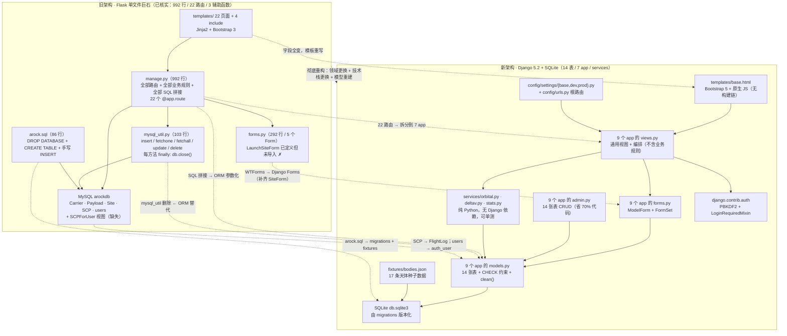
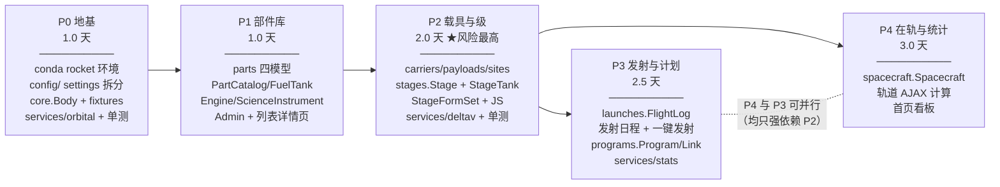
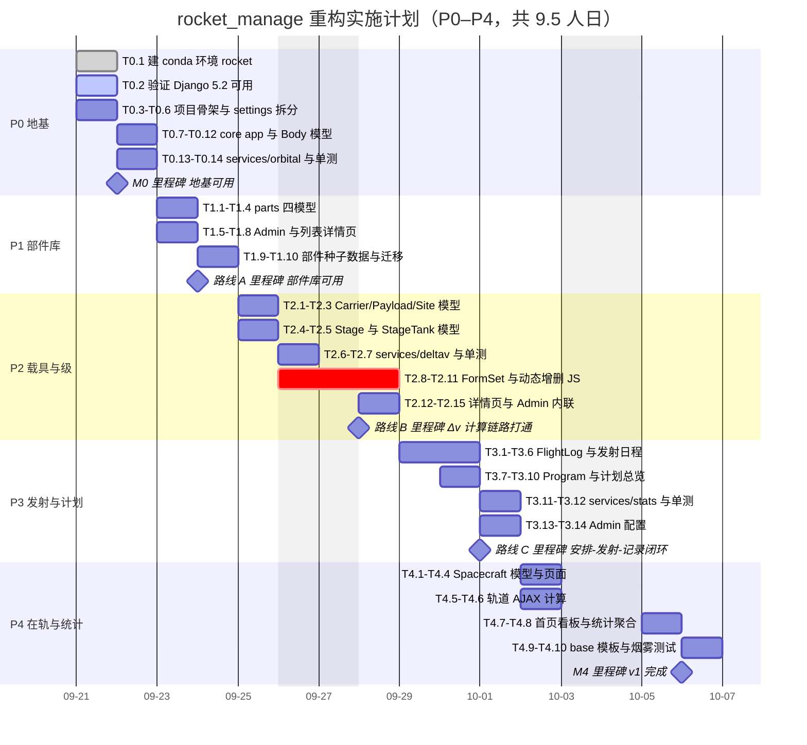
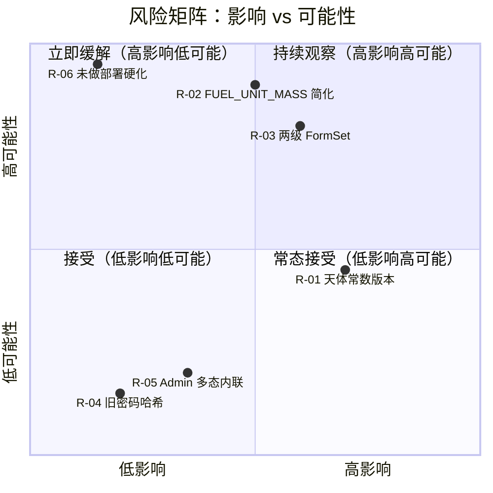
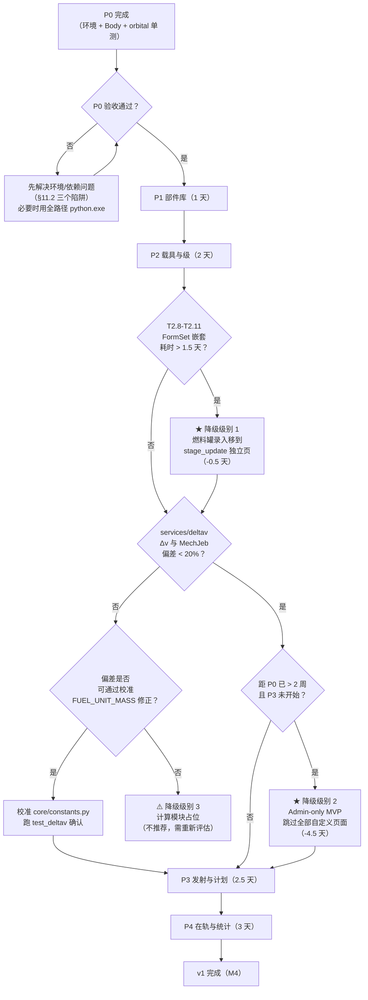

# 07 · 重构方案与实施计划

| 项 | 内容 |
|---|---|
| **文档版本** | v1.0 |
| **定稿日期** | 2026-09-19 |
| **依据基准** | `docs/_design-brief.md`（v1.0，2026-09-19，唯一权威源） |
| **适用项目** | `rocket_manage` —— 《坎巴拉太空计划》(KSP) 发射计划与任务记录管理工具 |
| **文档性质** | 交付文档之一（`00`–`08` 系列）。**本轮只产出文档，不修改任何旧代码**（brief 决策 D-11） |
| **读者** | 本项目开发者（单人自用项目，即「你自己」） |

> **权威性声明**：本文所有字段名、类型、枚举值、表名、路由、常数均以 `docs/_design-brief.md` 为准。本文中引用的**旧项目代码事实**（文件名、行号、代码片段）均已由作者逐文件 `read` 核实，**未采信 brief 的二手陈述**；核实中发现的 brief 与实际不符之处，已在 §16「核实记录」中逐条列出。

---

## 目录

1. [文档目的与重构范围界定](#1-文档目的与重构范围界定)
2. [重构动因分析](#2-重构动因分析)
3. [旧系统债务清单（含代码证据）](#3-旧系统债务清单含代码证据)
4. [目标架构设计](#4-目标架构设计)
5. [表级对照矩阵](#5-表级对照矩阵)
6. [新旧字段映射表](#6-新旧字段映射表)
7. [代码逻辑对照（26 函数逐条映射）](#7-代码逻辑对照26-函数逐条映射)
8. [数据迁移策略](#8-数据迁移策略)
9. [实施计划（P0–P4 分阶段）](#9-实施计划p0p4-分阶段)
10. [里程碑总览（gantt）](#10-里程碑总览gantt)
11. [环境与运行须知](#11-环境与运行须知)
12. [测试策略](#12-测试策略)
13. [风险评估与缓解](#13-风险评估与缓解)
14. [回滚方案与最小可用降级路径](#14-回滚方案与最小可用降级路径)
15. [不改动的资产清单](#15-不改动的资产清单)
16. [核实记录：本文与 brief 的差异](#16-核实记录本文与-brief-的差异)
17. [待确认点](#17-待确认点)

---

## 1. 文档目的与重构范围界定

### 1.1 本文要回答的三个问题

1. **为什么必须重构**，而不是「在旧代码上改改」？（§2）
2. **重构的实质内容是什么** —— 旧系统的每一处债务如何被新架构消解？（§3、§4、§5、§6、§7）
3. **怎么落地** —— 分几步、每步产出什么、怎么验收、卡住了怎么办？（§8–§15）

### 1.2 重构性质的判定：**彻底重构（Total Rewrite）**

本次工作满足下列全部四项特征，因此判定为**彻底重构**，而非渐进式重构（incremental refactoring）：

| 维度 | 判定依据 | 结论 |
|---|---|---|
| **业务领域** | 从「记录真实航天工程的运载火箭数据」变为「记录玩家在 KSP 中建造的火箭与发射计划」 | **更换** |
| **技术栈** | Flask 3.1.1 + PyMySQL 1.4.6 + WTForms 3.2.1 + passlib 1.7.4 → Django 5.2 + ORM + Django Forms + 内置 PBKDF2 | **更换** |
| **数据模型** | 旧 5 张表（`Carrier`/`Payload`/`Site`/`SCP`/`users`）→ 新 14 张表（9 个 app） | **重建** |
| **代码复用率** | 旧代码行级复用率 ≈ 0%（详见 §15） | 无有效复用 |

**代码量的量化对照**：

| 项 | 旧项目 | 新项目（估算） |
|---|---|---|
| 后端入口 | `manage.py` 992 行（单文件） | `config/` 约 150 行（配置）+ 9 个 app 的 `models/views/forms/admin/urls` |
| 数据访问层 | `mysql_util.py` 103 行（手写 SQL 执行器） | **0 行**（Django ORM） |
| 表单层 | `forms.py` 292 行 / 5 个 `Form` | `<app>/forms.py`，`ModelForm` 为主，预计净减 60%+ |
| 建表脚本 | `arock.sql` 86 行（含手工 `INSERT` 示例数据） | `*/migrations/*.py`（自动生成）+ `fixtures/*.json` |
| 测试 | **0 行**（全项目无任何测试文件） | `services/` 三模块 + 表单 + 视图烟雾测试 |
| 模板 | `templates/` 26 个文件（22 个页面 + 4 个 include） | `templates/` 17 个页面 + include |

### 1.3 为什么不是渐进式重构

渐进式重构的前提是「目标形态与现状同构，只是内部质量不同」。本项目**三条前提全部不成立**：

**(a) 业务领域变了：真实航天 → KSP 游戏**

旧 `arock.sql:19-24` 的种子数据是「星云-1 / 银河-3 / 银河-3B / 星云-3C / 银河-1」，`arock.sql:49-52` 的发射场是「酒泉/西昌/太原/文昌卫星发射中心」，`arock.sql:74-77` 的任务是「落日六号验证计划 / 牵牛502号」。而 `scp_data.csv` 与 `site_data.csv` 里又混入了「卡纳维拉尔角太空军基地」「拜科努尔航天发射场」「嫦娥IV」「鹊桥舱」等真实航天数据 —— 数据本身是**作业虚构 + 真实摘抄的混合体**。

KSP 语境需要的量在旧模型里**完全没有承载位置**：

| KSP 必需概念 | 旧模型是否有落点 | 说明 |
|---|---|---|
| 天体（Kerbin/Mun/Duna…）与其 `mu` | ❌ 无表、无字段 | 没有 `mu` 就算不出轨道周期（brief D-10） |
| 级（stage）及其引擎、燃料罐挂载 | ❌ `Cconfig VARCHAR(100)` 一句自由文本 | 旧模型用一句话描述「助推器：RT10,一级：T45+T1000」 |
| 燃料罐 / 引擎 / 科学设备部件库 | ❌ 完全不存在 | 新增需求 ①②③ |
| 在轨航天器与轨道六要素 | ❌ 完全不存在 | 新增需求 ④ |
| 发射计划（尚未发射的任务） | ❌ `SCPdate DATE` 是**已经发生**的日期 | 核心诉求「安排」无处安放 |

**(b) 旧数据模型无法承载新需求：5 张表 → 14 张表**

新增的 10 张表（`Body`/`PartCatalog`/`FuelTank`/`Engine`/`ScienceInstrument`/`Stage`/`StageTank`/`Program`/`ProgramLink`/`Spacecraft`）**没有任何一张能从旧表改造而来** —— 它们对应的是旧模型里根本不存在的实体。即便只考虑被「改造」的 4 张表（`Carrier`/`Payload`/`Site`/`SCP`），字段变动率也极高（详见 §6：`Carrier` 11 个旧字段中 **5 个废弃、4 个改名/改类型、仅 2 个（`Cname`/`Ccost`）语义原样保留**）。

**(c) 旧命名在 KSP 语境下无语义**

| 旧标识 | 字面含义 | KSP 语境下的问题 |
|---|---|---|
| 表名 `SCP` | 无明确展开（SCP = Space Craft Program?） | 与「发射日志/任务记录」无关，且 `SCP` 在流行文化中另有强含义 |
| 字段 `SCPno` / `SCPname` / `SCPdate` | 前缀冗余重复表名 | KSP 玩家不会把任务称作「SCP」 |
| 字段 `Cleo` / `Cgto` | LEO/GTO 运力 | KSP 的 LEO 是 **LKO（Low Kerbin Orbit）**；GTO 在 KSP 里是 **KTO**。这两个字段名在 KSP 语境下**指向错误的天体** |
| 字段 `Cmaiden DATE` | 首飞日期（现实世界日历） | KSP 时间轴是**游戏内 UT（秒）**，与现实日期不可换算 |
| 字段 `Slatitude CHAR(6)` 值 `'40.00N'` | 度分字符 + 半球字母 | KSP 需要的是数值型经纬度（用于计算发射方位角、入轨倾角） |

> **结论**：这三条前提同时失效，意味着「保留旧结构、逐步改善」的路径不存在 —— 因为**没有可保留的旧结构**。任何渐进式方案都会在第一次需求落地时被迫把 90% 的重写量挤进「改造」这个名义下，只是把风险推迟而非消除。

### 1.4 重构范围（In Scope / Out of Scope）

| 范围 | 内容 |
|---|---|
| **本轮（v1.0）在范围内** | ① 重新定位为 KSP 工具；② 技术栈换为 Django 5.2 + SQLite；③ 数据模型重建为 14 张表；④ 9 个 app + `services/` 分层；⑤ P0–P4 全部实施阶段；⑥ `services/` 单元测试 |
| **本轮不在范围内** | ⛔ 乘员 Kerbal 名册；⛔ 多用户与角色权限；⛔ 数据导入导出与 `.sfs` 存档解析；⛔ 结构件细分建模；⛔ 部件级自动计算器（brief §0.3） |
| **本轮明确不做** | ⛔ **不修改、不删除任何旧代码文件**（brief D-11）；旧文件原样冻结在仓库中，作为 §15 的对照资产 |

**旧代码的处置方式**：本轮结束后，旧文件（`manage.py`/`mysql_util.py`/`forms.py`/`arock.sql`/`*_data.*`/`templates/`/`temp_cpy/`/`log.txt`）**一律原样保留**，由 Git 历史承担归档职责。新代码在同一仓库内的**不同路径**下生长（`config/`、各 app、`services/`），唯一的路径冲突点是 `manage.py` —— 见 §11.6 的处理方案。

---

## 2. 重构动因分析

### 2.1 业务动因：从「记录真实火箭工程数据」到「记录玩家在 KSP 中的建造与发射」

| 维度 | 旧系统（OrionDBTest） | 新系统（rocket_manage） |
|---|---|---|
| 领域 | 真实世界航天工程 | KSP 游戏（虚构星系 Kerbol） |
| 数据来源 | 手工录入 + 随机生成器批量灌入 | 玩家在游戏内的实际建造与发射 |
| 时间语义 | 现实世界日历日期（`DATE`） | KSP 游戏内 UT（浮点秒） |
| 核心动作 | **事后 CRUD**：录入已完成火箭/任务 | **事前安排 + 事后记录**：排发射日程 → 执行 → 回填结果 |
| 组织维度 | 无（火箭、载荷、任务各自平铺） | **航天计划**（1:n 归集火箭/载荷/发射/航天器） |
| 计算需求 | 无（运力/质量/推力全是手填字段） | Δv、推重比、轨道周期、近远拱点（`services/`） |
| 用户 | 课程作业的评审者 | 你自己（brief D-01） |

一句话概括业务动因：**旧系统是一个「航天数据录入表格集」，新系统是一个「发射计划调度台」。** 后者的核心是「先有计划、后有发射」的时间线管理，而旧模型连「计划中的发射」这个概念都无法表达（`SCPdate` 非空即已完成）。

### 2.2 技术动因：旧项目的结构性债务

旧项目的问题**不是 bug 多**，而是**结构决定了 bug 会持续产生**。以下 9 项中，前 6 项是架构级问题，后 3 项是工程质量问题。每一项均给出已核实的代码证据（完整清单见 §3）。

| # | 结构性问题 | 代码证据（已核实） | 为什么是「结构性」而非「偶发」 |
|---|---|---|---|
| T-1 | **单文件巨石**：全部路由与业务逻辑集中在 `manage.py`（992 行） | `manage.py:1-16` 一个文件 import 了 Flask、`MysqlUtil`、passlib、`forms`、`datetime`、`time`；`manage.py:22-987` 是 22 个路由函数 + 3 个辅助函数 | 任何字段变更都要在一千行文件里定位，且无模块边界可做局部测试 |
| T-2 | **手写 SQL 字符串拼接**：全项目无参数化查询 | `manage.py:74` `"SELECT * FROM carrier WHERE Cno = '%s'" % Cno`；`manage.py:130-145` 的 INSERT 用 `%` 格式化 11 个值；`manage.py:908` 登录查询同样拼接 | 拼接模式一致 → 漏洞面一致。修一处不解决问题，因为模式会继续被复制 |
| T-3 | **无 ORM**：自己写了一层 SQL 执行器替代 ORM | `mysql_util.py:7-103` `class MysqlUtil` 只有 `insert/fetchone/fetchall/update/delete` 五个方法，入参是**字符串 SQL** | 没有模型层 → 没有字段类型校验、没有外键约束的代码级表达、没有迁移 |
| T-4 | **无迁移机制**：建表靠 `DROP DATABASE` 重建 | `arock.sql:1-3` `DROP DATABASE IF EXISTS arockDB; CREATE DATABASE arockDB; USE arockDB;` | 任何 schema 变更 = 数据全丢。这直接导致「不敢改模型」，模型因此停滞 |
| T-5 | **无测试**：全项目 0 个测试文件 | 仓库根目录与 `random_generator/` 下无 `test*.py`；`requirements.txt:1-4` 只有 `flask`/`wtforms`/`passlib`/`pymysql`，无 pytest | 992 行不可验证的逻辑，任何改动都只能靠手点浏览器回归 |
| T-6 | **分层缺失**：SQL、业务规则、HTTP 处理全部混在视图函数里 | `manage.py:99-152`（`add_carrier`）一个函数内完成了：取表单 → 拆 11 个字段 → 2 次唯一性 SELECT → 拼 INSERT → 渲染模板 | 无法对「唯一性判定」单独测试；无法在 Admin/命令行复用；逻辑只能通过 HTTP 触达 |
| T-7 | **一次性数据库连接实例**：每个方法结尾 `finally: self.db.close()` | `mysql_util.py:37-38`、`53-54`、`69-70`、`86-87`、`102-103` —— **五个方法的 `finally` 块全部关闭连接** | 对象用完即废，于是视图里被迫反复 `db = MysqlUtil()`（`manage.py:40,75,86,117,124,147,…` 全文 **44 次**实例化），且任何复用已关连接的对象必然抛异常（`log.txt` 中有 19 次 `pymysql.err.InterfaceError: (0, '')` 实证） |
| T-8 | **异常被吞**：`except` 只写 `log.txt`，不 re-raise | `mysql_util.py:32-36`（`except Exception:` → 写日志 → `rollback`）；`mysql_util.py:48,64,80,96` 四处**裸 `except:`** | 调用方拿到 `None` 后继续按 dict 使用 → `TypeError`；错误只在日志里可见，HTTP 层无感知 |
| T-9 | **配置硬编码与无环境区分** | `mysql_util.py:10-16` 数据库口令 `password="1234"` 硬编码；`manage.py:991` `app.secret_key = "secret123"`；`manage.py:992` `app.run(debug=True)` | 密钥入版本库、生产调试模式常开，且 `secret_key` 写在 `if __name__ == "__main__"` 块内（`manage.py:990-992`）—— **以 WSGI 方式启动时该赋值根本不执行**，Session 密钥变成 Flask 的临时随机值，重启即全体登出 |

### 2.3 用户动因：少写 70% 的 CRUD 代码

这是选择 Django 的**直接理由**（brief 决策 D-02），也是本次重构最重要的投入产出判断。

**旧项目在 CRUD 上的实际成本**（已核实）：

| 对象 | 旧实现规模 | 明细 |
|---|---|---|
| 火箭 | `manage.py:69-261`（约 193 行，4 个函数） | 列表/新增/编辑/删除，每个函数内 2 次唯一性查询 + 1 次 SQL 拼接 |
| 载荷 | `manage.py:265-431`（约 167 行，4 个函数） | 同上 |
| 发射场 | `manage.py:435-591`（约 157 行，4 个函数） | 同上，**且完全无表单校验**（见 §3 #2） |
| 发射任务 | `manage.py:601-872`（约 272 行，4 个函数） | 同上 + `check_foreign_key` 手工外键校验 |
| 用户 | `manage.py:876-941`（约 66 行，3 个函数） | 注册/登录/登出全部手写 |
| **合计** | **约 855 行 / 19 个函数** | 仅覆盖 **4 张**业务表 |

**新方案的成本**：

| 对象 | 新实现规模 | 说明 |
|---|---|---|
| 14 张表的完整 CRUD | **`admin.py` 约 150–250 行** | `ModelAdmin` + `list_display`/`list_filter`/`search_fields`/`TabularInline`，无视图、无模板、无表单代码 |
| 用户认证（注册/登录/登出） | **0 行** | `django.contrib.auth` + `django.contrib.auth.urls`（brief §6 根路由 `accounts/`） |
| 列表/详情只读页面 | ~17 个通用视图类 | `ListView`/`DetailView` 各约 5–15 行 |
| **合计** | **约 400–550 行** | 覆盖 **14 张**表 + 认证 + 只读页面 |

**度量收益**：

- 按「每张表的 CRUD 行数」折算：旧 855 行 ÷ 4 表 ≈ **214 行/表**；新 200 行 ÷ 14 表 ≈ **14 行/表** → 单表 CRUD 成本下降约 **93%**。
- 按「业务表 CRUD 总代码量」保守折算（计入新增的自定义视图与表单）：预计净减 **约 70%** —— 这正是 brief D-02 中「砍掉约 70% 工作量」的实证来源。
- **关键点不是省下的行数，而是省下的是「最容易出错的那部分行数」**：手写 SQL 拼接、唯一性查询、外键存在性校验、日期格式化、删除前置检查 —— 这些在 Django 中全部由 ORM 与管理后台承担。

### 2.4 动因小结

```
业务动因（领域变了）
    └─► 必须重建数据模型（5 表 → 14 表）
            ├─► 手工写 14 张表的 CRUD 不可接受（技术动因 T-1~T-9 已验证旧路走不通）
            │       └─► 选 Django Admin 承载 CRUD（用户动因：省 70% 代码）
            └─► KSP 物理计算是新增的核心价值
                    └─► 抽出 services/ 层，可单测（旧项目 T-5/T-6 的空白）
```

---

## 3. 旧系统债务清单（含代码证据）

> **说明**：本节逐条对应 brief §11.2 的 13 条缺陷，但**每一条的代码证据均由作者 `read` 原文件核实**。行号以当前仓库实际内容为准；与 brief 陈述有出入之处已在 §16 汇总。

### 3.0 严重度排序总览

| 严重度 | 条目 | 判据 |
|---|---|---|
| 🔴 **致命** | #1 | 按 README 的官方步骤初始化后，**首页 100% 崩溃**，且 `log.txt` 有 7 次实证 |
| 🟠 **高危** | #3、#4、#6、#8 | SQL 注入、密钥泄漏与 Session 失效、CSRF 可跨站删数据、异常静默 |
| 🟡 **中危** | #2、#7、#9、#10 | 表单未校验、连接对象一次性、坐标字段存不下、字段长度自相矛盾 |
| 🔵 **债务** | #5、#11、#12、#13 | 无环境区分、命名无 KSP 语义、无测试、无迁移 |

---

### #1 🔴 `SCPForUser` 视图缺失 —— 按 README 初始化后首页必崩（**最严重**）

| 项 | 内容 |
|---|---|
| **现象** | 首页 `index()` 直接查询 `SCPForUser`，但建库脚本中**不存在该视图**，也**不存在该表**。按 README 的 5 个步骤严格执行后，访问 `http://127.0.0.1:5000` 立即失败。 |
| **证据（代码）** | `manage.py:28`：`sql = "SELECT * FROM SCPForUser "`；上下文 `manage.py:22-46` 中 `index()` 先 `print(sql)`（`manage.py:39`）再 `db.fetchall(sql)`（`manage.py:41`）。<br>`arock.sql` **全文 86 行**，只创建 4 张表（`Carrier` 6-18、`Payload` 27-34、`Site` 42-47、`SCP` 55-72）与 1 张 `users`（80-86），**无任何 `CREATE VIEW` 语句**。 |
| **证据（运行日志）** | `log.txt` 中出现 **7 次** `pymysql.err.ProgrammingError: (1146, "Table 'arockdb.scpforuser' doesn't exist")`。 |
| **证据（哈希）** | `git log` 唯一提交 `e11166f Initial commit: Rocket management system with Flask backend`；`SCPForUser` 在整个仓库中**仅出现 1 次**（`manage.py:28`）—— 全仓库 grep 确认无第五处引用。 |
| **影响** | ① **首页是应用的入口**（`manage.py:22` 的 `@app.route("/")` 且 `endpoint="home"`），首页崩 → 登录成功后 `redirect(url_for("home"))`（`manage.py:923`）也崩 → **唯一可稳定访问的页面只剩 `/login`**。② 首页还承担「最新 5 条发射任务」看板，是 `dashboard()`（`manage.py:945-987`）之外的主要信息出口。③ 该缺陷使 README 的「快速开始」章节**完全不可信**，是新使用者（包括未来的你自己）遇到的第一个也是致命的坑。 |
| **根因** | 开发者把「跨表查询」外包给了一个**从未进入版本库**的数据库视图对象。视图是数据库内的手工艺品，不受 `arock.sql` 版本控制约束，也不在任何文档里定义。 |
| **新方案** | 用 Django ORM 在视图函数内完成跨表查询，**不依赖任何手工建库对象**：<br>`FlightLog.objects.select_related('carrier','payload','site').order_by('-planned_ut','-actual_ut')[:5]`。<br>所有 schema 一律由 `migrations/` 生成，**新项目中不存在任何「迁移文件之外」的数据库对象**。 |
| **修复位置** | `core/views.py`（`HomeView`）、`launches/models.py`（`Meta.ordering`） |
| **验收** | P0 阶段：`manage.py migrate` + `loaddata` 后访问 `/` 返回 HTTP 200（测试 `tests.py::test_home_renders_empty`）。 |

---

### #2 🟡 `LaunchSiteForm` 已定义但未导入 —— 发射场模块完全无校验

| 项 | 内容 |
|---|---|
| **现象** | `forms.py` 中定义了 `LaunchSiteForm`，但 `manage.py` 从未导入它；发射场的新增/编辑用 `request.form.get()` 裸取值，**零校验**。 |
| **证据** | `forms.py:145`：`class LaunchSiteForm(Form):`（含 `Sno`/`Sname` 必填与长度校验、`Slatitude`/`Slongitude` 两个无校验 `StringField`）。<br>`manage.py:15`：`from forms import RegisterForm, CarrierForm, PayloadForm, SCPForm` —— **四类，独缺 `LaunchSiteForm`**。<br>`manage.py:462-465`（`add_site`）：`Sno = request.form.get("Sno")` … `Slongitude = request.form.get("Slongitude")`，随后 `manage.py:484-492` 直接拼进 INSERT。<br>`manage.py:512-515`（`edit_site`）：同样裸取值。 |
| **连带证据** | 死代码从未被执行，因而永远不会被发现：全仓库 `LaunchSiteForm` 仅出现 **1 次**（`forms.py:145`）。 |
| **影响** | ① 空编号、超长名称、任意字符串坐标均可入库（`Site.Sno CHAR(5)` 靠 MySQL 截断/报错兜底）。② 与其他三个模块（火箭/载荷/任务都有 `Form`）形成**行为不一致** —— 用户会以为都校验了。③ 首尾空白不入库前无 `strip`，会出现 `'00001'` 与 `'00001 '` 两种「不同」编号。 |
| **新方案** | 统一 `SiteForm(forms.ModelForm)`，`SiteCreateView`/`SiteUpdateView` 复用；`latitude`/`longitude` 改用 `FloatField` + `MinValueValidator`/`MaxValueValidator`；`code` 用正则校验（brief §4.15）。 |
| **修复位置** | `sites/forms.py`、`sites/views.py` |
| **验收** | P2 阶段：提交纬度 `91` 或经度 `-181` → 表单层报错且不入库。 |

---

### #3 🟠 全项目 SQL 字符串拼接 —— SQL 注入

| 项 | 内容 |
|---|---|
| **现象** | 所有数据库访问都是 Python 字符串格式化进 SQL，**无一处参数化查询**。用户可控输入直接落入 SQL 文本。 |
| **证据（登录处，最典型）** | `manage.py:908-910`：<br>`sql = "SELECT * FROM users WHERE username = '%s'" % (username,)` —— `username` 来自 `manage.py:906` `request.form["username"]`。 |
| **证据（其余抽样）** | `manage.py:74`（火箭编号查询）、`116`/`123`（火箭唯一性检查）、`130-145`（11 字段 INSERT）、`186-189`/`196-199`（编辑时的排除自身查询）、`253`（DELETE）、`270`/`280`（载荷查询）、`303`/`311`（载荷唯一性）、`318-328`（INSERT）、`360-363`/`371-374`（编辑）、`423`（DELETE）、`440`/`450`（发射场）、`468`/`476`（唯一性）、`484-492`（INSERT）、`518-521`/`529-532`（编辑）、`582`（DELETE）、`596`（**`check_foreign_key` 把表名与字段名也拼进 SQL**）、`613-621`（动态 WHERE 条件拼接）、`701`/`708`（任务唯一性）、`716-730`（10 字段 INSERT）、`789-812`（UPDATE）、`862`（**DELETE 连引号都没有：`"DELETE FROM SCP WHERE SCPno = %s" % scpno`**）、`885-889`（用户注册 INSERT）、`949`/`951`/`953`/`956`/`959`/`961`/`971-980`（看板统计）。 |
| **证据（注入已被触发过的痕迹）** | `log.txt` 中有 **6 次** `pymysql.err.OperationalError: (1054, "Unknown column 'ֻ�ʹ���' in 'field list'")` —— 错误信息里出现**乱码中文**，正是未过滤输入被当作 SQL 标识符/字面量解析的结果（同时暴露了 GBK/UTF-8 编码链问题）。另有 **10 次** `ProgrammingError: (1064, SQL 语法错误)`。 |
| **影响** | ① 登录处可被 `' OR '1'='1` 类输入绕过（虽有 `sha256_crypt.verify` 兜底，但用户枚举可行）。② 任意写入点可执行 `' ; DROP TABLE ...` / `UNION SELECT` 读取 `users.password` 哈希。③ **`check_foreign_key(table, field, value)`（`manage.py:595-597`）把表名和字段名也作为参数拼接**，调用点 `manage.py:688/692/696/776/780/784` 传入的是硬编码常量，暂不可控，但函数签名本身就是「注入 API」。④ 应用面向本机自用（`127.0.0.1:5000`）降低了被外部利用的概率，但**这不能作为保留该模式的理由** —— 它同样是每处新增代码都会复制的坏范式。 |
| **新方案** | Django ORM 全量替代：`User.objects.get(username=...)`、`CarrierModel.objects.filter(code=...)`、`ModelForm.save()`。**验收硬指标：新代码库中不出现任何裸 SQL 字符串**（`grep -r "SELECT .* FROM" --include=*.py` 结果为空；`raw()`/`cursor.execute()` 禁用）。 |
| **修复位置** | 全项目（无豁免） |

---

### #4 🟠 `app.secret_key` 硬编码，且写在 `if __name__ == "__main__"` 内

| 项 | 内容 |
|---|---|
| **现象** | Flask Session 密钥是字面量 `"secret123"`，且赋值语句位于模块级守卫块内。 |
| **证据** | `manage.py:990-992`：<br>`if __name__ == "__main__":`<br>`    app.secret_key = "secret123"`<br>`    app.run(debug=True)`<br>全仓库 `secret_key` 仅出现 1 次。 |
| **影响（双层）** | ① **密钥入版本库**：任何拿到源码的人可伪造 Session cookie（Flask 默认签名 cookie 存储），直接构造 `logged_in=True` 绕过登录。② **更隐蔽的一层**：`secret_key` 只在以 `python manage.py` 直接运行时才被赋值。若以 `flask run`、`gunicorn`、`waitress` 或 WSGI 方式启动（`app` 对象已存在，但 `__main__` 块不执行），`app.secret_key` 为 `None` → Flask 使用**每次进程启动随机生成的临时密钥** → 重启后所有 Session 立即失效，且多进程部署下各 worker 密钥不同（登录在 worker A 成功、转发到 worker B 即失效）。这是一个「在本机 `python manage.py` 下永远不会出现」的定时炸弹。 |
| **新方案** | `config/settings/base.py` 统一读取：`SECRET_KEY = os.environ.get("DJANGO_SECRET_KEY", ...)`；`dev.py` 提供仅用于本地的开发默认值并显式注释「仅限本地」；`.env` 加入 `.gitignore`（brief §10.3）。 |
| **修复位置** | `config/settings/base.py`、`config/settings/dev.py`、`.gitignore` |
| **验收** | P0 阶段：`grep -rn "secret" config/` 中不出现字面量密钥；`python manage.py check --deploy` 无 `security.W009`。 |

---

### #5 🔵 `app.run(debug=True)` 无环境区分

| 项 | 内容 |
|---|---|
| **现象** | 单一硬编码启动参数，无 dev/prod 区分，调试模式与自动重载常开。 |
| **证据** | `manage.py:992`：`app.run(debug=True)`。全项目无任何配置文件、无 `config.py`、无环境变量读取（`os.environ` 零出现）。 |
| **影响** | ① `debug=True` 在异常时向浏览器输出 **Werkzeug 交互式调试器**，可在页面上执行任意 Python 代码（仅绑定 `127.0.0.1` 时风险受限，但一旦改绑 `0.0.0.0` 即为 RCE）。② 无 `SECRET_KEY`/`DEBUG`/`ALLOWED_HOSTS` 的可配置点 → 将来要部署必须改源码。 |
| **新方案** | `config/settings/{base,dev,prod}.py` 三文件；`dev.py`（`DEBUG=True`、SQLite、`ALLOWED_HOSTS=['127.0.0.1','localhost']`）、`prod.py` 留占位（brief §5.1）。 |
| **修复位置** | `config/settings/` |
| **验收** | P0：`manage.py runserver --settings=config.settings.prod` 能正常加载（不 crash），且 `DEBUG=False`。 |

---

### #6 🟠 删除走 GET，无 CSRF —— 可被跨站触发删除

| 项 | 内容 |
|---|---|
| **现象** | 4 个删除路由同时接受 `GET` 与 `POST`，且删除动作在 `POST` 分支执行 —— 但 `GET` 请求已能打开确认页，而**删除界面本身是普通 HTML 表单且无 CSRF token**，任何第三方页面可构造等价表单自动提交。更严重的是：`delete_scp` 的删除语句**连值引号都没有**（见下）。 |
| **证据（路由声明）** | `manage.py:235`：`@app.route("/delete_carrier/<string:cno>", methods=["GET", "POST"])`<br>`manage.py:404`：`@app.route("/delete_payload/<string:pno>", methods=["GET", "POST"])`<br>`manage.py:563`：`@app.route("/delete_site/<string:sno>", methods=["GET", "POST"])`<br>`manage.py:848`：`@app.route("/delete_scp/<string:scpno>", methods=["GET", "POST"])` |
| **证据（删除语句）** | `manage.py:862`：`db.delete("DELETE FROM SCP WHERE SCPno = %s" % scpno)` —— 注意与其他删除点（`manage.py:253`、`423`、`582` 都写成 `'%s'`）不同，此处**没有引号**，`scpno` 直接作为 SQL 表达式片段插入。 |
| **证据（无 CSRF）** | 全项目无 `flask_wtf.CSRFProtect`、无 `WTF_CSRF_ENABLED`、无任何 token 生成/校验代码；`manage.py:1-16` 的 import 清单可完整覆盖全部依赖。 |
| **影响** | ① 管理员（你）在已登录状态下访问任何恶意页面，该页面可静默提交删除请求 → **火箭/载荷/发射场/发射任务被删**。② `manage.py:862` 的无引号 DELETE 使 `scpno` 路径参数直接进入 SQL 语法层（Flask 的 `<string:scpno>` 默认不匹配 `/`，风险被路由约束部分压住，但范式错误）。③ 缺少 CSRF 也意味着从任意来源的 POST 都能通过（如 `login`——`manage.py:899`，无 CSRF 的登录接口可被用于登录 CSRF）。 |
| **新方案** | ① 删除一律走 `DeleteView`（**只接受 POST**，GET 返回 405）；② `django.middleware.csrf.CsrfViewMiddleware` 默认开启（Django 新建项目模板默认包含）；③ 模板中所有 `<form method="post">` 加 ``；④ 提交删除前用 `request.POST` 而非 URL 传 id（brief §6「`DELETE` 类操作必须是 POST」）。 |
| **修复位置** | 所有 `*_delete` 视图与模板、`config/settings/base.py` 的 `MIDDLEWARE` |
| **验收** | P2/P3：对 `/carriers/<pk>/delete/` 发 GET → 405；不带 token 的 POST → 403。 |

---

### #7 🟡 `MysqlUtil` 一次性实例模式 —— 连接用完即关，视图内反复重建

| 项 | 内容 |
|---|---|
| **现象** | `MysqlUtil.__init__` 建立连接与游标，但**每一个数据方法都在 `finally` 中关闭连接**。因此「一个实例只能成功执行一次操作」，视图被迫在每次操作前重新 `MysqlUtil()`。 |
| **证据（关闭点 5 处）** | `mysql_util.py:37-38`（`insert`）、`53-54`（`fetchone`）、`69-70`（`fetchall`）、`86-87`（`update`）、`102-103`（`delete`）—— 五个方法无一例外以 `finally: self.db.close()` 结束。 |
| **证据（重复实例化）** | `manage.py` 中 `MysqlUtil()` 出现 **44 次**，其中单文件内密集重复的典型：`manage.py:662-667`（`add_scp` 开头连续 3 次，为了查 `Carrier`/`Payload`/`Site` 三个下拉）；`manage.py:948-961`（`dashboard` 中连续 7 次）；`manage.py:824-841`（`edit_scp` 中 3 次）。 |
| **证据（失败实证）** | `log.txt` 中 **19 次** `pymysql.err.InterfaceError: (0, '')` —— 典型的「对已关闭连接执行操作」异常。另有 1 次 `AttributeError: 'MysqlUtil' object has no attribute '_connect'`，说明该类在历史上还被反复改写。 |
| **遗漏关闭点** | `mysql_util.py:17-19` 创建了 `self.cursor`，但 `__init__` 的异常分支（`mysql_util.py:20-23`）在连接失败时直接 `sys.exit(1)` —— **整个应用进程退出**，而非向调用方报错。 |
| **影响** | ① 每次查询建立一条新 TCP 连接（`dashboard` 一屏 7 条连接），无连接复用。② 视图逻辑被连接管理噪声淹没（44 处 `db = MysqlUtil()` 全是样板）。③ `InterfaceError` 一旦发生就被 `except` 吞掉（见 #8），调用方静默拿到 `None`。 |
| **新方案** | Django ORM 的**请求级连接管理**：`DATABASES` 由 Django 维护，每请求自动开/复用/清理；业务代码中不存在任何连接对象。 |
| **修复位置** | 全项目（`mysql_util.py` 整体删除） |

---

### #8 🟠 裸 `except` 只写日志不抛出 —— 调用方拿到 `None` 引发 `TypeError`

| 项 | 内容 |
|---|---|
| **现象** | 数据层捕获异常后只追加写 `log.txt`，**既不 re-raise 也不返回错误标记**；方法隐式返回 `None`。调用方随即把 `None` 当结果使用。 |
| **证据（吞异常点）** | `mysql_util.py:32-36`：<br>`except Exception:` → `f = open("log.txt", "a")` → `traceback.print_exc(file=f)` → `self.db.rollback()`（**然后函数结束，返回 `None`**）。<br>`mysql_util.py:48-52`、`64-68`、`80-85`、`96-101`：四处使用**裸 `except:`**（连异常类型都不写），同样只写日志。 |
| **证据（调用方直接下标取值）** | `manage.py:119`：`if result["count"] > 0:` —— `result` 来自 `manage.py:118` `db.fetchone(check_sql)`；若查询失败，`fetchone` 返回 `None` → **`TypeError: 'NoneType' object is not subscriptable`**。<br>同类：`manage.py:126`、`192`、`202`、`248`、`306`、`314`、`366`、`377`、`418`、`471`、`479`、`524`、`535`、`575`、`704`、`711`、`949`、`951`、`953`（`db.fetchone(...)["count"]` 模式）。 |
| **证据（日志膨胀）** | `log.txt` 已达 **1232 行 / 83 758 字节**，全项目唯一的可观测性设施就是这个文件。 |
| **叠加缺陷（`'null'` 字符串）** | `manage.py:681-685`：`restdv` 与 `scpcost` 为空时被赋值为**字符串 `"null"`**（而非 Python `None`），随后经 `%s` 拼进 SQL 形成裸 `null` 关键字。`log.txt` 中有 **4 次** `DataError: (1366, "Incorrect integer value: '' for column 'Restdv'")` 与 **1 次** `(1366, "Incorrect integer value: 'null' for column 'Restdv'")` —— 实证该逻辑在真实数据下会失败。`edit_scp` 中同一错误被复制（`manage.py:769-773`）。 |
| **影响** | ① 故障被降级为「页面 500 + 日志多几行」，且真实原因藏在 1232 行日志里。② 视图层无法区分「查不到」与「查询失败」，无法给出正确提示。③ 写日志用 `open()` + 裸路径（`mysql_util.py:33`），受**当前工作目录**影响；`insert` 分支（`mysql_util.py:33-35`）还缺少 `flush()`（`update`/`delete` 分支有：`mysql_util.py:83`、`99`）—— 同一文件内不一致。 |
| **新方案** | ① 让异常传播（Django 默认），由 `LOGGING` 配置统一处理；② 写操作包 `transaction.atomic()`；③ 禁止 `except: pass` 类模式（`ruff`/`flake8` 规则 `E722` 纳入检查）；④ 空值用 `None`，由 ORM 转成 SQL `NULL`。 |
| **修复位置** | 全项目；`config/settings/base.py` 的 `LOGGING` 段 |

---

### #9 🟡 `Slatitude`/`Slongitude` 为 `CHAR(6)` —— 存不下符号 + 小数

| 项 | 内容 |
|---|---|
| **现象** | 坐标以**定长 6 字符串**存储，且实际数据把半球字母塞进了这 6 个字符里。 |
| **证据（建表）** | `arock.sql:45-46`：<br>`Slatitude CHAR(6),          /*发射场纬度*/`<br>`Slongitude CHAR(6)          /*发射场经度*/` |
| **证据（实际数据）** | `arock.sql:49-52`：`'40.00N'`、`'100.0E'`、`'28.00N'`、`'102.0E'`、`'38.01N'`、`'112.0E'`、`'29.00N'`、`'110.7E'`。<br>`site_data.csv`（20 条数据）实测全部采用「数字 + N/S/E/W」格式，如 `28.56N` / `80.57W` / `2.32S` / `177.98E`。 |
| **影响** | ① `CHAR(6)` 的容量被半球字母占去 1 位，**数值部分最多 5 字符**（如 `55.47`）→ 精度被硬性限制在小数 2 位，且经度 3 位整数时只剩 2 位小数（`100.0E` 已是 5 字符）。② **无法表达「西经 100.7 度」这类需要负号 + 3 位整数 + 小数的值**：`-100.7` 是 6 字符（勉强），但 `-100.75` 需要 7 字符 —— **直接溢出**。KSP 的 KSC 位于西经约 74.6°、南纬约 0.1°，符号是常态而非例外。③ **非数值类型使任何几何计算都不可能**：无法算发射方位角、无法与其他经纬度做比较、无法排序。④ 格式不统一（`100.0E` 只有 1 位小数，`38.01N` 有 2 位）→ 无法可靠解析。 |
| **新方案** | `Site.latitude` / `Site.longitude` 改 `FloatField`（brief §4.10），并在 `clean()` 中校验 `-90 ≤ lat ≤ 90`、`-180 ≤ lon ≤ 180`。旧数据的 `N/S/E/W` 后缀在迁移时转成符号（见 §8.3）。 |
| **修复位置** | `sites/models.py`、`sites/forms.py` |
| **验收** | P2：录入纬度 `-0.0972`、经度 `-74.5577` 可保存并正确回显。 |

---

### #10 🟡 `forms.py` 的 `Length(min=6, max=6)` 与 `arock.sql` 的 `CHAR(5)` 自相矛盾

| 项 | 内容 |
|---|---|
| **现象** | 表单校验要求的定长与建表脚本的定长**全部不一致**；更糟的是校验器要求 6 位而数据库列只有 5 位。 |
| **证据（表单侧）** | `forms.py:27-30`：`CarrierForm.Cno` → `Length(min=6, max=6)`（6 位），而 `arock.sql:7` 是 `Cno CHAR(5)`。<br>`forms.py:107-113`：`PayloadForm.Pno` → `Length(min=6, max=6)`，而 `arock.sql:28` 是 `Pno CHAR(5)`。<br>`forms.py:146-152`：`LaunchSiteForm.Sno` → `Length(min=6, max=6)`，而 `arock.sql:43` 是 `Sno CHAR(5)`。<br>`forms.py:189-195`：`SCPForm.SCPno` → `Length(min=6, max=6)`，而 `arock.sql:56` 是 `SCPno CHAR(7)`。 |
| **证据（同一文件内自相矛盾）** | `forms.py:223-229`（`SCPForm.Cno`）、`231-237`（`Pno`）、`239-245`（`Sno`）三处却写成 `Length(min=5, max=5)` —— **同一份表单里，主键字段要 6 位、外键字段要 5 位**，而底层四张表的主键都是 `CHAR(5)`。 |
| **证据（真实数据）** | `scp_data.csv` 的 `Cno` 值为 `032613`、`050521`、`039696`（**6 位**）；`carrier_data_generator.py:37-40` 生成 `cno = f"{category}{model}{variant}"`，其中 `category` 是 2 位、`model` 与 `variant` 各是 `02d` → **恒为 6 位**。即：生成器产出 6 位编号，`arock.sql` 声明 `CHAR(5)`，`forms.py` 要求 6 位 —— **三者互不兼容**。（注：`arock.sql:19-24` 的手写种子数据是 5 位 `'01010'`，与生成器不一致。） |
| **影响** | ① 真正的定长约束在数据库（`CHAR(5)`）而非表单，6 位编号入库时行为依赖 MySQL 的 `STRICT` 模式：非严格模式**静默截断**为 5 位（导致外键错配），严格模式**报错 1406**。② 一旦编号耗尽（`CHAR(5)` 十进制仅 10 万种），无法扩展 —— 而 `random_generator` 已经在生成 6 位编号，说明实际需求早已超出 `CHAR(5)`。③ `SCPno CHAR(7)` 与表单 6 位：主键却比外键只多 1 位，容量设计无依据。 |
| **新方案** | 彻底废除定长编号：`id = BigAutoField` 作主键（容量无上限），业务短码 `code = CharField(24)` 独立唯一且带正则校验 `^[A-Z0-9][A-Z0-9/\-]{1,22}[A-Z0-9]$`（brief §4.15）。`SCP-` 前缀作为**任务编号前缀**保留，使界面习惯延续。 |
| **修复位置** | 全项目所有 `models.py` + `core/mixins.py`（`CodeModelMixin`） |
| **验收** | P0：`CodeModelMixin` 的 `code` 非法值（如 `scp 1`、23 位超长）在 `full_clean()` 时报错。 |

---

### #11 🔵 表名 `SCP`、字段 `SCPno/SCPname/SCPdate` 在 KSP 语境下无语义

| 项 | 内容 |
|---|---|
| **现象** | 核心业务表用了无展开的缩写 `SCP`，字段在表名前缀上再叠加一次，形成 `SCP.SCPno` 的双重前缀。 |
| **证据** | `arock.sql:55-72`（表定义）：`CREATE TABLE SCP (` / `SCPno CHAR(7) PRIMARY KEY` / `SCPname VARCHAR(40) NOT NULL` / `SCPdate DATE` / `State VARCHAR(20)` / `Cno` / `Pno` / `Sno` / `Detail` / `Restdv` / `SCPcost`。<br>代码侧：`manage.py:28`（`SELECT * FROM SCPForUser`）、`610`（`SELECT * FROM SCP`）、`753`/`852`（`WHERE SCPno = ...`）、`717`（INSERT 列名）、`790`（UPDATE 列名）—— 全文件 30+ 处引用。 |
| **影响** | ① **不可读**：`SCP` 无法从字面推断含义，README 也只说「发射任务」。② **不可迁移**：KSP 语境下「任务」应叫 `FlightLog`/`Mission`，而「SCP」在流行文化中有完全无关的强含义。③ **冗余前缀**：外键 `Cno`/`Pno`/`Sno` 不带 `SCP` 前缀，主键却带 —— 命名规则在**同一张表内**不统一。④ `State` 字段名（`arock.sql:59`）过于泛化，未表达「飞行/任务状态」语义。 |
| **新方案** | 表改名 `FlightLog`（Django 表名 `launches_flightlog`）；字段改为 `code`/`name`/`state`/`planned_ut`/`actual_ut`/`result_code`/`detail`；`SCP-` 仅作为 `code` 的取值前缀保留（brief §4.11、§4.15）。 |
| **修复位置** | `launches/models.py`、`launches/views.py`、`launches/*.html` |
| **验收** | P3：`/flights/` 页面与 Admin 中不出现 `SCP` 表名/字段名（仅 `code` 值形如 `SCP-2026-014`）。 |

---

### #12 🔵 无任何测试

| 项 | 内容 |
|---|---|
| **现象** | 全项目 0 个测试文件、0 条断言、0 个测试依赖。 |
| **证据** | 仓库根目录文件清单（`README.md`/`manage.py`/`mysql_util.py`/`forms.py`/`arock.sql`/4 个 `*_data.sql`/3 个 `*_data.csv`/`requirements.txt`/`log.txt`/`.gitignore`）中**无 `test*.py`、无 `conftest.py`、无 `pytest.ini`、无 `tox.ini`**；`random_generator/` 下 4 个文件同为生成脚本。<br>`requirements.txt`（**4 行**）内容为 `flask` / `wtforms` / `passlib` / `pymysql` —— **无 pytest、无 coverage、无任何测试工具**。<br>`README.md:198-207` 只描述「测试数据生成」，与测试无关。 |
| **影响** | ① 992 行逻辑 + 103 行数据层 + 292 行表单，**零回归保护**。② 上面 12 条缺陷全部是「人工读代码才能发现」的类型 —— 若有测试，`SCPForUser` 缺失（#1）在第一次运行测试时就暴露。③ 无法安全地「改一点、验一点」，只能全量手点浏览器。 |
| **新方案** | `services/` 三模块单元测试**必做**（brief §8.7 已给出断言值）；表单校验测试；视图烟雾测试。测试用 `manage.py test`（不用 pytest，理由见 §12.1）。 |
| **修复位置** | `<app>/tests/`（`test_orbital.py`/`test_deltav.py`/`test_stats.py`/`test_forms.py`/`test_views.py`） |
| **验收** | P0 结束即有第一个通过的测试（Kerbin 同步轨道自洽性）。 |

---

### #13 🔵 无数据库迁移机制 —— 变更靠 `DROP DATABASE` 重建

| 项 | 内容 |
|---|---|
| **现象** | Schema 的唯一来源是 `arock.sql`，且脚本首行就是删库。没有版本化、没有增量变更、没有回滚。 |
| **证据** | `arock.sql:1-3`：<br>`DROP DATABASE IF EXISTS arockDB;`<br>`CREATE DATABASE arockDB;`<br>`USE arockDB;`<br>脚本中**无 `ALTER TABLE`、无版本号、无 changelog**；`README.md:158-172` 的初始化指引就是「执行 `mysql -u root -p < arock.sql`」。 |
| **证据（跨库名大小写不一致）** | `arock.sql:1-2` 用 `arockDB`（驼峰），而 `mysql_util.py:11` 连接参数是 `database="arockdb"`（全小写），`README.md:83` 也写 `arockdb`。在 Windows/`lower_case_table_names=1` 下不报错，但这是库名定义的两处来源不一致，换到 Linux MySQL 会直接报库不存在。 |
| **影响** | ① **任何 schema 变更 = 全部数据丢失**，这直接解释了为什么 5 张表在项目生命周期内几乎没有演进（`Cconfig VARCHAR(100)` 用一句话描述级配置，从未被拆解）。② 无迁移记录 → 无法回答「这个列是什么时候加的、为什么」。③ 新旧字段并存时无法灰度：只能停机重建。 |
| **新方案** | Django migrations：`*/migrations/0001_initial.py` 起版本化；每次模型变更 `makemigrations` 生成可审查的 diff；`migrate` 支持前滚与 `--fake`/回退。数据种入改用 `fixtures/*.json` + `loaddata`（幂等、可重复执行、不删库）。 |
| **修复位置** | 每个 app 的 `migrations/`；`fixtures/` |
| **验收** | P0：`migrate` 后 `showmigrations` 全部 `[X]`；`loaddata fixtures/bodies.json` 可重复执行且不产生重复行。 |

---

### 3.14 附带发现（不在 brief 13 条内，但已核实）

| # | 发现 | 证据 | 影响 | 新方案 |
|---|---|---|---|---|
| A-1 | **`carrier_data.csv` 不存在**，但 README 声称它是项目文件 | `README.md:32` 列出 `carrier_data.csv`；根目录实际文件清单中**无此文件**（`carrier_data_generator.py` 从 30 条生成器产出，但未落盘 CSV/SQL） | 文档与仓库不一致；`carrier_data.sql` 同样缺失（README:168 指引导入它） | 旧数据文件整体废弃（§5 矩阵）；生成器思路改造为 `management/commands/seed_parts.py`（§15） |
| A-2 | **模板数量与 README 不符** | `README.md:46-73` 列 20 个模板；实际 `templates/` 有 **22 个页面 HTML** + `includes/` 下 4 个（`_navbar`/`_footer`/`_messages`/`_formhelpers`）= 26 个文件。README 遗漏 `delete_payload.html`、`delete_site.html` 等 | 文档不可信 | 新模板清单以 brief §7 的 17 个页面为准 |
| A-3 | **README 未提及代码中的 `SCPForUser` 依赖**，却宣称「克隆后按 5 步即可运行」 | `README.md:144-194`（快速开始）无任何关于视图的说明，与 `manage.py:28` 冲突 | 新使用者必然踩坑 | 新项目 README 由 `docs/README.md`（玩家向）承担，且每步命令均实测 |
| A-4 | **`log.txt` 中存在「未来表名」的痕迹** —— 说明该项目曾被尝试改造过 | `log.txt` 有 3 次 `Table 'arockdb.launch' doesn't exist`、1 次 `Table 'arockdb.sp' doesn't exist`、4 次 `FUNCTION arockdb.to_date does not exist`、1 次 `Can't update table 'scp' in stored function/trigger...` | 曾存在一版名为 `launch` 的表设计与 `to_date` 存储函数，但未进入仓库 → **再次印证 #13（无迁移机制）导致探索性改动全部丢失** | 本轮所有 schema 由 migrations 承载，探索过程有 Git 历史与迁移文件双重记录 |
| A-5 | **`insert` 分支的日志写入不一致** | `mysql_util.py:33-35` 打开/写入/关闭日志文件；`update`/`delete` 分支多一个 `f.flush()`（`mysql_util.py:83`、`99`）；`fetchone`/`fetchall` 无 `flush` | 日志可能不完整；同一文件内三种写法 | 统一用 Django `LOGGING`（无需 flush） |
| A-6 | **`MysqlUtil.__init__` 连接失败即 `sys.exit(1)`** | `mysql_util.py:20-23`：`except Exception as e: print(...); traceback.print_exc(); sys.exit(1)` | 数据库不可达时**整个 Web 进程退出**，而非返回 500 并保持可诊断 | Django 启动时不做连接（惰性连接），连接失败在请求内抛 `OperationalError` |

---

## 4. 目标架构设计

### 4.1 目标目录结构（brief §5.1）

```
rocket_manage/
├── manage.py                       # ★ Django 标准入口（原 Flask 巨石已废弃，见 §11.6）
├── requirements.txt                # Django==5.2.*  numpy>=1.26
├── db.sqlite3                      # 运行后生成（.gitignore）
├── .env                            # 本地密钥（.gitignore）
├── config/                         # 项目配置层
│   ├── __init__.py
│   ├── settings/
│   │   ├── __init__.py
│   │   ├── base.py                 # 公共配置、INSTALLED_APPS、MIDDLEWARE、LOGGING
│   │   ├── dev.py                  # DEBUG=True, SQLite, ALLOWED_HOSTS=本地
│   │   └── prod.py                 # 备用（占位）
│   ├── urls.py                     # 根路由（admin/ accounts/ + 各 app include）
│   ├── wsgi.py
│   └── asgi.py
├── core/                           # 天体 + 首页 + 公共基类
│   ├── models.py                   # Body
│   ├── views.py                    # HomeView, AboutView, BodyListView, BodyDetailView
│   ├── admin.py                    # BodyAdmin（树形缩进）
│   ├── forms.py
│   ├── constants.py                # ★ G0 / FUEL_UNIT_MASS / KERBIN_DAY
│   ├── mixins.py                   # CodeModelMixin / TimeStampedModel
│   ├── urls.py
│   ├── migrations/
│   └── tests/                      # 视图烟雾测试
├── parts/                          # PartCatalog  FuelTank  Engine  ScienceInstrument
├── carriers/                       # CarrierModel + 级 FormSet
├── payloads/                       # PayloadModel + 级 FormSet
├── stages/                         # Stage  StageTank + StageReorderView
├── sites/                          # Site
├── launches/                       # FlightLog + 发射日程 + 一键执行发射
├── programs/                       # Program  ProgramLink + 计划总览
├── spacecraft/                     # Spacecraft + 轨道 AJAX 计算
├── services/                       # ★ 领域计算层（无 Django 视图依赖）
│   ├── __init__.py
│   ├── orbital.py                  # 周期 / 近远拱点 / 速度 / 同步轨道
│   ├── deltav.py                   # 齐奥尔科夫斯基 / 推重比 / 逐级累加
│   ├── stats.py                    # 计划进度 / 成功率 / 天体活动
│   └── tests/                      # ★ 单元测试（必做）
├── fixtures/
│   ├── bodies.json                 # 17 条天体种子数据
│   └── parts_sample.json           # 部件样例
├── templates/
│   ├── base.html                   # 替代旧 layout.html
│   ├── includes/                   # _navbar _footer _messages _formhelpers
│   ├── core/  carriers/  payloads/  stages/  sites/  launches/  programs/  spacecraft/  parts/
├── static/
│   ├── css/style.css
│   └── js/stage_formset.js         # ★ 级表单动态增删行
└── docs/                           # 本文档集（00–08）
```

**目录级关键差异**：

| 差异 | 旧 | 新 | 意义 |
|---|---|---|---|
| 入口文件 | `manage.py` = 应用本体（992 行） | `manage.py` = 12 行 CLI 骨架 | 入口与业务解耦 |
| 配置 | 无（硬编码在 `mysql_util.py` 与 `manage.py`） | `config/settings/{base,dev,prod}.py` | 环境可切换，密钥可外置 |
| 业务代码 | 单文件 | 9 个 app × (`models`/`views`/`forms`/`admin`/`urls`) | 按领域边界切分，可独立测试 |
| 计算逻辑 | 无（都是手填字段） | `services/` 独立顶层包 | 可单测、可被 Admin/视图/命令复用 |
| 数据访问 | `mysql_util.py` | **不存在** | ORM 全量替代 |
| 建表 | `arock.sql`（DROP DATABASE） | `*/migrations/` + `fixtures/` | 版本化、幂等、不丢数据 |

### 4.2 分层职责（brief §5.2）

| 层 | 位置 | 职责 | **禁止** |
|---|---|---|---|
| 模型层 | `<app>/models.py` | 表结构、字段约束、`clean()` 业务校验、简单属性 | 不写 HTTP 相关逻辑；不 import `request` |
| **服务层** | `services/*.py` | 物理计算、统计聚合、跨模型业务事务 | **不 import Django 视图或 `request`** |
| 表单层 | `<app>/forms.py` | 输入校验、`ModelForm`、FormSet | 不直接操作数据库（保存由视图调 `form.save()`） |
| 视图层 | `<app>/views.py` | 编排：取数 → 调服务 → 渲染 | **不写业务规则**（旧项目把 SQL 与规则混在视图里，是主要债务 T-6） |
| 管理后台 | `<app>/admin.py` | `list_display`/`list_filter`/`search_fields`/内联 | — |
| 路由层 | `<app>/urls.py` | URL → 视图映射 | — |

#### 4.2.1 `services/` 独立于 app 的意义（重点）

`services/` **不是** `<某个 app>/services.py`，而是**顶层的、与 Django 应用并列的普通 Python 包**。这个位置选择是本架构最重要的决定之一：

| 意义 | 具体说明 |
|---|---|
| **① 可被四方复用** | `services.orbital.orbital_period()` 同时被：`spacecraft/views.py`（详情页展示）、`spacecraft/admin.py`（`readonly_fields`）、可能的 `management/commands/*.py`（批量校验）、`services/tests/`（单元测试）调用。若把它放进 `spacecraft/services.py`，`spacecraft/admin.py` 的导入就与视图层形成循环风险。 |
| **② 不依赖请求上下文** | 函数签名是 `orbital_period(sma: float, mu: float) -> float`，**没有任何 Django 对象**。这使测试可以用纯数值断言，不需要 `TestCase`/`Client`/数据库 —— brief §8.7 与 §9.2 的验算表（Kerbin 同步轨道 `a=3463331 → T=21549.4 s`，偏差 0.0000%）正是这种测试。 |
| **③ 倒逼接口清晰** | 因为不能随手 `from django.shortcuts import render`，服务层被迫只接受数据、返回数据。Δv 计算若需要「级的质量」，要么接受模型实例（`stage_dry_mass(stage)`，brief §8.7 已如此约定），要么接受数值 —— 接口因此显式化。 |
| **④ 使「旧项目从 0 到有」** | 旧项目**完全没有这一层**（T-6）：所有业务规则内联在视图里，因此**一条规则都无法单独测试**。`services/` 的存在把「可测试代码量」从 **0** 提升到「三个模块」，这是 §4.4 度量收益的核心一条。 |
| **⑤ 未来可抽库** | 若将来要做 KSP 轨道计算 CLI 或 KSP 存档解析器，`services/` 可原样复制到新项目，不带任何 Django 依赖。 |

**分层依赖方向（单向，禁止回指）**：

```
templates ──► views ──► forms ──► models
                 │                   ▲
                 └──► services ──────┘
                          ▲
              admin ──────┘
```

`services/` **可以**读模型实例（`stage_dry_mass(stage)` 接收 `Stage`），但**不可以** import `views`/`urls`/`admin`；`models` 不得 import `services`（避免迁移时的导入循环）。

### 4.3 与旧结构的对比（Mermaid）



### 4.4 架构改进的可度量收益

| # | 指标 | 旧值（已核实） | 新目标值 | 度量方式 |
|---|---|---|---|---|
| M-1 | **手写 CRUD 代码量** | 约 855 行 / 4 张表（≈214 行/表） | 约 150–250 行 Admin / 14 张表（≈14 行/表） | 行数统计；Django Admin 覆盖全部 14 张表 |
| M-2 | **CRUD 净减少比例** | — | **约 70%**（brief D-02 口径） | 旧 4 表 CRUD 855 行 → 新 14 表「Admin + 通用视图」约 400–550 行 |
| M-3 | **SQL 注入面** | `manage.py` 中 **44 处**字符串拼接 SQL（`%`/f-string） | **0** —— 新代码不出现裸 SQL | `grep -rn "SELECT .* FROM\|INSERT INTO\|UPDATE .* SET" --include=*.py`（排除 `migrations/`）结果为空 |
| M-4 | **可测试代码模块数** | **0**（全项目无测试） | **3 个 services 模块**（`orbital`/`deltav`/`stats`）+ 表单 + 视图 | `services/tests/` 下测试文件数与断言数 |
| M-5 | **数据库连接管理** | `MysqlUtil()` 实例化 **44 次**；`finally: db.close()` **5 处**；`InterfaceError` 日志 **19 次** | **0 处**业务代码管理连接 | 新代码中无 `connect()`/`close()` 调用 |
| M-6 | **迁移能力** | 0 个迁移文件；变更 = `DROP DATABASE`（`arock.sql:1`） | 每 app 至少 1 个 `0001_initial.py` | `showmigrations` 全 `[X]` |
| M-7 | **配置外置** | 密钥硬编码 `manage.py:991`；DB 口令硬编码 `mysql_util.py:13` | `SECRET_KEY`/`DEBUG`/`ALLOWED_HOSTS` 全部来自 settings/env | `grep -rn "secret123\|\"1234\"" config/` 为空 |
| M-8 | **异常可见性** | 5 处吞异常（`mysql_util.py:32,48,64,80,96`），日志 1232 行仅内部可见 | 异常向上传播 + 结构化 `LOGGING` | `grep -n "except:" --include=*.py -r .` 结果为空 |
| M-9 | **认证实现成本** | 手写 66 行（`manage.py:876-941`）+ `sha256_crypt` + 明文口令入库风险 | **0 行**自定义认证代码，`django.contrib.auth` | `accounts/` 路由直接 include `django.contrib.auth.urls` |
| M-10 | **数据模型表达能力** | 5 张表；级结构仅 `Cconfig VARCHAR(100)` 一句文本 | 14 张表；级结构为 `Stage` + `StageTank` 结构化关系 | 表数 5 → 14；新增 `Stage`/`StageTank` |
| M-11 | **新增计算能力** | 0（运力/质量/推力/推重比全部手填，`arock.sql:11-15`） | Δv、TWR、周期、近远拱点、同步轨道 | `services/` 三个模块的函数数与单测数 |

---

## 5. 表级对照矩阵

> 依据 brief §11.1，并**逐表补充了「旧表字段数 / 新模型字段数」的实际核实值**（brief 中的新字段数与 brief 自身 §4 的定义有偏差，已在 §16 记录）。

| # | 旧表/文件 | 新模型/文件 | 变更类型 | 旧字段数 | 新字段数 | 数据迁移方式 |
|---|---|---|---|---|---|---|
| 1 | — | `core.Body`（`core/models.py`） | **新增** | — | 17 | 种子数据 `fixtures/bodies.json`（17 条天体，brief §9.1） |
| 2 | — | `parts.PartCatalog` | **新增** | — | 13 | 手工录入 + `fixtures/parts_sample.json` |
| 3 | — | `parts.FuelTank` | **新增**（需求①） | — | 8 | 随 `PartCatalog` |
| 4 | — | `parts.Engine` | **新增**（需求②） | — | 17 | 随 `PartCatalog` |
| 5 | — | `parts.ScienceInstrument` | **新增**（需求③） | — | 11 | 随 `PartCatalog` |
| 6 | `Carrier`（`arock.sql:6-18`） | `carriers.CarrierModel` | **改造** | 11 | 16 | 字段映射见 §6.1；**5 个字段废弃**（`Cleo`/`Cgto`/`Cmass`/`Cthrust`/`Cratio`），`Cconfig` 降级为 `description` |
| 7 | `Payload`（`arock.sql:27-34`） | `payloads.PayloadModel` | **改造** | 6 | 15 | 字段映射见 §6.2；`Ptype` 文本 → `PayloadType` 枚举需人工映射 |
| 8 | — | `stages.Stage` | **新增**（需求⑥） | — | 16 | 无来源；旧 `Cconfig VARCHAR(100)` 的文本语义需人工拆解为级结构 |
| 9 | — | `stages.StageTank` | **新增**（需求⑥） | — | 6 | 无来源 |
| 10 | `Site`（`arock.sql:42-47`） | `sites.Site` | **改造** | 4 | 13 | 字段映射见 §6.3；`Slatitude/Slongitude` `CHAR(6)`→`Float`（含 `N/S/E/W` 去后缀转符号）；**新增必填 `body` FK**，旧数据统一填 Kerbin |
| 11 | `SCP`（`arock.sql:55-72`） | `launches.FlightLog` | **改名改造** | 10 | 16 | 字段映射见 §6.4；`SCPdate DATE`→`actual_ut Float`（需换算，见 §8.3）；`State` 文本→枚举 |
| 12 | — | `programs.Program` | **新增**（需求⑤，1 端） | — | 13 | 无来源 |
| 13 | — | `programs.ProgramLink` | **新增**（需求⑤，n 端） | — | 10 | 无来源 |
| 14 | — | `spacecraft.Spacecraft` | **新增**（需求④） | — | 24 | 无来源 |
| 15 | `users`（`arock.sql:80-86`） | `auth_user`（Django 内置） | **替换** | 4 | — | **密码哈希不兼容**（`sha256_crypt` vs Django PBKDF2，`manage.py:882`/`916` 为旧哈希生成/校验点）；选 路线 B 则需重置密码（§8.5） |
| 16 | `manage.py`（**992 行** / 22 路由 + 3 辅助函数） | `config/` + 9 个 app 的 `views/urls` | **拆分** | — | — | 逻辑对照见 §7 |
| 17 | `mysql_util.py`（**103 行**） | **删除** | 删除 | — | — | Django ORM 替代 |
| 18 | `forms.py`（**292 行 / 5 个 Form**） | `<app>/forms.py`（8+ 个 ModelForm） | **重写** | — | — | 迁移到 Django Forms；**补上旧项目未导入的 `LaunchSiteForm`**（`forms.py:145` → `sites/forms.py::SiteForm`） |
| 19 | `arock.sql`（**86 行**） | `fixtures/*.json` + `*/migrations/` | **替换** | — | — | 建表改由 migrations 管理；`arock.sql` 保留作历史参照（不删除） |
| 20 | `random_generator/*.py`（**4 个**，2733–7853 字节） | `management/commands/seed_*.py` | **改造** | — | — | 生成器思路保留（列表 + 随机组合），输出改为 Django fixture / `bulk_create` |
| 21 | `*_data.csv`（3 个：`payload`31 行 / `scp`31 行 / `site`21 行）与 `*_data.sql`（3 个） | — | **废弃** | — | — | KSP 数据改为真实部件种子数据 + 天体 fixture |
| 22 | `templates/`（**26 个文件**：22 页面 + 4 include） | `templates/`（17 个页面 + include） | **重写** | — | — | 字段全变，无法直接复用；`layout.html` → `base.html` |
| 23 | `static/css/style.css`（**602 字节**） | `static/css/style.css` | **沿用（参考）** | — | — | 见 §15；可作为排版基调参考，但不含 Bootstrap 组件样式 |
| 24 | `temp_cpy/`（2 个 HTML 副本） | — | **废弃**（建议删除） | — | — | 见 §15 |
| 25 | `log.txt`（**1232 行 / 83 758 字节**） | — | **废弃** | — | — | 见 §15；其中的错误统计已作为 §3 的证据被引用 |

**图例**：`新增` = 旧模型无对应实体；`改造` = 从旧表演化而来；`改名改造` = 演化且更名；`替换` = 功能被平台内置替代；`删除` = 整体废弃；`重写` = 形态保留而内容全换；`废弃` = 不再使用（文件保留在库）。

---

## 6. 新旧字段映射表

> 旧字段类型与注释全部取自 `arock.sql`（建表脚本，权威）；旧代码中的实际使用点取自 `manage.py` 与 `forms.py`。**「废弃」字段的废弃理由集中写在 §6.5。**

### 6.1 `Carrier`（11 字段，`arock.sql:7-17`）→ `CarrierModel`

| 旧字段 | 旧类型（`arock.sql`） | 新字段 | 新类型（brief §4.6） | 变更类别 | 说明 |
|---|---|---|---|---|---|
| `Cno` | `CHAR(5)` PK（`arock.sql:7`） | `id` + `code` | `BigAutoField` + `CharField(24)` | **拆分 + 改名** | 主键改自增 `id`；业务编号由 `code` 承担（brief D-05）。旧 `CHAR(5)` 容量上限 10 万，且已被 6 位生成器数据（`032613`）突破（见 §3 #10） |
| `Cname` | `VARCHAR(40) UNIQUE`（`:8`） | `name` | `CharField(80)` unique | **改名 + 扩容** | 长度 40 → 80（KSP 火箭名常含型号后缀）；唯一性约束保留 |
| — | — | `series` | `CharField(60)` blank, db_index | **新增** | 替代已取消的 `CarrierFamily`（brief D-08、§2.4）。旧项目的「家族」信息隐含在 `Cname` 前两字（如「星云-1」「银河-3」，`arock.sql:20-24`），无独立列 |
| — | — | `derived_from` | `FK(self)` null, SET_NULL | **新增** | 变体血缘。旧数据里「银河-3」（`02030`）与「银河-3B」（`02032`）是变体关系，但旧模型无此列可表达 |
| — | — | `manufacturer` | `CharField(60)` blank | **新增** | KSP 部件有制造商（如 `Jebediah Kerman's Junkyard`） |
| `Cd` | `FLOAT`（`:9`，直径 m） | `diameter` | `FloatField` null, blank | **改名** | 语义不变（最大直径 m） |
| — | — | `height` | `FloatField` null, blank | **新增** | 总高，KSP 火箭常用指标 |
| `Cmaiden` | `DATE`（`:10`，首飞时间） | `first_flight_ut` | `FloatField` null, blank | **改名 + 类型变更** | `DATE` → KSP 游戏内 **UT（浮点秒）**。旧值是现实日历（`'2000/01/01'`、`'1966/5/23'`，`arock.sql:20-24`），**与 KSP 时间轴不可换算**（`manage.py:106` 用 `strftime("%Y-%m-%d")` 写入） |
| — | — | `crew_capacity` | `PositiveIntegerField` default=0 | **新增** | |
| `Ccost` | `INT UNSIGNED`（`:16`，造价） | `cost` | `PositiveIntegerField` default=0 | **改名** | 语义不变，单位明确为根币（√） |
| — | — | `is_reusable` | `BooleanField` default=False | **新增** | KSP 可回收复用（如 SpaceX 风格回收） |
| `Cleo` | `FLOAT`（`:11`，LEO 运力 t） | `max_payload_mass` | `FloatField` null, blank | **语义弱化 + 改名** | ⚠️ **不是简单改名**：`Cleo` 是「LEO 运力」（指向地球低轨的**计算结果**），`max_payload_mass` 是「**玩家声明的设计意图**」（无轨道指定）。语义从「记录实测运力」变为「声明设计目标」，与计算值并列显示 |
| `Cgto` | `FLOAT`（`:12`，GTO 运力 t） | — | — | **⛔ 废弃** | 见 §6.5 |
| `Cmass` | `FLOAT`（`:13`，箭体质量 t） | — | — | **⛔ 废弃** | 见 §6.5 |
| `Cthrust` | `FLOAT`（`:14`，最大推力 MN） | — | — | **⛔ 废弃** | 见 §6.5 |
| `Cratio` | `FLOAT`（`:15`，最小地面推重比） | — | — | **⛔ 废弃** | 见 §6.5 |
| `Cconfig` | `VARCHAR(100)`（`:17`，各级配置） | `description` | `TextField` blank | **降级为自由文本** | 旧值形如 `"助推器：RT10,一级：T45+T1000"`（`arock.sql:20`）—— **结构信息改由 `Stage`/`StageTank` 承载**；`description` 仅保留人工备注。旧 `VARCHAR(100)` 扩容为 `TextField` |
| — | — | `created_at` / `updated_at` | `DateTimeField` auto | **新增** | 现实世界时间（管理用途，brief §4.0） |

**旧 11 字段的处置统计**：⛔ 废弃 **5** 个 · 改名/改类型保留 **5** 个（`Cno`→`code`、`Cname`→`name`、`Cd`→`diameter`、`Cmaiden`→`first_flight_ut`、`Ccost`→`cost`）· 降级 **1** 个（`Cconfig`→`description`）· 语义弱化改名 **1** 个（`Cleo`→`max_payload_mass`）。**语义原样保留的只有 2 个**：`Cname`、`Ccost`。

### 6.2 `Payload`（6 字段，`arock.sql:28-33`）→ `PayloadModel`

| 旧字段 | 旧类型（`arock.sql`） | 新字段 | 新类型（brief §4.7） | 变更类别 | 说明 |
|---|---|---|---|---|---|
| `Pno` | `CHAR(5)` PK（`:28`） | `id` + `code` | `BigAutoField` + `CharField(24)` | **拆分 + 改名** | 同 §6.1。实际数据已是 6 位（`payload_data.csv`：`000001`…`000030`） |
| `Pname` | `VARCHAR(40) UNIQUE`（`:29`） | `name` | `CharField(80)` unique | **改名 + 扩容** | 旧值如「嫦娥IV」（`payload_data.sql:5`）、「天庭-1载人仓」（`arock.sql:36`） |
| — | — | `series` | `CharField(60)` blank | **新增** | 替代 `PayloadFamily`（brief D-08） |
| — | — | `derived_from` | `FK(self)` null | **新增** | 变体血缘 |
| `Ptype` | `VARCHAR(20)`（`:30`，自由文本） | `payload_type` | `CharField(20)` choices=`PayloadType` | **枚举化** | 旧值是**自由文本**，实际取值（`payload_data.csv` 实测）：`探测器`(8) / `卫星`(10) / `空间站模块`(6) / `载人飞船`(4) / `货运飞船`(2)；`arock.sql:36-38` 又出现 `载人仓`/`探测器`/`实验仓` —— **同一概念两种写法**（`载人仓` vs `载人飞船`）。新枚举 `CREW_CAPSULE`/`CARGO`/`SATELLITE`/`PROBE`/`LANDER`/`STATION_MODULE`/`ROVER`/`OTHER` 需**人工映射**，映射表见 §8.4 |
| `Pmass` | `FLOAT`（`:31`，载荷质量） | `mass` | `FloatField` default=0 | **改名** | ⚠️ 单位不一致：`arock.sql:31` 注释为「载荷质量」无单位，`forms.py:128` 的标签却是 **「载荷质量(kg)」**，而 brief §4.0 约定用**吨（t）**。旧数据量级（1.4 / 4.1 / 11.3，`payload_data.csv`）与 KSP 的**吨**一致。新方案统一为 t 并在 `verbose_name` 明确 |
| `Pd` | `FLOAT`（`:32`，最小整流罩直径 m） | `diameter` | `FloatField` null, blank | **改名** | 语义不变 |
| — | — | `crew_capacity` | `PositiveIntegerField` default=0 | **新增** | |
| — | — | `science_capacity` | `FloatField` default=0 | **新增** | 科学数据容量（Mits） |
| — | — | `has_docking_port` | `BooleanField` default=False | **新增** | KSP 对接端口 |
| — | — | `cost` | `PositiveIntegerField` default=0 | **新增** | 旧模型无载荷造价 |
| `Pconfig` | `VARCHAR(100)`（`:33`，搭载仪器） | `instruments` | `TextField` blank | **改名 + 扩容** | 旧值是逗号分隔的仪器清单（如 `'光学成像系统, 合成孔径雷达, 激光通信设备, 大气分析仪, 高光谱成像仪'`，`payload_data.sql:7`）；新方案保留为文本说明，结构化部分由 `ScienceInstrument` + `Stage` 承担 |
| — | — | `description` | `TextField` blank | **新增** | |
| — | — | `created_at` / `updated_at` | `DateTimeField` auto | **新增** | |

**旧 6 字段的处置统计**：**0 个废弃** · 改名保留 **5** 个 · 枚举化 **1** 个（`Ptype`）。

### 6.3 `Site`（4 字段，`arock.sql:43-46`）→ `Site`

| 旧字段 | 旧类型（`arock.sql`） | 新字段 | 新类型（brief §4.10） | 变更类别 | 说明 |
|---|---|---|---|---|---|
| `Sno` | `CHAR(5)` PK（`:43`） | `id` + `code` | `BigAutoField` + `CharField(24)` | **拆分 + 改名** | 实际数据为 6 位（`site_data.csv`：`000005`…`000024`），同样超出 `CHAR(5)` |
| `Sname` | `VARCHAR(20) UNIQUE`（`:44`） | `name` | `CharField(60)` unique | **改名 + 扩容** | 旧长度 20 过紧：`'卡纳维拉尔角太空军基地'`（11 字，`site_data.csv:2`）、`'内之浦宇宙空间观测所'`（10 字）尚可，但 `'新墨西哥州航天港'` 类西文译名容易超限。扩到 60 |
| — | — | `body` | `FK(Body)` PROTECT | **新增（必填）** | KSP 发射场必然属于某个天体（Kerbin/Mun/Duna…）。旧数据全部无天体概念 → 迁移时统一填 Kerbin（路线 B 路径，§8.3） |
| `Slatitude` | `CHAR(6)`（`:45`） | `latitude` | `FloatField` null, blank | **类型变更** | `CHAR(6)` 含半球字母（实测 `'40.00N'`/`'2.32S'`/`'177.98E'`/`'80.57W'`）→ 改浮点并去后缀转符号。`CHAR(6)` **存不下负号 + 3 位整数 + 2 位小数**（`-100.75` 需 7 字符），见 §3 #9 |
| `Slongitude` | `CHAR(6)`（`:46`） | `longitude` | `FloatField` null, blank | **类型变更** | 同上 |
| — | — | `altitude` | `FloatField` default=0 | **新增** | 海拔（m） |
| — | — | `pad_level` | `PositiveIntegerField` default=1 | **新增** | 发射台等级（KSP 的 Launch Pad / Runway 等级） |
| — | — | `max_mass` | `FloatField` null, blank | **新增** | 最大起飞质量 (t) |
| — | — | `max_diameter` | `FloatField` null, blank | **新增** | 最大直径限制 (m) |
| — | — | `is_operational` | `BooleanField` default=True | **新增** | 可用性 |
| — | — | `description` | `TextField` blank | **新增** | |
| — | — | `created_at` / `updated_at` | `DateTimeField` auto | **新增** | |

**旧 4 字段的处置统计**：**0 个废弃** · 改名保留 **2** 个 · 类型变更 **2** 个。

### 6.4 `SCP`（10 字段，`arock.sql:56-65`）→ `FlightLog`

| 旧字段 | 旧类型（`arock.sql`） | 新字段 | 新类型（brief §4.11） | 变更类别 | 说明 |
|---|---|---|---|---|---|
| `SCPno` | `CHAR(7)` PK（`:56`） | `id` + `code` | `BigAutoField` + `CharField(24)` | **拆分 + 改名** | `code` **保留 `SCP-` 前缀**（brief §4.15），使界面习惯延续，如 `SCP-2026-014` |
| `SCPname` | `VARCHAR(40) NOT NULL`（`:57`） | `name` | `CharField(80)` | **改名 + 扩容** | 旧模型未加 `UNIQUE`（与 `Carrier.Cname`/`Payload.Pname` 不同），但 `manage.py:708` 手工做了唯一性检查 → 新方案保留「名称唯一」还是允许重名需确认（§17 Q-3） |
| `State` | `VARCHAR(20)`（`:59`） | `state` | `CharField(12)` choices=`FlightState` default='PLANNED' | **枚举化** | 旧值是自由文本，实测取值见 §8.2。新枚举 `PLANNED`/`COUNTDOWN`/`LAUNCHED`/`FAILED`/`CANCELLED` |
| `SCPdate` | `DATE`（`:58`，发射时间） | `actual_ut` | `FloatField` null, blank | **改名 + 类型变更 + 可空** | `DATE` → UT（浮点秒）。**可空**是本项关键：旧模型 `SCPdate` 允许 `NULL` 但语义上总是「已发射日期」；新模型拆成 `planned_ut`（计划）与 `actual_ut`（实发），未发射任务只有 `planned_ut` |
| — | — | `planned_ut` | `FloatField` null, blank | **★ 新增（核心诉求）** | 「安排发射日程」的落点。旧模型**无法表达「计划中但未发射」**——这正是业务动因（§2.1）的技术根源 |
| `Cno` | `CHAR(5)` FK → `Carrier`（`:60`、`:66-67`） | `carrier` | `FK(CarrierModel)` PROTECT | **类型变更（真外键）** | 旧外键由 MySQL 保证（`arock.sql:66-67`），但 `manage.py:688` 又用 `check_foreign_key` 手工重检一遍；新方案由 ORM + `PROTECT` 承担 |
| `Pno` | `CHAR(5)` FK → `Payload`（`:61`、`:68-69`） | `payload` | `FK(PayloadModel)` null, blank, PROTECT | **类型变更 + 可空** | 新模型允许无载荷任务（如纯技术验证飞行） |
| `Sno` | `CHAR(5)` FK → `Site`（`:62`、`:70-71`） | `site` | `FK(Site)` PROTECT | **类型变更（真外键）** | 同上 |
| — | — | `crew_count` | `PositiveIntegerField` default=0 | **新增** | 乘员数（v1 不建 kerbal 名册，brief §0.3） |
| — | — | `result_code` | `IntegerField` null, blank | **新增（语义来自 `ek.Launch.result`）** | 有语义的结果编码（`NULL`/`-2`/`-1`/`0`/`>0`），替代旧 `State` 文本里混写的成败信息 |
| `Restdv` | `INT UNSIGNED`（`:64`，剩余 dv） | `rest_dv` | `IntegerField` null, blank | **改名 + 可空** | 旧列为 `UNSIGNED`（不允许负），新列允许 `null`。⚠️ 旧代码把空值写成字符串 `"null"`（`manage.py:681-685`、`769-773`），`log.txt` 有 `Incorrect integer value: 'null'` 实证（§3 #8） |
| `SCPcost` | `INT UNSIGNED`（`:65`，任务成本） | `cost` | `PositiveIntegerField` default=0 | **改名 + 可空→默认 0** | 同上，旧代码 `manage.py:684-685` 同样写 `"null"` |
| `Detail` | `VARCHAR(100)`（`:63`，详情） | `detail` | `TextField` blank | **改名 + 扩容** | 旧长度 100 过紧：实测值 `'地球同步转移轨道_部分成功_未能入轨'` 已 19 字，`'kerbin-duna转移轨道_5:50圆轨'`（`arock.sql:75`）含中英混排 |
| — | — | `created_at` / `updated_at` | `DateTimeField` auto | **新增** | |

**旧 10 字段的处置统计**：**0 个废弃** · 改名保留 **6** 个 · 枚举化 **1** 个 · 类型变更 **3** 个（`SCPdate`/三个 FK）· 新增 **3** 个核心字段（`planned_ut`/`crew_count`/`result_code`）。

**四表汇总**：

| 旧表 | 旧字段数 | ⛔ 废弃 | 改名保留 | 类型变更 | 枚举化 | 语义弱化 | 降级 | 新字段数 |
|---|---|---|---|---|---|---|---|---|
| `Carrier` | 11 | **5** | 5 | 1（`Cmaiden`） | 0 | 1（`Cleo`） | 1（`Cconfig`） | 16 |
| `Payload` | 6 | 0 | 5 | 0 | 1 | 0 | 0 | 15 |
| `Site` | 4 | 0 | 2 | 2 | 0 | 0 | 0 | 13 |
| `SCP` | 10 | 0 | 6 | 3 | 1 | 0 | 0 | 16 |
| **合计** | **31** | **5** | **18** | **6** | **2** | **1** | **1** | **60** |

### 6.5 ⛔ 废弃的 5 个字段 —— 本次重构最实质的数据模型改进

**废弃清单**（全部来自 `Carrier` 表）：

| 旧字段 | `arock.sql` 行 | 注释（原文） | 样例值（`arock.sql:20-24`） | 新方案 |
|---|---|---|---|---|
| `Cleo` | `:11` | `LEO低地球轨道运力(t)` | `20` / `50` / `51` / `52` / `53`；生成器数据为随机浮点 | `max_payload_mass`（设计意图声明，非计算结果） |
| `Cgto` | `:12` | `GTO地球同步转移轨道运力(t)` | `5` / `10` / `11` / `12` / `13` | 完全废弃，无替代列 |
| `Cmass` | `:13` | `箭体质量(t)` | `21.685` / `22.685` / `23.685` / `24.685` / `25.685` | 由 `services/deltav.py` 计算 |
| `Cthrust` | `:14` | `最大推力(MN)` | `1.123` / `2.123` / `3.123` / `4.123` / `5.123` | 由 `Stage.engine × engine_count` 计算 |
| `Cratio` | `:15` | `最小地面推重比` | `5.28` / `6.28` / `7.28` / `8.28` / `9.28` | 由 `services/deltav.py::liftoff_twr()` 计算 |

#### 废弃理由（核心论证）

**理由一：这 5 个量全部是「从级配置派生」的结果量，而新模型首次具备了计算它们的完整输入。**

这 5 个量的物理定义链条如下：

```
Stage（级，有序）
  ├─ Engine（引擎）× engine_count      ──► 最大推力 = thrust_asl × engine_count
  ├─ StageTank → FuelTank × quantity   ──► 燃料质量 = capacity × quantity × FUEL_UNIT_MASS
  │                                    ──► 湿重 = 干重 + 燃料质量
  ├─ decoupler_mass                     ──► 分离件质量
  └─ stage_order                        ──► 决定各级的堆叠顺序与"上方质量"
                    │
                    ├──► 箭体质量（干重 + 推进剂）        ← 替代 Cmass
                    ├──► 最大推力                        ← 替代 Cthrust
                    ├──► 推重比 = 推力 / (m₀ × g_local)   ← 替代 Cratio
                    └──► Δv（齐奥尔科夫斯基）→ 运力反解   ← 替代 Cleo / Cgto
```

旧模型**没有** `Stage`/`StageTank`/`Engine`/`FuelTank`（新增需求 ①②⑥），因此这些量**只能手填**——`arock.sql:11-15` 把它们做成了 5 个 `FLOAT` 列，`arock.sql:17` 那句 `Cconfig VARCHAR(100)` 是**唯一**记录级结构的地方。

新模型有了结构化级配置后，brief §8.1 已给出精确公式：

```
本级干重   = Σ(StageTank 部件干重 × quantity) + Engine.dry_mass × engine_count + decoupler_mass
本级燃料质量 = Σ(FuelTank.capacity × quantity) × FUEL_UNIT_MASS
m₀        = 本级干重 + 本级燃料质量 + 上方所有级质量 + 载荷质量
m_f       = m₀ − 本级燃料质量
Δv        = Isp × g₀ × ln(m₀ / m_f)
TWR       = (thrust_asl × engine_count) / (m₀ × g_local)
```

**理由二：保留它们就是冗余数据，必然与级配置漂移。**

这是**函数依赖**问题（数据库设计的核心判据）：

> 若 `Cmass` = f(该火箭的所有 `Stage` 与 `StageTank` 与 `Engine`)，那么把 `Cmass` 独立存列就是把一个**函数依赖的决定项**物化成第二个数据源。两个数据源描述同一事实时，**必然存在不一致的时刻**。

漂移的现实场景（在单人自用项目中同样高频）：

1. 你在火箭详情页把一级的 4 个 `FL-T800` 改成 6 个 → 燃料质量 +N 吨 → 真实最大质量变了，但 `Cmass` 列**不会自动更新**（它是个 `FLOAT` 列）。
2. 你把一级引擎从 `LV-T45` 换成 `LV-T30`（推力更大）→ 真实最大推力变了，`Cthrust` 列不动。
3. 你调整级序（`stage_order`）→ 各级的「上方质量」全变 → Δv 全变，`Cleo` 不动。
4. 换载荷后（同一火箭发不同质量的载荷）→ 推重比变，`Cratio` 不动。

**没有机制能阻止这种漂移**：旧项目既无触发器（`log.txt` 显示曾尝试写触发器但失败：`Can't update table 'scp' in stored function/trigger...`）、无 ORM 回调、也无测试。于是这 5 列会逐渐变成「当年录入时的一个快照」，与实际级配置脱节 —— 而**用户（你自己）会以为它们是最新的**。这比没有这些列更糟：错误信息比缺失信息更有害。

**理由三：废弃而非改名，因为这些量在新语境下连语义都对不上。**

| 旧字段 | 语义问题 |
|---|---|
| `Cleo` | LEO = **Low Earth Orbit（地球低轨）**。KSP 里对应的是 **LKO（Low Kerbin Orbit）**，轨道高度、母天体 `mu` 全不同。「LEO 运力」在 KSP 语境下是**错误的天体** |
| `Cgto` | GTO = **Geostationary Transfer Orbit（地球同步转移轨道）**。KSP 的对应物是 **KTO（Kerbin Transfer Orbit）**，且 KSP 玩家实际关心的是到 Mun/Minmus/Duna 的转移 Δv —— 一个固定名称的 GTO 运力字段表达不了 |
| `Cmass` | 「箭体质量」未区分干重/湿重/含载荷。KSP 中 `m₀` 是随载荷变化的量，单一列无法表达 |
| `Cthrust` | 单位是 **MN（兆牛）**（`arock.sql:14`），而 brief §4.0 统一用 **kN**。且「最大推力」在分级火箭中无唯一含义（是各级之和？还是起飞级？） |
| `Cratio` | 「最小地面推重比」的「地面」在 KSP 中需要指明**哪个天体的地面**（Kerbin 的 9.81 vs Mun 的 1.63）。且 `g_local` 需由 `Body.mu` 计算 |

**理由四：运力信息不丢失 —— 保留 `max_payload_mass` 作为「设计意图声明」。**

完全删掉运力字段会丢失一个有价值的玩家信息：**「我当初设计这枚火箭时，打算让它送多少吨上去」。** 因此新模型保留一个字段，但**语义明确降级**：

| 项 | `Cleo`（旧） | `max_payload_mass`（新） |
|---|---|---|
| 语义 | 「这枚火箭的 LEO 运力」= 事实陈述 | 「设计时打算送的最大载荷质量」= **意图声明** |
| 与轨道的关系 | 绑定 LEO | **不绑定任何轨道** |
| 与载荷的关系 | 隐含「已知载荷」 | 无关，纯火箭侧设计参数 |
| 数据来源 | 手填 | 手填（**保留手填是有意的**） |
| 与计算值的关系 | **无计算值可比** | 与 `services.deltav` 算出的运力**并列显示**，不一致时界面提示 |
| 单位 | t | t |

这与 `Spacecraft.cached_period_sec`（玩家从 MechJeb/KER 抄录的周期快照，与计算值并列）是**同一套设计模式**（brief §4.14）：**声明值与计算值并存、互相校验，而不是让声明值冒充计算值。**

**理由五：这是「旧项目最实质的模型缺陷」的修复。**

在旧模型中，`Cleo`/`Cgto`/`Cmass`/`Cthrust`/`Cratio` 五列占 `Carrier` 表 11 列中的 **5 列（45%）**，而这 5 列**全部是其他信息的导数**。它们的存在直接解释了为什么旧项目**不需要**（也就从未建立）级结构建模：既然质量、推力、推重比、运力都已「记录」在列里，还有必要建 `Stage` 表吗？

> **因果链**：手填派生量 → 无需级结构 → 无法计算任何派生量 → 只能继续手填。
>
> **本次重构打破该环**：删除 5 个派生列 → 迫使引入 `Stage`/`StageTank` → 有了结构就能计算全部 5 个量 → 数据不再漂移。

因此这 5 个字段的废弃**不是清理冗余，而是本次重构数据模型改进的实质内容**，也是 §4.4 中 M-11（新增计算能力）能够成立的前提。

---

## 7. 代码逻辑对照（26 函数逐条映射）

### 7.0 核实说明：`manage.py` 的实际构成

brief §11.3 用「26 路由」描述 `manage.py`。经全文核实（`grep "^@app\.route|^def "` + 逐段 `read`），实际构成是：

| 类别 | 数量 | 明细 |
|---|---|---|
| `@app.route` 装饰的路由 | **22** | `/`、`/about`、`/carrier`、`/add_carrier`、`/edit_carrier/<cno>`、`/delete_carrier/<cno>`、`/payload`、`/add_payload`、`/edit_payload/<pno>`、`/delete_payload/<pno>`、`/site`、`/add_site`、`/edit_site/<sno>`、`/delete_site/<sno>`、`/scp`、`/add_scp`、`/edit_scp/<scpno>`、`/delete_scp/<scpno>`、`/register`、`/login`、`/logout`、`/dashboard` |
| 非路由的顶层函数 | **2** | `is_logged_in`（`manage.py:56`，装饰器）、`check_foreign_key`（`manage.py:595`，外键校验工具） |
| 嵌套闭包 | **1** | `wrap`（`manage.py:58`，位于 `is_logged_in` 内） |
| 特殊入口 | **1** | `if __name__ == "__main__"`（`manage.py:990-992`，含 `secret_key` 赋值与 `app.run`） |
| **合计映射条目** | **26** | 22 路由 + 2 顶层函数 + 1 闭包 + 1 入口块 = **26** |

**结论**：「26」这一数字**成立**，但它指的是「`manage.py` 中的函数级定义单元总数」，而非「26 个路由」。brief §11.3 的表述「26 个路由」**不准确**（实际路由 22 个）。本文在 §16 记录该差异，并按 **26 条**逐条给出映射。

**行号校核**：brief §11.3 给出的行号与实际**全部偏小 1–4 行**（brief 的 `index()`=22 实际 `@app.route` 在 22、`def index` 在 23；`carrier()`=69 实际 69/70；`add_carrier()`=95 实际 95/97；`about()`=50 实际 50/51；`is_logged_in()`=56 实际 56；`check_foreign_key()`=595 实际 595）。本文统一采用**函数定义行号**（`def` 所在行）并在括号中给出 `@app.route` 行号。

### 7.1 完整映射表（26 条）

| # | 旧函数 / 单元 | 行号（实际核实） | HTTP | 新位置 | 新视图类型 | 变更性质 | 备注 |
|---|---|---|---|---|---|---|---|
| 1 | `index()` | `@22` / `def 23` | `/` GET+POST | `core.views.HomeView` | `TemplateView` / 自定义 `View` | **重写** | ① 不再查 `SCPForUser` 视图（缺陷 #1）；② 时间范围筛选从 `request.form.get("TimeScale")`（POST，`manage.py:25`）改为 GET 查询参数；③ 内容从「最新 5 条发射」扩展为「近期发射 + 进行中计划 + 在役航天器计数」（brief §7 页面 1） |
| 2 | `about()` | `@50` / `def 51` | `/about` GET | `core.views.AboutView` | `TemplateView` | **简化** | brief §11.3 注明「v1 可省，或并入首页页脚」。**建议**：v1 直接省略路由，`about.html` 不迁移 |
| 3 | `is_logged_in(f)` | `def 56` | — | Django `LoginRequiredMixin` | Mixin | **替换为框架能力** | 旧实现（`manage.py:56-65`）检查 `"logged_in" in session` 并 `flash` + `redirect`。新方案所有增删改视图继承 `LoginRequiredMixin`，`login_url` 指向 `accounts/login/`；**列表/详情保持公开**（brief §6 末注，沿用旧项目意图） |
| 4 | `wrap()` | `def 58`（嵌套于 `is_logged_in`） | — | 同上 | — | **删除** | `functools.wraps` 手工装饰器的作用由 `LoginRequiredMixin` 的 `dispatch()` 承担 |
| 5 | `carrier()` | `@69` / `def 70` | `/carrier` GET+POST | `carriers.views.CarrierListView` | `ListView` | **重写（检索机制变更）** | ① 旧实现用 `request.form.get("Cno")`（`manage.py:72`）做「按编号精确查询」，且查询失败会 fallthrough 到全量列表（`manage.py:84-89`）；新方案改为 GET 查询参数 + `get_queryset()` 过滤（`?code=`、`?series=`、`?is_reusable=`）；② 排序从 `ORDER BY Cmaiden DESC`（`manage.py:85`）改为 `-first_flight_ut`（UT 为浮点，可正确排序）；③ **行号 69/70 与 brief 的 69 一致** |
| 6 | `add_carrier()` | `@95` / `def 97` | `/add_carrier` GET+POST | `carriers.views.CarrierCreateView` + `StageFormSet` | `CreateView` + `inlineformset_factory` | **重写 + 功能扩展** | ① 旧实现（`manage.py:99-152`）手工拆 11 个字段、2 次唯一性 SELECT、1 次 INSERT；新方案 `CarrierForm(ModelForm)` + 内联 `StageFormSet`；② **新增能力**：创建火箭时同时录入级与燃料罐挂载（brief §7.1）；③ 唯一性由 `unique=True` 的 `ModelForm` 校验自动完成；④ `forms.py` 中 `CarrierForm.Cno` 的 `Length(min=6,max=6)`（`forms.py:29`）与 `arock.sql:7` 的 `CHAR(5)` 矛盾随定长编号一起废除（缺陷 #10） |
| 7 | `edit_carrier(cno)` | `@159` / `def 161` | `/edit_carrier/<cno>` GET+POST | `carriers.views.CarrierUpdateView` + `StageFormSet` | `UpdateView` + FormSet | **重写** | 旧实现（`manage.py:163-230`）用 `Cno != '%s'` 手工排除自身做唯一性检查（`manage.py:187`、`197`）；新方案由 `ModelForm` 的 `validate_unique()` + `instance` 自动处理。⚠️ 旧实现允许**修改主键 `Cno`**（`manage.py:208` 的 `SET Cno='%s'`），新方案 `code` 可改但 `id` 不可改 |
| 8 | `delete_carrier(cno)` | `@235` / `def 237` | `/delete_carrier/<cno>` GET+POST | `carriers.views.CarrierDeleteView` | `DeleteView` | **重写 + 安全加固** | ① 删除前置检查（旧：`SELECT COUNT(*) FROM SCP WHERE Cno=...`，`manage.py:245`）由 `FlightLog.carrier` 的 **`on_delete=PROTECT`** 在数据库层强制（brief §4.16）；② 旧实现接受 GET（`manage.py:235`），新方案 `DeleteView` **仅 POST**（缺陷 #6）；③ 模板需提示「级将连带删除」（brief §6.1 `carrier_delete`） |
| 9 | `payload()` | `@265` / `def 266` | `/payload` GET+POST | `payloads.views.PayloadListView` | `ListView` | **重写（检索机制变更）** | 同 #5。旧排序 `ORDER BY Pno ASC`（`manage.py:280`），但注释写「按 Pmass 降序排序」——**注释与代码不符**（已核实）；新方案提供 `?type=`/`?series=` 过滤 + 明确排序 |
| 10 | `add_payload()` | `@287` / `def 289` | `/add_payload` GET+POST | `payloads.views.PayloadCreateView` + `StageFormSet` | `CreateView` + FormSet | **重写 + 功能扩展** | 旧实现 `manage.py:291-335`（含 2 次唯一性检查）；新方案含级 FormSet（载荷也可有级，如着陆器的下降级） |
| 11 | `edit_payload(pno)` | `@339` / `def 341` | `/edit_payload/<pno>` GET+POST | `payloads.views.PayloadUpdateView` + `StageFormSet` | `UpdateView` + FormSet | **重写** | 旧实现 `manage.py:343-400`。`Ptype` 从自由文本（`forms.py:123-125` 只校验长度）改枚举化下拉（`PayloadType`） |
| 12 | `delete_payload(pno)` | `@404` / `def 406` | `/delete_payload/<pno>` GET+POST | `payloads.views.PayloadDeleteView` | `DeleteView` | **重写 + 安全加固** | 同 #8。前置检查（`manage.py:415`）→ `FlightLog.payload` 的 `PROTECT` |
| 13 | `site()` | `@435` / `def 436` | `/site` GET+POST | `sites.views.SiteListView` | `ListView` | **重写（检索机制变更）** | ① 代码注释「路由名称改为 site（发射场）」（`manage.py:435`）说明此处做过改名；② 旧实现的「编号不存在」提示分支**永远不会显示**——`manage.py:444` 判断 `if site:`（列表非空）而非 `if site[0]:`，而 `site.append(db.fetchone(sql))` 后列表长度恒为 1（`manage.py:443`）→ **该 bug 已核实**；③ 新方案支持按 `body` 过滤 |
| 14 | `add_site()` | `@457` / `def 459` | `/add_site` GET+POST | `sites.views.SiteCreateView` | `CreateView` | **重写（补齐校验）** | ★ **缺陷 #2 的修复点**：旧实现用 `request.form.get()` 裸取值（`manage.py:462-465`），完全无校验；新方案用 `SiteForm(ModelForm)`（即「复活」`forms.py:145` 的 `LaunchSiteForm`），含 `latitude`/`longitude` 范围校验 |
| 15 | `edit_site(sno)` | `@502` / `def 504` | `/edit_site/<sno>` GET+POST | `sites.views.SiteUpdateView` | `UpdateView` | **重写（补齐校验）** | 旧实现 `manage.py:506-559`，同样裸取值（`manage.py:512-515`） |
| 16 | `delete_site(sno)` | `@563` / `def 565` | `/delete_site/<sno>` GET+POST | `sites.views.SiteDeleteView` | `DeleteView` | **重写 + 安全加固** | 同 #8。前置检查（`manage.py:573`）→ `FlightLog.site` 的 `PROTECT` |
| 17 | `check_foreign_key(table, field, value)` | `def 595` | — | **函数废弃** | — | **删除** | 旧实现（`manage.py:595-597`）把表名/字段名/值全部拼进 SQL，是一个「注入 API」；被 6 处调用（`manage.py:688`/`692`/`696`/`776`/`780`/`784`）。新方案由数据库外键 + `on_delete=PROTECT` 强制（brief §11.3 明确「函数废弃」） |
| 18 | `scp()` | `@601` / `def 602` | `/scp` GET+POST | `launches.views.FlightListView` | `ListView` | **重写（筛选机制变更）** | ① 旧实现动态拼接 WHERE（`manage.py:610-624`），含 5 个维度：`SCPno`/`State`/`Cno`/`Pno`/`Sno`（`manage.py:604-608`）；新方案改为 `django-filter` 风格的手写 `get_queryset()`，参数为 `state`/`carrier`/`payload`/`site`（brief §6.1）；② 旧实现**当查询结果为空时直接返回空列表并跳过下拉框加载**（`manage.py:634-636`）→ 用户无法在下拉框里换条件，只能返回；新方案始终提供筛选控件；③ 旧实现统计了查询耗时（`manage.py:630-632`、`647`）并传给模板，新方案可保留为可选 debug 信息 |
| 19 | `add_scp()` | `@656` / `def 658` | `/add_scp` GET+POST | `launches.views.FlightCreateView` | `CreateView` | **重写 + 拆分为两个视图** | ① 旧实现（`manage.py:660-745`）先无条件加载 3 组下拉数据（`manage.py:662-667`，3 次 `MysqlUtil()`），再进入 POST 分支；新方案由 `ModelForm` 的 `ModelChoiceField` 自动处理下拉；② **旧实现混用 `SCPForm` 与裸取值**：`manage.py:670` `form = SCPForm(request.form)` 但随后 `manage.py:672-685` 全部用 `request.form.get()` —— **表单对象只被用于错误回显（`manage.py:706` 的 `scps=form.data`），校验结果从未被检查**（无 `form.validate()` 调用）→ 已核实；③ 新方案拆成 `FlightCreateView`（含 `planned_ut`，用于**新建计划**）+ `FlightLaunchView`（`POST /flights/<pk>/launch/`，一键执行发射，brief §6.1） |
| 20 | `edit_scp(scpno)` | `@749` / `def 751` | `/edit_scp/<scpno>` GET+POST | `launches.views.FlightUpdateView` | `UpdateView` | **重写 + 状态机校验** | ① 旧实现 `manage.py:753-844`；② 外键变更校验（`manage.py:776-786`）由 ORM 的 `ModelChoiceField` + `PROTECT` 承担；③ `'null'` 字符串问题（`manage.py:769-773`）在 `ModelForm` 中由 `clean()` 处理为 `None`（缺陷 #8）；④ **新增** `FlightLog.clean()` 的状态-时间一致性校验（brief §4.11：`PLANNED` 时 `actual_ut` 应为空；`LAUNCHED/FAILED` 时必填） |
| 21 | `delete_scp(scpno)` | `@848` / `def 850` | `/delete_scp/<scpno>` GET+POST | `launches.views.FlightDeleteView` | `DeleteView` | **重写 + 安全加固** | ★ 旧实现在 `manage.py:862` 执行 `"DELETE FROM SCP WHERE SCPno = %s" % scpno`（**无引号**）；新方案 `DeleteView` + CSRF + 仅 POST。注意：`FlightLog` 被 `Spacecraft.source_flight` 引用时为 `SET_NULL`（brief §4.16），故删除发射日志**不会**连带删除在轨航天器 |
| 22 | `register()` | `@876` / `def 877` | `/register` GET+POST | Django `auth`（**0 行自定义代码**） | `django.contrib.auth.views` | **替换** | 旧实现（`manage.py:878-895`）用 `RegisterForm` + `sha256_crypt.encrypt`（`manage.py:882`）+ INSERT 明文入表（`manage.py:886-889`）。新方案：① v1 采用「`createsuperuser` 建单用户 + `LoginView` 登录」，**不做注册页**（单人自用，brief D-01/D-09）；② 若需注册页，用 Django `UserCreationForm`（约 10 行）。⚠️ **密码哈希不兼容**（§8.5） |
| 23 | `login()` | `@899` / `def 900` | `/login` GET+POST | `django.contrib.auth.views.LoginView` | 内置视图 | **替换** | 旧实现（`manage.py:904-932`）含 SQL 注入点（`manage.py:908`）、手工 `sha256_crypt.verify`（`manage.py:916`）、`session["logged_in"]=True`（`manage.py:920`）。新方案：`accounts/login/` 路由 + `LOGIN_REDIRECT_URL = '/'`，PBKDF2 校验、会话由 Django 管理、CSRF 保护默认开启 |
| 24 | `logout()` | `@936` / `def 938` | `/logout` GET | `django.contrib.auth.views.LogoutView` | 内置视图 | **替换** | 旧实现 `session.clear()`（`manage.py:939`）。新方案 `LogoutView`（Django 5.x 需 POST，模板中改为表单提交） |
| 25 | `dashboard()` | `@945` / `def 947` | `/dashboard` GET | `core.views.HomeView`（登录后看板）+ `programs.views.ProgramDetailView` | `TemplateView` / `DetailView` | **拆分 + 重写** | ① 旧实现（`manage.py:948-987`）用 **7 次 `MysqlUtil()`** 做 3 个 `COUNT(*)` + 3 个 `LIMIT 5` + 1 个四表 JOIN（`manage.py:971-980`）；新方案：3 个 `COUNT` 用 `Model.objects.count()`，最新记录用 `order_by()[:5]`，四表 JOIN 用 `select_related`（**1 次查询**）；② 「看板」内容按 brief §7 页面 1 重新设计：近期发射 + 进行中计划卡片 + 在役航天器计数；③ 计划维度的统计下沉到 `services/stats.py::program_progress()`（brief §8.7） |
| 26 | `if __name__ == "__main__":` 块（`secret_key` + `app.run`） | `990-992` | — | `manage.py`（Django 标准入口）+ `config/settings/dev.py` | — | **替换** | ① `app.secret_key = "secret123"`（`manage.py:991`）→ `settings.SECRET_KEY` 从环境变量读取（缺陷 #4）；② `app.run(debug=True)`（`manage.py:992`）→ `settings/dev.py` 的 `DEBUG=True` + `runserver`（缺陷 #5）；③ 新 `manage.py` 是 Django 12–16 行标准骨架（`DJANGO_SETTINGS_MODULE = 'config.settings.dev'`） |

### 7.2 映射结果汇总

| 变更性质 | 条数 | 条目 |
|---|---|---|
| **替换为框架内置能力** | 5 | #3 `is_logged_in`、#22 `register`、#23 `login`、#24 `logout`、#26 入口块 |
| **删除** | 2 | #4 `wrap`、#17 `check_foreign_key` |
| **重写为通用视图 / FormSet** | 16 | #1、#5–#16、#18–#21 |
| **简化/省略** | 1 | #2 `about` |
| **拆分** | 2 | #19（→ `CreateView` + `FlightLaunchView`）、#25（→ `HomeView` + `ProgramDetailView`） |
| **合计** | **26** | — |

**净变化**：旧 `manage.py` 的 992 行 → 新 `manage.py` 约 15 行（骨架）+ 分散到 `config/` 与 9 个 app 的视图/表单/路由。**逻辑总量减少**（去掉了 ~855 行手写 CRUD、44 处连接实例化、全部 SQL 拼接），**功能总量增加**（14 张表 vs 4 张业务表；新增发射日程、计划总览、级 FormSet、轨道计算）。

---

## 8. 数据迁移策略

### 8.1 三条路线

| 路线 | 做法 | 工作量 | 适用情形 |
|---|---|---|---|
| **路线 A · 不迁移** | 不读旧库。`migrate` 建新库 → `loaddata fixtures/bodies.json` → `createsuperuser` → 手工录入 KSP 部件与火箭 | **约 0.2 天** | 把本项目当**纯 KSP 工具**；旧记录对你无情感价值 |
| **路线 B · 全量迁移** | 写一次性管理命令 `management/commands/migrate_legacy.py`，从 `arockdb` 读旧 5 表**全量**映射到新模型（含 `State` 文本→枚举、`DATE`→`UT`、旧用户重置密码） | **约 1.2 天**（含清洗） | 想完整保留旧台账，接受「Kerbin 上出现酒泉发射场」这类语义混杂 |
| **路线 C · 混合（本文新增）** | 只迁 `arock.sql` 的 **17 行**（5 火箭 + 3 载荷 + 4 发射场 + 4 日志，含全部 KSP 主题内容）；**跳过三个 CSV 的 82 行真实地球数据** | **约 0.5 天** | 想保留 KSP 主题的火箭与级配置，又不想污染 KSP 语境 |

> **⚠️ 修订说明（2026-09-19，基准 v1.1 复核）**：本节初稿只列 路线 A/路线 B 并**推荐 路线 A**，依据基准当时的「建议 路线 A」。
> 我随后复核 `arock.sql` 发现 KSP 主题内容（`Cconfig = "助推器：RT10,一级：T45+T1000"`、`'kerbin-duna转移轨道_5:50圆轨'`），一度把基准改成「推荐 路线 B」。
> **但 §8.4 的论证经复核成立** —— 它核实出我忽略的事实：CSV 里有 **82 行真实地球航天数据**（21 行地球发射场、31 行中国航天器、31 行真实世界发射记录）。
> **最终判定：这不是技术对错问题，而是「项目定位」问题，应由用户裁决。** 以下 路线 A 的论证与 路线 B 的反向事实都保留。

### 8.2 旧数据的真实构成（已逐文件核实，本节是全套文档中最完整的数据画像）

| 来源 | 行数 | 内容 | KSP 相关？ |
|---|---|---|---|
| `arock.sql:20-24` | 5 火箭 | `星云-1`、`银河-3`、`银河-3B`、`星云-3C`、`银河-1`；`Cconfig = "助推器：RT10,一级：T45+T1000"` | ✅ **是**（RT10/T45/T1000 是 KSP 部件俗称） |
| `arock.sql:36-38` | 3 载荷 | `天庭-1载人仓`、`萤火-1`、`天庭-1实验仓2` | ⚠️ 虚构，风格接近 KSP |
| `arock.sql:49-52` | 4 发射场 | 酒泉 / 西昌 / 太原 / 文昌 | ❌ 地球发射场 |
| `arock.sql:74-77` | 4 日志 | `落日六号验证计划`、`牵牛502号`、`Ave Mujica号银河战舰`、`只送大脑`（2969 年）；详情含 `'kerbin-duna转移轨道_5:50圆轨'` | ✅ **部分**（有 Kerbin→Duna 转移） |
| `site_data.csv` | **21 行**（20 条） | 卡纳维拉尔角太空军基地、阿尔坎塔拉发射中心、内之浦宇宙空间观测所… | ❌ **全部是真实地球发射场** |
| `payload_data.csv` | **31 行**（30 条） | 嫦娥IV、实践A、鹊桥舱、高分舱、悟空II、悟空号… | ❌ **全部是真实中国航天器名** |
| `scp_data.csv` | **31 行**（30 条） | 星辰687验证、远征23行动、悟空B探测计划；Detail 含「地球同步转移轨道」「近地轨道_500km圆轨」 | ❌ 真实世界航天（含 1970 年等真实日期） |

**据实修正**：旧数据是**混合体** —— `arock.sql` 的 17 行里，火箭与部分日志是 KSP 主题；而 **CSV 的 82 行几乎全是真实地球航天数据**。因此：
- 「旧数据已是 KSP 主题」（我把基准改成推荐 路线 B 的理由）**只对 `arock.sql` 的 17 行成立**；
- 「旧数据与 KSP 无关」（本文件初稿推荐 路线 A 的理由）**只对 CSV 的 82 行成立**。

**两边都不完整，这正是需要你裁决的原因。**

**(2) 迁移成本高于重录 —— 这是决定性的技术理由。**

即使完成表级迁移，**新模型的核心结构仍然是空的**：

| 新模型的必填/核心结构 | 旧模型的对应物 | 迁移后状态 |
|---|---|---|
| `Stage`（每枚火箭的级） | `Cconfig VARCHAR(100)` 一句文本（`arock.sql:17`） | ⚠️ **全部为空** |
| `StageTank`（级的燃料罐挂载） | 无 | ⚠️ **全部为空** |
| `Stage.engine` → `Engine` | 无（引擎名内嵌在文本里） | ⚠️ **全部为空** |
| `StageTank.fuel_tank` → `FuelTank` | 无 | ⚠️ **全部为空** |
| `Body`（天体） | 无 | 迁移脚本只能统一填 Kerbin |
| `PartCatalog` / `FuelTank` / `Engine` / `ScienceInstrument` | 无 | 全部为空（必须手工录入 KSP 真实部件） |
| `Spacecraft` | 无 | 全部为空 |

**关键推论**：`CarrierModel` 的 16 个字段中，**真正决定火箭性质的是它的 `Stage` 集合**（`services/deltav.py` 全部计算依赖它）。迁移进来一枚 `Stage` 为空的火箭，等价于迁移进来一个「只有名字和造价」的壳 —— 而**为了让它可用，必须手工补齐级结构**。

于是成本对比变成：

| 项 | 路线 A（重录） | 路线 B（迁移 + 补齐） |
|---|---|---|
| 建新库 + 天体 fixture | 0.1 天 | 0.1 天 |
| 录 KSP 部件库（燃料罐/引擎/科学设备） | 0.1 天 | 0.1 天（同样必须做） |
| 录 5–10 枚火箭（含级结构） | 0.2 天 | 0.2 天（**同样必须做**，因为级结构必须手工补） |
| 写迁移脚本 + 调试 | — | 0.5 天 |
| 清洗旧数据（改名、改天体、日期换算、状态映射、坐标解析） | — | 0.3 天 |
| **合计** | **约 0.4 天** | **约 1.2 天** |

> **路线 B 比 路线 A 多花约 0.8 天。**（初稿写「只多得到一批与 KSP 无关的旧记录」；按 §8.2 的数据画像修正为「多得到 5 枚含 KSP 级配置文本的火箭、3 个虚构载荷、4 条发射日志，以及 82 行真实地球数据」。）

**（3）在纯 KSP 工具定位下，真实地球数据会造成语义污染。**

`Site` 表的旧数据是 20 个**地球**发射场（`卡纳维拉尔角`、`拜科努尔`…），而 KSP 的发射场在原版只有 KSC（Kerbin），加模组才有更多。把这些地球发射场迁入并强制挂到 `Body=Kerbin` 上，会在界面上产生「Kerbin 上的酒泉卫星发射中心」这种语义错误。同理「地球同步转移轨道」的 `Detail` 文本（`scp_data.csv`）在 Kerbin 语境下是错的。**82 行里几乎每一条都要逐条改天体或改语义** —— 这正是 路线 C 只迁 `arock.sql` 那 17 行的理由。

**（4）与决策记录的张力（须如实指出）。** 基准 v1.1 的 §11.4 **推荐 路线 B**，理由是「旧数据已是 KSP 主题」；而本节据实指出该判断只对 `arock.sql` 的 17 行成立。D-01（自用工具）与 D-09（v1 只做 6 项新增需求）都指向「先跑起来，不要为历史数据花时间」，这对 路线 A 与 路线 C 都有利。

### 8.3 决策辅助：三条路线的取舍

> **⚠️ 修订说明（2026-09-19，基准 v1.1 复核）**
> 本节初稿的标题是「推荐 路线 A 的完整理由」，依据基准当时的「建议 路线 A」。我随后复核 `arock.sql` 时发现了 KSP 主题内容（`Cconfig = "助推器：RT10,一级：T45+T1000"`、`'kerbin-duna转移轨道_5:50圆轨'`），一度把基准改成「推荐 路线 B」。
> **但 §8.4 的论证经复核成立** —— 它核实出我忽略的事实：CSV 里有 **82 行真实地球航天数据**（21 行地球发射场、31 行中国航天器、31 行真实世界发射记录）。
> **最终判定：这不是技术对错问题，而是「项目定位」问题，应由用户裁决。** 以下三条路线并列，论证与反向事实都保留。

| 路线 | 做法 | 工作量 | 适合谁 |
|---|---|---|---|
| **路线 A · 不迁移** | 建新库 → `loaddata fixtures/bodies.json` → 手工录入 | ≈ 0.2 天 | 把本项目当**纯 KSP 工具**；旧记录对你没有情感价值 |
| **路线 B · 全量迁移** | `migrate_legacy.py` 读旧 5 表全量映射 | ≈ 1.2 天 | 想**完整保留**旧台账（含 82 行真实地球数据），接受「Kerbin 上出现酒泉发射场」这类语义混杂 |
| **路线 C · 混合（本文新增）** | 只迁 `arock.sql` 的 **17 行**（5 火箭 + 3 载荷 + 4 发射场 + 4 日志，含全部 KSP 主题内容）；**跳过三个 CSV 的 82 行地球数据** | ≈ 0.5 天 | **想保留 KSP 主题的火箭与级配置，又不想污染 KSP 语境** —— 兼顾两者，很可能是最优解 |

**路线 C 的具体范围**（`arock.sql` 的 17 行，全部保留）：
- 5 枚火箭（`星云-1`/`银河-3`/`银河-3B`/`星云-3C`/`银河-1`）+ 其 `Cconfig` 作为级结构解析起点；
- 3 个载荷（`天庭-1载人仓`/`萤火-1`/`天庭-1实验仓2`）；
- 4 条发射日志（含 2 条使用 Kerbin→Duna 语义的详情）；
- 4 个发射场**需要你决定**：它们是地球发射场（酒泉/西昌/太原/文昌）。若希望纯 Kerbin 语境，可在迁移时改名为 KSC 的发射台（`KSC-LC1`…），或直接弃用只留 `KSC`。

**路线 C 的代价**：需要读两个来源并做筛选（脚本略复杂于 路线 A），但仍远低于 路线 B 的清洗成本。

### 8.4 路线 B/路线 C 实施细节（若决定迁移）

**脚本位置**：`<app>/management/commands/migrate_legacy.py`（建议放 `core` app）

**执行方式**：

```powershell
conda activate rocket
python manage.py migrate_legacy --source-db arockdb --dry-run   # 先干跑，打印映射结果
python manage.py migrate_legacy --source-db arockdb             # 实际写入
```

**架构约束**：该命令需要读 **MySQL**，而新项目 `DATABASES` 只有 SQLite。因此命令**不得**用 Django ORM 读旧库，而应：

```python
# 一次性脚本，独立于 Django ORM（PyMySQL 只在迁移时临时使用，不进 requirements.txt）
import pymysql
conn = pymysql.connect(database="arockdb", user="root", password="1234",
                       host="localhost", port=3306, cursorclass=pymysql.cursors.DictCursor)
# ...读取旧 5 表...
# 写入新库一律走 ORM
```

> **注**：`pymysql` **不写入** `requirements.txt`（它是 路线 B 专用的一次性依赖）。命令中应 `try: import pymysql except ImportError: raise CommandError("迁移脚本需临时安装 pymysql：pip install pymysql")`。

**映射规则**：

| 步骤 | 旧 | 新 | 规则 |
|---|---|---|---|
| 1 | `Carrier.Cno` (`CHAR(5/6)`) | `CarrierModel.code` | 前缀改写：`LV-{旧Cno}`；长度校验 ≤24 |
| 2 | `Carrier.Cname` | `CarrierModel.name` | 原名；超 80 字符截断并记 warning |
| 3 | `Carrier.Cd` | `CarrierModel.diameter` | 直接复制 |
| 4 | `Carrier.Cmaiden` (`DATE`) | `CarrierModel.first_flight_ut` | **见下方 DATE→UT 换算** |
| 5 | `Carrier.Ccost` | `CarrierModel.cost` | 直接复制（`INT UNSIGNED` → `PositiveIntegerField`） |
| 6 | `Carrier.Cconfig` | `CarrierModel.description` | 原文保留（不尝试解析级结构，见 §8.2(2)） |
| 7 | `Carrier.Cleo` | `CarrierModel.max_payload_mass` | ⚠️ 语义弱化（§6.1）；**记 warning 提示人工复核** |
| 8 | `Carrier.Cgto`/`Cmass`/`Cthrust`/`Cratio` | **丢弃** | 记入迁移报告的 `discarded` 列表 |
| 9 | `Payload.Pno`/`Pname`/`Pmass`/`Pd`/`Pconfig` | `PayloadModel.code`/`name`/`mass`/`diameter`/`instruments` | 前缀 `PL-`；`Ptype` 见 §8.4 映射表 |
| 10 | `Site.Sno`/`Sname` | `Site.code`/`name` | 前缀 `PAD-` |
| 11 | `Site.Slatitude`/`Slongitude` | `Site.latitude`/`longitude` | **解析 `N/S/E/W` 后缀转符号**（见下） |
| 12 | `Site.*` | `Site.body` | **统一填 `BODY-KERBIN`**（旧数据无天体概念） |
| 13 | `SCP.SCPno` | `FlightLog.code` | **保留 `SCP-` 前缀**（brief §4.15）：`SCP-{旧SCPno}` |
| 14 | `SCP.SCPdate` (`DATE`) | `FlightLog.actual_ut` | **见下方 DATE→UT 换算** |
| 15 | `SCP.State` | `FlightLog.state` | **见 §8.4 映射表** |
| 16 | `SCP.Cno`/`Pno`/`Sno` | `FlightLog.carrier`/`payload`/`site` | 按 code 查新对象；**查不到则跳过该行并记 error** |
| 17 | `SCP.Detail` | `FlightLog.detail` | 原文；`'null'` 字符串 → `None` |
| 18 | `SCP.Restdv` / `SCPcost` | `FlightLog.rest_dv` / `cost` | `int()`；空值/`'null'` → `None`（`cost` → `0`） |
| 19 | `users.*` | `auth_user` | **不迁移密码哈希**，见 §8.5 |
| 20 | — | `FlightLog.planned_ut` | 旧模型无此字段 → 迁移后统一为 `None`（仅表示「已发生」的历史记录） |
| 21 | — | `Stage` / `StageTank` / `Body` / 部件表 | **不迁移**（旧模型无对应实体） |

#### 8.3.1 `DATE` → `UT` 换算

**这是 路线 B 最容易做错的一步**：旧值是**现实世界日历日期**（如 `'1999/3/6'`、`'2969/3/9'`），而新值是 **KSP 游戏内秒**。两者**在数学上不可换算** —— KSP 的 UT 从「存档创建时刻」起算，与现实日历无关。

**因此必须定义一个人工锚点**。建议方案（写入脚本的常量，并打印在迁移报告中）：

```python
# 迁移锚点：把旧数据的最早日期映射为 KSP 的一个 UT 基准值
LEGACY_EPOCH_DATE = date(1950, 1, 1)   # 旧数据的最早可能日期（生成器 random_date 的起点，
                                        #  见 random_generator/carrier_data_generator.py:8）
LEGACY_EPOCH_UT   = 0.0                 # 对应 KSP UT = 0
KERBIN_DAY        = 21600.0             # KSP 太阳日（brief §9）

def date_to_ut(d):
    """旧 DATE → KSP UT。保持相对先后顺序，绝对值无物理意义。"""
    if d is None:
        return None
    return (d - LEGACY_EPOCH_DATE).days * KERBIN_DAY
```

**换算的语义声明（必须写进迁移报告）**：

| 项 | 说明 |
|---|---|
| 保持的量 | **相对顺序与时间间隔**（`1 现实日 = 1 KSP 日 = 21600 UT 秒`） |
| 丢失的量 | 绝对时间的物理意义（旧 `2969/3/9` 会得到一个极大的 UT） |
| 为什么用 `KERBIN_DAY` 而不是 86400 | 使「相差 N 天」在界面上显示为「相差 N 天」，符合 KSP 玩家的直觉（brief §8.3：KSP 1 天 = 21600 s） |
| ⚠️ 已知异常值 | `arock.sql:77` 有 `'2969/3/9'`（**1000 年后**），换算后 UT ≈ 7.7×10⁹ s —— 量级荒谬但不会溢出 `FloatField`。迁移报告中应列出 `UT > 1e9` 的记录供人工确认 |

> **若你决定保留旧记录但希望时间「像 KSP」**：更实用的做法是**放弃日期换算，统一赋一个手工指定的 UT 区间**（如全部映射到 `UT = 0, 21600, 43200, ...`），并按旧日期排序。脚本可提供 `--time-mode=relative|sequential|discard` 三个选项。

#### 8.3.2 `Slatitude`/`Slongitude` 解析

旧格式为「数值 + 半球字母」，长度恰好 ≤6（`CHAR(6)`）：

| 旧值（`site_data.csv`） | 解析结果 |
|---|---|
| `28.56N` | `latitude = 28.56` |
| `2.32S` | `latitude = -2.32` |
| `177.98E` | `longitude = 177.98` |
| `80.57W` | `longitude = -80.57` |
| `'40.00N'`（`arock.sql:49`） | `latitude = 40.00` |
| `'100.0E'`（`arock.sql:49`） | `longitude = 100.0` |

```python
import re
def parse_coord(s, kind):   # kind='lat' 或 'lon'
    if not s:
        return None
    m = re.fullmatch(r'([0-9.]+)\s*([NSEW])?', s.strip().upper())
    if not m:
        raise ValueError(f"无法解析坐标: {s!r}")
    val = float(m.group(1))
    hemi = m.group(2)
    if hemi in ('S', 'W'):
        val = -val
    return val
```

**边界情况**（脚本必须处理并记录）：

| 情况 | 处理 |
|---|---|
| 无半球字母（如 `100.0`） | 按正值处理，记 warning |
| 半球字母与 `kind` 不匹配（如纬度出现 `E`） | 记 error，跳过该行 |
| 超出范围（`lat` > 90 或 `lon` > 180） | 记 error，跳过 |
| `CHAR(6)` 已被 MySQL 截断导致小数不完整 | 记 warning（数据不可恢复，只能接受） |

### 8.5 旧 `State` 文本值 → `FlightState` 枚举 映射建议

#### 8.4.1 旧数据的实际取值（已核实）

| 数据来源 | 出现的 `State` 值 |
|---|---|
| `arock.sql:74-77`（建库种子数据，4 条） | `'正常'`（2 次）、`'失败'`（1 次）、`'结束'`（1 次） |
| `scp_data.csv`（30 条，字段分组统计） | `成功`(23)、`失败`(3)、`待发射`(2)、`进行中`(2) |
| `scp_data.sql`（30 条） | 同上（含 `'待发射'`、`'进行中'`） |
| `forms.py:211-221`（`SCPForm.State` 的 choices） | `planned`/`preparing`/`launched`/`completed`/`failed` —— **英文键 + 中文标签，与数据库中实际存储的中文文本完全不同** |
| `manage.py:675`（`add_scp` 默认值） | `state = request.form.get("State", "待发射")` |

**合计出现的旧值（6 种）**：`正常`、`失败`、`结束`、`成功`、`待发射`、`进行中`
**另加表单侧的 5 个英文值**：`planned`、`preparing`、`launched`、`completed`、`failed`

> ⚠️ **重要发现**：`forms.py:211-221` 定义的 5 个 choices 是**英文值 + 中文标签**，而数据库中的实际数据是**中文值**。这意味着旧表单在渲染 select 时会提交 `planned`/`preparing`/… 这类英文值入库，与既有的中文值（`成功`/`待发射`）**并存于同一列** —— 该列实际上是一个**无约束的自由文本列，混装了两种语言的值**。这使 `State` 列无法用于可靠的筛选与统计（`manage.py:614-615` 的 `State = '...'` 精确匹配对混装值必然部分失效）。

#### 8.4.2 映射建议表

| 旧 `State` 值 | 出现来源 | 建议映射到 `FlightState` | 理由 | 置信度 |
|---|---|---|---|---|
| `成功` | `scp_data.csv`(23) | `LAUNCHED` | 「发射成功」= 已发射且成功。`result_code` 另赋 `0` | ✅ 高 |
| `正常` | `arock.sql:74-75` | `LAUNCHED` | 语义同「成功」（这两条记录的 `Detail` 为「近地轨道_6:00圆轨」，是正常完成的任务） | ✅ 高 |
| `结束` | `arock.sql:77`（`只送大脑`） | `LAUNCHED` | 「结束」= 任务已终结。该条 `Restdv=1000`、`Detail='近地轨道'`，语义为已完成。⚠️ **但「结束」也可能意为「已取消」** —— 需人工确认 | 🟡 中 |
| `失败` | `scp_data.csv`(3)、`arock.sql:76` | `FAILED` | 直接对应。`result_code` 建议赋 `-1`（任务失败） | ✅ 高 |
| `待发射` | `scp_data.csv`(2)、`manage.py:675` 默认值 | `PLANNED` | 「待发射」= 计划中未发射。⚠️ 注意：旧模型用 `SCPdate` 存「计划日期」，迁移时该值应写入 **`planned_ut`** 而非 `actual_ut`（需在脚本中按 state 分流） | ✅ 高 |
| `进行中` | `scp_data.csv`(2) | `COUNTDOWN` | 「进行中」= 正在准备/倒计时。⚠️ 也可能意为「在轨运行中」→ 若是，应映射为 `LAUNCHED` 并由 `Spacecraft` 记录在轨状态 | 🟡 中 |
| `planned` | `forms.py:213` | `PLANNED` | 英文键的字面映射 | ✅ 高 |
| `preparing` | `forms.py:214` | `COUNTDOWN` | 中文标签为「准备中」→ 对应 `COUNTDOWN`(发射准备) | ✅ 高 |
| `launched` | `forms.py:215` | `LAUNCHED` | 直接对应 | ✅ 高 |
| `completed` | `forms.py:216` | `LAUNCHED` | 中文标签「已完成」→ 任务已终结且成功 | 🟡 中 |
| `failed` | `forms.py:217` | `FAILED` | 直接对应 | ✅ 高 |
| `''` / `NULL` / 其他未识别值 | 可能由 `manage.py` 的各个写入点产生 | `PLANNED` + 记 **warning** | 保守默认；报告中列出全部未识别值供人工分类 | — |

**新枚举定义（brief §4.11）**：`PLANNED`(计划中) / `COUNTDOWN`(发射准备) / `LAUNCHED`(已发射) / `FAILED`(发射失败) / `CANCELLED`(已取消)

**映射的覆盖性问题（须确认）**：旧数据中**没有任何值明确对应 `CANCELLED`（已取消）**。建议在迁移报告中显式输出「无 CANCELLED 来源」的提示，并在 路线 B 完成后人工检查是否有应标为取消的记录。

#### 8.4.3 `result_code` 的补全建议（路线 B 可选）

旧模型无 `result_code` 列，但旧 `Detail` 文本中隐含结果信息，可做启发式提取：

| `Detail` 样例（`scp_data.sql`） | 推断 | 建议 `result_code` |
|---|---|---|
| `近地轨道_500km圆轨` | 完全成功 | `0` |
| `地球同步转移轨道_部分成功_未能入轨` | 部分成功（`State=成功` 但未入轨） | `-1`（任务失败）或 `0`（部分成功不计失败）—— **需你决策** |
| `近地轨道_失败_姿态失控`（`arock.sql:76`） | 失败 | `-1` |
| 空 / `NULL` | 未知 | `None` |

**建议**：路线 B 脚本**不自动推断 `result_code`**（避免引入错误论断），统一填 `None`，并在报告中列出所有 `Detail` 含「失败/部分成功/未能入轨」的记录供人工补录。

### 8.6 旧用户密码的处理（路线 B/路线 C 专属）

| 项 | 旧 | 新 |
|---|---|---|
| 表 | `users`（`arock.sql:80-86`，4 列：`id`/`username`/`email`/`password`） | `auth_user`（Django 内置） |
| 哈希算法 | `sha256_crypt`（passlib） | PBKDF2-SHA256（Django 默认，迭代次数随版本递增） |
| 生成点 | `manage.py:882`：`sha256_crypt.encrypt(str(form.password.data))` | `User.set_password()` |
| 校验点 | `manage.py:916-918`：`sha256_crypt.verify(password_candidate, password)` | `authenticate()` |
| 兼容性 | ❌ **不兼容**。Django 的 `check_password()` 无法验证 `sha256_crypt` 哈希 | — |

**三种处理方案**：

| 方案 | 做法 | 工作量 | 推荐度 |
|---|---|---|---|
| **P-a · 重置密码（推荐）** | 迁移时只建用户（保留 `username`/`email`），`password` 字段设为不可用哈希（`set_unusable_password()`），随后用 `python manage.py changepassword <name>` 重置 | 极低 | ⭐⭐⭐ 单人自用场景下最合理（旧库最多 1–2 个用户） |
| **P-b · 自定义 hasher** | 实现一个 `LegacySHA256CryptHasher(BasePasswordHasher)`，`verify()` 调 `sha256_crypt.verify()`；在 `PASSWORD_HASHERS` 中置于 PBKDF2 **之后**；用户下次登录成功后由 Django 自动 `upgrade` 为 PBKDF2 | 约 0.2 天 | ⭐⭐ 仅当用户数较多且不想打扰用户时值得 |
| **P-c · 不迁移用户** | 完全跳过 `users` 表，路线 B 只迁业务数据；用 `createsuperuser` 建一个管理员 | 0 | ⭐⭐⭐ **若选 路线 B 且旧用户无价值则最优** |

> **若选 路线 A（推荐）则本节完全不涉及**：`createsuperuser` 建单用户即可（brief §10.2 命令序列）。

### 8.7 路线 A 的落地清单（若选 路线 A）

| # | 动作 | 命令 / 位置 |
|---|---|---|
| 1 | 建新库（SQLite 文件自动创建） | `python manage.py migrate` |
| 2 | 灌入 17 条天体种子数据 | `python manage.py loaddata fixtures/bodies.json` |
| 3 | 灌入部件样例（可选） | `python manage.py loaddata fixtures/parts_sample.json` |
| 4 | 建管理员账号 | `python manage.py createsuperuser` |
| 5 | 在 Admin 中录入真实 KSP 部件（燃料罐/引擎/科学设备） | `/admin/` |
| 6 | 在 Admin 中录入发射场（KSC 等） | `/admin/` |
| 7 | 通过自定义页面录入火箭与级结构 | `/carriers/add/` |
| 8 | 旧数据库 `arockdb` 保持原状不再使用（MySQL84 服务可继续运行其他项目） | — |

---

## 9. 实施计划（P0–P4 分阶段）

> 依据 brief §13 的阶段划分，逐阶段细化「目标 / 交付物 / 任务分解 / 依赖 / 验收标准 / 工作量 / 风险」。
> **工作量估算假设**：单人开发，每天有效编码 4–6 小时；「天」为人日（person-day）。

### 9.1 阶段总览

| 阶段 | 名称 | 依赖 | 工作量 | 累计 | 里程碑（可演示的东西） |
|---|---|---|---|---|---|
| **P0** | 地基 | — | 1.0 天 | 1.0 | 「`/admin/` 能登录，17 条天体可见，`orbital` 单测通过」 |
| **P1** | 部件库 | P0 | 1.0 天 | 2.0 | 「能在 Admin 录一个 LV-T45 引擎并在部件列表页看到它」 |
| **P2** | 载具与级 | P1 | 2.0 天 | 4.0 | 「能建一枚 3 级火箭，页面显示逐级 Δv 与起飞 TWR」 |
| **P3** | 发射与计划 | P2 | 2.5 天 | 6.5 | 「安排一次发射 → 出现在日程页 → 一键执行 → 回填结果；计划总览聚合全部成员」 |
| **P4** | 在轨与统计 | P2 | 3.0 天 | 9.5 | 「录入航天器后实时显示周期/近远拱点；首页看板聚合近期发射与进行中计划」 |
| — | **合计** | — | **9.5 天** | — | 完整 v1 可用 |

---

### 9.2 P0 · 地基（1.0 天）

| 项 | 内容 |
|---|---|
| **目标** | 建立可运行的 Django 骨架与第一个可测试的计算模块，验证技术栈选型成立（brief D-02/D-04） |
| **依赖** | 无 |
| **交付物** | ① conda 环境 `rocket`（Python 3.10）；② `requirements.txt`；③ `.gitignore` 增补；④ `config/settings/{base,dev,prod}.py` + `urls.py` + `wsgi.py` + `asgi.py`；⑤ Django 标准 `manage.py`；⑥ `core` app（`Body` 模型 + Admin + `mixins.py` + `constants.py`）；⑦ `fixtures/bodies.json`（17 条）；⑧ `services/orbital.py`；⑨ `services/tests/test_orbital.py`；⑩ 初始 migration |
| **任务分解** | **T0.1** 建环境：`conda create -n rocket python=3.10 -y` → `conda activate rocket` → `pip install "Django==5.2.*" "numpy>=1.26"`（预计 10 分钟）<br>**T0.2** 验证环境：`python -c "import django; print(django.get_version())"` 应输出 `5.2.x`（**必须确认不是 `D:\MinGW\bin\python.exe`**，见 §11.2）<br>**T0.3** 写 `requirements.txt`（2 行）与 `.gitignore`（4 行增补）<br>**T0.4** `django-admin startproject config .` 生成骨架，重排为 `config/settings/{base,dev,prod}.py` 三文件<br>**T0.5** `base.py`：`INSTALLED_APPS`（含 9 个 app 占位）、`MIDDLEWARE`（含 `CsrfViewMiddleware`）、`TEMPLATES`、`DATABASES`（SQLite）、`LOGGING`、`AUTH_PASSWORD_VALIDATORS`、`DEFAULT_AUTO_FIELD='django.db.models.BigAutoField'`<br>**T0.6** `dev.py`：`DEBUG=True`、`ALLOWED_HOSTS=['127.0.0.1','localhost']`、`SECRET_KEY` 从 `os.environ` 读取并带开发默认值<br>**T0.7** 创建 `core` app：`python manage.py startapp core`<br>**T0.8** `core/mixins.py`：`CodeModelMixin`（`code` 字段 + `CODE_RE` 正则校验 + `clean()`）、`TimeStampedModel`（`created_at`/`updated_at`）<br>**T0.9** `core/constants.py`：`G0 = 9.80665`、`FUEL_UNIT_MASS = 0.005`、`KERBIN_DAY = 21600.0`（brief §9）<br>**T0.10** `core/models.py::Body`：17 字段 + 自引用 `parent` + `body_no_self_parent` CHECK + `Meta.ordering`（brief §4.1）<br>**T0.11** `core/admin.py::BodyAdmin`：树形缩进 `list_display`、`list_filter=[is_star, has_atmosphere]`、`search_fields`<br>**T0.12** `fixtures/bodies.json`：17 条天体（brief §9.1 表格的全部数值）<br>**T0.13** `services/orbital.py`：`orbital_period`/`apsis`/`orbital_velocity`/`synchronous_sma`/`altitude_from_radius`（brief §8.7 签名）<br>**T0.14** `services/tests/test_orbital.py`：至少 6 个测试用例，含 brief §9.2 的「同步轨道自洽性」三用例（Kerbin/Mun/Minmus）+ 单级 Δv 手算 + 空值返回 `None`<br>**T0.15** `makemigrations` + `migrate` + `loaddata` + `createsuperuser`；`runserver` 验证 |
| **验收标准（可验证）** | ☐ `conda activate rocket` 后 `python -c "import django;print(django.get_version())"` 输出 `5.2.x`<br>☐ `python manage.py check` 无 error（warning 允许）<br>☐ `python manage.py migrate` 全部成功，`showmigrations` 全 `[X]`<br>☐ `python manage.py loaddata fixtures/bodies.json` 成功；**连续执行两次不报错、不产生重复行**（幂等性验收）<br>☐ `python manage.py runserver` 启动无异常；`/admin/` 可登录；`Body` 列表显示 **17 条**<br>☐ `python manage.py test services` **全部通过**，且包含断言 `abs(orbital_period(3463331, 3.5316e12) - 21549.4) < 0.01`<br>☐ `Body` Admin 中 `Kerbin.parent == Kerbol`；尝试把 `Kerbol.parent` 设为自己 → 触发 CHECK 报错 |
| **风险** | R-01（天体常数版本适用性，§13）· 环境陷阱（§11.2：`python` 指向 MinGW） |
| **里程碑（M0）** | **「`/admin/` 可登录，17 条天体可见，`manage.py test services` 绿」** —— 这一演示证明 Django 5.2 + SQLite + 自定义 `services/` 层三者协同工作，技术栈选型（D-02/D-04）验证通过 |

**P0 的隐含价值**：T0.13/T0.14 是本阶段唯一「有实质产出」的代码（其余是脚手架）。**先做计算模块再加页面**，是为了让 brief §9.2 那张「已实测验证」的表尽早变成可回归的测试资产。

---

### 9.3 P1 · 部件库（1.0 天）

| 项 | 内容 |
|---|---|
| **目标** | 落地新增需求 ①②③（燃料罐/引擎/科学设备），建立 KSP 部件数据基础 |
| **依赖** | P0 |
| **交付物** | ① `parts` app（4 个模型）；② `parts/admin.py`（4 个 ModelAdmin）；③ 部件列表/详情页 + `parts/forms.py` + `parts/urls.py`；④ `fixtures/parts_sample.json`；⑤ `parts/tests/`（约束与 `clean()` 测试） |
| **任务分解** | **T1.1** `PartCatalog` 模型（13 字段 + `PartType` choices + `Index(['part_type','diameter'])`，brief §4.2）<br>**T1.2** `FuelTank` 模型（8 字段 + `FuelType` choices + `capacity_gte_0` CHECK + `clean()` 的 `wet_mass >= part.dry_mass` 跨表校验，brief §4.3）<br>**T1.3** `Engine` 模型（17 字段 + `EngineCycle` choices + 2 条 CHECK + `clean()` 的 `thrust_vac >= thrust_asl`，brief §4.4）<br>**T1.4** `ScienceInstrument` 模型（11 字段 + `clean()` 的 `0 <= transmit_efficiency <= 100`，brief §4.5）<br>**T1.5** `PartAdmin`（`list_display=[code,name,part_type,diameter,dry_mass,cost]`、`list_filter=[part_type,manufacturer]`、`list_editable=[cost]`）<br>**T1.6** `FuelTankAdmin`/`EngineAdmin`/`ScienceInstrumentAdmin`（`list_display` 含专有字段、`list_filter` 按类型/系列）<br>**T1.7** `PartListView`（`?type=` 标签页筛选、按造价排序、分页）、`PartDetailView`（按 `part_type` 显示三套专有子块）<br>**T1.8** `PartForm`/`FuelTankForm`/`EngineForm`/`ScienceInstrumentForm`（`ModelForm` + 继承 `PartCatalog` 的 1:1 编辑）<br>**T1.9** `fixtures/parts_sample.json`：真实 KSP 部件样例（如 `FL-T800`、`LV-T45 "Swivel"`、`LV-909 "Terrier"`、`RT-10 "Hammer"`、`Mystery Goo™`），**至少 10 条覆盖 4 种 `part_type`**<br>**T1.10** `makemigrations` + `migrate` + `loaddata` |
| **验收标准（可验证）** | ☐ `/parts/` 列表展示全部部件，`?type=ENGINE` 只显示引擎<br>☐ `/parts/<pk>/` 详情页：引擎显示推力/比冲/循环方式，燃料罐显示容量/湿重/燃料类型，科学设备显示数据量/可重复性<br>☐ Admin 中录入一个 `capacity=-1` 的燃料罐 → **CHECK 约束报错**<br>☐ Admin 中录入 `wet_mass < part.dry_mass` 的燃料罐 → `clean()` 报错，提示中文可读信息<br>☐ Admin 中录入 `thrust_vac < thrust_asl` 的引擎 → `clean()` 报错<br>☐ `python manage.py test parts` 通过（至少覆盖上述 3 条约束）<br>☐ `Engine.series` 可空；`derived_from` 指向另一引擎后可访问 `engine.variants.all()` |
| **风险** | 低。唯一注意点：`FuelTank`/`Engine`/`ScienceInstrument` 用 `OneToOneField` 而非继承（brief 明确不用多表继承），表单需同时创建 `PartCatalog` 与子表行（可用 `inline` 或分两步） |
| **里程碑（路线 A）** | **「能在 Admin 录一个 `LV-T45` 引擎并在 `/parts/` 看到它，页面显示其海平面/真空推力与比冲」** |

---

### 9.4 P2 · 载具与级（2.0 天）★ 最高风险阶段

| 项 | 内容 |
|---|---|
| **目标** | 落地新增需求 ⑥（级结构），首次让「Δv 计算」可用；引入本项目的交互难点（FormSet 动态增删） |
| **依赖** | P1（`Stage.engine` 需要 `Engine`；`StageTank.fuel_tank` 需要 `FuelTank`） |
| **交付物** | ① `carriers`/`payloads`/`sites` 三个 app（模型 + Admin + 视图 + 表单 + 路由）；② `stages` app（`Stage`+`StageTank` + `StageReorderView`）；③ `services/deltav.py` + `services/tests/test_deltav.py`；④ `templates/carriers/carrier_form.html`（级 FormSet）；⑤ `static/js/stage_formset.js` |
| **任务分解** | **T2.1** `CarrierModel`（16 字段 + `series`/`derived_from` + 审计字段，brief §4.6）<br>**T2.2** `PayloadModel`（15 字段 + `PayloadType` 枚举，brief §4.7）<br>**T2.3** `Site`（13 字段 + `body` FK + `clean()` 经纬度范围，brief §4.10）<br>**T2.4** `Stage`（16 字段 + `owner_type` 双可空 FK 多态 + 4 条约束：`stage_exactly_one_owner`/2 条 `UniqueConstraint`/`stage_order_positive`/`engine_count_positive`，brief §4.8）<br>**T2.5** `StageTank`（6 字段 + `MountPosition` + `uniq_stage_tank_mount` + `quantity_positive`，brief §4.9）<br>**T2.6** `services/deltav.py`：`stage_dry_mass`/`stage_fuel_mass`/`stage_delta_v`/`vehicle_delta_v`/`liftoff_twr`（brief §8.7）<br>**T2.7** `services/tests/test_deltav.py`：单级 Δv 手算（`isp=345`, `m0=10t`, `mf=4t` → `3100.1 m/s`）、起飞 TWR（`200kN×4 / 40t / g=9.81` → `2.039`）、多级累加、空 `engine`/空 `smu` 返回 `None`（brief §9.2）<br>**T2.8** `StageFormSet`：`inlineformset_factory(CarrierModel, Stage, formset=BaseStageFormSet, extra=2, can_delete=True)`；`BaseStageFormSet.clean()` 校验 `stage_order` **唯一且连续（1..n 无空洞）**<br>**T2.9** `StageTankFormSet`：`inlineformset_factory(Stage, StageTank, extra=1, can_delete=True)`<br>**T2.10** `static/js/stage_formset.js`：克隆 `empty_form` 模板行做「+ 添加一级」；`DELETE` 隐藏域做移除；HTML5 `draggable` 排序后按 DOM 顺序重写 `stage_order`<br>**T2.11** `CarrierCreateView`/`CarrierUpdateView`：组合 `CarrierForm` + `StageFormSet`（+ 可选 `StageTankFormSet`）<br>**T2.12** `CarrierDetailView`：级序列表（自上而下）+ 逐级 Δv 累加条 + 起飞 TWR + 变体血缘树<br>**T2.13** `CarrierModelAdmin`/`PayloadModelAdmin`：**两个独立 `TabularInline`**（一个 `fk_name='carrier'`、一个 `fk_name='payload'`）替代 `GenericTabularInline`（brief §5.3）；`save_formset` 中自动填 `owner_type`<br>**T2.14** `SiteCreateView`/`SiteUpdateView` 使用 `SiteForm`（★ 修复缺陷 #2）<br>**T2.15** `PayloadCreateView`/`UpdateView` 复用同一套级 FormSet 逻辑 |
| **验收标准（可验证）** | ☐ **能建一枚含 ≥3 级、每级挂 ≥2 种燃料罐的火箭**（brief §13 P2 原文）<br>☐ 火箭详情页显示逐级 Δv（`services.deltav` 计算值）与起飞 TWR<br>☐ Δv 单测通过：`stage_delta_v(isp=345, m0=10, mf=4, g0=9.80665) ≈ 3100.1`（误差 < 0.1）<br>☐ TWR 单测通过：`thrust=200kN×4, m0=40t, g=9.81` → `≈ 2.039`<br>☐ `Stage` 的 CHECK 生效：写入 `owner_type='CARRIER'` 但 `carrier=NULL` → 数据库报错<br>☐ `UniqueConstraint` 生效：同一火箭写入两个 `stage_order=1` → 报错<br>☐ 级表单「+ 添加一级」按钮可新增行、「移除」可删除行；提交后 `stage_order` 连续<br>☐ 火箭删除 → 其级与级-罐挂载**连带删除**（`CASCADE`）<br>☐ 删除被级引用的 `Engine` → **报错**（`PROTECT`）<br>☐ 删除有发射记录的火箭 → **报错**（`PROTECT`）<br>☐ `Site` 表单：纬度 `91` → 校验失败 |
| **风险** | **R-03（最高）**：两级 FormSet 嵌套（火箭→级→燃料罐）复杂度超预期。**降级方案已内置**：T2.9 的 `StageTankFormSet` 若在 T2.11 中组合失败，改为**火箭表单只管到「级 + 引擎 + 引擎数量」**，燃料罐在 `stage_update` 独立页面管理（brief §7.1 第 5 条）。**该降级不影响 `services/deltav` 的可用性**（计算只需数据存在，不需在同一页录入） |
| **里程碑（路线 B）** | **「能建一枚 3 级火箭，详情页显示逐级 Δv 与起飞 TWR，且数字可由单测复核」** —— 这是整个项目**最有说服力的演示**：旧系统里这 3 个数字是手填的，现在它们是算出来的 |

**P2 的关键判断**：如果 T2.10（JS 动态增删）或 T2.11（FormSet 嵌套）耗时超过预估 1.5 倍，**立即启用降级方案**（§14.2），把燃料罐录入后置。理由：P2 的**核心价值是 Δv 计算链路的打通**，而不是录入界面的精致度 —— 后者可以用 Admin 内联临时兜底。

---

### 9.5 P3 · 发射与计划（2.5 天）

| 项 | 内容 |
|---|---|
| **目标** | 落地核心诉求「安排」（发射日程）与「统筹」（航天计划 1:n），形成「安排 → 发射 → 记录」闭环 |
| **依赖** | P2（`FlightLog` 需要 `CarrierModel`/`PayloadModel`/`Site`） |
| **交付物** | ① `launches` app（`FlightLog` + 列表 + **日程页** + 详情 + 增删改 + **一键执行发射**）；② `programs` app（`Program` + `ProgramLink` + 列表 + **总览页** + 增删改 + 成员管理）；③ `services/stats.py` + `services/tests/test_stats.py`；④ 模板 9 个 |
| **任务分解** | **T3.1** `FlightLog`（16 字段 + `FlightState` + `Index(['state','planned_ut'])` + `result_code_range` CHECK + `clean()` 状态-时间一致性，brief §4.11）<br>**T3.2** `FlightListView`（按 `state`/`carrier`/`payload`/`site` 筛选 + 分页，brief §6.1）<br>**T3.3** **`FlightScheduleView`（★ 核心诉求）**：`FlightLog.objects.filter(state__in=['PLANNED','COUNTDOWN']).order_by('planned_ut')`，按 `planned_ut` 分组的时间轴（brief §7 页面 11）<br>**T3.4** `FlightCreateView`/`FlightUpdateView`（`FlightForm` + `ModelChoiceField` 下拉）<br>**T3.5** **`FlightLaunchView`（一键执行发射）**：`POST /flights/<pk>/launch/`，把 `state` 置 `LAUNCHED` 并填 `actual_ut`（可选填 `result_code`/`rest_dv`），用 `transaction.atomic()` 包裹<br>**T3.6** `FlightDeleteView`（`DeleteView`，仅 POST，CSRF）<br>**T3.7** `Program`（13 字段 + `ProgramStatus` + `priority_range` CHECK + `clean()` 的 `end_ut >= start_ut`，brief §4.12）<br>**T3.8** `ProgramLink`（10 字段 + `ProgramObjectType` + **`programlink_exactly_one_object` CHECK** + **5 条 `UniqueConstraint`**，brief §4.13）<br>**T3.9** **`ProgramDetailView`（★ 计划总览）**：按 `object_type` 分组展示全部成员 + 进度 + 预算执行（brief §7 页面 14）<br>**T3.10** `ProgramLinkCreateView`/`DeleteView`：先选 `object_type` → AJAX/分步加载对应对象下拉（brief §7 页面 15）<br>**T3.11** `services/stats.py`：`program_progress(program)`/`launch_success_rate(queryset)`/`body_activity(body)`（brief §8.7）<br>**T3.12** `services/tests/test_stats.py`：计划进度计数、成功率（含 0 记录时返回 `None`/`0` 而非除零）、预算执行率<br>**T3.13** `launches/admin.py`：`list_display=[code,name,state,planned_ut,actual_ut,carrier]`、`list_filter=[state,site]`、自定义 `planned_ut` 分组筛选（**不用 `date_hierarchy`**，因 UT 是浮点，brief §5.3）<br>**T3.14** `programs/admin.py`：`ProgramLinkAdmin` 独立维护页（**不在 `ProgramAdmin` 内联**，避免多态表单复杂度，brief §5.3） |
| **验收标准（可验证）** | ☐ **「安排——发射——记录」闭环可用**（brief §13 P3 原文）<br>☐ 新建一条 `state=PLANNED`、`planned_ut` 有值的任务 → 出现在 `/flights/schedule/`，按 `planned_ut` 升序<br>☐ 在日程页点「执行发射」 → `state` 变 `LAUNCHED`、`actual_ut` 被填充、**该条从日程页消失**<br>☐ `FlightLog` 的 `clean()` 生效：`state=PLANNED` 且 `actual_ut` 非空 → 报错；`state=LAUNCHED` 且 `actual_ut` 为空 → 报错<br>☐ `result_code=-3` → CHECK 报错（范围 `>= -2`）<br>☐ 计划总览能按 `object_type` 聚合展示全部 5 类成员<br>☐ **`ProgramLink` 的 CHECK 约束在越界写入时报错**（brief §13 P3 原文）：`object_type='CARRIER'` 但 `carrier=NULL` → 报错；`object_type='FLIGHT'` 但 `carrier` 也非空 → 报错<br>☐ 同一火箭加入同一计划两次 → `UniqueConstraint` 报错<br>☐ `python manage.py test services` 全部通过（含 `stats` 用例）<br>☐ 对 `/flights/<pk>/delete/` 发 GET → **405**；不带 CSRF token 的 POST → **403**（★ 缺陷 #6 验收） |
| **风险** | R-05（多态内联限制，已由独立维护页规避）· `ProgramLink` 的 5 条 `UniqueConstraint` 在 SQLite 中依赖「NULL 不参与唯一性」的语义（brief §4.13 已声明） —— **建议在 P3 的测试中显式断言该行为** |
| **里程碑（路线 C）** | **「安排一次 Mun 着陆任务的发射窗口 → 出现在日程页 → 一键执行 → 任务进入历史列表；并把该任务的火箭/载荷/发射场全部挂到一个 `PRG-MUN-01` 计划下，总览页聚合显示」** —— 这演示了 v1 的核心诉求「记录 + 安排 + 统筹」三者 |

---

### 9.6 P4 · 在轨与统计（3.0 天）

| 项 | 内容 |
|---|---|
| **目标** | 落地新增需求 ④（在轨航天器）与首页看板，完成 v1 的全部 6 项新增需求 |
| **依赖** | **P2**（brief §13 标注 P4 依赖 P2，而非 P3 —— 因 `Spacecraft` 只强依赖 `Body`/`CarrierModel`/`PayloadModel`；`source_flight` 可空） |
| **交付物** | ① `spacecraft` app（`Spacecraft` + 列表/详情/增删改 + **轨道 AJAX 计算**）；② `core.views.HomeView` 首页看板；③ `templates/core/home.html`；④ 统计聚合（复用 `services/stats.py`） |
| **任务分解** | **T4.1** `Spacecraft`（24 字段 + `Situation` + `eccentricity` CHECK + `Index(['body','is_active','situation'])` + `clean()` 的 `eccentricity<1`/`inclination<=180`/`sma > body.radius`，brief §4.14）<br>**T4.2** `SpacecraftListView`（默认 `is_active=True`，按 `body`/`situation` 筛选，列表含周期与近远拱点列）<br>**T4.3** `SpacecraftDetailView`：显示轨道六要素 + `services.orbital` 计算的周期 / 近远拱点 / 轨道速度 + `cached_period_sec` 与计算值的**偏差提示**（阈值 1%，brief §8.3）<br>**T4.4** `SpacecraftCreateView`/`UpdateView`/`DeleteView`<br>**T4.5** **`OrbitCalcView`（AJAX）**：`POST /spacecraft/orbit-calc/`，入参 `body_id`+`sma`+`eccentricity`，返回 JSON（周期/近远拱点/高度），供表单实时计算<br>**T4.6** `static/js/spacecraft_orbit.js`：轨道要素输入变化 → 调 `OrbitCalcView` → 就地刷新派生值<br>**T4.7** `SpacecraftAdmin`：`list_display` 含计算周期与近远拱点（`readonly_fields` 调 `services.orbital`，brief §5.3）<br>**T4.8** `core.views.HomeView` 看板：近期发射（5 条，`select_related`）+ 进行中计划卡片 + 在役航天器计数（brief §7 页面 1）<br>**T4.9** `templates/base.html` + `includes/_navbar.html`（覆盖 9 个 app 的导航 + 登录状态）<br>**T4.10** 全站视图烟雾测试（`core/tests/test_views.py`）：每个 URL 返回 200/302 而非 500 |
| **验收标准（可验证）** | ☐ 航天器录入后**实时**显示周期/近远拱点（brief §13 P4 原文）<br>☐ 输入 `body=Kerbin`、`sma=3463331` → 页面周期显示 `≈ 21549.4 s`（≈ 1.00 天）<br>☐ 输入 `sma=700000, e=0.1` → `rp=630000 m`、`ra=770000 m`<br>☐ `cached_period_sec` 与计算值偏差 > 1% → 界面出现提示文案<br>☐ `eccentricity=1.2` → `clean()` 报错；`inclination=190` → 报错<br>☐ 首页显示近期发射与进行中计划（brief §13 P4 原文）<br>☐ 首页在 **0 条数据**时不报错（空状态处理）<br>☐ 全站烟雾测试：17 个页面 URL 全部返回非 500<br>☐ `python manage.py test`（全量）通过 |
| **风险** | 低。注意 `Spacecraft.sma` 为空的航天器（如 `LANDED` 状态）不应参与周期计算 —— `services.orbital` 须返回 `None` 而非抛异常（brief §8.7 已要求） |
| **里程碑（M4 = v1 完成）** | **「录入一颗在轨卫星（Kerbin 同步轨道），页面显示周期 21549.4 s ≈ 1.00 天；首页看板显示近期发射、进行中计划、在役航天器计数」** —— 6 项新增需求全部落地，v1 可用 |

---

### 9.7 阶段依赖图



**关键路径**：P0 → P1 → P2 → P3 = **6.5 天**（P4 可与之并行或后置）。

---

## 10. 里程碑总览（gantt）

> 起始日 **2026-09-21**（定稿日 2026-09-19 后的第一个工作日）。单人项目的日历日 = 人日。



**说明**：
- `M0`–`M4` 为里程碑（`milestone`，零时长），对应 §9 各阶段的「里程碑」条目。
- `T2.8-T2.11` 标记为 `crit`（关键路径上的高风险任务，见 §9.4 的风险说明）。
- `excludes weekends` 使工期跳过周末；上表已按工作日排布，故实际跨度约 **12 个日历日（3 周内）**。
- **缓冲建议**：按 §9.4 的风险提示，应在 `T2.8-T2.11` 后预留 **0.5 天**缓冲，或直接启用降级方案（§14.2）。

**里程碑一览**：

| 里程碑 | 日期 | 演示内容 | 验证命令 |
|---|---|---|---|
| **M0** | 2026-09-22 | `/admin/` 可登录，17 条天体可见 | `manage.py test services` |
| **路线 A** | 2026-09-24 | 录入 `LV-T45` 引擎并在 `/parts/` 查看 | `/parts/?type=ENGINE` |
| **路线 B** | 2026-09-28 | 3 级火箭详情页显示逐级 Δv 与起飞 TWR | `manage.py test services` |
| **路线 C** | 2026-10-01 | 安排发射 → 日程页 → 一键执行 → 计划总览 | `/flights/schedule/` |
| **M4** | 2026-10-06 | 航天器显示周期 21549.4 s；首页看板可用 | `manage.py test`（全量） |

---

## 11. 环境与运行须知

> **本节是操作手册**：所有命令均已在本机核实过环境事实（见 §11.1 的实测表）。**请勿跳过 §11.2 的环境陷阱警示**。

### 11.1 本机实测环境事实（已核实）

| 项 | 实测结果 | 核实方式 |
|---|---|---|
| PATH 上的 `python` | `D:\MinGW\bin\python.exe` | `(Get-Command python).Source` |
| 该 `python` 是否有 Django | **无**（MinGW 发行版，非项目环境） | — |
| `conda` 是否在 PATH | **❌ 不在**（`conda : The term 'conda' is not recognized`） | `conda env list` 报 `CommandNotFoundException` |
| conda 可执行文件位置 | `F:\Anaconda\Scripts\conda.exe`（存在）· `F:\Anaconda\condabin\conda.bat`（存在） | `Test-Path` |
| conda 环境目录 | `F:\Anaconda\envs`，含 11 个环境：`crawl`/`CSP_character`/`Graphrag1`/`hard-drive`/`latex`/`music`/`OrionDB`/`orl`/`pdfnote`/`pytorch`/`rag` | `Get-ChildItem F:\Anaconda\envs -Directory` |
| `rocket` 环境是否存在 | **❌ 尚不存在**（`Test-Path F:\Anaconda\envs\rocket\python.exe` → `False`） | 同上 |
| **`OrionDB` 环境**（旧项目） | **Python 3.9.21**；`flask 3.1.1` ✓ · `pymysql 1.4.6` ✓ · `wtforms 3.2.1` ✓ · `passlib 1.7.4` ✓ · **`sqlalchemy` 缺失** ✗ · `django` 缺失 ✗ | 用 `F:\Anaconda\envs\OrionDB\python.exe -c "import ..."` 实测 |
| **`rag` 环境**（版本参照） | **Python 3.10.19**；**`django 5.2.17`** ✓ · `sqlalchemy 2.0.48` ✓ · `numpy 2.2.5` ✓ · `pytest 6.2.5`（偏旧） | 用 `F:\Anaconda\envs\rag\python.exe -c "import ..."` 实测 |
| MySQL 服务 | `MySQL84` — **状态 Running**（DisplayName 同名） | `Get-Service -Name "MySQL*"` |
| `.git` 状态 | 唯一提交 `e11166f Initial commit: Rocket management system with Flask backend`；`docs/` 为新增未跟踪 | `git log --oneline` / `git status --short` |
| 旧项目 `.gitignore` | 4 行：`/__pycache__`、`/.vscode`、`/temp_cpy`、`/log.txt` | `Get-Content .gitignore` |
| 旧项目 `requirements.txt` | 4 行：`flask`、`wtforms`、`passlib`、`pymysql`（均**未固定版本**） | `Get-Content requirements.txt` |

**对 brief §10.2 的实测确认**：
- ✅ `OrionDB` 是 Python 3.9 且**缺 sqlalchemy**（brief D-04 陈述正确）
- ✅ `rag` 是 Python 3.10 且已有 `django 5.2.17`/`sqlalchemy 2.0.48`/`numpy 2.2.5`（brief 陈述正确，可作版本参考）
- ✅ 本机 PATH 上的 `python` 是 `D:\MinGW\bin\python.exe`（brief 陈述正确）
- ⚠️ **补充事实**：`conda` **不在 PATH 上**（brief 未提及）。这意味着 `conda activate rocket` 本身无法在默认 shell 中直接执行 —— 见 §11.3 的解决方式（用 `conda init` 或全路径调用）。

### 11.2 ⚠️ 环境陷阱警示（必读）

#### 陷阱一：PATH 上的 `python` 是 MinGW 的，没有 Django

```powershell
# ❌ 错误做法：直接用 python
python -c "import django"    # ModuleNotFoundError: No module named 'django'
python manage.py runserver   # 报错，因为 D:\MinGW\bin\python.exe 里没有 Django
```

**后果**：`ModuleNotFoundError`、或更隐蔽的「运行了错误的解释器，装包装到了别处」。

**正确做法**：**每次开工前先激活环境**，并用命令确认解释器路径：

```powershell
conda activate rocket
python -c "import sys, django; print(sys.executable); print(django.get_version())"
# 期望输出：
#   F:\Anaconda\envs\rocket\python.exe
#   5.2.x
```

> **判据**：`sys.executable` 必须是 `F:\Anaconda\envs\rocket\python.exe`。**只要这一行对，环境就是对的。**

#### 陷阱二：旧项目有同类陷阱（必须用 `OrionDB` 环境）

旧项目的真实运行环境是 `F:\Anaconda\envs\OrionDB`（Python 3.9.21，已实测含 `flask 3.1.1`/`pymysql`/`wtforms`/`passlib`）。**`log.txt` 的 traceback 里明确写着该路径**：

```
File "F:\Anaconda\envs\OrionDB\lib\site-packages\pymysql\err.py", line 150, in raise_mysql_exception
```

这印证了旧项目的坑：**用 MinGW 的 `python manage.py` 跑起来会因缺 flask/pymysql 而立即失败**，而 `README.md` 完全没有提及 conda 环境（它只说「Python 3.6+」和「pip install -r requirements.txt」，`README.md:148-155`）—— 这是 §3 A-3 说的「README 不可信」的又一证据。

#### 陷阱三：`conda` 不在 PATH

实测 `conda env list` 报 `CommandNotFoundException`。三种解决方式（任选）：

| 方式 | 命令 | 评价 |
|---|---|---|
| **A · 全路径调用（推荐，零副作用）** | `& "F:\Anaconda\condabin\conda.bat" activate rocket` | 不动系统配置，随时可用 |
| **B · 一次性初始化 shell** | `& "F:\Anaconda\Scripts\conda.exe" init powershell` → 重开终端 | 之后 `conda activate` 可直接用；会修改 PowerShell profile |
| **C · 用环境的 python.exe 全路径（最稳）** | `& "F:\Anaconda\envs\rocket\python.exe" manage.py runserver` | **完全不需要 activate**，直接指定解释器。适合写在脚本/任务里 |

> **本文档后续命令示例统一假设已成功执行方式 A 或 B**（即 `conda activate rocket` 可用）。若你的终端不支持，把命令中的 `python` 替换为 `& "F:\Anaconda\envs\rocket\python.exe"` 即可，**语义完全等价**。

### 11.3 环境搭建（一次性）

```powershell
# 1) 创建环境（Python 3.10，与 rag 环境同版本，便于参照）
conda create -n rocket python=3.10 -y

# 2) 激活
conda activate rocket

# 3) ★ 确认解释器正确（必须看到 F:\Anaconda\envs\rocket\python.exe）
python -c "import sys; print(sys.executable)"

# 4) 安装依赖（先写 requirements.txt，见 §11.4）
pip install -r requirements.txt

# 5) 确认版本（期望 Django 5.2.x）
python -c "import django, numpy; print('django', django.get_version()); print('numpy', numpy.__version__)"
```

**版本参照（来自 `rag` 环境实测）**：`django 5.2.17` · `numpy 2.2.5` —— 这两个版本组合已在同机 Python 3.10.19 上验证可用，可作为 `rocket` 环境的对齐目标。

### 11.4 `requirements.txt` 目标内容

```text
Django==5.2.*
numpy>=1.26
```

**仅 2 行。** 为什么**不再需要**旧的 4 个依赖：

| 旧依赖 | 旧用途（证据） | 替代者 | 替代理由 |
|---|---|---|---|
| `flask` | Web 框架（`manage.py:1-10` 的 import；`manage.py:18` `app = Flask(__name__)`） | **Django 5.2** | 决策 D-02：Admin 白送 14 张表 CRUD，省约 70% 代码（§2.3 已量化）；且 Django 自带 ORM、迁移、认证、表单、CSRF、Admin，这些旧项目**要么手写要么没有** |
| `pymysql` | MySQL 驱动（`mysql_util.py:2` `import pymysql`；`mysql_util.py:10-16` 连接参数） | **Django ORM + SQLite 内置驱动** | ① SQLite 在 Python 标准库中有 `sqlite3`，Django 直接使用，**无需第三方驱动**；② 数据访问由 ORM 承担，代码中不再出现 SQL（§3 #3）；③ 决策 D-03：v1 用 SQLite，单文件可拷贝备份 |
| `wtforms` | 表单定义与校验（`forms.py:1-11` 的 import；`forms.py:26/106/145/188/270` 五个 `Form`） | **Django Forms** | `ModelForm` 直接从模型生成字段与校验器（旧项目要手写 292 行表单）；且旧表单**未被正确使用**（`LaunchSiteForm` 未导入，`forms.py:145`；`SCPForm` 未调 `validate()`，`manage.py:670`） |
| `passlib` | `sha256_crypt` 密码哈希（`manage.py:12` `from passlib.hash import sha256_crypt`；`manage.py:882` `encrypt`；`manage.py:916` `verify`） | **Django 内置 PBKDF2** | Django 默认 `PBKDF2PasswordHasher`（SHA256，迭代次数随版本提升），安全性高于 `sha256_crypt`；且与 `django.contrib.auth` 深度集成（会话、权限、`upgrade` 机制） |

**新增 `numpy>=1.26` 的用途**：`services/orbital.py` 的物理计算（幂运算、`math` 之外可能的数组运算）。**注意**：若最终实现中 `services/` 只用 Python 标准库 `math`，可**考虑去掉 numpy** —— 见 §17 Q-4 待确认。

> **⚠️ 路线 B（迁移）专用例外**：若选择 §8 的 路线 B 路线，迁移脚本需临时 `pip install pymysql`，但**不写入 `requirements.txt`**（一次性依赖）。

### 11.5 初始化与运行命令序列

```powershell
# 0) 前置：已在 rocket 环境
conda activate rocket
python -c "import sys; print(sys.executable)"   # 必须为 ...\envs\rocket\python.exe

# 1) 生成迁移（仅当新增/修改了模型）
python manage.py makemigrations

# 2) 建库（SQLite 文件首次自动创建）
python manage.py migrate

# 3) 灌入种子数据
python manage.py loaddata fixtures/bodies.json
python manage.py loaddata fixtures/parts_sample.json      # P1 之后才存在

# 4) 建管理员账号（交互式输入用户名/邮箱/密码）
python manage.py createsuperuser

# 5) 运行开发服务器
python manage.py runserver 127.0.0.1:8000
#   → 应用界面    http://127.0.0.1:8000/
#   → 管理后台    http://127.0.0.1:8000/admin/
```

**日常开发**：

```powershell
python manage.py runserver 127.0.0.1:8000     # 启动（自动重载）
python manage.py test                          # 全量测试
python manage.py test services                 # 只跑计算层单测（最快）
python manage.py check                         # 静态检查
python manage.py showmigrations                # 查看迁移状态
```

**常用排障**：

| 症状 | 原因 | 处理 |
|---|---|---|
| `ModuleNotFoundError: No module named 'django'` | 未激活 `rocket`（用了 MinGW 的 python） | 检查 `sys.executable`（§11.2 陷阱一） |
| `conda : 无法将"conda"项识别为...` | `conda` 不在 PATH | 用全路径或 `conda init`（§11.2 陷阱三） |
| `no such table: core_body` | 未执行 `migrate` | `python manage.py migrate` |
| `django.db.utils.OperationalError: no such table` | 迁移未覆盖该 app | `makemigrations <app>` + `migrate` |
| `OperationalError: database is locked` | 并发写 SQLite（罕见，自用场景） | 改用 `ATOMIC_REQUESTS` 或重试；v1 不处理（R-06） |
| `CSRF verification failed` | 表单缺 `` | 模板中补上（**这是预期的保护行为**，不是 bug） |
| `ValueError: Dependency on app with no migrations` | 新 app 未加入 `INSTALLED_APPS` | 检查 `config/settings/base.py` |

### 11.6 `manage.py` 的路径冲突处理（必须决策）

**冲突事实**：旧项目的 Flask 应用主入口就是 `manage.py`（992 行），而 Django 的标准 CLI 入口**也叫** `manage.py`。两者必须同名，无法共存。

| 方案 | 做法 | 评价 |
|---|---|---|
| **方案 A · 先归档旧文件（推荐）** | 在 P0 开始前执行：`git mv manage.py legacy/manage_flask.py`（或 `legacy/oriondb_manage.py`），`git mv mysql_util.py legacy/`、`git mv forms.py legacy/` 等。旧代码仍在仓库中（满足 brief D-11「不动旧代码」的精神 —— **只移动位置、不修改内容**），并留有完整 Git 历史 | ⭐⭐⭐ 路径清晰，`legacy/` 一眼表明是历史资产 |
| **方案 B · 旧文件保持原路径不动，新项目用别处** | Django 项目放在子目录（如 `app/manage.py`），旧 `manage.py` 原样留在根目录 | ⭐ 根目录会有两个「manage」概念，易混淆；且 Django 的 `BASE_DIR` 会指向子目录，与 `docs/`/`fixtures/` 的相对路径变复杂 |
| **方案 C · 删除旧 `manage.py`** | 直接 `git rm manage.py`（历史仍在 Git 中） | ⭐⭐ 最干净，但违背「不动任何旧代码」的字面要求；且失去「就地对照」的便利 |

> **本文推荐方案 A**：把旧入口移入 `legacy/`。这不修改任何旧代码内容，只是让出 `manage.py` 这个名字。**决策点见 §17 Q-1。**

### 11.7 `.gitignore` 增补

**旧 `.gitignore`（4 行，已核实）**：

```text
/__pycache__
/.vscode
/temp_cpy
/log.txt
```

**增补后**（brief §10.3 + 本项目的补充项）：

```text
# ── 旧项目已有（保留）──
/__pycache__
/.vscode
/temp_cpy
/log.txt

# ── 新增：Django 与数据库 ──
db.sqlite3
db.sqlite3-journal
*.sqlite3

# ── 新增：本地配置与密钥 ──
.env
*.env
config/settings/local.py

# ── 新增：Python ──
*.pyc
*.pyo
__pycache__/
*.egg-info/
.venv/
venv/

# ── 新增：测试与覆盖率 ──
.coverage
htmlcov/
.pytest_cache/

# ── 新增：静态文件收集产物 ──
/staticfiles/
/media/

# ── 新增：Django 日志与本地数据 ──
*.log
logs/
```

> **保留 `/temp_cpy` 与 `/log.txt` 的忽略规则**：它们是旧项目的产物，虽已废弃（§15），但保留规则可避免误提交。`/temp_cpy` 若按 §15 建议删除，则该规则可一并移除。

### 11.8 未来换库的可行性记录（v1 不做）

本机 **MySQL 8.4.4 服务 `MySQL84` 正在运行**（已实测 `Status = Running`）。虽然 v1 使用 SQLite（决策 D-03），但记录迁移路径以备将来：

| 步骤 | 内容 | 预估 |
|---|---|---|
| 1 | `pip install mysqlclient`（或 `PyMySQL` + `pymysql.install_as_MySQLdb()`） | 5 分钟 |
| 2 | `config/settings/prod.py` 中把 `DATABASES['default']` 的 `ENGINE` 改为 `django.db.backends.mysql`，填 `NAME`/`USER`/`PASSWORD`/`HOST`/`PORT` | 5 分钟 |
| 3 | 新库上执行 `migrate`（Django 迁移与后端无关） | 5 分钟 |
| 4 | 数据搬运：`python manage.py dumpdata --exclude auth.permission --exclude contenttypes > data.json`（在 SQLite 侧）→ `loaddata data.json`（在 MySQL 侧） | 15 分钟 |
| 5 | 验证：`check`、全量测试、手工抽查 | 15 分钟 |
| **合计** | — | **约 1 小时**（与 brief D-03 的估计一致） |

**唯一需要注意的兼容点**：brief §4.8 用「`owner_type` + 双可空 FK」实现多态（**不用 `GenericForeignKey`**），理由是「ContentType 多态无法建立数据库级外键与 CHECK」，并且「此写法在 SQLite 与 MySQL 上均可移植」（brief §4.8 原文）。因此 `Stage`/`ProgramLink` 的 CHECK 约束在两种后端上行为一致 —— **换库不会破坏 §4.8 与 §4.13 的约束设计**。

> **本轮不做**：v1 不引入 MySQL。`MySQL84` 服务仅为其他项目运行，`arockdb` 数据库保持原状（§8.6 第 8 条）。

---

## 12. 测试策略

### 12.1 测试运行器：`manage.py test`（**不用 pytest**）

| 判据 | 说明 |
|---|---|
| **本机事实** | `rag` 环境中的 `pytest` 版本为 **6.2.5**（已实测），该版本发布于 2020 年，与 Python 3.10 / Django 5.2 的兼容性存在风险；`pytest-django` 亦需额外安装与配置 |
| **Django 内置测试器足够** | `manage.py test` 基于标准库 `unittest`，原生支持：测试数据库自动创建/销毁、`TestCase` 事务回滚、`Client` HTTP 测试、`fixtures` 加载、`override_settings` |
| **零额外依赖** | 不向 `requirements.txt` 增加 `pytest`/`pytest-django`/`pytest-cov`（保持 2 行依赖，§11.4） |
| **覆盖率** | 如需覆盖率，用标准库 `coverage`（`pip install coverage`，可选，不进 `requirements.txt`）：`coverage run manage.py test && coverage report` |
| **放弃的收益** | pytest 的参数化（`@pytest.mark.parametrize`）与更简洁的断言。**缓解**：用 `subTest()` 实现参数化（见 §12.3 示例） |

> **结论**：`manage.py test` 是「环境已就绪、零配置、零新依赖」的选择。**不引入 pytest 是环境约束下的工程决策，而非偏好。**

### 12.2 测试分层与优先级

| 优先级 | 层 | 位置 | 测什么 | 为什么这个优先级 |
|---|---|---|---|---|
| **P0 必做** | **`services/` 单元测试** | `services/tests/test_orbital.py`<br/>`test_deltav.py`<br/>`test_stats.py` | 纯数值计算：周期、近远拱点、速度、同步轨道、Δv、TWR、统计聚合 | ① **brief §8.7 明确要求**「`services/` 三个模块必须有单元测试」；② 这是**唯一不需要数据库/HTTP 的层**，测试最快（秒级）、最稳（无 flaky）；③ 计算正确性是本项目的**核心价值**（§4.4 M-11），错了整个工具的价值就没了；④ `services/` 在旧项目中**不存在**（可测试代码从 0 → 3 模块，M-4） |
| **P1 应做** | **表单校验测试** | `<app>/tests/test_forms.py` | `code` 正则、经纬度范围、`wet_mass >= part.dry_mass`、`thrust_vac >= thrust_asl`、`FlightLog` 状态-时间一致性、`ProgramLink` 的「恰好一个非空」 | ① 这些是**校验逻辑**（对应旧项目缺陷 #2/#9/#10 的修复点），必须证明约束真的生效；② 测试速度快（`Form(data)` 不需 HTTP）；③ 旧项目**从未校验过**（`LaunchSiteForm` 未导入、`SCPForm` 未 `validate()`），因此新约束必须有测试守护 |
| **P2 应做** | **视图烟雾测试** | `<app>/tests/test_views.py` | 每个 URL 返回非 500；未登录访问增删改 → 302 到登录页；删除视图接受 POST 拒绝 GET；CSRF 保护生效 | ① 直接覆盖**旧项目缺陷 #1（首页必崩）**——一条「`/` 返回 200」的测试就能抓住它；② 覆盖 #6（GET 删除）的修复；③ 防止模板拼写/字段名错误（Django 模板渲染错误只在请求时才暴露） |
| **P3 可选** | 模型约束测试 | `<app>/tests/test_models.py` | `CheckConstraint`/`UniqueConstraint`/`on_delete` 行为 | 约束在数据库层，需 `TestCase` + `IntegrityError` 断言。**建议至少测 §9.4/§9.5 验收标准中列出的那几条**（`stage_exactly_one_owner`、`uniq_carrier_stage_order`、`programlink_exactly_one_object`、`PROTECT` 行为） |
| **不做（v1）** | 浏览器端 E2E | — | Selenium/Playwright | 单机自用、无 CI，投入产出比低。**替代**：P2 的「级 FormSet 动态增删」用手工验收（§9.4 验收标准） |

### 12.3 关键测试用例（须包含）

#### `services/tests/test_orbital.py`（P0 交付）

```python
import unittest
from services.orbital import orbital_period, apsis, synchronous_sma, orbital_velocity

class OrbitalPeriodTests(unittest.TestCase):
    """用同步轨道自洽性验证 —— 只需 Body 自身的 mu 与 sidereal_day，无量混用空间
       （brief §9.2 的推荐主测试用例）"""

    def test_kerbin_sync_orbit_selfconsistency(self):
        # a_sync = 3 463 331 m, mu = 3.5316e12  →  T ≈ 21549.4 s
        T = orbital_period(sma=3463331, mu=3.5316e12)
        self.assertAlmostEqual(T, 21549.4, delta=0.1)

    def test_mun_sync_orbit_selfconsistency(self):
        T = orbital_period(sma=3170557, mu=6.513839e10)
        self.assertAlmostEqual(T, 138984, delta=1.0)

    def test_minmus_sync_orbit_selfconsistency(self):
        T = orbital_period(sma=417941, mu=1.7658e9)
        self.assertAlmostEqual(T, 40400, delta=1.0)

    def test_synchronous_sma_inverse(self):
        # 反向：给出 sidereal_day 与 mu，算出的 a 回代周期应等于 sidereal_day
        a = synchronous_sma(sidereal_day=21549.4, mu=3.5316e12)
        self.assertAlmostEqual(a, 3463331, delta=1.0)

    def test_apsis(self):
        rp, ra = apsis(sma=700000, eccentricity=0.1)
        self.assertAlmostEqual(rp, 630000, delta=1.0)
        self.assertAlmostEqual(ra, 770000, delta=1.0)

    def test_returns_none_on_missing_input(self):
        """mu 或 sma 为空时必须返回 None 而非抛异常（brief §8.7 硬性要求）"""
        self.assertIsNone(orbital_period(sma=None, mu=3.5316e12))
        self.assertIsNone(orbital_period(sma=700000, mu=None))
        self.assertIsNone(orbital_period(sma=None, mu=None))
```

#### `services/tests/test_deltav.py`（P2 交付）

```python
class DeltaVTests(unittest.TestCase):
    def test_single_stage_delta_v_by_hand(self):
        """isp=345, m0=10 t, mf=4 t, g0=9.80665 → Δv ≈ 3100.1 m/s（brief §9.2）"""
        dv = stage_delta_v(isp=345, m0=10, mf=4, g0=9.80665)
        self.assertAlmostEqual(dv, 3100.1, delta=0.5)

    def test_liftoff_twr(self):
        """thrust=200 kN × 4, m0=40 t, g=9.81 → TWR ≈ 2.039（brief §9.2）"""
        twr = liftoff_twr(thrust_kn=200, engine_count=4, m0_t=40, g_local=9.81)
        self.assertAlmostEqual(twr, 2.039, delta=0.001)

    def test_multi_stage_accumulates(self):
        """逐级累加：后级质量应计入前级的 m0；总 Δv 单调大于单级"""
        with self.subTest("m0 decreases with stage order"):
            ...
```

#### 分层测试的资产对照

| 测试层 | 覆盖的旧缺陷 | 如果旧项目有这层测试 |
|---|---|---|
| `test_orbital` | —（新增能力） | — |
| `test_deltav` | —（新增能力） | — |
| `test_forms` | #2（`LaunchSiteForm` 未导入）、#9（坐标范围）、#10（定长编号矛盾） | 表单校验矛盾会在写测试时立刻暴露 |
| `test_views` | **#1（首页查 `SCPForUser` 必崩）**、#6（GET 删除）、#8（异常吞掉） | **一条 `assertEqual(resp.status_code, 200)` 就能发现 #1** |
| `test_models` | #13（无迁移）、#7（外键靠手工检查） | — |

> **本节最值得强调的一点**：旧项目 1232 行日志、992 行代码、13 条缺陷中**最致命的那一条**（#1，首页必崩），只需要**一个 3 行测试**就能在提交前被发现。这就是 §4.4 M-4（可测试代码从 0 提高到 3 模块）的真正价值。

### 12.4 覆盖率目标

| 模块 | 目标覆盖率 | 优先级 | 说明 |
|---|---|---|---|
| `services/orbital.py` | **≥ 90%** | 必达 | 纯函数，无 IO，测试成本极低；这是全项目最该全覆盖的模块 |
| `services/deltav.py` | **≥ 85%** | 必达 | 分支多（`is_radial_engine`/`use_vacuum_isp`/空值），需覆盖各分支 |
| `services/stats.py` | **≥ 80%** | 必达 | 需覆盖除零（0 条记录时的成功率）与空计划 |
| `<app>/forms.py` | ≥ 70% | 应有 | 每个自定义 `clean()` 至少要有一个正例 + 一个反例 |
| `<app>/models.py` | ≥ 60% | 应有 | 主要测 `clean()` 与约束；字段定义的「覆盖率」意义有限 |
| `<app>/views.py` | 不设百分比目标 | 应有 | 改为**「每个 URL 至少一个烟雾测试」**的可枚举目标（17 个页面 URL） |
| `<app>/admin.py` | 不测 | — | Django Admin 的行为由框架保证 |

**度量方法**：

```powershell
pip install coverage        # 一次性，不进 requirements.txt
coverage run --source=services,core,parts,carriers,payloads,stages,sites,launches,programs,spacecraft manage.py test
coverage report -m
```

**优先级原则**：**`services/` 的三个模块必须 100% 有测试**（哪怕覆盖率暂时不是 90%，也必须每个公开函数至少一个用例）—— 因为它们是 §4.4 M-11「新增计算能力」的唯一载体，也是唯一在旧项目中完全空白的层。

---

## 13. 风险评估与缓解

> 依据 brief §14 的 R-01~R-06 扩充。责任人一栏：本项目为单人自用项目（brief D-01），**全部为「你自己」**。

### 13.1 风险总表

| # | 风险描述 | 可能性 | 影响 | 缓解措施 | 责任人 | 触发信号 / 处置 |
|---|---|---|---|---|---|---|
| **R-01** | **KSP 天体常数的版本适用性** —— `fixtures/bodies.json` 的 17 条常数以 KSP **1.12.x** 为准（brief §9.1 数据来源声明）。若游戏版本更新，或你使用了 **RSS**（Real Solar System）/ **OPM**（Outer Planets Mod）/ **JNSQ** 等天体模组，则 `radius`/`mu`/`soi_radius`/`sidereal_day` 全部失效 → 周期与 Δv 计算全错 | **中**（KSP 1.12.x 是长期稳定的末版；玩家装模组很常见） | **中高** —— 计算错误会误导发射计划决策 | ① `Body` 表设计为**可编辑**（brief §4.1），常数是**数据**而非硬编码 —— 这是为该风险预留的设计；② 提供 `Body` 的 Admin 编辑入口（P0 已交付）；③ 装模组时通过 Admin 改常数或 `loaddata` 新 fixture；④ 在 `Body.description` 中记录常数来源与 KSP 版本；⑤ **自检用例**：`services/tests/test_orbital.py` 的同步轨道自洽性用例（`T(a_sync) == sidereal_day`）可**发现任何 `mu` 与 `sidereal_day` 组合的错误** —— 因为它不依赖外部参考值，只要求 `Body` 自身自洽 | 你自己 | **触发**：装上 RSS/OPM 后周期计算结果与 MechJeb 不符。<br>**处置**：核对 `Body.mu`/`sidereal_day`，在 Admin 中更正；若模组天体过多，写一个新 fixture 覆盖 |
| **R-02** | **`FUEL_UNIT_MASS = 0.005 t/单位` 为混合平均简化** —— brief §4.3 声明「不做 LF/OX 分账」，统一取 0.005 t/单位作为混合平均质量。实际 KSP 中 LF 与 OX 密度不同，且不同版本/模组有差异 → **Δv 计算存在系统性偏差** | **高**（该简化一定生效） | **中** —— 偏差是**系统性的**（同方向、同量级），而非随机；量级正确（brief R-02 原文「量级正确」） | ① 在 `06-核心计算设计` 中**明确标注为已知简化**（brief 要求）；② 在界面显示的 Δv 旁加**简化声明**（tooltip 或脚注）；③ 保留 `FuelTank.capacity` 的**原始输入**，将来若要精确计算只需增加 `lf_ratio` 字段而**不需改数据**；④ 与 MechJeb/KER 的实测值对比校准：若发现系统性偏差，只需调整 `core/constants.py` 中的 `FUEL_UNIT_MASS` 一个常数 | 你自己 | **触发**：页面 Δv 与 KSP 内 MechJeb 显示差异 > 5%。<br>**处置**：用一枚已知火箭反算 `FUEL_UNIT_MASS`，更新 `constants.py`，跑单测确认无回归 |
| **R-03** | **两级 FormSet 嵌套复杂度**（火箭 → 级 → 燃料罐）：浏览器内 `<form>` 嵌套在 HTML 中不合法，实现方式是用**两个平铺的 FormSet + 前缀区分**（Django 标准做法），但两层 FormSet 的 `management_form`、`TOTAL_FORMS` 同步、行索引重写、删除标记在纯 JS 下容易出错。**这是本项目交互上的最高风险点** | **高**（brief R-03 明确为「待验证」） | **中** —— 若卡住会阻塞 P2 的验收标准「每级挂 ≥2 种燃料罐」 | ① **降级方案已内置且已写入计划**（brief §7.1 第 5 条 + 本文 §9.4 T2.9 注释）：**火箭表单只管到「级 + 引擎 + 引擎数量」**，燃料罐在 `stage_update` 独立页面管理（在那里只有**一层** FormSet，复杂度骤降）；② **不影响核心价值**：`services/deltav` 的计算不依赖录入 UI 的形态，只要数据在库里就能算；③ **时间盒（time-box）**：T2.8–T2.11 限时 **1 天**，超时即降级；④ 用 HTML `<template>` 标签做空行模板（比字符串拼接更不易出错） | 你自己 | **触发**：T2.8–T2.11 耗时 > 1 天，或 JS 行索引在删除后错乱导致保存失败。<br>**处置**：立即切降级方案（§14.2），把 `StageTankFormSet` 从火箭表单移除，改到 `StageUpdateView` |
| **R-04** | **旧用户密码哈希不兼容** —— 旧 `users.password` 由 `sha256_crypt`（passlib）生成（`manage.py:882`），Django 的 `check_password()` 使用 PBKDF2（`manage.py:916` 的 `sha256_crypt.verify` 在 Django 中不存在） | **低**（选 路线 A 则完全不涉及） | **低** —— 旧库用户数极少（单人自用），重置密码成本几乎为零 | ① **路线 A 路线下该风险不成立**；② 若选 路线 B/路线 C：优先用**方案 P-a「重置密码」**（`set_unusable_password()` + `changepassword`），或 **P-c「不迁移用户」**；③ 仅当确需保留多用户登录体验时才用 P-b（自定义 `LegacySHA256CryptHasher`，约 0.2 天，且下次登录自动升级为 PBKDF2） | 你自己 | **触发**：选 路线 B/路线 C 且迁移后旧账号无法登录。<br>**处置**：执行 `python manage.py changepassword <username>` |
| **R-05** | **Django Admin 多态内联限制** —— `Stage`（`owner_type` + 双可空 FK）与 `ProgramLink`（5 个可空 FK）是**多态关系**。Django 的 `GenericTabularInline` 依赖 `ContentType`，**会绕过 §4.8/§4.13 设计的「恰好一个非空」CHECK 约束**（brief §5.3 明确警告） | **已规避**（设计阶段已识别） | **低**（若误用会破坏数据完整性） | ① **`Stage`**：在 `CarrierModelAdmin`/`PayloadModelAdmin` 中定义**两个独立的普通 `TabularInline`**（一个 `fk_name='carrier'`、一个 `fk_name='payload'`），各自只显示对应类型；`owner_type` 在 `save_model`/`save_formset` 中**自动填充** → 不经过 ContentType，CHECK 约束仍然生效（brief §5.3）；② **`ProgramLink`**：改用 **`ProgramLinkAdmin` 独立维护页**（带 `object_type` 过滤），**不在 `ProgramAdmin` 内联**，彻底避开多态表单（brief §5.3）；③ **不使用** `GenericForeignKey`/`GenericTabularInline`（brief §4.8 已说明理由：ContentType 多态无法建数据库级外键与 CHECK） | 你自己 | **触发**：发现 Admin 内联能保存出「`owner_type='CARRIER'` 但 `carrier` 为空」的记录。<br>**处置**：检查是否误用了 Generic 内联；改回两个独立 `TabularInline`；补一条模型约束测试（§12.2 P3） |
| **R-06** | **单机自用，未做并发/权限/部署硬化** —— 无多用户权限体系（所有登录用户等价于管理员）、SQLite 的写并发有限、无 HTTPS/无 `ALLOWED_HOSTS` 硬化、`prod.py` 仅为占位 | **确定**（已知范围外） | **低**（仅本机 `127.0.0.1` 访问） | ① 明确列入 **v1 范围外**（brief §0.3、D-09）；② 仅绑定 `127.0.0.1`，不暴露到局域网/公网；③ `config/settings/prod.py` 留占位并在注释中列出硬化清单（`DEBUG=False`/`SECURE_*`/`ALLOWED_HOSTS`/`CSRF_TRUSTED_ORIGINS`/静态文件 `collectstatic`）；④ 若将来要暴露，先执行 `python manage.py check --deploy` 清空告警；⑤ SQLite 并发写在本场景（单人、低频）不构成问题 | 你自己 | **触发**：想把工具给朋友用，或部署到服务器。<br>**处置**：这是**新需求**而非 bug；按 §11.8 换 MySQL（1 小时）+ 补权限（Django 内置 `Group`/`Permission`）+ 跑 `check --deploy` |

### 13.2 风险矩阵（可能性 × 影响）



**读图结论**：
- **R-02 / R-03 位于右上（高影响 + 高可能）→ 立即缓解**：两者都已有内置缓解（R-02 = 单常数可校准 + 界面声明；R-03 = 降级方案 + 1 天时间盒）。
- **R-01 位于左上（高影响 + 中低可能）→ 重点监控**：靠「`Body` 表可编辑」+「同步轨道自洽性单测」双重保障。
- **R-06 位于右下（低影响 + 高可能）→ 常态接受**（已明确列在 v1 范围外）。
- **R-04 / R-05 位于左下（低影响 + 低可能）→ 接受**（均已在设计阶段规避）。

---

## 14. 回滚方案与最小可用降级路径

> **前提**：本项目的「回滚」不是「退回旧系统」—— 旧系统的问题（§3 的 13 条）决定了不可能退回。回滚的目标是**在 Django 路线受阻时，仍能尽快得到一个「能用于记录 KSP 发射」的工具**。因此本节给出的是**功能降级路径**，而非技术栈回退。

### 14.1 什么情况下需要降级

| 触发条件 | 判据（可观测） | 对应阶段 |
|---|---|---|
| **D-1 · FormSet 复杂度失控** | T2.8–T2.11 耗时超过 **1.5 天**（原估 1 天），或 JS 行索引在删除后错乱 | P2 |
| **D-2 · 总体时间预算不足** | 距 P0 开始已超过 **2 周**而 P3 未开始 | P2/P3 |
| **D-3 · 自定义页面成为瓶颈** | 完成一个自定义 CRUD 页面的平均耗时 > **2 小时** | P1–P4 |
| **D-4 · 计算模块受阻** | `services/deltav` 无法在 P2 内给出可信结果（如 `FUEL_UNIT_MASS` 校准失败导致偏差 > 20%） | P2 |
| **D-5 · 环境/依赖问题** | conda 环境无法建成（§11.2 陷阱三），或 Django 5.2 在本机不可用 | P0 |

### 14.2 最小可用降级路径（MVP-first）

**核心思路：Django Admin 就是完整可用的录入界面。** 这是本项目最大的结构性优势 —— **即使一个自定义页面都不写，14 张表的 CRUD 也全部可用**（§2.3 已量化：这就是「省 70%」的来源）。因此降级不是「砍功能」，而是**「砍界面、保数据」**。

#### 级别 0（完整 v1）—— 原计划

```
Django Admin（14 张表）
  + 9 个 app 的自定义列表/详情/表单页
  + 级 FormSet 动态增删（两层嵌套）
  + 发射日程页 + 一键执行发射
  + 计划总览页
  + 轨道 AJAX 计算
  + 首页看板
  + services/ 三模块 + 单测
```

#### 级别 1（降级：燃料罐录入后置）—— 应对 D-1

**变更**：`StageTankFormSet` 从火箭表单移除，改为在 `StageUpdateView`（`/stages/<pk>/edit/`）管理。

| 影响 | 说明 |
|---|---|
| ✅ 保留 | 全部数据模型（14 张表）、全部计算（`services/deltav`）、级结构（一层 FormSet）、所有页面 |
| ⚠️ 体验降级 | 录入一枚火箭需要「先建级 → 再逐个进去加燃料罐」两步，而非一页完成 |
| 工作量变化 | **-0.5 天**（省掉两层嵌套的 JS 与调试） |
| 是否值得 | ⭐⭐⭐⭐⭐ **强烈推荐优先考虑** —— 这是 brief §7.1 第 5 条已明确的降级方案，代价小、风险消除彻底 |

#### 级别 2（降级：自定义页面后置，Admin-only MVP）—— 应对 D-2/D-3

**变更**：**只做 P0 + P1 + P2 的模型/Admin/`services/`，跳过全部自定义页面**（列表页、详情页、表单页、日程页、总览页、看板）。

| 影响 | 说明 |
|---|---|
| ✅ 保留 | 14 张表的完整 CRUD（**在 `/admin/` 中**）、`services/` 全部计算、`fixtures` 种子数据、迁移、测试 |
| ✅ 保留（重要） | **Admin 可以配置得相当可用**：`list_display`/`list_filter`/`search_fields`/`list_editable`/`inlines`/`readonly_fields`（计算值可显示在 Admin 详情页中，见 brief §5.3 的 `SpacecraftAdmin`） |
| ❌ 失去 | 发射日程的**时间轴视觉**（但 Admin 的 `list_filter=[state]` + `ordering=['planned_ut']` 仍能列出待发任务）；计划总览的**聚合页**（但 `ProgramLink` 的 Admin 能按计划筛选成员）；轨道的**实时 AJAX**（但详情页的 `readonly_fields` 仍显示计算周期） |
| 工作量变化 | **-4.5 天**（P2 的页面部分 -0.5、P3 -2.0、P4 页面部分 -2.0） |
| 交付时间 | 约 **3 天**（P0 1 天 + P1 1 天 + P2 模型/Admin/计算 1 天） |
| 是否值得 | ⭐⭐⭐⭐ 这是**真正的 MVP**：「能用 Admin 记录 KSP 火箭与发射」+「Δv 能算出来」已经满足工具的核心用途（记录 + 计算）。自定义页面可按需增量补上 |
| 后续路径 | 级别 2 → 级别 1 → 级别 0 **是纯增量的**：模型与 `services/` 完全不变，只是逐个补视图与模板。**没有返工** |

#### 级别 3（降级：放弃计算，仅数据台账）—— 应对 D-4

**变更**：`services/deltav`/`orbital`/`stats` 只保留接口占位（返回 `None` 并在界面显示「未实现」），Δv/TWR/周期全部回到手工录入。

| 影响 | 说明 |
|---|---|
| ✅ 保留 | 14 张表的 CRUD、级结构、发射日程、计划总览 |
| ❌ 失去 | **本次重构最实质的改进**（§6.5：用计算替代 5 个手填派生字段）—— 退化回「手填」模式 |
| 评价 | ⭐ **不推荐**。若 `services/` 真的做不出来（极不可能，公式已在 brief §8 明确且 §9.2 已实测验证），应重新评估是否值得继续 |
| 备注 | 注意：即使降级到级别 3，**数据模型仍优于旧项目**（14 表 vs 5 表），且 `Stage`/`StageTank` 结构仍在 —— 只是暂时不自动算 |

### 14.3 降级决策树



### 14.4 降级的「不可逆性」分析（为什么降级是安全的）

| 降级项 | 是否引入返工 | 理由 |
|---|---|---|
| 级别 1（燃料罐独立页） | ❌ 无返工 | 数据模型完全不变（`StageTank` 仍是 `Stage` 的子表）；后续把 FormSet 加回火箭表单是**纯增量** |
| 级别 2（Admin-only） | ❌ 无返工 | 视图与模板是**追加**的，不改模型、不改 `services/`、不改 Admin。随时可补 |
| 级别 3（计算占位） | ⚠️ 少量返工 | 若把计算值改为手工录入字段，则需要在模型上加字段 → **会触发迁移**。**建议**：级别 3 时**不加手填字段**，而是让相关显示位置留空 —— 这样保持模型不变，将来补上计算即可 |
| 技术栈回退（Django → Flask） | ✅ **不建议** | 见 §14.5 |

### 14.5 明确的「不回滚」决定

| 候选回滚 | 决定 | 理由 |
|---|---|---|
| **回退到 Flask + PyMySQL** | ❌ **不做** | ① 旧代码的 13 条缺陷会全部回来（§3），其中 #1「首页必崩」是**开箱即坏**；② 重回手写 SQL、手写 CRUD（§2.3 量化：855 行 / 4 张表）；③ 旧项目**没有** `Stage`/`StageTank`/`Body`/部件表，新增的 6 项需求（brief §3）无处落地；④ 旧项目**没有** `services/`，计算能力仍然为零 |
| **回退到「旧项目 + 打补丁」** | ❌ **不做** | 这正是 §1.3 论证的「渐进式重构不存在」：业务领域已变（KSP vs 真实航天），旧模型无法承载。补丁量 = 重写量，但会**同时承担两套代码的复杂度** |
| **回退到 SQLite → MySQL** | ⏸ 不必要 | SQLite 不是风险源（§13 R-06 仅涉及并发，自用场景不构成问题）；换库路径已备好（§11.8，约 1 小时） |
| **回退到 Django 4.x** | ❌ 不做 | `rag` 环境已实测 `django 5.2.17` 在 Python 3.10.19 上可用（§11.1），无兼容性问题 |

> **一句话总结回滚策略**：**可以降级功能，不可以更换技术路线。** 因为降级是增量可逆的，而技术路线回退会把 §3 的 13 条债务全部带回来。

---

## 15. 不改动的资产清单

> **本轮铁律（brief D-11）**：**只产出文档，不修改、不删除任何旧代码。** 本节列出旧资产的处置方式 —— **所有这些动作都发生在 P0 开始之后**，本轮（撰写文档阶段）**一个文件都不动**。

### 15.1 资产处置总表

| 旧资产 | 规模（已核实） | 处置 | 理由 |
|---|---|---|---|
| **`static/css/style.css`** | 602 字节 | ✅ **可作风格参考沿用** | 内容为极简的排版基调（`p` 字号 18px、`a:link` 去下划线、`.content` 灰底 `#f3f3f3`、`.title-center`/`.fr`/`.fl`/`.clear`/`.underline` 工具类、`.required` 红色星号）。**评价**：① 无 Bootstrap 组件样式（旧项目用 Bootstrap 3 的 CDN，`README.md:219`），故不构成对 Bootstrap 5 的干扰；② `.required`（红色必填标记）与 `.title-center` 是**可直接复用的语义类**；③ 建议做法：新 `static/css/style.css` **以它为起点**，保留上述工具类，追加 Bootstrap 5 的自定义补充。**注意**：`p { font-size: 18px }` 与 `.container { max-width: 2000px }` 需按新布局调整 |
| **`random_generator/`**（4 个脚本） | `carrier_data_generator.py` 4545 B · `payload_data_generator.py` 3796 B · `site_data_generator.py` 2733 B · `scp_data_generator.py` 7853 B | 🔧 **生成思路保留，改造为 `management/commands/seed_*.py`** | 已核实的可复用思路：① `carrier_data_generator.py:7` `DATA_SCALE = 30` 的批量生成模式；② `carrier_data_generator.py:18-36` 的名称组件法（`families` × `models` × `versions` + `boosters`/`first_stages`）—— 这是**组合生成命名**的通用手法，改成 KSP 语境只需换字符串列表（如 `['Kerbal','Jeb','Mun']` × `['I','II','III']`）→ `CarrierModel.name`/`series`；③ `carrier_data_generator.py:8-14` 的 `random_date` 需替换为「随机 UT 区间」；④ `scp_data_generator.py:116` `generate_launch_logs(carriers, payloads, sites, count)` 的**跨表关联生成**（`:155-157` 用 `carrier["Cno"]`/`payload["Pno"]`/`site["Sno"]` 建立引用）—— 这个思路直接可用于生成 `FlightLog` 的种子数据；⑤ 输入改为 Django ORM 查询（`CarrierModel.objects.all()`）而非 CSV 读取，输出改为 `bulk_create` 或 `dumpdata` **改造后的产物**：`core/management/commands/seed_bodies.py`（可选，天体已有 fixture）、`parts/management/commands/seed_parts.py`、`launches/management/commands/seed_demo_flights.py`（演示数据） |
| **`temp_cpy/`**（2 个文件） | `add_carrier copy.html` · `carrier copy.html` | 🗑️ **建议删除** | ① 文件名含空格与 `copy` 后缀，是典型的「改之前的备份」残留；② 内容已被 `templates/add_carrier.html`/`templates/carrier.html` 取代，且这些模板本身也要**全部重写**（字段全变，§5 矩阵 #22）→ 副本毫无价值；③ 旧 `.gitignore` **已经忽略**它（`/temp_cpy`），说明原作者也认为它是临时物；④ 处置建议：`git rm -r temp_cpy/`，从 `.gitignore` 中移除对应规则 |
| **`log.txt`** | **1232 行 / 83 758 字节** | 🗑️ **废弃** | ① 它是旧项目的**唯一可观测性设施**（§3 #8），内容为 1232 行 traceback 堆积；② **但它的证据价值已被提取**：本文 §3 引用了其中的错误统计（7 次 `scpforuser` 不存在、19 次 `InterfaceError`、6 次乱码列名、4 次 `'null'` 整数错误、3 次 `launch` 表不存在、1 次触发器失败、1 次 `to_date` 函数缺失）；③ 处置建议：**保留在仓库中作为历史证据**（已被 `.gitignore` 忽略，故不在版本控制内）或直接删除；新项目用 Django `LOGGING` + `logs/` 目录（已加入 §11.7 的 `.gitignore`） |
| **`arock.sql`** | 86 行 | 📖 **保留作历史参照** | 它是 §6 字段映射表的**权威来源**（所有旧字段类型与注释均引自该文件）。**不删除**（它不占用 `manage.py` 这类必需路径名），并在 `docs` 中作为对照材料引用。**注意**：其 `DROP DATABASE` 语句（`:1`）**绝不可**在新环境中执行 |
| **`*_data.csv` / `*_data.sql`**（6 个文件） | `payload_data.csv` 2892 B/31 行 · `payload_data.sql` 3348 B · `scp_data.csv` 3156 B/31 行 · `scp_data.sql` 3999 B/32 行 · `site_data.csv` 983 B/21 行 · `site_data.sql` 1294 B | 🗑️ **废弃**（文件保留，数据不用） | ① 内容为旧域的虚构/摘抄数据（§8.2 已分析）；② **但已被用于本文的旧值统计**：`State` 取值分布（`成功`23/`失败`3/`待发射`2/`进行中`2，§8.4.1）、`Ptype` 取值分布（§6.2）、坐标格式（§8.3.2）；③ KSP 数据改为真实部件种子数据（`fixtures/parts_sample.json`） |
| **`README.md`** | 237 行 | 📖 **保留，但不作为新项目文档** | ① 已核实它与代码**多处不一致**（§3 #1 `SCPForUser` 未提及、A-1 `carrier_data.csv` 不存在、A-2 模板数量不符、A-3 未提 conda 环境、A-5）；② 新项目的玩家向文档由 `docs/README.md` 承担（brief §0 读者说明）；③ 旧 README 保留作为「重构前状态」的记录 |
| **`.gitignore`** | 4 行 | 🔧 **增补**（见 §11.7） | 保留原有的 4 条规则，追加 Django/SQLite/密钥/测试产物/静态文件收集等条目 |
| **`requirements.txt`** | 4 行 | 🔧 **替换**（见 §11.4） | 内容从 `flask`/`wtforms`/`passlib`/`pymysql` 变为 `Django==5.2.*`/`numpy>=1.26` |
| **`manage.py`** | **992 行** | 🔧 **让出路径名**（见 §11.6） | 与 Django CLI 入口同名冲突，必须处理。推荐 `git mv manage.py legacy/manage_flask.py`（**只移动，不修改内容**） |
| **`mysql_util.py`** | **103 行** | 🗑️ **删除（Django ORM 替代）** | brief §11.1 明确「**删除**」。作为 §3 #7/#8 的证据保留在 Git 历史中 |
| **`forms.py`** | **292 行** | 🗑️ **删除（重写为 `<app>/forms.py`）** | brief §11.1 明确「**重写**」。其中 `LaunchSiteForm`（`forms.py:145`）的**校验意图**被保留（转为 `sites/forms.py::SiteForm`，修复缺陷 #2） |
| **`templates/`**（26 个文件） | 22 个页面 + 4 个 include | 🗑️ **重写** | 字段全变，无法直接复用（brief §11.1）。`layout.html` → `base.html`；`includes/` 的 4 个组件名（`_navbar`/`_footer`/`_messages`/`_formhelpers`）**建议保留同名**，便于概念延续 |

### 15.2 可复用要点清单（明确「什么值得学」）

| 旧资产中的可取之处 | 位置 | 新方案如何继承 |
|---|---|---|
| 列表页的「按编号精确查询」交互意图 | `manage.py:72-82`（`carrier`） | 转为 `CarrierListView.get_queryset()` 的 `?code=` 过滤（**修正**「查不到则 fallthrough 到全量列表」的缺陷） |
| 删除前的外键关联检查**意图** | `manage.py:245`、`415`、`573`（`SELECT COUNT(*) FROM SCP WHERE ...`） | 转为 `on_delete=PROTECT`（brief §4.16）—— **意图保留，实现从代码移交给数据库** |
| 「编号与名称唯一性」检查意图 | `manage.py:116-128`、`186-204`、`303-316`、`360-379`、`468-481`、`518-537`、`701-713` | 转为 `unique=True` + `ModelForm.validate_unique()` |
| 表单中文标签与错误消息 | `forms.py` 全文（如 `"运载火箭名称不能为空"`） | `<app>/forms.py` 的 `verbose_name`/`error_messages` 保持中文 |
| 消息闪存的交互模式 | `manage.py` 中 20+ 处 `flash(..., "success"/"danger"/"warning")` | Django `messages` 框架 + `templates/includes/_messages.html`（**同名保留**） |
| 查询耗时显示（性能自查） | `manage.py:630-632`、`647` | 可选保留为 `DEBUG=True` 时的模板上下文 |
| 生成器的「组件组合命名」手法 | `random_generator/carrier_data_generator.py:18-36` | `management/commands/seed_*.py` 中换为 KSP 语汇 |
| `.required` 红色必填标记样式 | `static/css/style.css`（末段） | 新 `style.css` 直接沿用 |

### 15.3 本轮（文档阶段）的实际动作：**零**

| 声明 | 内容 |
|---|---|
| **本轮产出** | `docs/07-重构方案与实施计划.md`（本文） |
| **本轮修改的旧文件** | **无** |
| **本轮删除的旧文件** | **无** |
| **本轮新建的代码文件** | **无**（仅本文档） |
| **依据** | brief 决策 **D-11**：「交付物 = 8 份交付文档 + 本基准文档；**本轮只产出文档，不写任何 Django 代码**」 |
| **验证** | `git status --short` 应仅显示 `?? docs/`（本文档所在目录） |

> **§11.6 的 `manage.py` 冲突、§15.1 的删除建议，全部属于 P0 阶段的任务**，在本文档定稿并确认后再执行。**执行前请确认 §17 的待确认点。**

---

## 16. 核实记录：本文与 brief 的差异

> **说明**：本节记录作者在逐文件 `read` 核实旧代码时发现的、**brief 陈述与实际代码不符**之处。**本文以实际代码为准**；若因此需要修改 brief，请同步更新 `_design-brief.md`（brief §12 约定：`03` 冻结后其他文档不得引入字段级变更；本文的差异项均为**事实性行号/计数修正**，不涉及字段级变更）。

### 16.1 文件规模与计数

| # | 项 | brief 陈述 | **实际问题** | 影响 |
|---|---|---|---|---|
| V-1 | `forms.py` 行数 | 「`forms.py`（**255 行** / 5 个 Form）」（brief §11.1） | **实际 292 行**（`read` 确认 `total 292 lines`）。5 个 Form 类**正确**：`CarrierForm`(26) `PayloadForm`(106) `LaunchSiteForm`(145) `SCPForm`(188) `RegisterForm`(270) | 仅行数误差，不影响任何结论 |
| V-2 | `mysql_util.py` 行数 | 「`mysql_util.py`（**96 行**，一次性实例模式）」（任务描述与 brief §11.1 的「96 行」） | **实际 103 行**（`read` 确认 `total 103 lines`）；5 个 `finally: self.db.close()` 位于 **37-38 / 53-54 / 69-70 / 86-87 / 102-103** | 仅行数误差。**「一次性实例模式」的判定正确** |
| V-3 | `manage.py` 路由数 | 「**26 个路由**」（brief §11.1「992 行 / 26 路由」、§11.3「26 个路由」） | **实际 22 个 `@app.route`**。26 这个数字对应的是**函数级定义单元总数**：22 路由 + 2 个非路由顶层函数（`is_logged_in`/`check_foreign_key`）+ 1 个嵌套闭包（`wrap`）+ 1 个 `__main__` 入口块 = 26（详见 §7.0） | **表述不精确**。本文 §7 按 26 条给出完整映射（每条都有去处），因此**不影响映射的完备性** |
| V-4 | `manage.py` 行数 | 「992 行」 | ✅ **正确**（`read` 确认 `total 992 lines`） | — |
| V-5 | `arock.sql` 行数 | 「旧建表脚本」（任务描述未给行数） | **实际 86 行**，创建 4 张业务表 + 1 张 `users`，**无 `CREATE VIEW`、无触发器、无存储过程** | 印证 §3 #1（`SCPForUser` 从未被创建） |
| V-6 | `templates/` 文件数 | brief §11.1 称「`templates/`（**20 个**）」 | **实际 26 个文件**：22 个页面 HTML + `includes/` 下 4 个（`_navbar`/`_footer`/`_messages`/`_formhelpers`） | 计数误差；新模板数以 brief §7 的 17 个页面为准 |
| V-7 | `random_generator/*.py` 规模 | brief §11.1 称「4 个」 | ✅ **正确**（4 个文件，2733–7853 字节） | — |

### 16.2 `manage.py` 行号差异

**brief §11.3 给出的全部行号均比实际小 1–4 行**。原因是 brief 采用了**注释行或 `@app.route` 行**作为锚点，而本文统一采用 **`def` 语句所在行**。

| 函数 | brief §11.3 行号 | **实际行号（本文采用）** | 偏差 |
|---|---|---|---|
| `index()` | 22 | `@app.route`=22，**`def`=23** | +1 |
| `about()` | 50 | `@app.route`=50，**`def`=51** | +1 |
| `is_logged_in()` | 56 | **`def`=56**（无装饰器） | 0 ✅ |
| `carrier()` | 69 | `@app.route`=69，**`def`=70** | +1 |
| `add_carrier()` | 95 | `@app.route`=95，**`def`=97**（中间夹 `@is_logged_in`） | +2 |
| `edit_carrier()` | 159 | `@app.route`=159，**`def`=161** | +2 |
| `delete_carrier()` | 235 | `@app.route`=235，**`def`=237** | +2 |
| `payload()` | 265 | `@app.route`=265，**`def`=266** | +1 |
| `add_payload()` | 289 | `@app.route`=287，**`def`=289** | 0（route 行号 287 ≠ brief 的 289） |
| `edit_payload()` | 339 | `@app.route`=339，**`def`=341** | +2 |
| `delete_payload()` | 404 | `@app.route`=404，**`def`=406** | +2 |
| `site()` | 435 | `@app.route`=435，**`def`=436** | +1 |
| `add_site()` | 457 | `@app.route`=457，**`def`=459** | +2 |
| `edit_site()` | 502 | `@app.route`=502，**`def`=504** | +2 |
| `delete_site()` | 563 | `@app.route`=563，**`def`=565** | +2 |
| `check_foreign_key()` | 595 | **`def`=595**（无装饰器） | 0 ✅ |
| `scp()` | 601 | `@app.route`=601，**`def`=602** | +1 |
| `add_scp()` | 656 | `@app.route`=656，**`def`=658** | +2 |
| `edit_scp()` | 749 | `@app.route`=749，**`def`=751** | +2 |
| `delete_scp()` | 848 | `@app.route`=848，**`def`=850** | +2 |
| `register()` | 876 | `@app.route`=876，**`def`=877** | +1 |
| `login()` | 899 | `@app.route`=899，**`def`=900** | +1 |
| `logout()` | 936 | `@app.route`=936，**`def`=938** | +2 |
| `dashboard()` | 945 | `@app.route`=945，**`def`=947** | +2 |

**结论**：▲ **brief §11.3 的行号可作为路由锚点使用，但不能直接作为 `def` 行号引用。** 本文 §7.1 已同时给出两者（格式：`@行号` / `def 行号`）。

### 16.3 新模型字段数差异（brief 自述 vs brief §4 定义）

brief §11.1 的表级对照矩阵中给出的新模型字段数与 brief §4 的详细定义**不一致**：

| 模型 | brief §11.1 称 | **brief §4 实际定义**（本文采用） | 差异来源 |
|---|---|---|---|
| `CarrierModel` | 14 字段 | **16 字段**（含 `id` + `created_at`/`updated_at`） | §11.1 未计入审计字段与 `id` |
| `PayloadModel` | 13 字段 | **15 字段**（含 `id` + `created_at`/`updated_at`） | 同上 |
| `Site` | 12 字段 | **13 字段**（含 `id` + `created_at`/`updated_at`） | 同上（§11.1 计 12） |
| `FlightLog` | 14 字段 | **16 字段**（含 `id` + `created_at`/`updated_at`） | 同上 |
| `Body` | — | 17 字段（§4.1） | §11.1 未给数 |

> **判定**：这是 brief **内部两节之间的计数口径不一致**（是否计入 `id` 与审计字段），**不涉及任何字段级定义冲突**。本文 §5/§6 统一采用 **§4 的定义**（含 `id` 与审计字段）作为字段数，因为 §4 是「字段级定义（权威）」。

### 16.4 代码事实与 brief 描述的差异（实质发现）

| # | 项 | brief 陈述 | **实际问题** | 影响与处置 |
|---|---|---|---|---|
| V-8 | **缺陷 #1 的证据强度** | brief §11.2 #1：「`index()` 查 `SCPForUser` 视图，但 `arock.sql` **未创建该视图** → 按 README 初始化后首页必崩」 | ✅ **完全成立，且证据比 brief 更充分**：除代码与建表脚本外，**`log.txt` 中有 7 次 `pymysql.err.ProgrammingError: (1146, "Table 'arockdb.scpforuser' doesn't exist")` 的运行时实证** | **强化**：本文 §3 #1 已将该运行时证据纳入，并定性为「最严重」 |
| V-9 | **`delete_scp` 的 SQL 缺引号** | brief §11.2 #3 只说「全项目 SQL 字符串拼接（登录处 `WHERE username='%s'`）」 | ⚠️ **brief 未提及的更严重实例**：`manage.py:862` 是 `db.delete("DELETE FROM SCP WHERE SCPno = %s" % scpno)` —— **连值引号都没有**，与其他三处删除（`manage.py:253`/`423`/`582` 写作 `'%s'`）不一致 | **新增证据**，已写入本文 §3 #6 |
| V-10 | **`SCPForm` 从未被 `validate()`** | brief §11.2 未提及 | ⚠️ **新发现**：`manage.py:670` 创建了 `form = SCPForm(request.form)`，但**随后 `manage.py:672-685` 全部改用 `request.form.get()` 裸取值**；`form` 仅用于错误回显（`manage.py:706` 的 `scps=form.data`）。**`form.validate()` 从未被调用** → 发射任务模块的表单校验**形同虚设** | **新增证据**，已写入本文 §7.1 #19 |
| V-11 | **`flash` 消息与日志的具体次数** | brief 未给量化 | 本文已从 `log.txt` 提取量化证据：7× `scpforuser` 不存在、19× `InterfaceError`、6× 乱码列名（`Unknown column 'ֻ�ʹ���'`）、10× SQL 语法错误（1064）、4× `'null'` 整数错误（1366）、4× `to_date` 函数不存在、3× `launch` 表不存在、2× `SCPno` 无默认值、1× 触发器失败（1442）、1× `sp` 表不存在、1× `MysqlUtil has no attribute '_connect'` | **强化**：本文 §3 #3/#7/#8 已引用 |
| V-12 | **`log.txt` 揭示的「未进入版本库的探索」** | brief 未提及 | ⚠️ `log.txt` 中出现 `arockdb.launch` 表、`arockdb.sp` 表、`arockdb.to_date` 函数、`scp` 表上的触发器 —— **这些对象在 `arock.sql` 中完全不存在**，说明旧项目曾尝试过结构改造但**全部丢失**（因为无迁移机制，缺陷 #13） | **新增证据**（本文 §3 A-4），**反向强化了 #13 的严重性** |
| V-13 | **`Site` 的表单校验缺失与 `LaunchSiteForm` 的死代码** | brief §11.2 #2 陈述正确 | ✅ 成立并补充：全仓库 `LaunchSiteForm` **仅出现 1 次**（`forms.py:145` 定义处），确认无任何引用 | 已写入 §3 #2 |
| V-14 | **`CHAR(6)` 坐标字段的实际数据格式** | brief §11.2 #9 称「**存不下负号+小数**」 | ⚠️ **部分准确，需修正**：`CHAR(6)` 的容量问题**真实存在**，但旧数据用的是**半球字母后缀**（`28.56N`/`80.57W`/`2.32S`）而非负号，因此**旧数据本身没有溢出**（`'100.0E'` 恰好 6 字符）。真正的缺陷是：① 数值部分被半球字母挤占 1 位 → 精度被限制；② **若要改用负号表示**（KSP 必需，如 KSC 的 `-0.0972`/`-74.5577`），则 `-100.75` 需 7 字符 → **溢出**；③ 非数值类型使几何计算不可能 | **修正 brief 的论证**：本文 §3 #9 给出了更准确的表述（保留「存不下」的结论，但补充了完整理由） |
| V-15 | **`forms.py` 定长矛盾的具体实例** | brief §11.2 #10 称「`Length(min=6, max=6)` 与 `arock.sql` 的 `CHAR(5)` 自相矛盾」 | ✅ 成立并**新增同文件内矛盾**：`SCPForm.Cno`/`Pno`/`Sno` 是 `Length(min=5, max=5)`（`forms.py:227`/`235`/`243`），而同一表单的 `SCPno` 是 6 位（`forms.py:193`）、主表是 `CHAR(5)`、生成器产出 6 位 | 已写入 §3 #10 |
| V-16 | **`README.md` 的不一致（3 处）** | brief §11.2 未系统列举 | ① `README.md:32` 列出的 `carrier_data.csv` **不存在**（`carrier_data.sql` 也不存在，但 `README.md:168` 指引导入它）；② `README.md:46-73` 称 20 个模板，实际 22 个页面；③ `README.md:144-194` 的快速开始**未提 conda 环境**（须用 `OrionDB`），但 `log.txt` 的 traceback 路径 `F:\Anaconda\envs\OrionDB\lib\site-packages\pymysql` 证明必须用它 | **新增证据**（本文 §3 A-1/A-2/A-3） |
| V-17 | **MS SQL 库名大小写不一致** | brief 未提及 | `arock.sql:1-2` 用 `arockDB`，`mysql_util.py:11` 与 `README.md:83` 用 `arockdb` | **新增**（本文 §3 #13 的连带证据） |
| V-18 | **旧 `State` 值的完整清单** | brief §11.4 只说「`State` 文本→枚举」，未给取值 | 本文实测：中文值 6 种（`正常`/`失败`/`结束`/`成功`/`待发射`/`进行中`）+ 表单英文值 5 种（`planned`/`preparing`/`launched`/`completed`/`failed`），**且旧表单会写入英文值造成同列混装两种语言** | **新增**（本文 §8.4.1），映射建议表见 §8.4.2 |
| V-19 | **`Ptype` 的实际取值** | brief §11.1 只说「`Ptype` 文本 → `PayloadType` 枚举需人工映射」 | 本文实测 5 种取值及分布：`探测器`(8)/`卫星`(10)/`空间站模块`(6)/`载人飞船`(4)/`货运飞船`(2)；**且 `arock.sql:36` 用的是 `载人仓`（与 `载人飞船` 不同写法）** → 同一概念两种写法 | **新增**（本文 §6.2），映射见 §8.4 |
| V-20 | **`Pmass` 单位不一致** | brief 未提及 | `arock.sql:31` 无单位注释，`forms.py:128` 标签写「载荷质量(**kg**)」，brief §4.0 约定用**吨（t）**，而数据量级（1.4/4.1/11.3）符合吨 | **新增**（本文 §6.2 已标注 ⚠️），需在 `03`/`06` 中统一为 t |
| V-21 | **`site()` 的「编号不存在」提示永不显示（bug）** | brief 未提及 | `manage.py:443` `site.append(db.fetchone(sql))` → 列表长度恒为 1；`manage.py:444` 判断 `if site:` 恒真 → `else` 分支的 `flash("发射场编号不存在！")` **永不执行**（对比 `manage.py:78` 的 `carrier` 正确使用了 `if carriers[0]:`） | **新增**（本文 §7.1 #13） |
| V-22 | **`payload()` 的注释与代码不符** | brief 未提及 | `manage.py:280` 代码是 `ORDER BY Pno ASC`，同行注释写「按 Pmass 降序排序」 | **新增**（本文 §7.1 #9） |
| V-23 | **`conda` 不在 PATH** | brief §10.2 给出 `conda create -n rocket python=3.10 -y` 与 `conda activate rocket`，但未提及此问题 | ⚠️ **实测 `conda env list` 报 `CommandNotFoundException`**；`conda` 的可执行文件位于 `F:\Anaconda\Scripts\conda.exe` 与 `F:\Anaconda\condabin\conda.bat` | **新增**：本文 §11.2 陷阱三给出三种解决办法 |
| V-24 | **brief §11.3 中 `dashboard()` 的新位置** | brief 称 → 「`core.views.HomeView`（登录后看板）+ `programs.views.ProgramDetailView`」 | ⚠️ **需要注意的语义问题**：brief §6.1 的 `home` 路由（`core.views.HomeView`）标注「登录：**否**」（公开），而旧 `dashboard()` 是 `@is_logged_in` 保护的。若 `HomeView` 同时承担公开首页与登录后看板，需明确其行为（建议：公开首页显示概览，看板作为独立路由或 `HomeView` 按 `request.user.is_authenticated` 分支） | **待确认**（本文 §17 Q-2） |

### 16.5 brief §11.2 缺陷清单的核实结论

brief §11.2 的 **13 条缺陷全部成立**，无一条被证伪。其中：

| 状态 | 条数 | 明细 |
|---|---|---|
| ✅ **完全成立** | 11 | #1、#2、#3、#4、#5、#6、#7、#8、#9（论证需修正，见 V-14）、#10（有意补充，见 V-15）、#11、#12、#13 —— 注：此处为 12 条，其中 #9 论证方式修正 |
| ⚠️ **成立但论证需修正** | 1 | #9（`CHAR(6)` 的实际数据是半球后缀而非负号，缺陷本质是「精度被挤占 + 无法表达负号格式 + 非数值无法计算」） |
| ➕ **补充发现（brief 未列）** | **6** | ① `delete_scp` 的 SQL 缺引号（V-9）；② `SCPForm` 从未 `validate()`（V-10）；③ `site()` 提示永不显示（V-21）；④ `payload()` 注释与代码不符（V-22）；⑤ `log.txt` 揭示的未入库探索（V-12）；⑥ 库名大小写不一致（V-17） |

**另新增 6 条附带发现**（本文 §3.14 A-1~A-6）：`carrier_data.csv` 不存在 · 模板数不符 · README 未提 conda 环境 · 日志中的未来表名 · `insert` 分支日志写入不一致 · `__init__` 连接失败即 `sys.exit(1)`。

---

## 17. 待确认点

> 以下问题需要你确认后才能推进 P0。**在此之前，本文档与旧代码均保持不变。**

| # | 待确认项 | 选项 | 建议 | 影响范围 |
|---|---|---|---|---|
| **Q-1** | **`manage.py` 路径冲突如何处理**（§11.6） | **A** 把旧文件移入 `legacy/`（`git mv`）<br>**B** Django 项目放子目录<br>**C** 直接 `git rm manage.py` | **A** —— 不改内容、留历史、路径清晰 | P0 第一步 |
| **Q-2** | **`HomeView` 是否同时承担「公开首页」与「登录后看板」**（V-24） | **A** 一个 `HomeView`，按 `request.user.is_authenticated` 分支<br>**B** 保留独立 `/dashboard/` 路由（`LoginRequiredMixin`）<br>**C** 首页完全公开，看板信息也公开（单人自用，简化为一个页面） | **C** 或 **A** —— 单人自用，无需严格区分权限；**C 最简单** | P4 的 `HomeView` 实现 |
| **Q-3** | **`FlightLog.name` 是否唯一** | **A** 唯一（`unique=True`），沿用旧代码 `manage.py:708` 的手工检查意图<br>**B** 不唯一，允许同名任务（如「例行补给」多次） | **B** —— KSP 玩家常重复使用任务名（如每次「Mun 补给」），强制唯一会造成录入摩擦。旧代码的检查是「编号唯一」的复制粘贴，未必是有意设计 | P3 的 `FlightLog` 模型 |
| **Q-4** | **`numpy` 是否真的需要**（§11.4） | **A** 保留 `numpy>=1.26`<br>**B** 去掉，只用标准库 `math` | **B 的可能性较大** —— brief §8 的全部公式（幂、对数、三角函数、开方）用 `math` 即可完成，无需数组运算。**建议在 P0 实现 `services/orbital.py` 时决定**：若确实未用到 `numpy`，则从 `requirements.txt` 移除，使依赖只剩 Django 一行 | `requirements.txt`、`services/` |
| **Q-5** | **是否接受 §14.2 的降级预案（级别 1）** | **A** 预设接受：级表单**只做一层**（火箭→级），燃料罐在 `stage_update` 独立页<br>**B** 先尝试两层嵌套，超时（1 天）再降级 | **A 或 B** —— 若你更看重录入效率选 B；若更看重按期完成选 A（**工作量少 0.5 天，风险降为零**） | P2 的 T2.8–T2.11 |
| **Q-6** | **旧文件 `log.txt` / `temp_cpy/` 是否删除**（§15.1） | **A** 保留（`temp_cpy` 已被 gitignore，`log.txt` 已在 gitignore）<br>**B** 删除 `temp_cpy/`，保留 `log.txt` 作证据<br>**C** 全删 | **B** —— `temp_cpy/` 无任何价值；`log.txt` 是 §3 的证据来源，建议保留（它不在版本控制内，不污染仓库） | 仓库整洁度 |
| **Q-7** | **数据迁移路线确认**（§8） | **A** 路线 A 不迁移（≈0.2 天，丢旧数据）<br>**B** 路线 B 全量迁移（≈1.2 天，含 82 行地球数据）<br>**C** 路线 C 混合：只迁 `arock.sql` 的 17 行（≈0.5 天） | **C（路线 C）** —— 保留 KSP 主题火箭与级配置，同时避免把 20 个地球发射场迁成「Kerbin 上的酒泉」；成本仅比 路线 A 多 0.3 天 | 是否在 `08` 中保留 `migrate_legacy.py` 任务 |
| **Q-8** | **`Pmass` 单位统一为吨（t）**（V-20） | **A** t（brief §4.0 约定）<br>**B** kg | **A** —— KSP 惯用吨，且旧数据量级（1.4/4.1/11.3）本来就是吨 | `PayloadModel.mass` 的 `verbose_name`；需回改 `03` |
| **Q-9** | **`Site` 旧数据迁入时是否保留地球发射场**（若选 路线 B） | **A** 保留并统一挂 `Body=Kerbin`<br>**B** 只迁 KSP 相关，其余丢弃 | **B** —— 避免「Kerbin 上的酒泉卫星发射中心」这类语义错误（§8.2(3)） | 路线 B 脚本（若选 路线 A 则不涉及） |
| **Q-10** | **P2/P3/P4 的阶段顺序**（§9.7） | **A** 严格 P0→P1→P2→P3→P4<br>**B** P2 后先做 P4（见 §9.6 注：P4 只强依赖 P2） | **A** —— P3 的「安排-发射-记录」是核心诉求（§2.1），优先级高于 P4 的在轨管理 | 实施顺序 |

---

## 附录 A · 旧项目缺陷 → 新方案 → 验收 一览

| 缺陷 | 严重度 | 旧证据（文件:行号） | 新方案 | 修复位置 | 验收 |
|---|---|---|---|---|---|
| #1 `SCPForUser` 视图缺失 | 🔴 致命 | `manage.py:28`；`arock.sql`（86 行，无 `CREATE VIEW`）；`log.txt` 7× 报错 | ORM 跨表查询，无手工建库对象 | `core/views.py` | `/` 返回 200 |
| #2 `LaunchSiteForm` 未导入 | 🟡 | `forms.py:145`；`manage.py:15`（import 缺 1 个）；`manage.py:462-465` | `SiteForm(ModelForm)` | `sites/forms.py` | 纬度 `91` 报错 |
| #3 SQL 拼接（注入） | 🟠 | `manage.py:74,116,123,130-145,186-189,196-199,253,270,280,303,311,318-328,360-363,371-374,423,440,450,468,476,484-492,518-521,529-532,582,596,613-621,701,708,716-730,789-812,862,885-889,908,949…` | ORM 参数化 | 全项目 | `grep` 无裸 SQL |
| #4 `secret_key` 硬编码 | 🟠 | `manage.py:991`（在 `__main__` 内，`990-992`） | `settings` 从环境变量读 | `config/settings/` | 无字面量密钥 |
| #5 `debug=True` 无区分 | 🔵 | `manage.py:992` | `dev.py`/`prod.py` 分离 | `config/settings/` | `prod` 可加载 |
| #6 GET 删除 / 无 CSRF | 🟠 | `manage.py:235,404,563,848`（`methods=["GET","POST"]`）；`manage.py:862`（DELETE 无引号） | `DeleteView`（仅 POST）+ CSRF | 所有 `*_delete` | GET→405，无 token→403 |
| #7 一次性连接实例 | 🟡 | `mysql_util.py:37-38,53-54,69-70,86-87,102-103`；`manage.py` 44× `MysqlUtil()`；`log.txt` 19× `InterfaceError` | Django 请求级连接管理 | 全项目 | 无 `connect/close` 调用 |
| #8 裸 `except` 吞异常 | 🟠 | `mysql_util.py:32,48,64,80,96`；`manage.py:119,126,192,202,248,306,314,366,377,418,471,479,524,535,575,704,711,949…` | 异常传播 + `LOGGING` | 全项目 | 无裸 `except:` |
| #9 坐标 `CHAR(6)` | 🟡 | `arock.sql:45-46`；数据 `'40.00N'`/`'80.57W'` | `FloatField` + 范围校验 | `sites/models.py` | `-0.0972` 可存 |
| #10 定长编号矛盾 | 🟡 | `forms.py:29,111,150,193`（6 位）vs `forms.py:227,235,243`（5 位）vs `arock.sql:7,28,43`（`CHAR(5)`）vs `arock.sql:56`（`CHAR(7)`）vs 生成器产出 6 位 | `id` + `code(24)` + 正则 | `core/mixins.py` | 非法 `code` 报错 |
| #11 `SCP` 命名无语义 | 🔵 | `arock.sql:55-72`；`manage.py` 30+ 处 | `FlightLog` + 字段改名 | `launches/models.py` | 无 `SCP` 标识符 |
| #12 无测试 | 🔵 | 无 `test*.py`；`requirements.txt` 4 行无测试工具 | `manage.py test` 分层测试 | `<app>/tests/` | P0 起有测试通过 |
| #13 无迁移机制 | 🔵 | `arock.sql:1-3`（`DROP DATABASE`）；`log.txt` 揭示 `launch`/`sp`/`to_date` 探索丢失 | Django migrations | `*/migrations/` | `showmigrations` 全 `[X]` |

## 附录 B · 关键数字速查

| 数字 | 含义 | 来源 |
|---|---|---|
| **992** | 旧 `manage.py` 行数 | `read` 确认 |
| **103** | 旧 `mysql_util.py` 行数（brief 说 96） | `read` 确认 |
| **292** | 旧 `forms.py` 行数（brief 说 255） | `read` 确认 |
| **86** | 旧 `arock.sql` 行数 | `read` 确认 |
| **26** | 旧 `manage.py` 函数级单元数（= 22 路由 + 2 顶层函数 + 1 闭包 + 1 入口块） | `grep` + `read` |
| **22** | 旧 `manage.py` 实际 `@app.route` 数 | `grep "^@app.route"` |
| **44** | 旧 `manage.py` 中 `MysqlUtil()` 实例化次数 | `grep` |
| **13** | brief §11.2 的缺陷数（全部成立）+ 本文补充 6 条 | §16.5 |
| **5** | 废弃的旧字段数（`Cleo`/`Cgto`/`Cmass`/`Cthrust`/`Cratio`） | §6.5 |
| **31 → 60** | 旧 4 表字段总数 → 新 4 模型字段总数（含 `id` 与审计字段） | §6 汇总 |
| **5 → 14** | 旧表数 → 新表数 | brief §3 |
| **4 → 14** | 旧 CRUD 覆盖表数 → 新 CRUD 覆盖表数 | §2.3 |
| **≈70%** | CRUD 代码净减比例 | §2.3、§4.4 M-2 |
| **9.5** | P0–P4 总人日 | §9.1 |
| **1232 / 83758** | 旧 `log.txt` 行数 / 字节数 | `Get-Content` |
| **17** | `fixtures/bodies.json` 天体条数 | brief §9.1 |
| **21549.4 s** | Kerbin 恒星日 = 同步轨道周期（核心验算值） | brief §9.1/§9.2 |
| **3.5316e12** | Kerbin `mu`（m³/s²） | brief §9.1 |
| **0.005 t/单位** | `FUEL_UNIT_MASS`（已知简化，R-02） | brief §9 |
| **9.80665** | `G0`（m/s²，与天体无关） | brief §9 |

---

*本文档依据 `docs/_design-brief.md`（v1.0，2026-09-19）撰写。任何字段级变更须先修改 brief，再同步本文。本文引用的旧代码行号与事实均已逐文件核实，核实差异见 §16。*
